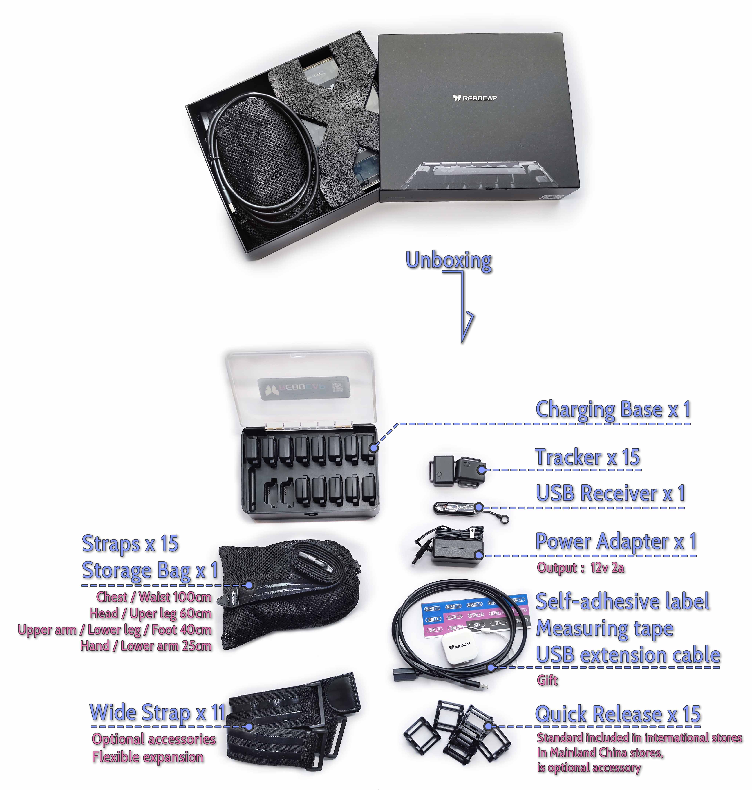
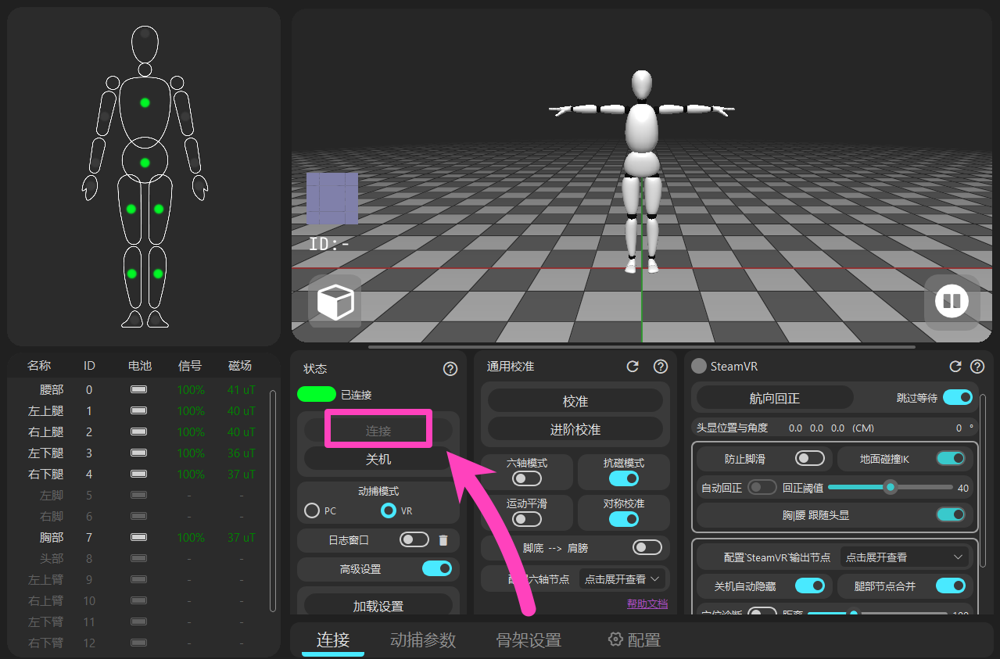
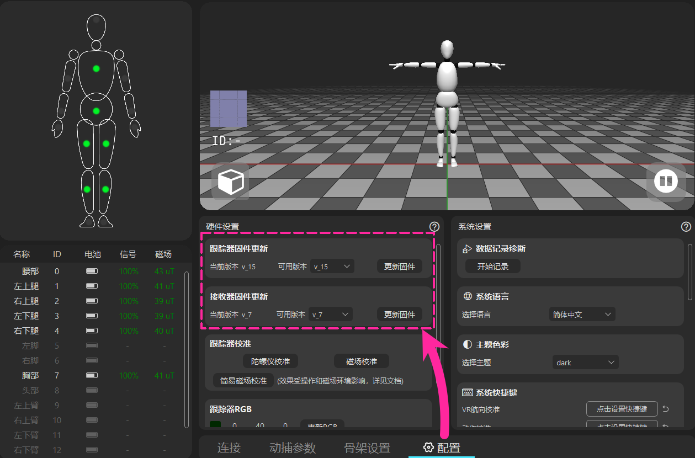
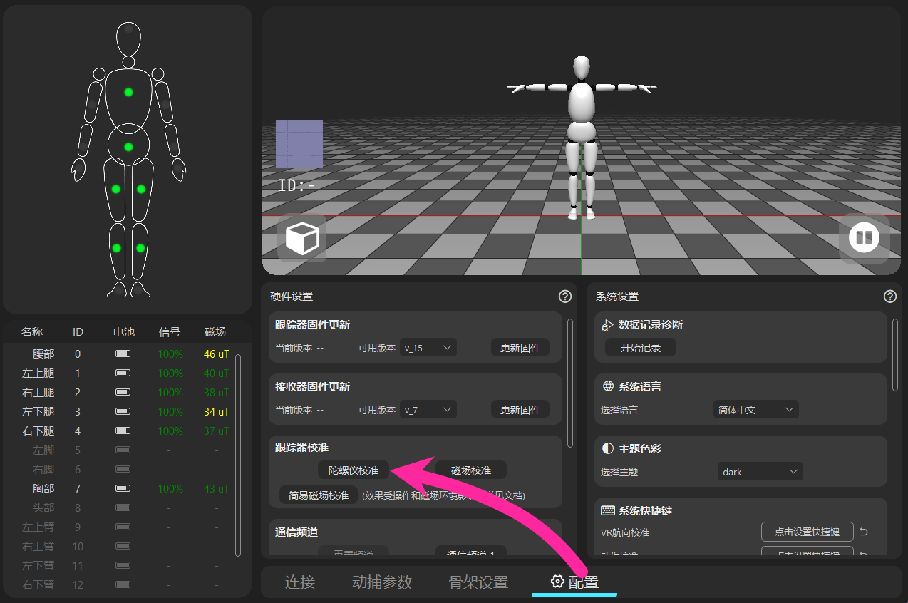
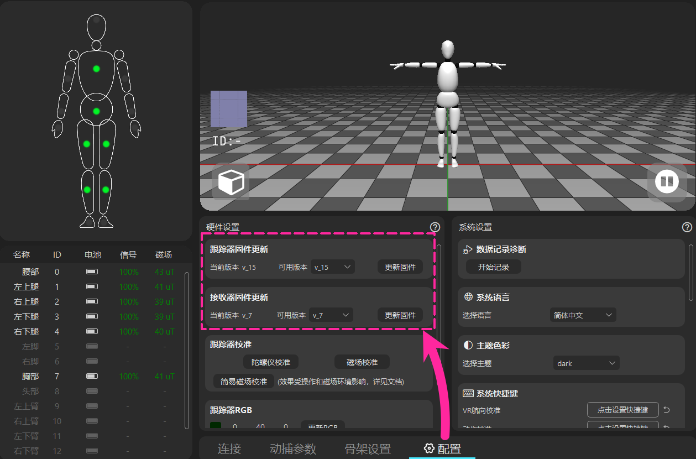

# 15 Trackers Set - Unboxing to Use

<!-- ============ Title ======== Check package content ==================== -->
## 1 - Check package content

* **Drawer Color Box**(⚠️ Do not discard)  
* **Tracker** x 15 
  **USB Receiver** x 1 
* **Charging Case** x 1 
  **Power Adapter** x 1 (Output 12V 2A)

* **Storage Mesh Bag** x 1 
  **Elastic Strap** x 15 (2.5cm width)

* **Included Gifts** 
  Self-adhesive ID stickers 
  Measuring tape 
  USB extension cable

* **Optional Accessories** 
  Quick Release Base x 15 (Standard for International version) 
  Wide Strap x 11 (5cm width, excluding palms and feet, can be freely matched with original narrow straps)

<!-- ============= Title ======= Install straps ==================== -->
## 2 - Install straps

<!-- Method A - Direct Installation -->

## Method A - Direct Installation

  <video id="video" controls loop preload="metadata" width="60%">
    <source id="mp4" src="/zh-Hans/img/tracker_normal.mp4" type="video/mp4" />
  </video>

- This installation method is not recommended as long-term stress can easily cause material aging and cracking. 
  It is usually used as a backup method.

<!-- Method B - Using Quick Release Base -->

## Method B - Using Quick Release Base

- Install the quick release base onto the strap, ensuring the strap passes underneath the base.

  <video id="video" controls loop preload="metadata" width="60%">
    <source id="mp4" src="/zh-Hans/img/kuaichai_normal.mp4" type="video/mp4" />
  </video>

- Installation video for the quick release base

- After attaching the Velcro, pull it slightly to both sides to ensure the hooks are fully embedded in the loop side, preventing it from falling off.

- Tracker removal tip: 
  Prying from one side makes it easier to remove the tracker directly from the quick release base.

<!-- Method C - Using Wide Straps -->

## Method C - Using Wide Straps

- One end of the wide strap comes with built-in Velcro. Install the tracker or quick release base on it. 
  The extra single-piece Velcro in the box serves as a backup.

  <a href="/docs/tutorial/instroction_for_straps" class="button button--primary" style="text-decoration: none; border-radius: 6px; display: inline-block; font-weight: bold; font-size: 1.0rem; padding: 6px 18px;">
    More Strap Installation Guides → 📖
  </a>

<!-- ============ Title ======== Body Wearing Positions ==================== -->
## 3 - Body Wearing Positions

<!-- ==================== Column Layout Start ==================== -->

<!-- Left Column: Character Model -->

<!-- Right Column: Text Description -->

<!-- Group 1: Circumference Data -->

<strong>Chest/Waist:</strong> 100 cm 
<strong>Head/Thigh:</strong> 60 cm 
<strong>Upper Arm/Calf/Foot:</strong> 40 cm 
<strong>Palm/Forearm:</strong> 25 cm

<!-- Group 2: Individual Adjustments -->

<strong>Individual Adjustments:</strong> 
Please refer to the wearing positions shown in the image. 
It is recommended to place the chest/waist trackers on the back, 
and the leg trackers can be placed on the side.

<!-- Group 3: Avoided Areas Tips -->

<strong>Tips:</strong> 
Keep the tracker button facing upwards. 
 
Do not place the waist tracker at the navel to prevent it from being squeezed, 
and leg trackers should avoid areas where muscles bulge into slopes. 
Do not place the thigh trackers too close to the knees. 

<!-- Group 4: VR Differences -->

<strong>Note:</strong> Wearing in VR mode has some differences, 
but it is recommended to check that all trackers work properly first.

<!-- Group 5: Bottom ID Image -->

Trackers have ID numbers pasted on the back, 
and the bindings between numbers and positions are preset at the factory. 
Only the 4 trackers on the forearms and palms can have their positions swapped via the software, 
other trackers cannot swap positions.

<!-- ==================== Column Layout End ==================== -->

<!-- ============= Title ======= Install Software & Check Firmware Update ==================== -->
## 4 - Install Software & Check Firmware Update

<!-- ==================== Flag A: Install software Start ==================== -->

## A - Install Software

🌐Download Link → [https://doc.rebocap.com/en\_US/tutorial/software\_install.html](https://doc.rebocap.com/en_US/tutorial/software_install.html)

- Version Selection:\
  V01 - Suitable for environments with stable magnetic fields, recommended for dancing. 
  V02 Beta02 - Optimized by default for the 6-tracker set, using a new algorithm that actively detects strong interference sources, even maintaining orientation on a spring bed.

- Recommended to install on a non-system drive (do not install on C drive).

<!-- ==================== Flag A: Install software End ==================== -->

<!-- ==================== Flag B: Connect to computer Start ==================== -->

## B - Connect to Computer

<!-- ==================== Step 1: Connect Receiver Start ==================== -->

<strong style="font-size: 1.15em" class="tutorial-step-title">1. Connect Receiver</strong> 
- Plug the USB receiver into the computer, choosing a port with clear space around it. 
- Or use the included USB extension cable for external connection. (Standard USB 3.0 cables on the market) 
- If the tracker signal cannot maintain at 100%, change the position of the receiver.

<!-- ==================== Step 1 End ==================== -->

<!-- ==================== Step 2: Software Connection Start ==================== -->

<strong style="font-size: 1.15em" class="tutorial-step-title">2. Software Connection</strong> 
- Click "Connect" in the software (connection is automatic in Beta02 and later versions).

<!-- ==================== Step 2 End ==================== -->

<!-- ==================== Step 3: Power on Trackers Start ==================== -->

<strong style="font-size: 1.15em" class="tutorial-step-title">3. Power on Trackers</strong> 
- Press the tracker button to power on. 
- Note: Trackers are powered off through the software.

<!-- ==================== Step 3 End ==================== -->

<!-- ==================== Flag B: Connect to computer End ==================== -->

<!-- ==================== Flag C: Check firmware Start ==================== -->

## C - Check Firmware

<!-- ==================== Check Firmware Start ==================== -->

<strong style="font-size: 1.15em" class="tutorial-step-title">Check [Tracker & Receiver] Firmware</strong> 
- Upgrade to the highest available version in the options. 
- This version will change with future software updates. 
- Firmware is packaged within the software installer and does not update online.

<!-- ==================== Check Firmware End ==================== -->

<!-- ==================== Dropdown Start ==================== -->

View the supported firmware versions for the corresponding software.

   &emsp;&emsp; Some firmware versions have major algorithm changes and are incompatible with older software versions.   

   &emsp;&emsp; When switching back to older software, you need to downgrade the firmware accordingly.  

   &emsp;&emsp;&emsp; release_v01 - ◼️tracker: V6 / V7 , 📡receiver: V6 / V7   

   &emsp;&emsp;&emsp; release_v02 beta02 - ◼️tracker: V15 , 📡receiver: V6 / V7   

   &emsp;&emsp;&emsp; (Unreleased) release_v02 beta02.1 - ◼️tracker: V16 , 📡receiver: V8   

<!-- ==================== Dropdown End ==================== -->

- Open the log window to view the actual firmware version of each tracker   
  (the log window is located under "Connect and Power Off" in the software).

- Trackers are updated wirelessly 📶 — no USB data cable is required.  
  🚫 Do not update the tracker and receiver at the same time.  
  If the tracker update fails, consider turning off half of the trackers to stabilize the data upload. Trackers with the correct firmware version in the logs can remain turned off.

- If the update fails, restart the tracker and click update again.  
  &emsp;&emsp;🟩Green light – Fast flash: Tracker is working normally  
  &emsp;&emsp;🟩Green light – Slow flash: Tracker is waiting for receiver signal  
  &emsp;&emsp;🟦Blue light: Tracker is receiving firmware data  
  &emsp;&emsp;🟨Yellow light: Update failed (manually press the 🔘 button to restart, then update again)  
  &emsp;&emsp;⬜White light: Update successful (usually restarts automatically after 10s; if it fails to restart automatically, a manual restart is required)  

- When the 📡receiver update is completed, disconnect and re-insert the USB, then 🔄restart the software.

<!-- ==================== Flag C: Check firmware End ==================== -->

<!-- ============= Title ======= Calibrate Tracker Initial Data ==================== -->
## 5 - Calibrate Tracker Initial Data

<!-- ==================== Flag Gyroscope Calibrate Start ==================== -->

## Gyroscope Calibration
<!-- ==================== Step 1: Place Trackers Start ==================== -->

<strong style="font-size: 1.15em" class="tutorial-step-title">1. Place on the floor</strong> 
- Place the trackers on the floor (in a position with no physical shaking/movement). 
- No need to put them back in the blister tray.

<!-- ==================== Step 1 End ==================== -->

<!-- ==================== Step 2: Start Calibration Start ==================== -->

<strong style="font-size: 1.15em" class="tutorial-step-title">2. Start Calibration</strong> 
- Click the button and wait for the acquisition to complete. 
- The principle is to record a few seconds with absolutely no shaking in reality.

<!-- ==================== Step 2 End ==================== -->

<!-- ==================== Step 3: Check Gyroscope Info Start ==================== -->

<strong style="font-size: 1.15em" class="tutorial-step-title">3. Check Gyroscope Info</strong> 
- Once completed, check the gyroscope info of each tracker. 
- Normally, the output value of the gyroscope should be between 0 and ±0.05 when stationary.

<!-- ==================== Step 3 End ==================== -->

<!-- ==================== Flag Gyroscope Calibrate End ==================== -->

<!-- ==================== Flag Magnet Calibrate Start ==================== -->

## Magnetic Field Calibration

<!-- ==================== Step 1: Place Blister Tray Start ==================== -->

<strong style="font-size: 1.15em" class="tutorial-step-title">1. Place in blister tray</strong> 
- Put trackers into the blister tray in the same direction. 
- (If it feels inconvenient to hold, you can place the blister tray back in the paper box).

<!-- ==================== Step 1 End ==================== -->

<!-- ==================== Step 2: Stand in Center Start ==================== -->

<strong style="font-size: 1.15em" class="tutorial-step-title">2. Stand in the center of the play area</strong> 
- Hold it in your arms, stand in the center of your play area, 
- Or one step away from the edge of the computer desk.

<!-- ==================== Step 2 End ==================== -->

<!-- ==================== Step 3: Rotate Blister Tray Start ==================== -->

<strong style="font-size: 1.15em" class="tutorial-step-title">3. Rotate blister tray</strong> 
- Click the software button and follow the animation displayed in the software to rotate the blister tray. 
- (Rotate two turns for each face change).

<!-- ==================== Step 3 End ==================== -->

<!-- ==================== Step 4: Check Magnetic Readings Start ==================== -->

<strong style="font-size: 1.15em" class="tutorial-step-title">4. Check magnetic field readings</strong> 
- Once completed, flip the blister tray freely in your hands, 
- 🔍Check if the magnetic readings of the calibrated trackers are consistent or close, 
- ⚠️If the magnetic field readings differ significantly from each other, you need to perform magnetic calibration again.

<!-- ==================== Step 4 End ==================== -->

<!-- ==================== Dropdown Start ==================== -->

What if I don't have or lost the charging case?

   &emsp;&emsp;You can use straps to secure the trackers to a square water bottle or tissue box,  
   &emsp;&emsp; in groups of 2-3. 

<!-- ==================== Dropdown End ==================== -->

<!-- ==================== Dropdown Start ==================== -->

Simple Magnetic Calibration

   &emsp;&emsp;As a convenient alternative.  
   &emsp;&emsp;Main action:  
   &emsp;&emsp;Rotate the tracker during recording to cover as many directions as possible (360° all-round flipping). 

   &emsp;&emsp;Tip:  
   &emsp;&emsp;Move your wrists and arms in a "figure 8" shape so the sensor can capture magnetic field data from more angles. 

<!-- ==================== Dropdown End ==================== -->

<!-- ==================== Dropdown Start ==================== -->

Can't see this button in older versions?

   &emsp;&emsp;This button is not displayed by default in older versions, 
   &emsp;&emsp;You need to manually create a specific .txt file to make it appear. 

   &emsp;&emsp;Go to the Rebocap root folder (where Rebocap.exe is located),  
   &emsp;&emsp;Create a new .txt file and rename it to 
   &emsp;&emsp; \_simple_cal\_

   &emsp;&emsp;After restarting the software, the button will appear.

<!-- ==================== Dropdown End ==================== -->

<!-- ==================== Dropdown End ==================== -->

<!-- ==================== Flag Magnet Calibrate End ==================== -->

<!-- ============= Title ======= Check Tracking System ==================== -->
## 6 - Check Tracking System

- Click the [Calibrate] button to record specific postures. 

- Once completed, you will see the motion capture system start working in the 3D previewer, 
  From there, you can proceed to use it for animation recording, virtual avatars, or VR games.

<!-- ==================== Flag Calibration posture guide Start ==================== -->

## VR – Calibration Posture Guide

<!-- ==================== Step 1: A pose Start ==================== -->

<strong style="font-size: 1.15em" class="tutorial-step-title">A Pose</strong> 
- Keep proper foot spacing, neither too close nor too wide, similar to the image. 
- Stand naturally and relaxed, no need to tense your muscles.

<!-- ==================== Step 1 End ==================== -->

<!-- ==================== Step 2: T pose Start ==================== -->

<strong style="font-size: 1.15em" class="tutorial-step-title">T Pose</strong> 
- Spread your arms horizontally. 
- Sometimes muscle memory differs from actually stretching the hands straight, so take a visual check.

<!-- ==================== Step 2 End ==================== -->

<!-- ==================== Step 3: S pose Start ==================== -->

<strong style="font-size: 1.15em" class="tutorial-step-title">S Pose</strong> 
- Half squat + bend waist + lower head, so that the trackers can determine the forward direction of the body through the tilt angle. 
- Keep legs balanced + knee spacing, with arms parallel facing forward. 
- If bending is difficult or unclear, you can use Advanced Calibration.

<!-- ==================== Step 3 End ==================== -->

<!-- ==================== Step 4: B pose Start ==================== -->

<strong style="font-size: 1.15em" class="tutorial-step-title">B Pose (Advanced Calibration)</strong> 
- Separate the S Pose bending + head lowering into a separate bowing movement for recording. 
- This avoids body distortion caused by S Pose (commonly seen as the skeleton system tilting to the side after sitting down).

<!-- ==================== Step 4 End ==================== -->

<!-- ==================== Flag Calibration posture guide End ==================== -->

<!-- ============ Title ======== PC Mode ==================== -->
## PC Mode

<!-- ==================== Flag Software Recording Start ==================== -->

## In-App Recording

- Usage Recommendations: 
- .rebo_anim is the software's native data format. For long recordings, it is recommended to export it as a backup, and it can be replayed using [Offline Playback]. 
- .bvh files cannot be saved in folder paths containing Chinese characters. 
- Directly saved fbx is a skeleton file used for traditional animation and needs to be remapped in editing tools. In most cases, do not turn on [Root Animation] to avoid file errors after export.

<!-- ==================== Flag Software Recording End ==================== -->

<!-- ==================== Flag Virtual Idol (VTube) Start ==================== -->

## Virtual Idol (VTube)

- Software like VMirror, TikTok Live Companion, MetaVance, etc., have corresponding features for direct use. 
- Supports using VMC channel to connect to idol software like Warudo. 

<!-- ============ Redirect Buttons ==================== -->

  <a href="https://www.bilibili.com/video/BV1z7hFzfEw6/" target="_blank" class="button button--primary" style="text-decoration: none; border-radius: 6px; display: inline-block; font-weight: bold; font-size: 1.0rem; padding: 6px 18px;">
    Connect VMirror
  </a>
  <a href="https://www.bilibili.com/video/BV1fPbwzbEak" target="_blank" class="button button--primary" style="text-decoration: none; border-radius: 6px; display: inline-block; font-weight: bold; font-size: 1.0rem; padding: 6px 18px;">
    Connect TikTok Live Companion
  </a>
  <a href="https://www.bilibili.com/video/BV1fPbwzbEak" target="_blank" class="button button--primary" style="text-decoration: none; border-radius: 6px; display: inline-block; font-weight: bold; font-size: 1.0rem; padding: 6px 18px;">
    Connect Warudo
  </a>

<!-- ==================== Flag Virtual Idol (VTube) End ==================== -->

<!-- ==================== Flag Direct Plugins Start ==================== -->

## Direct Plugins

<!-- ============ Redirect Buttons ==================== -->

  <a href="https://doc.rebocap.com/en_us/plugins/blender.html" target="_blank" class="button button--primary" style="text-decoration: none; border-radius: 6px; display: inline-block; font-weight: bold; font-size: 1.0rem; padding: 6px 18px;">
    Blender 
  </a>
  <a href="https://doc.rebocap.com/en_us/plugins/ue.html" target="_blank" class="button button--primary" style="text-decoration: none; border-radius: 6px; display: inline-block; font-weight: bold; font-size: 1.0rem; padding: 6px 18px;">
    UE 
  </a>
  <a href="https://doc.rebocap.com/en_us/plugins/unity.html" target="_blank" class="button button--primary" style="text-decoration: none; border-radius: 6px; display: inline-block; font-weight: bold; font-size: 1.0rem; padding: 6px 18px;">
    Unity 
  </a>
  <a href="https://doc.rebocap.com/en_us/SDK/" target="_blank" class="button button--primary" style="text-decoration: none; border-radius: 6px; display: inline-block; font-weight: bold; font-size: 1.0rem; padding: 6px 18px;">
    SDK 
  </a>

<!-- ==================== Flag Direct Plugins End ==================== -->

<!-- ============= Title ======= VR Mode ==================== -->
## VR Mode

<!-- ==================== Flag Connection Start ==================== -->

## Connection

<!-- ==================== Step 1: Start SteamVR Start ==================== -->

<strong style="font-size: 1.15em" class="tutorial-step-title">1. Start SteamVR</strong> 
- Start SteamVR. 
- (SteamVR Headset = Rebocap Head Tracker).

<!-- ==================== Step 1 End ==================== -->

<!-- ==================== Step 2: Select VR Mode and Calibrate Start ==================== -->

<strong style="font-size: 1.15em" class="tutorial-step-title">2. Select VR Mode and Calibrate</strong> 
- Select [VR Mode] in Rebocap, and then click "Calibrate". 
- Please calibrate while SteamVR is running to ensure a successful connection.

<!-- ==================== Step 2 End ==================== -->

<!-- ==================== Step 3 Start ==================== -->

<strong style="font-size: 1.15em" class="tutorial-step-title">3. Check SteamVR Status</strong> 
- Once calibration is complete, 
  you will see the refreshed butterfly logo in the SteamVR list.

<!-- ==================== Step 3 End ==================== -->

- To enter SteamVR later, simply repeat this section's steps.
- Rebocap ID + 3 = SteamVR ID

<!-- ==================== Flag Connection End ==================== -->

<!-- ==================== Flag Tracker VR Usage Start ==================== -->

## Tracker Usage in VR Mode

💡 There are 3 options for VR game combinations: 10, 8, and 6 tracker points. If foot trackers are not used, please keep the [AI Engine] enabled.  
🧤 Up to 14 trackers can be used when using [Replace Controller Position] or tracking gloves. 
💻 Up to 15 trackers can be used when using [VR Output] (simulating headset coordinates). *(Only for technical players to explore)*

<!-- ==================== Flag Tracker VR Usage End ==================== -->

<!-- ==================== Flag VR – Calibration posture guide Start ==================== -->

## VR – Calibration Posture Guide

<!-- ==================== Step 1: A pose Start ==================== -->

<strong style="font-size: 1.15em" class="tutorial-step-title">A Pose</strong> 
- Raise the VR controllers to avoid the trackers capturing the magnets in the controllers. 
- Keep proper foot spacing, neither too close nor too wide, similar to the image. 
- Stand naturally and relaxed, no need to tense your muscles.

<!-- ==================== Step 1 End ==================== -->

<!-- ==================== Step 2: T pose Start ==================== -->

<strong style="font-size: 1.15em" class="tutorial-step-title">T Pose</strong> 
- Spread your arms horizontally. 
- Sometimes muscle memory differs from actually stretching the hands straight, so take a visual check.

<!-- ==================== Step 2 End ==================== -->

<!-- ==================== Step 3: S pose Start ==================== -->

<strong style="font-size: 1.15em" class="tutorial-step-title">S Pose</strong> 
- Half squat + bend waist + lower head, so that the trackers can determine the forward direction of the body through the tilt angle. 
- Keep legs balanced + knee spacing, with arms parallel facing forward. 
- If bending is difficult or unclear, you can use Advanced Calibration.

<!-- ==================== Step 3 End ==================== -->

<!-- ==================== Step 4: B pose Start ==================== -->

<strong style="font-size: 1.15em" class="tutorial-step-title">B Pose (Advanced Calibration)</strong> 
- Separate the S Pose bending + head lowering into a separate bowing movement for recording. 
- This avoids body distortion caused by S Pose (commonly seen as the skeleton system tilting to the side after sitting down).

<!-- ==================== Step 4 End ==================== -->

<!-- ==================== Flag VR – Calibration posture guide End ==================== -->

<!-- ==================== Flag Enter game (example: VRChat) Start ==================== -->

## Enter Game (Example: VRChat)

<!-- ==================== Step 1: Check SteamVR Status Start ==================== -->

<strong style="font-size: 1.15em" class="tutorial-step-title">1. Check SteamVR Status</strong> 
- Check the refreshed butterfly logo in the SteamVR list. 
  With tracking point information available, VRChat will display the Full Body Tracking toggle.

<!-- ==================== Step 1 End ==================== -->

<!-- ==================== Step 2: Open In-game Menu Start ==================== -->

<strong style="font-size: 1.15em" class="tutorial-step-title">2. Open In-game Menu</strong> 
- Open the in-game Quick Menu, and then click "Calibrate".

<!-- ==================== Step 2 End ==================== -->

<!-- ==================== Step 3: Bind Tracker Points Start ==================== -->

<strong style="font-size: 1.15em" class="tutorial-step-title">3. Bind Tracker Points</strong> 
- Align the tracking points symmetrically on the avatar's body. 
  It is not necessary for the tracking points to align perfectly, as every avatar's body proportions differ. 
- Press the triggers on both hands to complete the binding of tracking points.

<!-- ==================== Step 3 End ==================== -->

<!-- ==================== Flag Enter game (example: VRChat) End ==================== -->
