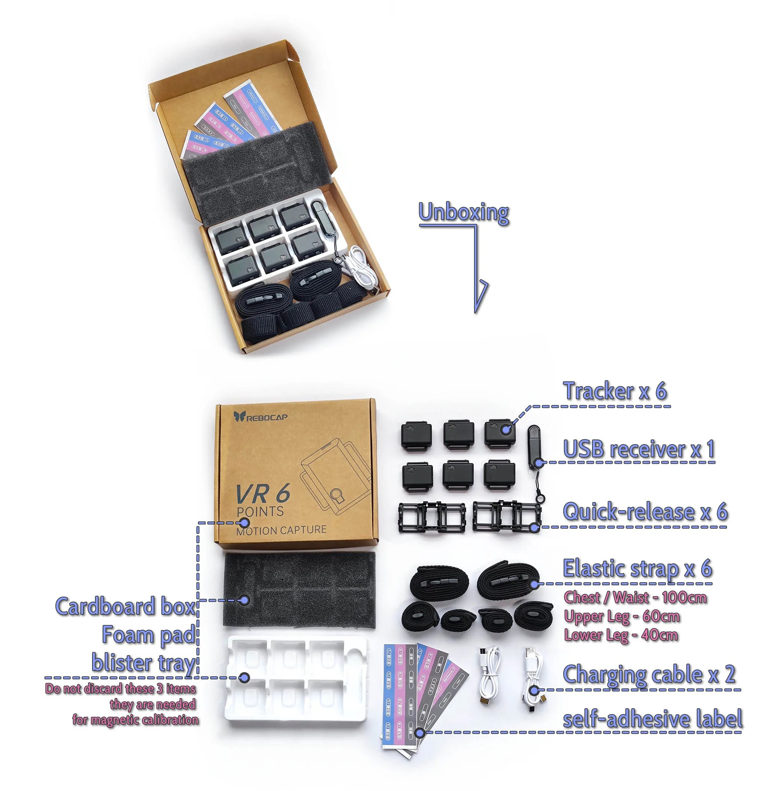

# 6 ‑ tracker bundle unboxing to use

<!-- ============ 标题 ======== 检查包裹内容 ==================== -->
## 1 - Check the package

* **Cardboard box, Foam pad, blister tray** 
 (⚠️ *Do not discard these 3 items; they are needed for magnetic calibration.*)
* **Tracker** x 6
* **USB receiver** x 1
* **Quick-release base** x 6
* **Elastic strap** x 6
  * Chest / Waist - 100cm
  * Upper Leg - 60cm
  * Lower Leg - 40cm
* **Charging cable** x 2
* **Self-adhesive label** (Stickers)

<!-- ============= 标题 ======= 安装绑带 ==================== -->
## 2 - Install straps

- Remove the quick‑release base from the tracker, 
prying from one side makes removal easier.

- Attach quick‑release base to strap, ensure strap passes underneath.

  <video id="video" controls loop preload="metadata" width="60%">
    <source id="mp4" src="/img/kuaichai_normal.mp4" type="video/mp4" />
  </video>

- Strap installation video

- After attaching Velcro, pull sideways to embed hooks into plush, avoid falling off.

  <a href="/docs/tutorial/instroction_for_straps" class="button button--primary" style="text-decoration: none; border-radius: 6px; display: inline-block; font-weight: bold; font-size: 1.0rem; padding: 6px 18px;">
    More Strap Installation Guides → 📖
  </a>

<!-- ============ 标题 ======== 穿戴在身上的位置 ==================== -->
## 3 - Wear on the body

<!-- ==================== 左右分栏图文排版 开始 ==================== -->

<!-- 左侧分栏：放人物模型图 -->

<!-- 提示：请将无文字的人物主图放入 static/img/unboxing/ 目录中，并将下方路径改为实际图名 -->

<!-- 右侧分栏：放文字说明 -->

<!-- 第一组：围度数据 -->

<strong>Chest/Waist:</strong> 100 cm 
<strong>Upper leg:</strong> 60 cm 
<strong>Lower leg:</strong> 40 cm

<!-- 第四组：身体差异性调整 -->

<strong>Body differences:</strong> 
Please refer to the wearing positions shown in the image, 
Recommend placing chest/waist tracker on the back, 
Leg tracker can be placed on the side.

<!-- 第三组：避开区域提示 -->

<strong>Tips:</strong> 
Keep tracker buttons facing upward. 
 
Do not place waist tracker at the navel to avoid pressure, 
Avoid bulging skin areas for leg trackers. 
Don't place the thigh tracker too close to the knee. 

<!-- 第五组：底部小图与文字上下排版 -->

<!-- 提示：请将编号细节小图放入目录，并在此配置真实路径 -->

Trackers have ID numbers on the back, 
Factory-set numbers and positions. 
Not modifiable or replaceable,  
cannot combine two 6‑tracker sets together.

<!-- ==================== 左右分栏图文排版 结束 ==================== -->

<!-- ============= 标题 ======= 安装软件 和 检查固件更新 ==================== -->

## 4 - Install software - Check firmware update

<!-- ==================== 旗帜 A：Install software 开始 ==================== -->

## A - Install software

🌐Download link → [https://doc.rebocap.com/en\_US/tutorial/software\_install.html](https://doc.rebocap.com/en_US/tutorial/software_install.html)

- Version selection:\
  V01 - Suitable for environments with stable magnetic fields, mainly for dancing. 
  V02 Beta02 - The default switches are optimized for the 6-tracker set,  
  and it features a new algorithm that actively detects strong sources of interference, maintaining orientation even on a spring bed.

<!-- ==================== 折叠页 开始 ==================== -->

If use V01 version, Some settings need to be change.

   &emsp;&emsp;1 - Turn off extra displayed tracker points. 
   &emsp;&emsp;&emsp; Open [Set 'SteamVR'Nodes] → Turn off [Left/Right Upper Arm] 

   &emsp;&emsp;2 - Turn off the feature that stuck running globally. 
   &emsp;&emsp;&emsp; → [Motion Params] → Turn off [Vertical IK & Horizontal IK]

<!-- ==================== 折叠页 结束 ==================== -->

- Recommended install on a non‑system drive (not C:).

<!-- ==================== 旗帜 A：Install software 结束 ==================== -->

<!-- ==================== 旗帜 B：Connect to computer 开始 ==================== -->

## B - Connect to computer

<!-- ==================== 步骤 1：连接接收器 开始 ==================== -->

<!-- 提示：请将“Connect Receiver”步骤的图片放入 static/img/unboxing/ 目录中，并将下方路径改为实际图名 -->

<strong style="font-size: 1.15em" class="tutorial-step-title">1. Connect Receiver</strong> 
- Insert USB receiver into computer, choose an open surrounding port. 
- Or prepare a common USB 3.0 data cable as an extension. 
- If tracker signal cannot maintain 100%, consider using an extension cable or changing its position.

<!-- ==================== 步骤 1 结束 ==================== -->

<!-- ==================== 步骤 2：软件连接 开始 ==================== -->

<!-- 提示：请将“Software Connection”步骤的图片放入 static/img/unboxing/ 目录中，并将下方路径改为实际图名 -->

<strong style="font-size: 1.15em" class="tutorial-step-title">2. Software Connection</strong> 
- Click "Connect" in software (After beta02 version, it will auto connect).

<!-- ==================== 步骤 2 结束 ==================== -->

<!-- ==================== 步骤 3：开启追踪器 开始 ==================== -->

<!-- 提示：请将“Power on Trackers”步骤的图片放入 static/img/unboxing/ 目录中，并将下方路径改为实际图名 -->

<strong style="font-size: 1.15em" class="tutorial-step-title">3. Power on Trackers</strong> 
- Press tracker button to power on. 
- Note: Trackers are powered off via the software.

<!-- ==================== 步骤 3 结束 ==================== -->

<!-- ==================== 旗帜 B：Connect to computer 结束 ==================== -->

<!-- ==================== 旗帜 C：Check firmware 开始 ==================== -->

## C - Check firmware

<!-- ====================  检查固件 开始 ==================== -->

<!-- 提示：请将“Power on Trackers”步骤的图片放入 static/img/unboxing/ 目录中，并将下方路径改为实际图名 -->

<strong style="font-size: 1.15em" class="tutorial-step-title">Check [tracker and receiver] firmware</strong> 
- to the highest version available in options, 
- will change with future software updates. 
- Firmware is bundled with the software package, not updated via the internet.

<!-- ====================  检查固件 结束 ==================== -->

<!-- ==================== 折叠页 开始 ==================== -->

 Check the firmware version supported by the software.

   &emsp;&emsp; Some firmware versions have significant algorithm changes, making them incompatible with older software.   

   &emsp;&emsp; When switching back to an older software version, you need to downgrade the firmware accordingly.  

   &emsp;&emsp;&emsp; release_v01 - ◼️tracker : V6 / V7  ,  📡receiver : V6 / V7   

   &emsp;&emsp;&emsp; release_v02 beta02 - ◼️tracker : V15  ,  📡receiver : V6 / V7   

   &emsp;&emsp;&emsp; (not public) release_v02 beta02.1 - ◼️tracker : V16  ,  📡receiver : V8   

<!-- ==================== 折叠页 结束 ==================== -->

- Open the log window to see each tracker actual firmware version   
(the log window is located under "Connect & Power Off" in the software).

- The trackers are updated wirelessly 📶 — no USB cable is needed.  
🚫 Do not update the tracker and receiver at the same time.  

- If the update fails, need restart the tracker and click update again.  
&emsp;&emsp;🟩Green – fast blink: Tracker working normally  
&emsp;&emsp;🟩Green – slow blink: Tracker waiting for receiver signal  
&emsp;&emsp;🟦Blue: Tracker is receiving firmware data  
&emsp;&emsp;🟨Yellow: Update failed (manually press the 🔘 button to restart, then retry the update)  
&emsp;&emsp;⬜White: Update successful (usually auto‑restarts after 10s; if not, restart manually) 

-  When 📡receiver update done, unplug and replug the USB, and 🔄restart the software.

<!-- ==================== 旗帜 C：Check firmware 结束 ==================== -->

<!-- ============= 标题 ======= 校正追踪器初始数据 ==================== -->
## 5 -Calibrate tracker initial data

<!-- ==================== 旗帜 Gyroscope Calibrate 开始 ==================== -->

## Gyroscope Calibrate
<!-- ==================== 步骤 1：放置追踪器 开始 ==================== -->

<!-- 提示：请将“Place Trackers”步骤的图片放入 static/img/unboxing/ 目录中，并将下方路径改为实际图名 -->

<strong style="font-size: 1.15em" class="tutorial-step-title">1. Place Trackers on the Floor</strong> 
- Place trackers on the floor  
(in a position with no physical shaking/movement). 
- No need to put them back in the blister tray. 
- The principle is to record a few seconds of no physical movement in reality.

<!-- ==================== 步骤 1 结束 ==================== -->

<!-- ==================== 步骤 2：启动采集 开始 ==================== -->

<!-- 提示：请将“Start Calibration”步骤的图片放入 static/img/unboxing/ 目录中，并将下方路径改为实际图名 -->

<strong style="font-size: 1.15em" class="tutorial-step-title">2. Start Calibration</strong> 
- Click the button, wait for collection to complete.

<!-- ==================== 步骤 2 结束 ==================== -->

<!-- ==================== 步骤 3：检查陀螺仪信息 开始 ==================== -->

<!-- 提示：请将“Check Gyroscope”步骤的图片放入 static/img/unboxing/ 目录中，并将下方路径改为实际图名 -->

<strong style="font-size: 1.15em" class="tutorial-step-title">3. Check Gyroscope Info</strong> 
- 🔍Once completed, check the gyroscope information of each tracker. 
- Typically, the gyroscope output values should be 0 to ±0.05 when static.

<!-- ==================== 步骤 3 结束 ==================== -->

<!-- ==================== 旗帜 Gyroscope Calibrate 结束 ==================== -->

<!-- ==================== 旗帜 Magnet Calibrate 开始 ==================== -->

## Magnet Calibrate

<!-- ==================== 步骤 1：放置吸塑盘 开始 ==================== -->

<strong style="font-size: 1.15em" class="tutorial-step-title">1. Place Trackers in Blister Tray</strong> 
- Place trackers in the blister tray in a uniform direction. 
- (If you find it inconvenient to hold, you can put the blister tray back inside the cardboard box).

<!-- ==================== 步骤 1 结束 ==================== -->

<!-- ==================== 步骤 2：站在中心 开始 ==================== -->

<strong style="font-size: 1.15em" class="tutorial-step-title">2. Stand in Play Area Center</strong> 
- Hold it in your arms, stand in the center of the play area, 
- or one step away from the edge of the computer desk.

<!-- ==================== 步骤 2 结束 ==================== -->

<!-- ==================== 步骤 3：旋转吸塑盘 开始 ==================== -->

<strong style="font-size: 1.15em" class="tutorial-step-title">3. Rotate the Blister Tray</strong> 
- Click the software button, rotate the blister tray following the animation shown in the software. 
- (Rotate two turns for each facing/side).

<!-- ==================== 步骤 3 结束 ==================== -->

<!-- ==================== 步骤 4：检查磁场读数 开始 ==================== -->

<strong style="font-size: 1.15em" class="tutorial-step-title">4. Check Magnetic Field Readings</strong> 
- Once completed, randomly flip the blister tray in your hands, 
- 🔍check if the calibrated tracker magnetic field readings are consistent or close to each other, 
- ⚠️if the magnetic field readings differ significantly from each other, you need to perform magnetic calibration again.

<!-- ==================== 步骤 4 结束 ==================== -->

<!-- ==================== 折叠页 开始 ==================== -->

What if you don't have/lost the box?.

   &emsp;&emsp;You can use the straps to attach the trackers to a square water bottle or a tissue box,  
   &emsp;&emsp; grouping them in sets of 2–3. 

<!-- ==================== 折叠页 结束 ==================== -->

<!-- ==================== 折叠页 开始 ==================== -->

Simple magnetic calibration.

   &emsp;&emsp;As a convenient alternative.   
   &emsp;&emsp;Main action:  
   &emsp;&emsp;Rotate the tracker during the recording period, covering as many directions as possible (360° full‑range flips). 

   &emsp;&emsp;Tip:  
   &emsp;&emsp;Move your wrist and arm in a figure‑8 pattern so the sensor can capture magnetic field data from more angles. 

<!-- ==================== 折叠页 结束 ==================== -->

<!-- ==================== 旧版本看不到简易磁场校准 折叠页 开始 ==================== -->

Is this button not visible in V01 and older versions?

   &emsp;&emsp;This button is not shown in older versions by default , 
   &emsp;&emsp;you need to manually create a specific .txt file to make it appear. 

   &emsp;&emsp;Go to the Rebocap root folder (where Rebocap.exe is located),  
   &emsp;&emsp;create a new .txt file, and rename it to 
   &emsp;&emsp; \_simple_cal_

   &emsp;&emsp;After restarting the software, the button will appear.

<!-- ==================== 旧版本看不到简易磁场校准 折叠页 结束 ==================== -->

<!-- ==================== 折叠页 结束 ==================== -->

<!-- ==================== 旗帜 Magnet Calibrate 结束 ==================== -->

<!-- ============= 标题 ======= 进入SteamVR ==================== -->
## 6 - Enter SteamVR

<!-- ==================== 旗帜 Connection 开始 ==================== -->

## Connection

<!-- ==================== 步骤 1：启动 SteamVR 开始 ==================== -->

<strong style="font-size: 1.15em" class="tutorial-step-title">1. Launch SteamVR</strong> 
- Launch SteamVR. 
- (SteamVR headset = Rebocap head tracker).

<!-- ==================== 步骤 1 结束 ==================== -->

<!-- ==================== 步骤 2：选择 VR 模式并校准 开始 ==================== -->

<strong style="font-size: 1.15em" class="tutorial-step-title">2. Select VR Mode & Calibrate</strong> 
- In Rebocap, select [VR Mode], then click "Calibrate". 
- Calibrate while SteamVR is running to ensure a successful connection.

<!-- ==================== 步骤 2 结束 ==================== -->

- To enter game, just repeat this step
- Rebocap ID +3 = Ssteamvr ID

<!-- ==================== 旗帜 Connection 结束 ==================== -->

<!-- ==================== 旗帜 VR – Calibration posture guide 开始 ==================== -->

## VR – Calibration posture guide

<!-- ==================== 步骤 1：A pose 开始 ==================== -->

<strong style="font-size: 1.15em" class="tutorial-step-title">A pose</strong> 
- Raise VR controller to avoid tracker capturing magnets in controller. 
- Keep proper foot spacing, neither too close nor too wide, similar to the image.  
- Stand naturally and relaxed without tensing your muscles.

<!-- ==================== 步骤 1 结束 ==================== -->

<!-- ==================== 步骤 2：S pose 开始 ==================== -->

<strong style="font-size: 1.15em" class="tutorial-step-title">S pose</strong> 
- Half squat + bend waist and lower head, so that the tracker can determine the forward direction of the body through the tilt angle.  
- If bending is difficult or unclear, you can use Advanced Calibration. 
- Keep legs balanced + knee spacing.

<!-- ==================== 步骤 2 结束 ==================== -->

<!-- ==================== 步骤 3：B pose 开始 ==================== -->

<strong style="font-size: 1.15em" class="tutorial-step-title">B pose (Advanced Calibration)</strong> 
- Separate S pose bending into bowing posture for recording. 
- This avoids body distortion caused by S pose 
 (commonly seen as the skeleton system tilting to the side after sitting down).

<!-- ==================== 步骤 3 结束 ==================== -->

<!-- ==================== 旗帜 VR – Calibration posture guide 结束 ==================== -->

<!-- ==================== 旗帜 Enter game (example: VRChat) 开始 ==================== -->

## Enter game (example: VRChat)

<!-- ==================== 步骤 1：检查 SteamVR 蝴蝶图标 开始 ==================== -->

<strong style="font-size: 1.15em" class="tutorial-step-title">1. Check SteamVR Status</strong> 
- After calibration is completed, you can see the refreshed butterfly logo in the SteamVR list.

<!-- ==================== 步骤 1 结束 ==================== -->

<!-- ==================== 步骤 2：打开游戏内校准 开始 ==================== -->

<strong style="font-size: 1.15em" class="tutorial-step-title">2. Open In-game Menu</strong> 
- Open the menu in the game, then click "Calibrate".

<!-- ==================== 步骤 2 结束 ==================== -->

<!-- ==================== 步骤 3：绑定追踪点 开始 ==================== -->

<strong style="font-size: 1.15em" class="tutorial-step-title">3. Bind Tracker Points</strong> 
- Align the tracAlign the tracker points symmetrically on the character's body.  
-They do not need to match perfectly, as body proportions vary for different avatars. 
- Press the trigger button with the index fingers of both hands to complete the binding of tracker points.

<!-- ==================== 步骤 3 结束 ==================== -->

<!-- ==================== 旗帜 Enter game (example: VRChat) 结束 ==================== -->

