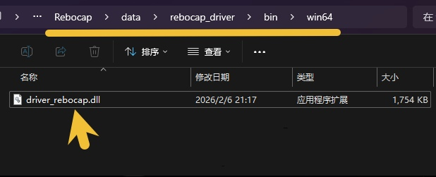

# SteamVR Guide

Here are some recommended settings for SteamVR and solutions to common issues.

## VR Headset / Streaming Software Recommendations

### VR Headset Settings {#software-download-toc}
<h2 class="tutorial-heading-flag" style="background: #aab0ff; margin-top: 0; display: inline-block;">VR Headset Settings</h2>

<!-- === 轮播图组件 代码开始 === -->

  <input type="radio" name="carousel" id="slide1" defaultChecked />
  <input type="radio" name="carousel" id="slide2" />
  
  

    

      
    

    

      <video src="/img/steamvr_guide/steamvr_windows_video.mp4" autoplay muted playsinline preload="auto"></video>
    

  

  

  
  

    

      <label for="slide2" class="arrow-left-1">&#10094;</label>
      <label for="slide1" class="arrow-left-2">&#10094;</label>
    

    

      <label for="slide1" title="Image 1"></label>
      <label for="slide2" title="Video"><svg viewBox="0 0 24 24" width="8" height="8" ><polygon points="8,4 20,12 8,20" /></svg></label>
    

    

      <label for="slide2" class="arrow-right-1">&#10095;</label>
      <label for="slide1" class="arrow-right-2">&#10095;</label>
    

  

<!-- === 轮播图组件 代码结束 === -->

<strong> - Try to use SteamVR's desktop window to control the rebocap software.</strong> 
Returning to the built-in system of some VR headsets will stop/hibernate SteamVR data, 
and direction misalignment will occur when returning to SteamVR. 
( <u>Virtual Desktop</u> is not affected by this issue, but avoid Quest system sleep ) 

Cannot display the desktop after clicking the icon?

Try to recenter or reset the main dashboard in the SteamVR menu. 

- For standalone headsets like Quest or Pico, draw the play boundary slightly larger than your actual room size 
to prevent triggering boundary popups that disrupt headset tracking data in SteamVR, causing full-body deformation.

  <input type="radio" name="carousel2" id="slide3" defaultChecked />
  <input type="radio" name="carousel2" id="slide4" />
  
  

    

      
    

    

      <video src="/img/steamvr_guide/VR_headset_tracking_lost_video.mp4" autoplay muted playsinline preload="auto"></video>
    

  

  

  
  

    

      <label for="slide4" class="arrow-left-1">&#10094;</label>
      <label for="slide3" class="arrow-left-2">&#10094;</label>
    

    

      <label for="slide3" title="Image 1"></label>
      <label for="slide4" title="Video"><svg viewBox="0 0 24 24" width="8" height="8" ><polygon points="8,4 20,12 8,20" /></svg></label>
    

    

      <label for="slide4" class="arrow-right-1">&#10095;</label>
      <label for="slide3" class="arrow-right-2">&#10095;</label>
    

  

- If the headset remains fixed in place when walking or crouching, it indicates that positional tracking is disabled in the VR headset system. 
(Enable Play Boundary on Quest system; enable [Positional Tracking] on Pico system)

### Virtual Desktop {#software-download-toc}
<h2 class="tutorial-heading-flag" style="background: #aab0ff; margin-top: 0; display: inline-block;">Virtual Desktop</h2>

 

<strong>We recommend disabling 2 options:</strong>
 

> <strong>1 - Center to play space</strong> 
 When double-clicking the left home button to return to the VD desktop, the headset in the SteamVR space rotates 180° backward, 
which may cause rebocap to record an incorrect orientation during calibration.

>  <strong>2 - Emulate SteamVR vive trackers</strong> 
 This function passes the AI full-body tracking points of the Quest system to SteamVR, but overlaps with our tracking points in VRChat, seizing control. 
 If you only want to enable specific local tracking points, you can use a plugin to adjust it. 
🌐 [Plugin GitHub Repository](https://github.com/DenTechs/Virtual_Desktop_Body_Tracking_Configurator)

### SteamVR {#software-download-toc}
<h2 class="tutorial-heading-flag" style="background: #aab0ff; margin-top: 0; display: inline-block;">SteamVR</h2>

- Disable the SteamVR boundary 
The default boundary restricts the maximum movement range of tracking points, acting like an invisible wall. 
If the VR headset is incorrectly positioned at a height of 2.4 meters, raising your legs while lying down might show trackers unable to exceed the headset's height, 
because SteamVR's default ceiling height is 2.4 meters, and tracking points cannot pass through the ceiling.

- Recenter VR headset orientation in advance 
Press and hold the 'Right Controller Home Button' to reset VR headset system orientation, 
which resets the SteamVR virtual horizon arrow to face straight ahead. If orientation is accidentally lost, use this feature to realign the coordinate system.

- Prompt popup when launching games 
Select any community binding configuration in the background, 
and after activating it, the prompt will no longer appear on subsequent launches.

## Unable to Connect to SteamVR

<h2 class="tutorial-heading-flag" style="background: #aab0ff; margin-top: 0; display: inline-block;">Please check the following items:</h2>

<strong> 1 - Click calibrate while SteamVR is running.</strong> 
If SteamVR is not started, rebocap cannot detect if VR is present in the system.

  <input type="radio" name="carousel3" id="slide5" defaultChecked />
  <input type="radio" name="carousel3" id="slide6" />
  
  

    

      
    

    

      
    

  

  

  
  

    

      <label for="slide6" class="arrow-left-1">&#10094;</label>
      <label for="slide5" class="arrow-left-2">&#10094;</label>
    

    

      <label for="slide5" title="Image 1"></label>
      <label for="slide6" title="Image 2"></label>
    

    

      <label for="slide6" class="arrow-right-1">&#10095;</label>
      <label for="slide5" class="arrow-right-2">&#10095;</label>
    

  

<strong> 2 - Check the SteamVR driver.</strong> 
Open the [Log Window] in rebocap. It automatically checks each time rebocap is launched.
If needed, you can force install drivers in the [Settings] page.

  <input type="radio" name="carousel4" id="slide7" defaultChecked />
  <input type="radio" name="carousel4" id="slide8" />
  
  

    

      
    

    

      <video src="/img/steamvr_guide/check_steamvr_addons_video -cns.mp4" autoplay muted playsinline preload="auto"></video>
    

  

  

  
  

    

      <label for="slide8" class="arrow-left-1">&#10094;</label>
      <label for="slide7" class="arrow-left-2">&#10094;</label>
    

    

      <label for="slide7" title="Image 1"></label>
      <label for="slide8" title="Video"><svg viewBox="0 0 24 24" width="8" height="8"><polygon points="8,4 20,12 8,20" /></svg></label>
    

    

      <label for="slide8" class="arrow-right-1">&#10095;</label>
      <label for="slide7" class="arrow-right-2">&#10095;</label>
    

  

<strong> 3 - Check SteamVR Add-ons.</strong> 
If SteamVR crashes unexpectedly, it often forcibly disables all add-ons. 
Re-enabling rebocap add-ons requires restarting SteamVR.

## Show and Hide SteamVR Trackers

<strong> Show and hide tracking points</strong> 
 Control the visibility of tracking points in the software's [ Configure SteamVR Output Nodes ] section. 
 There is no need to configure this in the SteamVR management menu. 

 

Note

The trackers are not directly connected to SteamVR. The physical trackers manipulate the skeleton system, and corresponding tracking points are created on the skeleton system to input into SteamVR. 
This means even without a physical tracker for a specific point, tracking points can still be provided to SteamVR.

## Tracker role attributes set but the game cannot recognize feet and waist

- Some games use the openVR environment to recognize tracking, but the current rebocap V01/V02 SteamVR driver has a bug where it cannot be recognized due to the missing [Relo] name, 
Even if the corresponding attributes are modified in SteamVR, they still cannot be recognized. 
The current workaround is to replace it with the older driver_rebocap.dll file.

This bug is awaiting a fix by the development team in a future update.

<a href="/img/steamvr_guide/(%20P05%20)%20%20%20%20driver_rebocap.dll" download target="_blank" class="button button--primary button--sm" style="margin-bottom: 15px; display: inline-block; font-size: 1em;">Download ( P05 ) driver_rebocap.dll</a> 

- Replacement process: 
1 - Keep rebocap and SteamVR closed. 
2 - Go to the rebocap installation folder, 
Find the "Rebocap\data\rebocap_driver\bin\win64" folder, 
Replace the driver_rebocap.dll file in it. 
(Remove the "P05" prefix) 
3 - First start the Rebocap software, wait for it to update the SteamVR driver file, and then start SteamVR.

