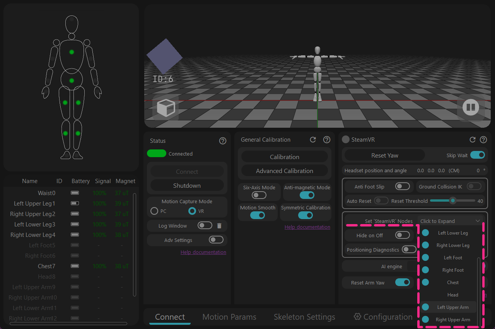
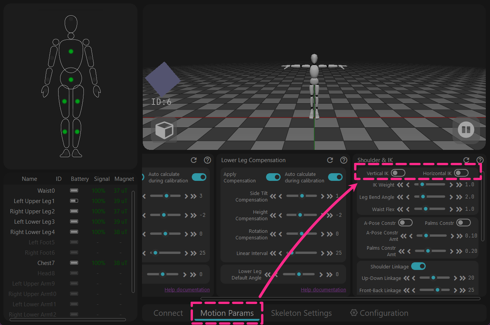

<!-- ==================== Flag A: Install software Start ==================== -->

## Download {#software-download-toc}
<h2 class="tutorial-heading-flag" style="background: #88b49c; margin-top: 0; display: inline-block;">Download</h2>

Currently, the available version is `Release`. Click the download link below. 
The `Beta` version is a public test build, which works better in areas with significant magnetic interference, but has not yet been extensively validated.

**Stable Release** -  [Download Rebocap V01](https://doc.rebocap.com/img/files/rebocap_release_v01.exe)

**Beta Version** - [Download Rebocap V02 Beta02](https://doc.rebocap.com/img/files/rebocap_release_v02_beta02.exe)

- Version Selection:\
  V01 - Suitable for environments with stable magnetic fields, recommended for dancing. 
  V02 Beta02 - Default settings are optimized for the 6-tracker set, and it uses a new algorithm to actively identify strong interference sources, maintaining orientation even on trampolines.

- It is recommended to install on a non-system drive (do not install on the C drive).

<!-- ==================== Details Start ==================== -->

 Check supported firmware versions for the software.

   &emsp;&emsp; Some firmware versions have major algorithm changes and are incompatible with older software versions.   

   &emsp;&emsp; When switching back to an older software version, the firmware must be downgraded accordingly.  

   &emsp;&emsp;&emsp; release_v01 - ◼️tracker : V6 / V7  ,  📡receiver : V6 / V7   

   &emsp;&emsp;&emsp; release_v02 beta02 - ◼️tracker : V15  ,  📡receiver : V6 / V7   

   &emsp;&emsp;&emsp; (Unpublished) release_v02 beta02.1 - ◼️tracker : V16  ,  📡receiver : V6 / V7 / V8   

<!-- ==================== Details End ==================== -->

<!-- ==================== Details Start ==================== -->

If using the V01 version in VR mode, the following settings need to be changed.

<strong>1 - Turn off extra displayed tracking points.</strong> 
Open [Configure 'SteamVR' output nodes] → Turn off [Left/Right Upper Arm]

Details

The software originally planned to use the [Auto-hide joints] function to automatically hide unused tracking points, 
but it was found that this function could not automatically check. This has been fixed in the V02 Beta02 software.

<strong>2 - Turn off functions that may incorrectly get stuck working globally.</strong> 
→ [Motion Parameters] → Turn off [Vertical IK & Horizontal IK]

Details

This function was originally a sub-function in the [Anti-slip] module, 
but it would unexpectedly remain active globally. This has been fixed in the V02 Beta02 software.

<!-- ==================== Details End ==================== -->

<!-- ==================== Flag A: Install software End ==================== -->

Notes:
> The software currently only supports **Windows 10** and above. 
> The software must be used while connected to the internet. If you wish to use it offline, please connect through a mobile hotspot, start the software, wait for 30 seconds, and then disconnect the network. 
(As long as the [Log window] shows that the network verification was successful, you can disconnect the network)

## Software Installation
1. Double-click rebocap_release_v01.exe (the current version is rebocap_release_v01.exe)
2. Install according to the steps shown in the figure below
3. Open the Rebocap software
   * Open from the Start Menu
   * Open via the desktop shortcut

## Software Update Notes

### Changelog

#### 2026-02-04 Update: Rebocap Release V02 Beta02
1. Updated firmware to v15, optimized anti-magnetic and 6-axis algorithms, improved anti-magnetic stability, improved 6-axis stability
   > Under dynamic conditions, e.g., dancing continuously in a poor magnetic environment, performance is still close to that of 6-axis mode. With the new firmware, as long as the magnetic field is good, dynamic dancing can be continuously corrected (the previous firmware relied on intermittent static moments for correction)
2. Added delayed auto-shutdown function, requires upgrading the receiver firmware.
3. Reworked heading calibration and added PC heading calibration function：
   > Note: When performing PC heading calibration, use a full-body A-pose; raising the forearms and palms forward works better. Alternatively, you can directly perform an S-Pose, or sit down and stretch your arms straight forward also works）
4. If the software crashes unexpectedly and is reopened within 5 minutes, the previous calibration results will be applied automatically; no need to recalibrate
5. During heading calibration, the magnetic field will be reset (directly reset to a relative field of 1.0). In other words, if you are lying in bed, it will use the magnetic field at the calibration moment as the initial reference to correct.
6. Removed the restriction on magnetic field calibration; the simple magnetic calibration (drawing a figure-8) is now clickable by default
   > By default, calibration is limited to 8 sensors at a time. If you add the file: `data/__no_limit_max_nodes__` in the data directory, the limit will be removed
7. Fixed a bug where foot movement after lying down could cause the character’s skeleton to split.

Other updates：
1. The software title bar now displays the version number
2. Fixed a bug where the auto-hide powered-off sensors function did not take effect
3. When foot anti-slip mode is disabled, feet can go below the ground, and IK has been removed
4. Resolved a bug where the avatar pose froze after unplugging the receiver
5. Added VR lateral offset in the skeleton settings (for models whose HMD mount point is not centered on the forehead but slightly to the side, you can adjust as needed)

#### 2025-12-03 Update: Rebocap Release V01
**VR Section：**
1. Added in-place walking function: when stepping in place, the joystick is simulated to move forward steadily and slowly, see the Help document for details (Advanced Feature)
2. Added VR virtual ground height adjustment, range -100 cm~100 cm (Advanced Feature)
3. Added controller replacement function: when enabled, hand trackers replace the controller’s position and orientation, see the Help document for details (Advanced Feature)
4. Upgraded the SteamVR plugin and attempted to fix the issue where trackers are recognized as controllers
5. Fixed incorrect foot locator when importing a skeleton in VR mode (mainly affecting IK calculation) that caused the avatar’s feet and overall body to sink.
6. After heading reset, the Auto Re-center function will be triggered proactively
7. Added switch to automatically hide powered-off nodes; when enabled, powered-off nodes will be hidden automatically
8. Restored the VR chest/waist follow-HMD feature

**PC Section：**
1. Updated motion calibration algorithm: relaxed T-pose arm posture requirements, resolving asymmetrical arm issues for some users
2. Added arm IK. The Clasped-Hands IK minimizes arm crossing when hands are together, and the A-Pose IK addresses severe clipping when the avatar’s shoulders are too narrow and arms are vertical.
3. Added MMD motion export and PMX model import. Note, VMD motions do not contain IK; you need to remove IK constraints manually.
4. Fixed the bug where animation frame rate jump was capped at 999

**General：**
1. UI updated: reorganized by function, improved some term translations, and made feature descriptions more user-friendly
2. Added Advanced Settings toggle, along with settings export/import and Restore Defaults functions
3. Removed the issue where calibration could not proceed due to failed motionless detection
4. Added auto-connect feature; no need to click the connect button manually anymore
5. Added receiver firmware upgrade to resolve high CPU load and packet loss issues (especially on AMD CPUs)
6. Upgraded trackers to v07 firmware for overall improved stability
7. Added the ability to select specific nodes for 6-axis mode (Advanced Feature)
8. Fixed a bug where some gyroscopes did not return to zero after calibration

**Others:**
1. Added a startup splash screen to avoid long periods of background waiting  
2. Enhanced 3D window stability  
3. Increased the number of authentication servers to three (China, Hong Kong, and the United States); authentication succeeds as long as any one server passes  
4. Fixed an occasional bug where data appeared to fail to send during calibration (it was actually sent successfully)  
5. Changed the default skeleton to the community-recommended default skeleton and modified other default parameters  
6. Added a recalibration prompt when toggling the six-axis switch on or off  
7. Fixed the six-axis lateral tilt compensation issue  

### TODO (in no particular order, only major update points are listed here)

- Optimize IK performance  
- Improve software stability  
- Support VR 3-point mode  
- Support PC full-body 6-point mode  
- Add documentation in other languages (to be added once documentation is stabilized)  

### Historical Versions
> **Note: Versions prior to preview05 do not support new hardware released after 2025-11-29. For new hardware, please download the latest Release version or Beta version.**
