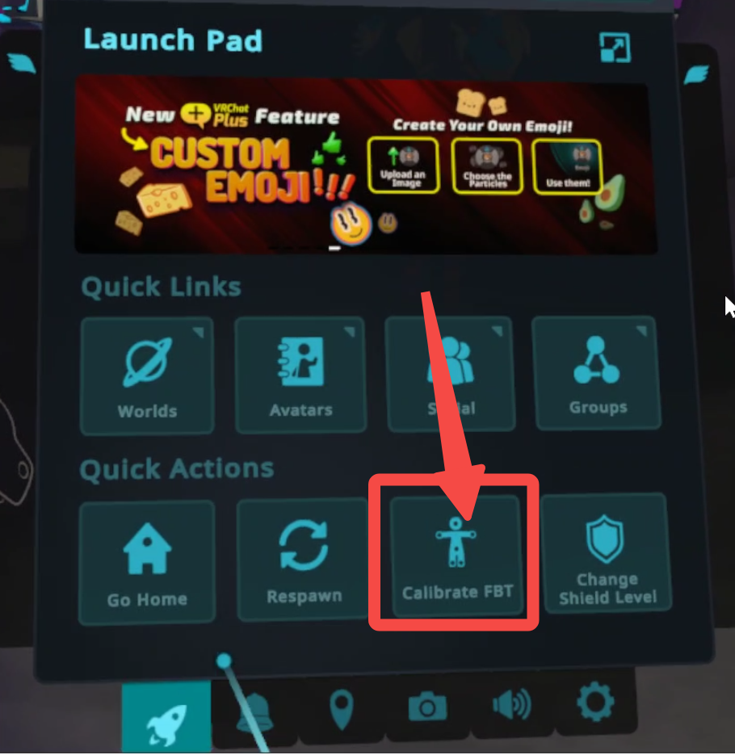

**¡Antes de leer este tutorial, asegúrate de [leer cuidadosamente la integración de SteamVR](README)!!! Si el icono del tracker de rebocap en SteamVR nunca se ha iluminado, ¡este tutorial no tiene sentido!!!**

# Configuraciones Básicas de VRChat

### Introducción a las Configuraciones Básicas de VRChat
Para abrir las configuraciones básicas, sigue estos pasos: Presiona el botón Y en el controlador para convocar el menú -> haz clic en el icono del engranaje -> desplázate hacia abajo hasta `Tracking & IK`, como se muestra en la figura

 
 
 

Puntos clave de la introducción a las configuraciones básicas de IK:
1. Ajustar la altura en VRChat

    > Altura real del usuario, ¡completa la altura medida en Rebocap aquí, no tu altura real! Porque todos los trackers se simulan de acuerdo a la altura medida por Rebocap.
    > 
    > Rebocap mide la altura como la altura del visor * 1.05, para errores en la medición de altura [consulta aquí](../../ui_help_doc/control/connect#vr_pannel).
    > 
    > Si la altura medida por tu visor es siempre inconsistente con la tuya (lo que significa que excede tu altura por ±5cm), puedes apagar la medición automática de altura en el [panel VR](../../ui_help_doc/control/connect#vr_pannel) y ajustar la altura en la página del esqueleto. ¡La altura final mostrada es el estándar! Luego en VRChat, ajusta la altura a la altura final mostrada en Rebocap.
    > **Nota, esta solución no es la mejor**, porque si el visor en sí mide la altura incorrectamente, entonces el desplazamiento del visor en el espacio también es incorrecto. Por ejemplo, si el visor se mueve realmente un metro hacia abajo, los datos de movimiento proporcionados por el visor pueden ser de solo 0,6 metros, lo que resulta en un rendimiento de seguimiento deficiente.

Ver método de medición de altura de Rebocap: Abre el registro para ver mensajes históricos (¡si apagas la altura automática, no se mostrará aquí!)

 
 

2. Ajustar el modo de medición de VRChat

    > ¡Los usuarios nuevos en la captura de movimiento de cuerpo completo de VRChat deberían usar uniformemente el modo `Height`! Los usuarios familiarizados con VRChat IK pueden considerar usar el modo Arm, en conjunto con Arm

3. Permitir el seguimiento de cuerpo completo

    > Debe permitirse, como se muestra en la figura, el estado está encendido (on)

4. Modo de bloqueo de IK
  > Esto se puede ajustar para ver diferentes efectos. Si no estás seguro, puedes usar LockHip o LockHead. Habrá diferencias significativas, especialmente en posturas sentadas o acostadas.

### Introducción a las Configuraciones Avanzadas de IK en VRChat
Para abrir las configuraciones avanzadas, sigue estos pasos: Presiona el botón Y en el controlador para convocar el menú -> haz clic en mundo (world), aparece un panel de configuraciones grande -> haz clic en el icono de engranaje -> selecciona `Tracking & IK` a la izquierda, como se muestra en la figura

 
 
 
 
 

Nota especial: ¡Usuarios nuevos en la captura de movimiento de cuerpo completo de VRChat, excepto por los marcados en la figura, deberían usar todas las configuraciones predeterminadas!!! Puedes consultar las capturas de pantalla

Introducción a las 4 configuraciones marcadas en la figura:
1. ¡Si usar el interruptor IK tradicional!
    > No se recomienda encenderlo, el valor predeterminado es usar IK 2.0, el uso del IK tradicional traerá otros problemas, como que la cintura se hunda en las nalgas
2. Relación de altura del brazo
    > **¡Esta opción solo es efectiva cuando el modo de medición se establece en Arm**! Para usuarios familiarizados con VRChat IK, no recomendado para usuarios no familiarizados. Si hay problemas, puedes comunicarte con otros usuarios, ¡el oficial no proporciona soporte técnico en este punto!
    > 
    > Generalmente, cuando se establece en modo Arm, puedes ajustar la relación aquí para hacer que el rendimiento de la pierna sea más natural. El método específico es abrir el modo de calibración en VRChat, ver los puntos del tracker y ajustar la relación para que los puntos del tracker en los pies estén cerca del empeine.
   
:::danger Consejo

Si los usuarios encuentran que hay menos puntos de seguimiento, ¡es probable que hayan caído debajo del piso! ¡Intenta levantar los pies para comprobarlo!

:::

3. Si mostrar el rango de calibración del tracker
    > Es decir, la esfera de rango verde.

4. Cambiar el modelo de visualización del tracker
    > Si necesitas cambiar a una cruz, establece el `axis` como se muestra en la imagen, y puedes cambiarlo y verlo tú mismo.

### Cómo Calibrar en VRChat
Después de completar las configuraciones básicas mencionadas anteriormente, sigue los pasos a continuación:
1. Presiona el botón Y en el controlador izquierdo para abrir el panel de configuraciones.
2. Haz clic en el icono de la persona pequeña en el panel (siempre que se haya activado el tracker virtual en SteamVR; de lo contrario, el icono aquí no coincidirá con el de la imagen a continuación. Si no está claro, consulta la [Integración con SteamVR](README)).
    > 
3. Ajusta tu postura de pie y adopta una postura T (T-pose), asegurándote de que el punto de seguimiento en la parte superior del pie esté cerca del empeine. Si la esfera de rango verde está abierta, intenta hacer que la esfera sea lo más pequeña posible (los usuarios familiarizados con IK pueden ajustarla ellos mismos).
    > Si descubres que la parte superior de tu pie está debajo del piso, esto a menudo es causado por un error en VRChat. VRChat tiene problemas con el reconocimiento del suelo; por ejemplo, si colocas el controlador en el piso real, la posición del controlador en VRChat puede estar debajo del piso (lo mismo se aplica si está flotando).
    > 
    > Actualmente, no hay una buena manera de resolver esto. Puedes reiniciar VRChat o, después de la calibración, usar `ovr advanced settings` para ajustar la altura del suelo. ¡Asegúrate de ajustarlo solo después de la calibración de movimiento!
4. Mantén la postura T. Si todo tu cuerpo está alineado, presiona los botones de los gatillos (trigger) en ambas manos simultáneamente (el botón de gatillo se refiere al botón en el área de descanso del dedo índice) ¡para completar la calibración en VRChat!

  

  <video id="video" controls preload="metadata" width="100%">
        <source id="mp4" src="/img/vrc_calibrate.mp4" type="video/mp4" />
  </video>
  

# Pasos de Solución de Problemas en VRChat
> Los problemas que no son de detalle generalmente se refieren a problemas específicos, como piernas que no pueden enderezarse en ciertos estados, que están muy relacionados con VRC y la configuración del esqueleto. Se proporcionarán explicaciones adicionales más adelante.
> 
> Esta sección aborda principalmente los problemas de desalineación o caos general.
> 
> Los problemas detallados se documentarán más adelante; por ahora, puedes consultar a miembros experimentados del grupo.

- Comprueba si la interfaz de vista previa 3D es normal.
- Comprueba si el tracker en la interfaz predeterminada de SteamVR es normal.
    > Para detalles específicos, [por favor consulta aquí](README#how_to_solve_tracker_slant).
- Comprueba si las configuraciones de teclas en VRC son consistentes con el tutorial anterior.

### ¿Por qué los brazos del personaje no pueden enderezarse en VRC?
- Esto es causado por un desajuste entre el esqueleto del modelo y el esqueleto del usuario. Si el brazo del modelo es demasiado corto, es más fácil de enderezar. El problema central es que las proporciones óseas no coinciden con las de una persona real.
  > Los usuarios avanzados pueden intentar usar el modo Arm y luego modificar el `arm vs height ratio`.
  > 
  > Aquí hay un ejemplo extremo para que los jugadores lo entiendan: si el brazo del personaje virtual mide 3 metros de largo, pero la altura del personaje es de solo 1,7 metros, la posición de reposo normal de los brazos de una persona en realidad es en la cintura. Sin embargo, VRChat debe respetar la posición real de la mano, por lo que los brazos del personaje virtual solo se pueden doblar en un cierto ángulo.

### ¿Por qué los pies de mi personaje están por debajo del piso durante la calibración?
> Esto ya se ha explicado en el tercer punto de [Cómo Calibrar en VRChat](#calibration_in_vrc).

### ¿Por qué mis piernas no pueden enderezarse?
> Esto está relacionado con la diferencia significativa en las proporciones óseas del personaje virtual en comparación con la realidad. En general, usar un esqueleto de personaje que coincida con el tuyo y ajustarlo en rebocap produce los mejores resultados.
> 
> Además, puedes usar un truco de calibración para aliviar este problema, como establecer la altura en VRChat ligeramente más baja de lo que se midió en rebocap. Esto facilita que las piernas se enderecen al estar sentado.
> 
> Esto está dirigido a usuarios que no bailan; para los usuarios que bailan, se recomienda establecer la altura de acuerdo con las mediciones en rebocap.

### ¿Por qué se me cruzan los pies al sentarme?
1. Excluye la influencia del tirón de los pantalones.
2. Cambia la posición del tracker en el muslo y observa los efectos de diferentes posiciones.
3. Si todavía hay problemas, ¡por favor [ajusta la compensación](../../ui_help_doc/control/cap_param#up_leg_com) (prioriza ajustar la compensación del muslo) basándote en los efectos observados en la vista previa 3D!
4. Durante la calibración de movimiento, mantén la distancia entre los pies más junta.
5. Durante la calibración en VRChat, mantén la distancia entre los pies un poco más cerca.

Para los puntos 1 y 2, por favor lee detenidamente la [sección del tutorial](../../tutorial/instroction_for_straps#tracker_position_recomendation).

### Cómo Mejorar la Estabilidad
1. Usa [métodos de fijación complejos](../../tutorial/instroction_for_straps#quick_fix_complex_install) para las correas, o compra correas más anchas.
2. Los sensores de pie son cruciales; [por favor, consulta aquí](../../tutorial/instroction_for_straps#tracker_position_on_body).
3. Para los usuarios que bailan, especialmente durante bailes intensos, se recomienda encontrar un entorno con un campo magnético relativamente bueno y apagar el modo antimagnético.

                     