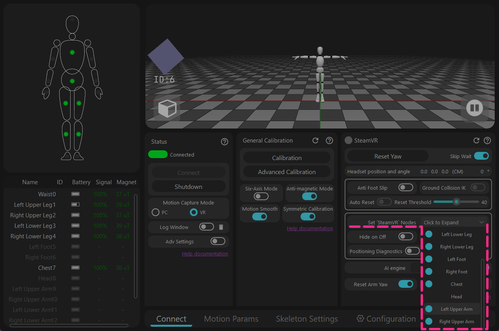
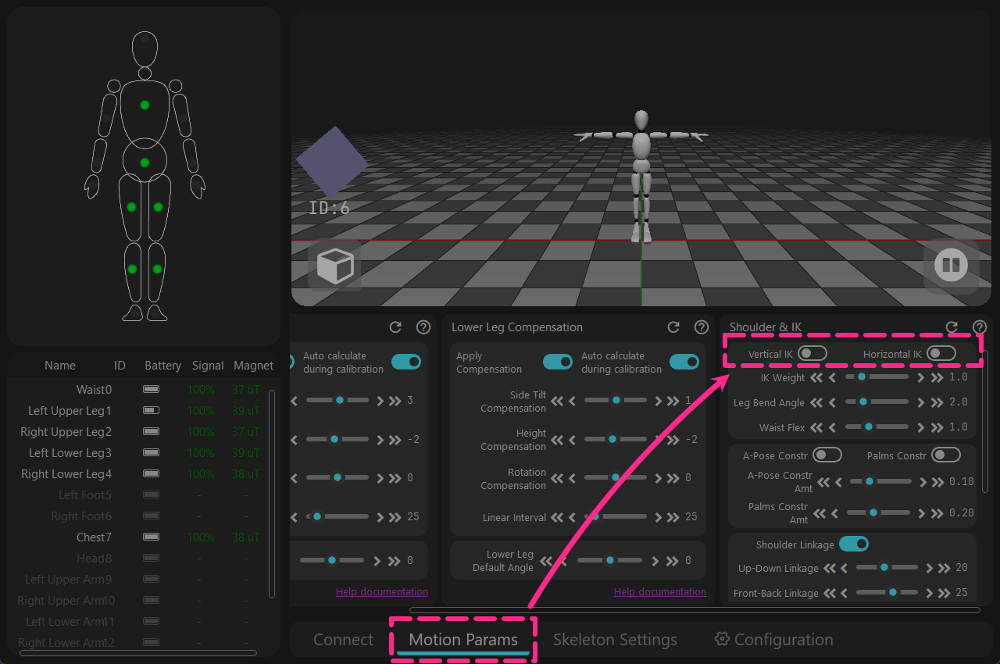
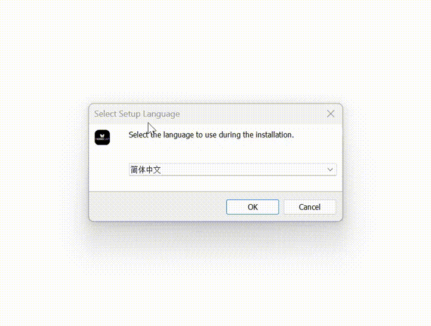

<!-- ==================== Flag A: Install software Start ==================== -->

## Descarga {#software-download-toc}
<h2 class="tutorial-heading-flag" style="background: #88b49c; margin-top: 0; display: inline-block;">Descarga</h2>

Actualmente, la versión disponible es `Release`. Haga clic en el enlace de descarga a continuación. 
La versión `Beta` es una versión de prueba pública, que funciona mejor en áreas con interferencia magnética significativa, pero aún no ha sido validada exhaustivamente.

**Versión Estable** -  [Descargar Rebocap V01](https://doc.rebocap.com/img/files/rebocap_release_v01.exe)

**Versión Beta** - [Descargar Rebocap V02 Beta02](https://doc.rebocap.com/img/files/rebocap_release_v02_beta02.exe)

- Selección de Versión:\
  V01 - Adecuada para entornos con campos magnéticos estables, recomendada para bailar. 
  V02 Beta02 - La configuración predeterminada está optimizada para el conjunto de 6 rastreadores y utiliza un nuevo algoritmo para identificar activamente fuentes de interferencia fuerte, manteniendo la orientación incluso en trampolines.

- Se recomienda instalar en un disco que no sea del sistema (no instalar en el disco C).

<!-- ==================== Details Start ==================== -->

 Verifique las versiones de firmware compatibles y las instrucciones de funcionamiento.

   &emsp;&emsp; Algunas versiones de firmware tienen cambios importantes en el algoritmo y son incompatibles con versiones de software más antiguas.   

   &emsp;&emsp; Al volver a una versión de software más antigua, el firmware debe degradarse en consecuencia.  

   &emsp;&emsp;&emsp; release_v01 - ◼️tracker : V6 / V7  ,  📡receiver : V6 / V7   

   &emsp;&emsp;&emsp; release_v02 beta02 - ◼️tracker : V15  ,  📡receiver : V6 / V7   

   &emsp;&emsp;&emsp; (No publicado) release_v02 beta02.1 - ◼️tracker : V16  ,  📡receiver : V6 / V7 / V8   

<video autoPlay loop muted playsInline width="100%" src="/img/softawre_install/show_version_log.mp4"></video>

**Instrucciones de funcionamiento del firmware** 
- Abra la ventana de registro para ver la versión de firmware real de cada rastreador   
(la ventana de registro se encuentra en "Conectar y Apagar" en el software).

 

- Los rastreadores se actualizan de forma inalámbrica 📶 — no se necesita cable USB.  
🚫 No actualice el rastreador y el receptor al mismo tiempo.  

- Si la actualización falla, debe reiniciar el rastreador y hacer clic en actualizar nuevamente.  
&emsp;&emsp;🟩Verde – parpadeo rápido: el rastreador funciona normalmente  
&emsp;&emsp;🟩Verde – parpadeo lento: el rastreador espera la señal del receptor  
&emsp;&emsp;🟦Azul: el rastreador está recibiendo datos de firmware  
&emsp;&emsp;🟨Amarillo: la actualización falló (presione manualmente el botón 🔘 para reiniciar y luego vuelva a intentar la actualización)  
&emsp;&emsp;⬜Blanco: actualización exitosa (generalmente se reinicia automáticamente después de 10 segundos; si no, reinícielo manualmente) 

-  Cuando finalice la actualización del receptor 📡, desconecte y vuelva a conectar el USB, y reinicie 🔄 el software.

<!-- ==================== Details End ==================== -->

<!-- ==================== Details Start ==================== -->

Si utiliza la versión V01 en modo VR, debe cambiar la siguiente configuración.

<strong>1 - Cuando no haya un rastreador de brazo superior, apague manualmente los puntos de rastreo adicionales.</strong> 
Abra [Configurar nodos de salida 'SteamVR'] → Desactive [Brazo superior izquierdo/derecho]

Detalles

El software originalmente planeaba usar la función [Ocultar automáticamente articulaciones] para ocultar automáticamente los puntos de seguimiento no utilizados, 
pero se descubrió que esta función no se podía comprobar automáticamente. Esto se ha solucionado en el software V02 Beta02.

<strong>2 - Apague las funciones que puedan atascarse incorrectamente funcionando globalmente.</strong> 
→ [Parámetros de Movimiento] → Desactive [IK Vertical & IK Horizontal]

Detalles

Esta función originalmente era una subfunción en el módulo [Antideslizante], 
pero permanecería activa globalmente de forma inesperada. Esto se ha solucionado en el software V02 Beta02.

<!-- ==================== Details End ==================== -->

<!-- ==================== Flag A: Install software End ==================== -->

Notas:
> El software actualmente solo es compatible con **Windows 10** y superior. 
> El software debe usarse mientras esté conectado a Internet. Si desea usarlo sin conexión, conéctese a través de un punto de acceso móvil, inicie el software, espere 30 segundos y luego desconecte la red. 
(Siempre que la [Ventana de registro] muestre que la verificación de red fue exitosa, puede desconectar la red)

## Instalación del Software
1. Haga doble clic en rebocap_release_v01.exe (la versión actual es rebocap_release_v01.exe)
2. Instálelo de acuerdo con los pasos que se muestran en la figura a continuación
3. Abra el software Rebocap
   * Abrir desde el Menú de Inicio
   * Abrir a través del acceso directo del escritorio

## Notas de Actualización del Software

### Registro de Cambios

#### Actualización 2026-02-04: Rebocap Release V02 Beta02
1. Firmware actualizado a v15, algoritmos antimagnéticos y de 6 ejes optimizados, estabilidad antimagnética mejorada, estabilidad de 6 ejes mejorada
   > En condiciones dinámicas, por ejemplo, bailando continuamente en un entorno magnético deficiente, el rendimiento aún está cerca del modo de 6 ejes. Con el nuevo firmware, siempre que el campo magnético sea bueno, el baile dinámico se puede corregir de manera continua (el firmware anterior dependía de momentos estáticos intermitentes para la corrección)
2. Se agregó la función de apagado automático retrasado, requiere actualizar el firmware del receptor.
3. Calibración de rumbo rediseñada y se agregó la función de calibración de rumbo en PC:
   > Nota: Al realizar la calibración de rumbo en PC, use una pose A de cuerpo completo; levantar los antebrazos y las palmas hacia adelante funciona mejor. Alternativamente, puede realizar directamente una Pose S, o sentarse y estirar los brazos hacia adelante también funciona)
4. Si el software falla inesperadamente y se vuelve a abrir en 5 minutos, los resultados de calibración anteriores se aplicarán automáticamente; no es necesario recalibrar
5. Durante la calibración de rumbo, el campo magnético se restablecerá (se restablecerá directamente a un campo relativo de 1.0). En otras palabras, si está acostado en la cama, utilizará el campo magnético en el momento de la calibración como referencia inicial para corregir.
6. Se eliminó la restricción en la calibración del campo magnético (Magnetic Field Calibration); la calibración magnética simple (Simple Magnetic Calibration) (dibujar un número 8) ahora se puede hacer clic de forma predeterminada
   > Por defecto, la calibración está limitada a 8 sensores a la vez. Si agrega el archivo: `data/__no_limit_max_nodes__` en el directorio de datos, se eliminará el límite
7. Se corrigió un error por el cual el movimiento del pie después de acostarse podía hacer que el esqueleto del personaje se dividiera.

Otras actualizaciones:
1. La barra de título del software ahora muestra el número de versión
2. Se corrigió un error por el cual la función de ocultación automática de los sensores apagados no surtía efecto
3. Cuando el modo antideslizante del pie está desactivado, los pies pueden ir por debajo del suelo y el IK se ha eliminado
4. Se resolvió un error por el cual la pose del avatar se congelaba después de desconectar el receptor
5. Se agregó compensación lateral de VR en la configuración del esqueleto (para modelos cuyo punto de montaje HMD no está centrado en la frente sino ligeramente a un lado, puede ajustar según sea necesario)

#### Actualización 2025-12-03: Rebocap Release V01
**Sección VR:**
1. Se agregó la función de caminar en el lugar: al caminar en el lugar, el joystick se simula para avanzar constante y lentamente, consulte el documento de Ayuda para obtener detalles (Función Avanzada)
2. Se agregó el ajuste de altura del suelo virtual de VR, rango de -100 cm a 100 cm (Función Avanzada)
3. Se agregó la función de reemplazo del controlador: cuando está habilitada, los rastreadores manuales reemplazan la posición y orientación del controlador, consulte el documento de Ayuda para obtener detalles (Función Avanzada)
4. Se actualizó el complemento SteamVR y se intentó solucionar el problema por el cual los rastreadores se reconocen como controladores
5. Localizador de pies incorrecto arreglado al importar un esqueleto en modo VR (que afectaba principalmente el cálculo de IK) que hacía que los pies del avatar y el cuerpo en general se hundieran.
6. Después del restablecimiento de rumbo, la función Auto Re-centrado se activará de manera proactiva
7. Se agregó un interruptor para ocultar automáticamente los nodos apagados; cuando está habilitado, los nodos apagados se ocultarán automáticamente
8. Se restauró la función de seguimiento de VR pecho/cintura para seguir al HMD

**Sección PC:**
1. Algoritmo de calibración de movimiento actualizado: se relajaron los requisitos de postura del brazo en T, resolviendo problemas de brazos asimétricos para algunos usuarios
2. Se agregó el brazo IK. El IK de Manos Juntas minimiza el cruce de brazos cuando las manos están juntas, y el IK de Pose A soluciona el recorte grave cuando los hombros del avatar son demasiado estrechos y los brazos están verticales.
3. Se agregó exportación de movimiento MMD e importación de modelo PMX. Nota: los movimientos VMD no contienen IK; debe eliminar las restricciones IK manualmente.
4. Se corrigió el error donde el salto de velocidad de fotogramas de animación estaba limitado a 999

**General:**
1. Interfaz de usuario actualizada: se reorganizó por función, se mejoraron algunas traducciones de términos y se hicieron descripciones de funciones más amigables
2. Se agregó el interruptor de Configuración Avanzada, junto con funciones de exportación/importación de configuración y Restaurar Valores Predeterminados
3. Se eliminó el problema por el cual la calibración no podía continuar debido a la detección fallida de inmovilidad
4. Se agregó la función de conexión automática; ya no es necesario hacer clic en el botón de conexión manualmente
5. Se agregó actualización de firmware del receptor para resolver los problemas de alta carga de CPU y pérdida de paquetes (especialmente en CPU AMD)
6. Rastreadores actualizados al firmware v07 para una estabilidad general mejorada
7. Se agregó la capacidad de seleccionar nodos específicos para el modo de 6 ejes (Función Avanzada)
8. Se corrigió un error en el que algunos giroscopios no volvían a cero después de la calibración

**Otros:**
1. Se agregó una pantalla de inicio al arrancar para evitar largos períodos de espera en segundo plano
2. Estabilidad de la ventana 3D mejorada
3. Aumentó el número de servidores de autenticación a tres (China, Hong Kong y Estados Unidos); la autenticación es exitosa siempre que algún servidor apruebe
4. Se corrigió un error ocasional donde los datos parecían no poder enviarse durante la calibración (en realidad, se enviaron correctamente)
5. Se cambió el esqueleto predeterminado por el esqueleto recomendado por la comunidad y se modificaron otros parámetros predeterminados
6. Se agregó un mensaje de recalibración al activar o desactivar el interruptor de seis ejes
7. Se corrigió el problema de compensación de inclinación lateral de seis ejes

### POR HACER (sin orden en particular, solo se enumeran los puntos de actualización importantes)

- Optimizar el rendimiento de IK  
- Mejorar la estabilidad del software  
- Soporte para el modo VR de 3 puntos  
- Soporte para el modo de cuerpo completo de 6 puntos en PC  
- Agregar documentación en otros idiomas (se agregará una vez que la documentación esté estabilizada)  

### Versiones Históricas
> **Nota: Las versiones anteriores a preview05 no admiten hardware nuevo lanzado después del 2025-11-29. Para hardware nuevo, descargue la última versión Release o versión Beta.**
