# 6 - déballage et utilisation du kit de trackers

<!-- ============ 标题 ======== 检查包裹内容 ==================== -->
## 1 - Vérifier le contenu de la boîte

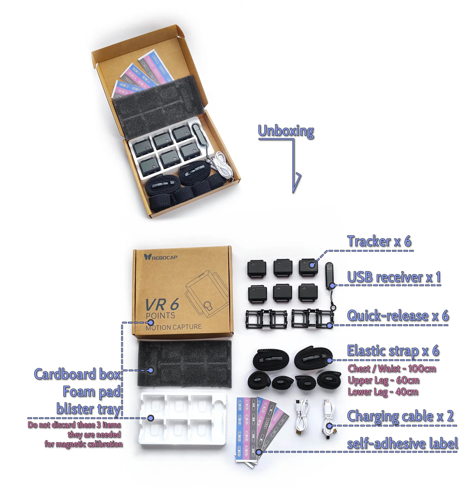

* **Boîte en carton, coussin en mousse, plateau en plastique** 
 (⚠️ *Ne jetez pas ces 3 éléments ; ils sont nécessaires pour l'étalonnage (Calibration) magnétique.*)
* **Tracker** x 6
* **Récepteur USB** x 1
* **Base à dégagement rapide** x 6
* **Sangle élastique** x 6
  * Poitrine / Taille - 100cm
  * Cuisse - 60cm
  * Mollet - 40cm
* **Câble de charge** x 2
* **Étiquette autocollante** (Autocollants)

<!-- ============= 标题 ======= 安装绑带 ==================== -->
## 2 - Installer les sangles

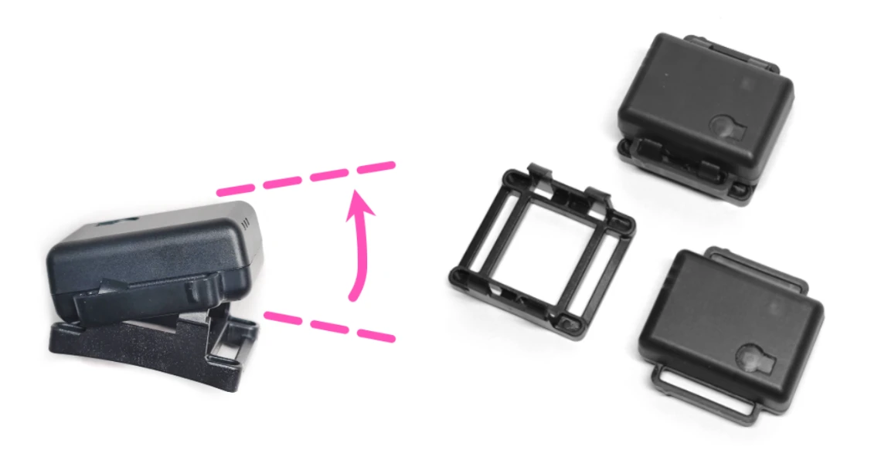

- Retirez la base à dégagement rapide du tracker, 
faire levier d'un côté facilite le retrait.

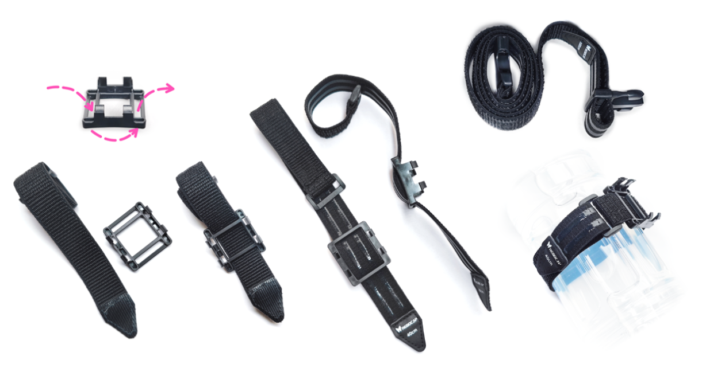
- Fixez la base à dégagement rapide à la sangle, assurez-vous que la sangle passe en dessous.

  <video id="video" controls loop preload="metadata" width="60%">
    <source id="mp4" src="/img/kuaichai_normal.mp4" type="video/mp4" />
  </video>

- Vidéo d'installation de la sangle

- Après avoir attaché le Velcro, tirez sur les côtés pour encastrer les crochets dans la peluche, afin d'éviter qu'il ne tombe.

  <a href="/docs/tutorial/instroction_for_straps" target="_blank" class="button button--primary" style="text-decoration: none; border-radius: 6px; display: inline-block; font-weight: bold; font-size: 1.0rem; padding: 6px 18px;">
    Plus de guides d'installation de sangle → 📖
  </a>

<!-- ============ 标题 ======== 穿戴在身上的位置 ==================== -->
## 3 - Porter sur le corps

<!-- ==================== 左右分栏图文排版 开始 ==================== -->

<!-- 左侧分栏：放人物模型图 -->

<!-- 提示：请将无文字的人物主图放入 static/img/unboxing/ 目录中，并将下方路径改为实际图名 -->

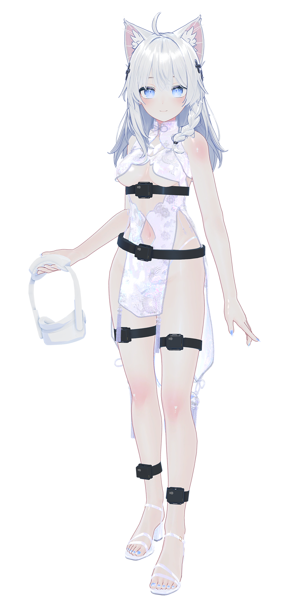

<!-- 右侧分栏：放文字说明 -->

<!-- 第一组：围度数据 -->

<strong>Poitrine / Taille :</strong> 100 cm 
<strong>Cuisse :</strong> 60 cm 
<strong>Mollet :</strong> 40 cm

<!-- 第四组：身体差异性调整 -->

<strong>Différences corporelles :</strong> 
Veuillez vous référer aux positions de port indiquées sur l'image, 
Il est recommandé de placer le tracker poitrine/taille dans le dos, 
Les trackers de jambe peuvent être placés sur le côté.

<!-- 第三组：避开区域提示 -->

<strong>Conseils :</strong> 
Gardez les boutons du tracker orientés vers le haut. 
 
Ne placez pas le tracker de taille au niveau du nombril pour éviter la pression, 
Évitez les zones de peau bombées pour les trackers de jambe. 
Ne placez pas le tracker de cuisse trop près du genou. 

<!-- 第五组：底部小图与文字上下排版 -->

<!-- 提示：请将编号细节小图放入目录，并在此配置真实路径 -->

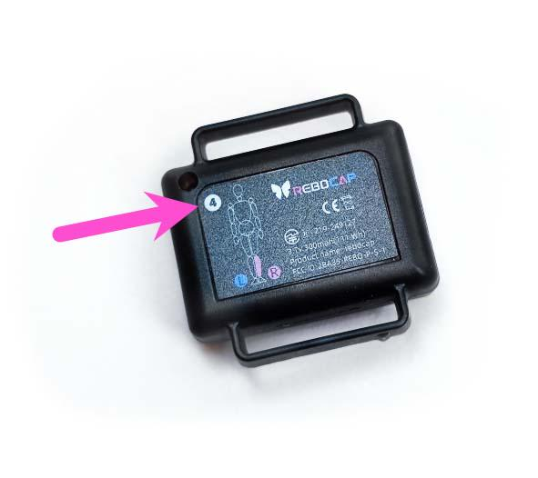

Les trackers ont des numéros d'identification au dos, 
Numéros et positions définis en usine. 
Non modifiables ni remplaçables,  
impossible de combiner deux kits de 6 trackers ensemble.

<!-- ==================== 左右分栏图文排版 结束 ==================== -->

<!-- ============= 标题 ======= 安装软件 和 检查固件更新 ==================== -->

## 4 - Installer le logiciel - Vérifier la mise à jour du firmware

<!-- ==================== 旗帜 A：Install software 开始 ==================== -->

## A - Installer le logiciel

  <a href="/docs/tutorial/software_install" target="_blank" class="button button--primary" style="text-decoration: none; border-radius: 6px; display: inline-block; font-weight: bold; font-size: 1.0rem; padding: 6px 18px;">
    Téléchargement du logiciel → 🌐
  </a>

- Sélection de la version :\
  V01 - Adapté aux environnements avec des champs magnétiques stables, principalement pour la danse. 
  V02 Beta02 - Les paramètres par défaut sont optimisés pour le kit de 6 trackers,  
  et il dispose d'un nouvel algorithme qui détecte activement les fortes sources d'interférence, maintenant l'orientation même sur un lit à ressorts.

<!-- ==================== 折叠页 开始 ==================== -->

Si vous utilisez la version V01 en mode VR, certains paramètres doivent être modifiés.

<strong>1 - Désactiver les points de suivi supplémentaires affichés.</strong> 
Ouvrez [Set 'SteamVR'Nodes] → Désactivez [Left/Right Upper Arm]

Détails

Le logiciel prévoyait à l'origine d'utiliser la fonction [Auto Hide Joints] pour masquer automatiquement les points de suivi inutilisés, 
mais il s'est avéré que cette fonction ne pouvait pas vérifier automatiquement. Cela a été corrigé dans le logiciel V02 Beta02.

<strong>2 - Désactiver la fonctionnalité restée active globalement.</strong> 
→ [Motion Params] → Désactivez [Vertical IK & Horizontal IK]

Détails

Cette fonctionnalité était initialement prévue comme une sous-fonction du module [Anti-Slip], 
mais elle est restée accidentellement dans un état actif global. Cela a été corrigé dans le logiciel V02 Beta02.

<!-- ==================== 折叠页 结束 ==================== -->

- Installation recommandée sur un lecteur non système (pas C:).

<!-- ==================== 旗帜 A：Install software 结束 ==================== -->

<!-- ==================== 旗帜 B：Connect to computer 开始 ==================== -->

## B - Connecter à l'ordinateur

<!-- ==================== 步骤 1：连接接收器 开始 ==================== -->

<!-- 提示：请将“Connect Receiver”步骤的图片放入 static/img/unboxing/ 目录中，并将下方路径改为实际图名 -->

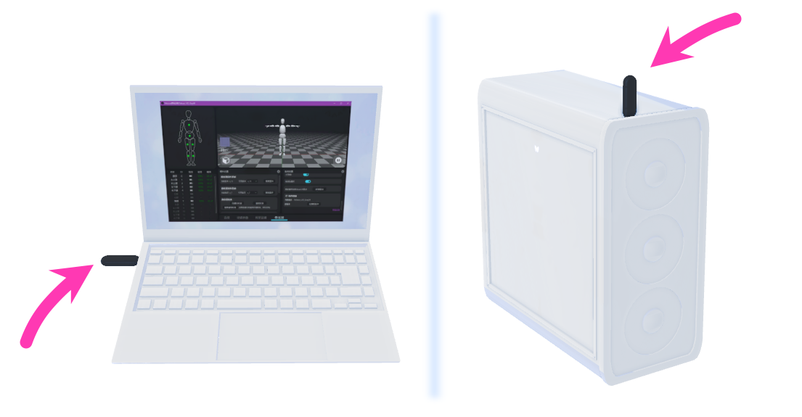

<strong style="font-size: 1.15em" class="tutorial-step-title">1. Connecter le récepteur</strong> 
- Insérez le récepteur USB dans l'ordinateur, choisissez un port dégagé. 
- Ou préparez un câble de données USB 3.0 courant comme rallonge. 
- Si le signal du tracker ne peut pas se maintenir à 100%, envisagez d'utiliser une rallonge ou de changer sa position.

<!-- ==================== 步骤 1 结束 ==================== -->

<!-- ==================== 步骤 2：软件连接 开始 ==================== -->

<!-- 提示：请将“Software Connection”步骤的图片放入 static/img/unboxing/ 目录中，并将下方路径改为实际图名 -->

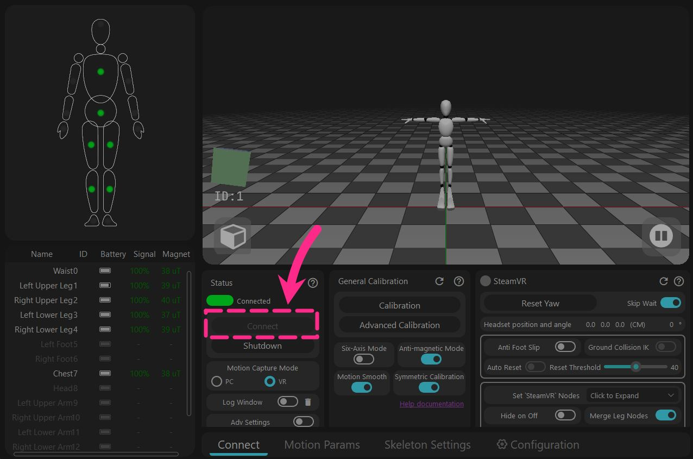

<strong style="font-size: 1.15em" class="tutorial-step-title">2. Connexion logicielle</strong> 
- Cliquez sur "Connect" dans le logiciel (après la version beta02, il se connectera automatiquement).

<!-- ==================== 步骤 2 结束 ==================== -->

<!-- ==================== 步骤 3：开启追踪器 开始 ==================== -->

<!-- 提示：请将“Power on Trackers”步骤的图片放入 static/img/unboxing/ 目录中，并将下方路径改为实际图名 -->

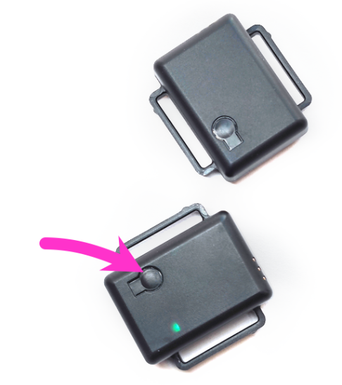

<strong style="font-size: 1.15em" class="tutorial-step-title">3. Allumer les trackers</strong> 
- Appuyez sur le bouton du tracker pour l'allumer. 
- Remarque : Les trackers sont éteints via le logiciel.

<!-- ==================== 步骤 3 结束 ==================== -->

<!-- ==================== 旗帜 B：Connect to computer 结束 ==================== -->

<!-- ==================== 旗帜 C：Check firmware 开始 ==================== -->

## C - Vérifier le firmware

<!-- ====================  检查固件 开始 ==================== -->

<!-- 提示：请将“Power on Trackers”步骤的图片放入 static/img/unboxing/ 目录中，并将下方路径改为实际图名 -->

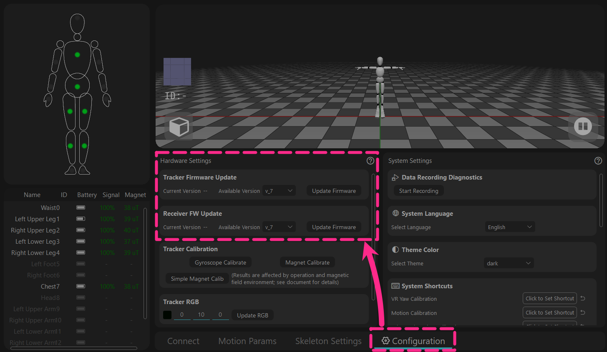

<strong style="font-size: 1.15em" class="tutorial-step-title">Vérifier le firmware [tracker et récepteur]</strong> 
- vers la version la plus élevée disponible dans les options, 
- changera avec les futures mises à jour logicielles. 
- Le firmware est fourni avec le package logiciel, il n'est pas mis à jour via Internet.

<!-- ====================  检查固件 结束 ==================== -->

<!-- ==================== 折叠页 开始 ==================== -->

 Vérifiez la version du firmware prise en charge par le logiciel.

   &emsp;&emsp; Certaines versions de firmware comportent des modifications algorithmiques importantes, les rendant incompatibles avec les anciens logiciels.   

   &emsp;&emsp; Lors du retour à une ancienne version du logiciel, vous devez dégrader le firmware en conséquence.  

   &emsp;&emsp;&emsp; release_v01 - ◼️tracker : V6 / V7  ,  📡récepteur : V6 / V7   

   &emsp;&emsp;&emsp; release_v02 beta02 - ◼️tracker : V15  ,  📡récepteur : V6 / V7   

   &emsp;&emsp;&emsp; (non public) release_v02 beta02.1 - ◼️tracker : V16  ,  📡récepteur : V8   

<!-- ==================== 折叠页 结束 ==================== -->

- Ouvrez la fenêtre de journal pour voir la version réelle du firmware de chaque tracker   
(la fenêtre de journal est située sous "Connect & Power Off" dans le logiciel).

- Les trackers sont mis à jour sans fil 📶 — aucun câble USB n'est nécessaire.  
🚫 Ne mettez pas à jour le tracker et le récepteur en même temps.  

- Si la mise à jour échoue, vous devez redémarrer le tracker et cliquer à nouveau sur Mettre à jour.  
&emsp;&emsp;🟩Vert – clignotement rapide : Le tracker fonctionne normalement  
&emsp;&emsp;🟩Vert – clignotement lent : Le tracker attend le signal du récepteur  
&emsp;&emsp;🟦Bleu : Le tracker reçoit les données du firmware  
&emsp;&emsp;🟨Jaune : La mise à jour a échoué (appuyez manuellement sur le bouton 🔘 pour redémarrer, puis réessayez la mise à jour)  
&emsp;&emsp;⬜Blanc : Mise à jour réussie (redémarre généralement automatiquement après 10s ; sinon, redémarrez manuellement) 

-  Une fois la mise à jour du 📡récepteur terminée, débranchez et rebranchez l'USB, et 🔄redémarrez le logiciel.

<!-- ==================== 旗帜 C：Check firmware 结束 ==================== -->

<!-- ============= 标题 ======= 校正追踪器初始数据 ==================== -->
## 5 - Étalonner les données initiales du tracker

<!-- ==================== 旗帜 Gyroscope Calibration 开始 ==================== -->

## Étalonnage du gyroscope (Gyroscope Calibration)
<!-- ==================== 步骤 1：放置追踪器 开始 ==================== -->

<!-- 提示：请将“Place Trackers”步骤的图片放入 static/img/unboxing/ 目录中，并将下方路径改为实际图名 -->

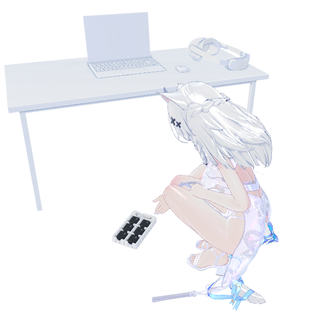

<strong style="font-size: 1.15em" class="tutorial-step-title">1. Placer les trackers sur le sol</strong> 
- Placez les trackers sur le sol  
(dans une position sans aucun tremblement/mouvement physique). 
- Pas besoin de les remettre dans le plateau en plastique. 
- Le principe est d'enregistrer quelques secondes sans aucun mouvement physique dans la réalité.

<!-- ==================== 步骤 1 结束 ==================== -->

<!-- ==================== 步骤 2：启动采集 开始 ==================== -->

<!-- 提示：请将“Start Calibration”步骤的图片放入 static/img/unboxing/ 目录中，并将下方路径改为实际图名 -->

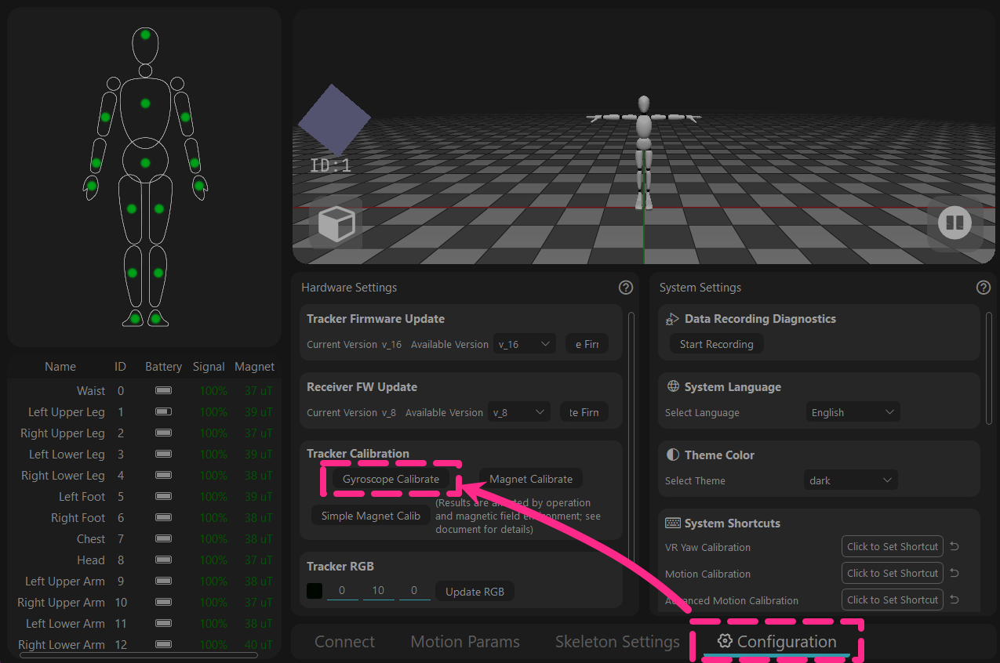

<strong style="font-size: 1.15em" class="tutorial-step-title">2. Lancer l'étalonnage (Calibration)</strong> 
- Cliquez sur le bouton, attendez que la collecte soit terminée.

<!-- ==================== 步骤 2 结束 ==================== -->

<!-- ==================== 步骤 3：检查陀螺仪信息 开始 ==================== -->

<!-- 提示：请将“Check Gyroscope”步骤的图片放入 static/img/unboxing/ 目录中，并将下方路径改为实际图名 -->

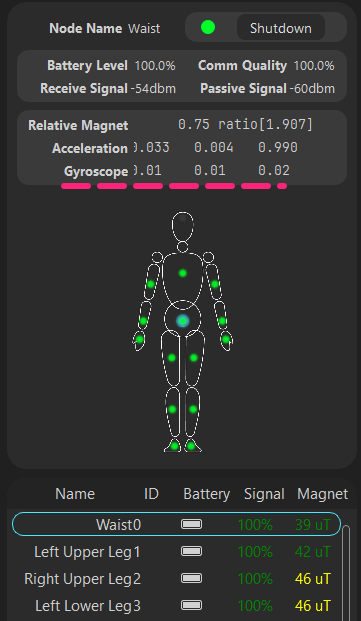

<strong style="font-size: 1.15em" class="tutorial-step-title">3. Vérifier les informations du gyroscope</strong> 
- 🔍Une fois terminé, vérifiez les informations du gyroscope de chaque tracker. 
- En règle générale, les valeurs de sortie du gyroscope doivent être de 0 à ±0,05 à l'arrêt.

<!-- ==================== 步骤 3 结束 ==================== -->

<!-- ==================== 旗帜 Gyroscope Calibration 结束 ==================== -->

<!-- ==================== 旗帜 Magnetic Field Calibration 开始 ==================== -->

## Étalonnage du champ magnétique (Magnetic Field Calibration)

<!-- ==================== 步骤 1：放置吸塑盘 开始 ==================== -->

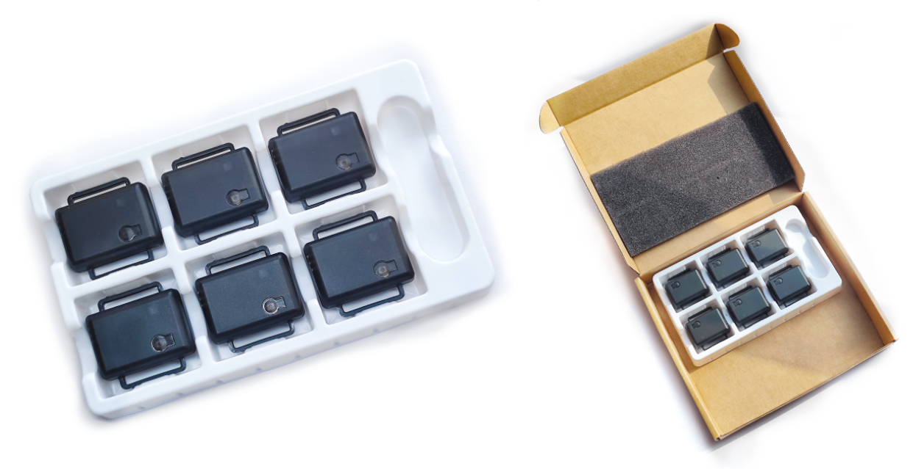

<strong style="font-size: 1.15em" class="tutorial-step-title">1. Placer les trackers dans le plateau en plastique</strong> 
- Placez les trackers dans le plateau en plastique dans une direction uniforme. 
- (Si vous trouvez cela peu pratique à tenir, vous pouvez remettre le plateau en plastique dans la boîte en carton).

<!-- ==================== 步骤 1 结束 ==================== -->

<!-- ==================== 步骤 2：站在中心 开始 ==================== -->

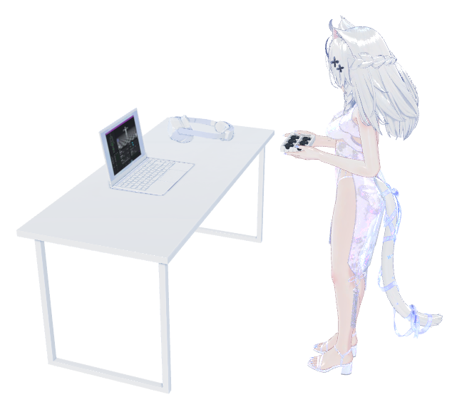

<strong style="font-size: 1.15em" class="tutorial-step-title">2. Se tenir au centre de l'espace de jeu</strong> 
- Tenez-le dans vos bras, tenez-vous au centre de l'espace de jeu, 
- ou à un pas du bord du bureau de l'ordinateur.

<!-- ==================== 步骤 2 结束 ==================== -->

<!-- ==================== 步骤 3：旋转吸塑盘 开始 ==================== -->

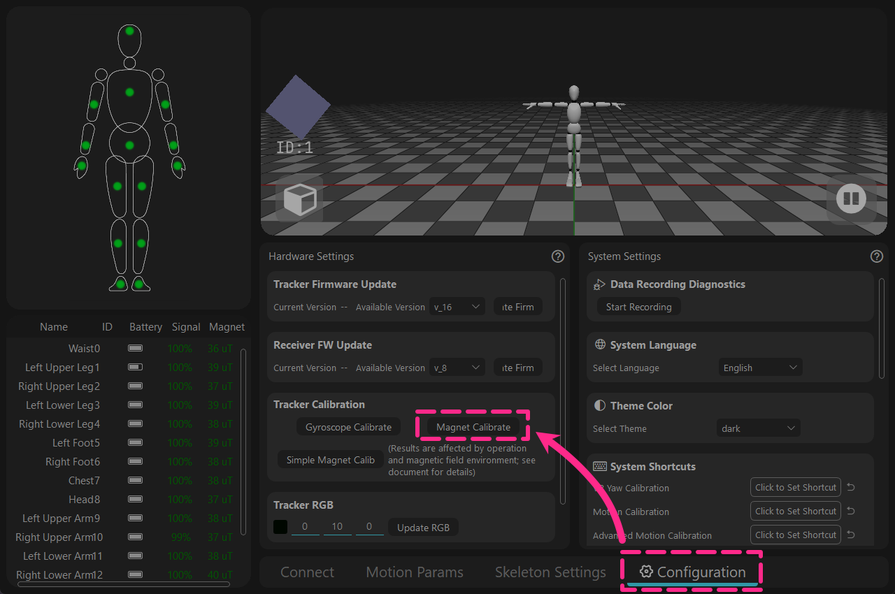

<strong style="font-size: 1.15em" class="tutorial-step-title">3. Effectuer l'étalonnage (Calibration)</strong> 
- Cliquez sur le bouton du logiciel et suivez la séquence d'animation affichée par le logiciel pour tourner à une vitesse constante. 
- (Le processus d'enregistrement capture des données pour deux tours complets par côté).

<!-- ==================== 步骤 3 结束 ==================== -->

<!-- ==================== 步骤 4：检查磁场读数 开始 ==================== -->

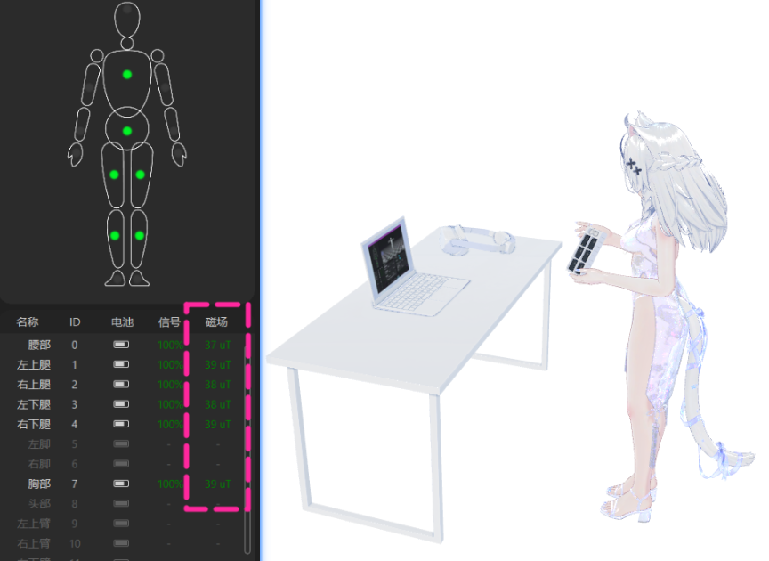

<strong style="font-size: 1.15em" class="tutorial-step-title">4. Vérifier les lectures du champ magnétique</strong> 
- Une fois terminé, retournez le plateau en plastique de manière aléatoire dans vos mains, 
- 🔍vérifiez si les lectures du champ magnétique du tracker étalonné sont cohérentes ou proches les unes des autres, 
- ⚠️si les lectures du champ magnétique diffèrent considérablement les unes des autres, vous devez effectuer à nouveau l'étalonnage (Calibration) magnétique.

<!-- ==================== 步骤 4 结束 ==================== -->

<!-- ==================== 折叠页 开始 ==================== -->

Que faire si vous n'avez pas/avez perdu la boîte ?

   &emsp;&emsp;Vous pouvez utiliser les sangles pour attacher les trackers à une bouteille d'eau carrée ou à une boîte de mouchoirs,  
   &emsp;&emsp; en les regroupant par 2 ou 3. 

<!-- ==================== 折叠页 结束 ==================== -->

<!-- ==================== 折叠页 开始 ==================== -->

Étalonnage magnétique simple (Simple Magnetic Calibration).

   &emsp;&emsp;Comme alternative pratique.   
   &emsp;&emsp;Action principale :  
   &emsp;&emsp;Tournez le tracker pendant la période d'enregistrement, couvrant autant de directions que possible (tours complets à 360°). 

   &emsp;&emsp;Conseil :  
   &emsp;&emsp;Déplacez votre poignet et votre bras en formant un "8" afin que le capteur puisse capturer les données du champ magnétique sous plus d'angles. 

<!-- ==================== 折叠页 结束 ==================== -->

<!-- ==================== 旧版本看不到简易磁场校准 折叠页 开始 ==================== -->

Ce bouton n'est-il pas visible dans la V01 et les versions antérieures ?

   &emsp;&emsp;Ce bouton n'est pas affiché dans les anciennes versions par défaut, 
   &emsp;&emsp;vous devez créer manuellement un fichier .txt spécifique pour le faire apparaître. 

   &emsp;&emsp;Allez dans le dossier racine de Rebocap (où se trouve Rebocap.exe),  
   &emsp;&emsp;créez un nouveau fichier .txt, et renommez-le en 
   &emsp;&emsp; \_simple_cal_

   &emsp;&emsp;Après le redémarrage du logiciel, le bouton apparaîtra.

<!-- ==================== 旧版本看不到简易磁场校准 折叠页 结束 ==================== -->

<!-- ==================== 折叠页 结束 ==================== -->

<!-- ==================== 旗帜 Magnetic Field Calibration 结束 ==================== -->

<!-- ============= 标题 ======= 进入SteamVR ==================== -->
## 6 - Entrer dans SteamVR

<!-- ==================== 旗帜 Connection 开始 ==================== -->

## Connexion

<!-- ==================== 步骤 1：启动 SteamVR 开始 ==================== -->

<strong style="font-size: 1.15em" class="tutorial-step-title">1. Lancer SteamVR</strong> 
- Lancez SteamVR. 
- (Casque SteamVR = Tracker de tête Rebocap).

<!-- ==================== 步骤 1 结束 ==================== -->

<!-- ==================== 步骤 2：选择 VR 模式并校准 开始 ==================== -->

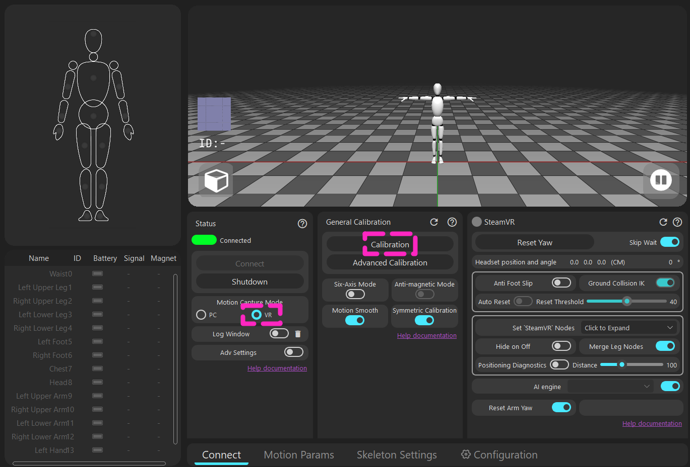

<strong style="font-size: 1.15em" class="tutorial-step-title">2. Sélectionner le mode VR et étalonner</strong> 
- Dans Rebocap, sélectionnez [VR Mode], puis cliquez sur "Calibrate". 
- Étalonnez pendant que SteamVR est en cours d'exécution pour assurer une connexion réussie.

<!-- ==================== 步骤 2 结束 ==================== -->

- Pour entrer dans le jeu, répétez simplement cette étape
- ID Rebocap +3 = ID SteamVR

<!-- ==================== 旗帜 Connection 结束 ==================== -->

<!-- ==================== 旗帜 VR – Calibration Posture Guide 开始 ==================== -->

## VR – Guide de posture d'étalonnage (Calibration)

<!-- ==================== 步骤 1：A pose 开始 ==================== -->

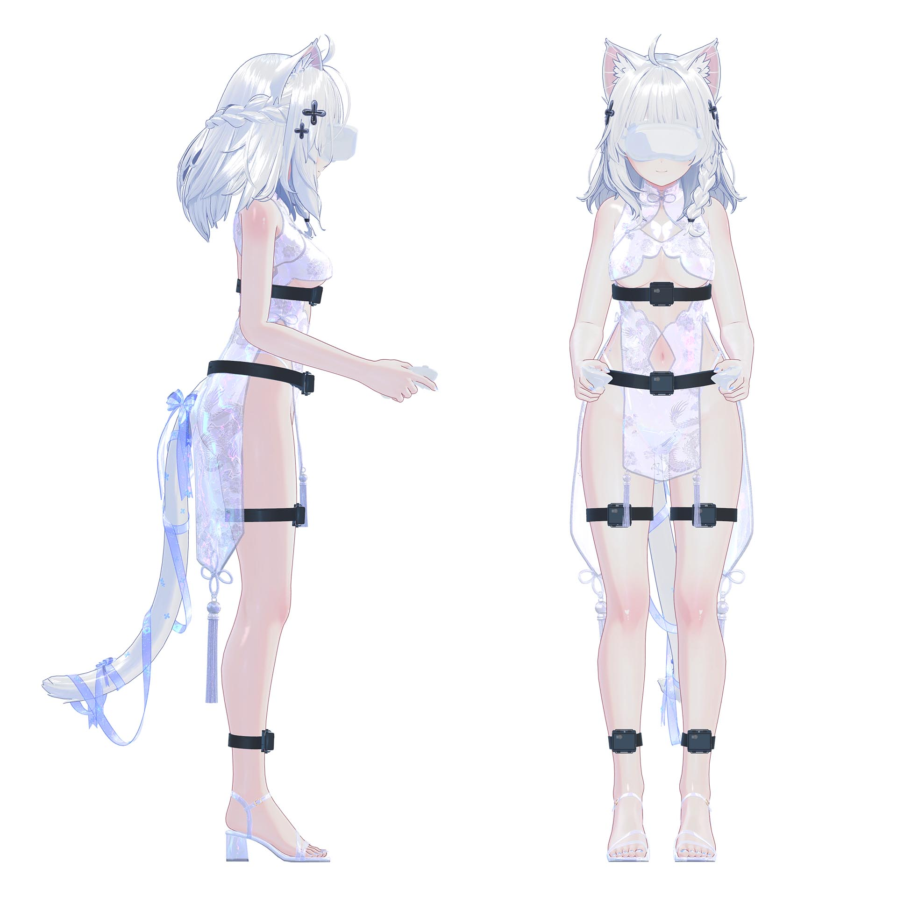

<strong style="font-size: 1.15em" class="tutorial-step-title">Pose A</strong> 
- Soulevez la manette VR pour éviter que le tracker ne capture les aimants de la manette. 
- Gardez un espacement approprié entre les pieds, ni trop proches ni trop écartés, semblable à l'image. 
- Tenez-vous naturellement et détendu sans tendre vos muscles.

<!-- ==================== 步骤 1 结束 ==================== -->

<!-- ==================== 步骤 2：S pose 开始 ==================== -->

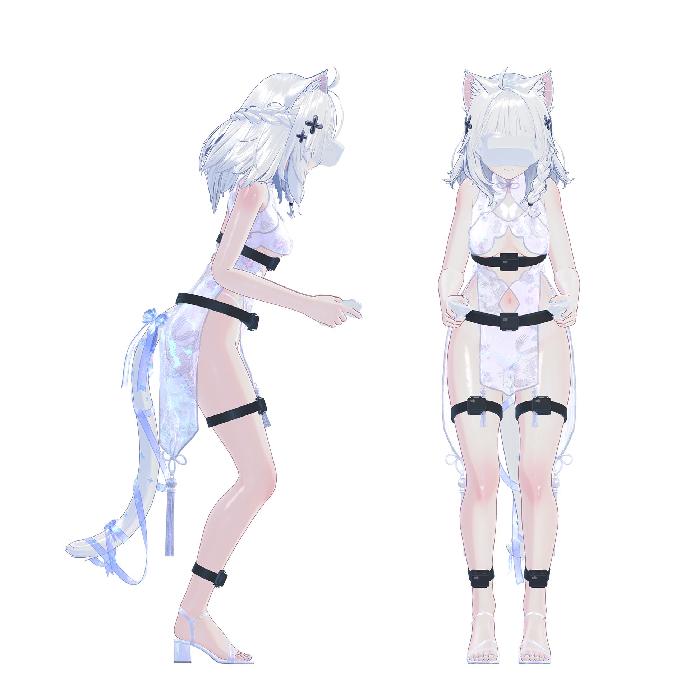

<strong style="font-size: 1.15em" class="tutorial-step-title">Pose S</strong> 
- Demi-squat + pliez la taille et baissez la tête, de sorte que le tracker puisse déterminer la direction vers l'avant du corps grâce à l'angle d'inclinaison. 
- Si se pencher est difficile ou peu clair, vous pouvez utiliser l'étalonnage avancé (Advanced Calibration). 
- Gardez l'équilibre des jambes + l'espacement des genoux.

<!-- ==================== 步骤 2 结束 ==================== -->

<!-- ==================== 步骤 3：B pose 开始 ==================== -->

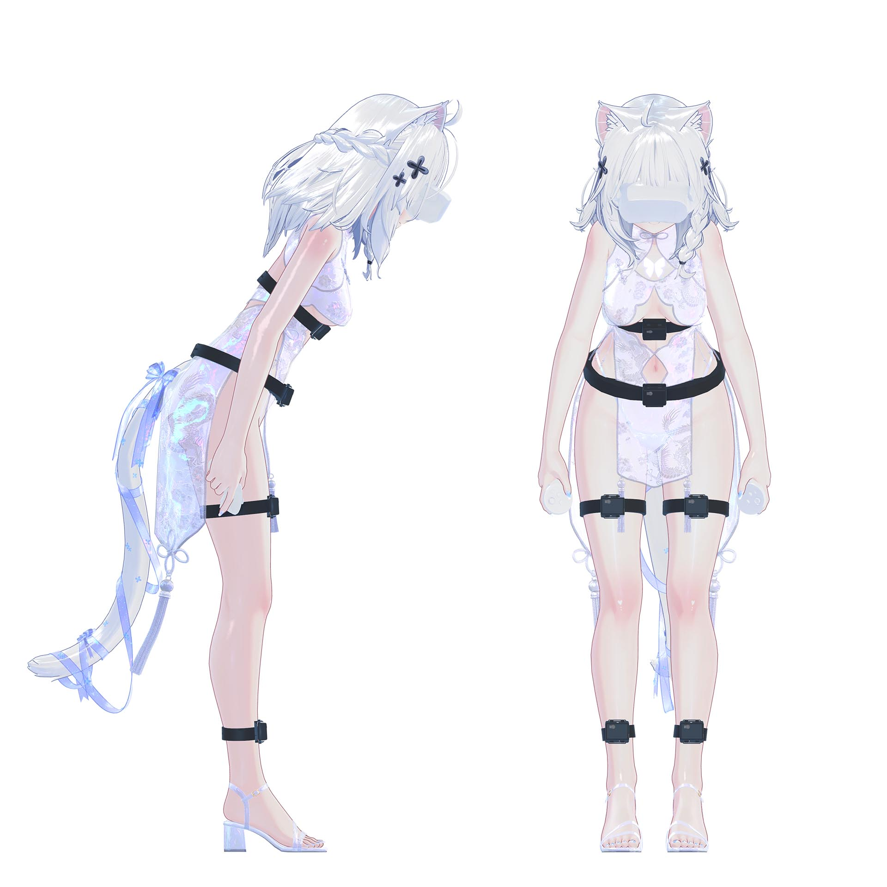

<strong style="font-size: 1.15em" class="tutorial-step-title">Pose B (Étalonnage avancé (Advanced Calibration))</strong> 
- Séparez la flexion de la pose S en une posture d'inclinaison pour l'enregistrement. 
- Cela évite la distorsion du corps causée par la pose S 
 (couramment vue comme le système squelettique s'inclinant sur le côté après s'être assis).

<!-- ==================== 步骤 3 结束 ==================== -->

<!-- ==================== 旗帜 VR – Calibration Posture Guide 结束 ==================== -->

<!-- ==================== 旗帜 Enter game (example: VRChat) 开始 ==================== -->

## Entrer dans le jeu (exemple : VRChat)

<!-- ==================== 步骤 1：检查 SteamVR 蝴蝶图标 开始 ==================== -->

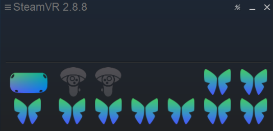

<strong style="font-size: 1.15em" class="tutorial-step-title">1. Vérifier le statut SteamVR</strong> 
- Une fois l'étalonnage (Calibration) terminé, vous pouvez voir le logo papillon actualisé dans la liste SteamVR.

<!-- ==================== 步骤 1 结束 ==================== -->

<!-- ==================== 步骤 2：打开游戏内校准 开始 ==================== -->

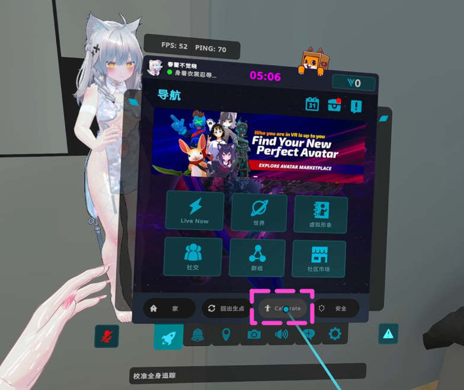

<strong style="font-size: 1.15em" class="tutorial-step-title">2. Ouvrir le menu en jeu</strong> 
- Ouvrez le menu dans le jeu, puis cliquez sur "Calibrate".

<!-- ==================== 步骤 2 结束 ==================== -->

<!-- ==================== 步骤 3：绑定追踪点 开始 ==================== -->

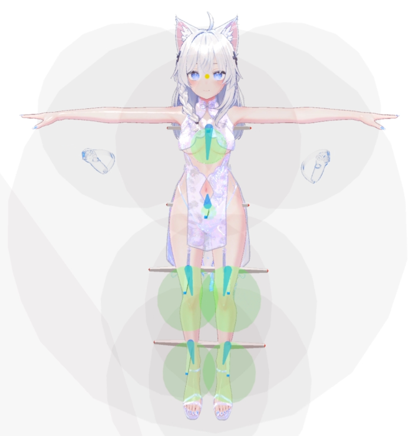

<strong style="font-size: 1.15em" class="tutorial-step-title">3. Lier les points de suivi</strong> 
- Alignez les points de suivi symétriquement sur le corps du personnage. 
- Ils n'ont pas besoin de correspondre parfaitement, car les proportions du corps varient pour différents avatars. 
- Appuyez sur la gâchette avec les index des deux mains pour terminer la liaison des points de suivi.

<!-- ==================== 步骤 3 结束 ==================== -->

<!-- ==================== 旗帜 Enter game (example: VRChat) 结束 ==================== -->
