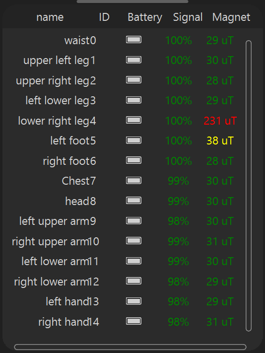
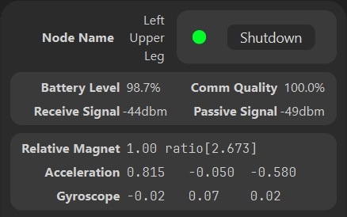

# Informations sur la liste matérielle
Les informations de la liste matérielle sont utilisées pour un aperçu global.
- Première colonne
  > Nom de la pièce
- Deuxième colonne
  > Numéro de pièce, correspond au numéro sur l'étiquette derrière le capteur
- Troisième colonne
  > Niveau de batterie, le pourcentage ne peut être utilisé qu'à titre de référence ; il est dérivé de la conversion de tension. Cependant, la mesure de tension n'est pas une mesure d'échantillonnage A/D professionnelle, il y a donc une certaine erreur et ce n'est pas un pourcentage absolu. Il devrait être basé sur le temps d'utilisation réel.
- Quatrième colonne
  > Cela fait référence à la qualité de la communication, par exemple, quel pourcentage des données de fréquence d'images de 120 a été reçu avec succès au cours des 2 dernières secondes. **Pas la force du signal !** La force du signal peut être visualisée dans les détails du tracker, mesurée en `dbm`. Généralement, >-70dbm est considéré comme une bonne qualité de signal ; par exemple, -30 dbm est un signal très fort.
- Cinquième colonne
  > Valeur absolue du champ magnétique, mesurée en uT. Un champ magnétique constant est généralement affiché en vert. Si certaines valeurs sont très élevées ou très faibles, elles seront affichées en rouge. Pour plus de détails sur la façon d'évaluer le champ magnétique, veuillez vous référer à Détection et diagnostic de champ magnétique

# Détails du matériel
Cliquez sur un élément de la liste pour afficher des informations détaillées sur le matériel.

### Éteindre individuellement
  > Vous pouvez cliquer sur le bouton d'arrêt pour éteindre ce tracker individuellement.

### Autres informations
- Niveau de batterie
  > Pourcentage de batterie spécifique, ceci n'est qu'à titre de référence approximative ; le temps d'utilisation réel doit être pris en compte.
- Qualité de communication
  > Quel pourcentage des données de fréquence d'images de 120 a été reçu avec succès au cours des 2 dernières secondes, pas la force du signal ! La force du signal peut être visualisée dans les détails du tracker, mesurée en `dbm`. Généralement, >-70dbm est considéré comme une bonne qualité de signal ; par exemple, -30 dbm est un signal très fort.
- Signal reçu
  > La force du signal reçue par le récepteur du capteur ; >-70 dbm est considéré comme une bonne qualité de signal.
- Signal passif
  > La force du signal reçue par le capteur du récepteur ; >-70 dbm est considéré comme une bonne qualité de signal.
- Champ magnétique relatif
  > C'est la taille relative par rapport à l'espace et au temps de l'A-Pose lors de la calibration. Une taille relative systématiquement à moins de 1,1 est généralement considérée comme un bon environnement de champ magnétique. Dans un bon environnement de champ magnétique, l'application d'algorithmes anti-magnétiques est plus efficace. Pour la détermination spécifique du champ magnétique et l'étalonnage, veuillez voir ici
- Accélération
  > Accélération après étalonnage sur trois axes, normalisée à l'accélération gravitationnelle actuelle.
- Gyroscope
  > Gyroscope après étalonnage sur trois axes. Si le tracker est complètement immobile et que la valeur ici est éloignée de zéro de plus de 0,2, il est recommandé d'effectuer un étalonnage du gyroscope

                     