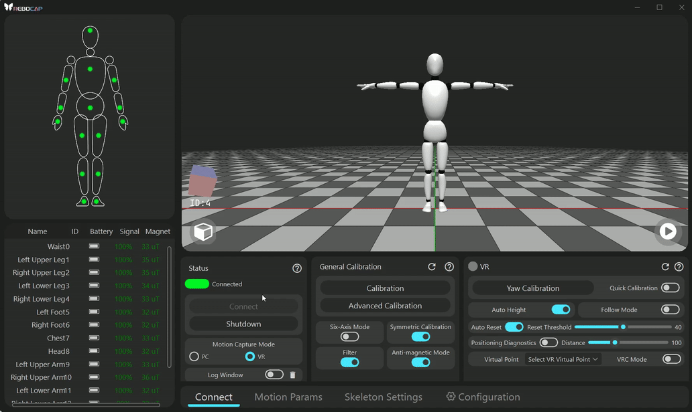
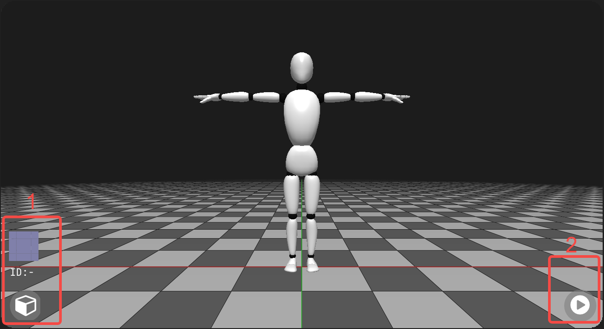
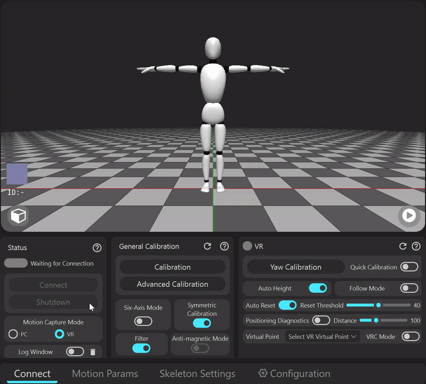

# Fonction de prévisualisation 3D
- **Afficher un aperçu en temps réel de la capture de mouvement**

  **Instructions**
  * Déplacez la vue avec le bouton gauche de la souris
  * Faites glisser la position de la caméra avec le bouton central de la souris, ce qui signifie faire glisser la vue
  * La molette de la souris fait avancer et reculer la position de la caméra en fonction de la direction actuelle, ce qui peut être utilisé pour ajuster la taille des personnages dans la vue
- **Afficher le tracker**
    > La zone marquée d'un 1 dans l'image `3d_preview` est utilisée pour afficher le tracker. Lorsque le tracker est sélectionné, il peut indiquer la direction du tracker en temps réel. En cliquant sur le bouton de la boîte, vous fermerez l'aperçu en temps réel du tracker.

### Comment fermer la 3D pour économiser des performances
* Cliquez sur le bouton dans la zone 2 de l'image `3d_preview` pour suspendre le rendu, ce qui permet d'économiser des ressources
* Pour fermer complètement le rendu 3D : Vous pouvez désactiver directement le rendu 3D dans la page de configuration, ce qui prendra effet après un redémarrage, économisant de la mémoire et réduisant considérablement les ressources CPU et GPU
      
  

Voir les détails

    
  

  

# Fonctionnalité de journal (Log)
Utilisée pour vérifier les messages d'avertissement, etc.

### Comment l'ouvrir

                     