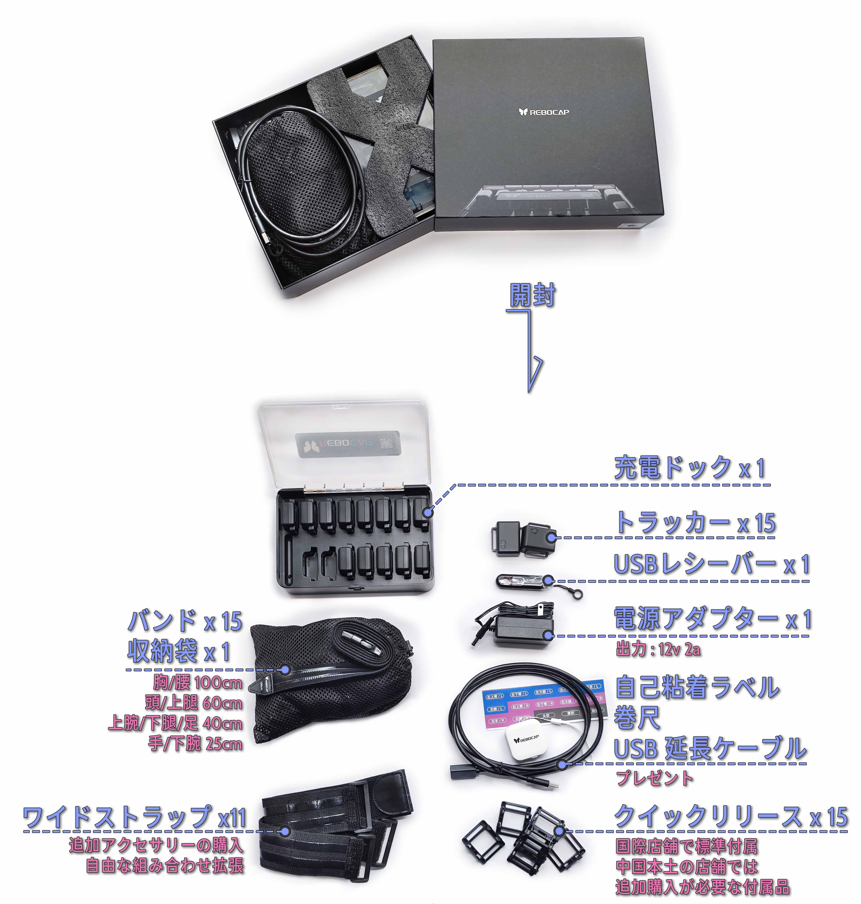
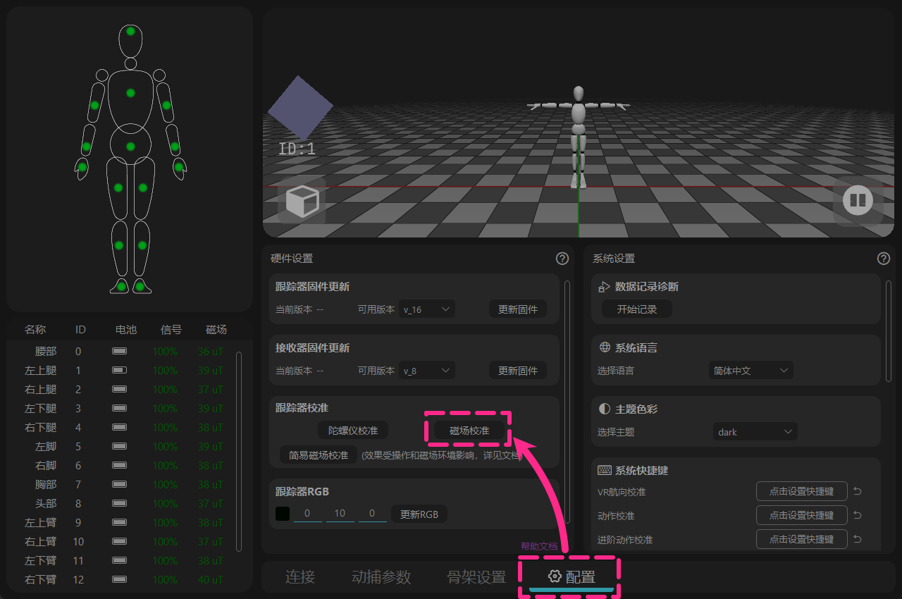
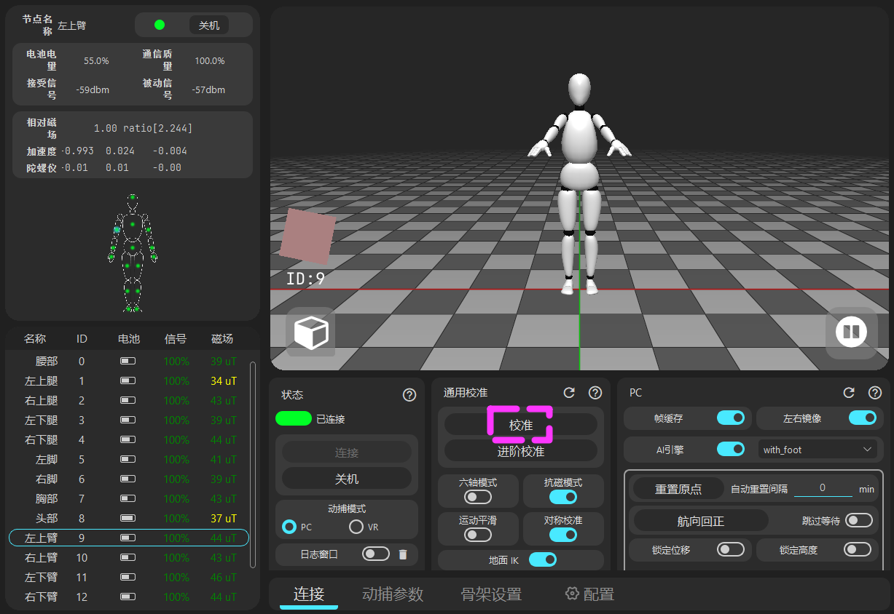
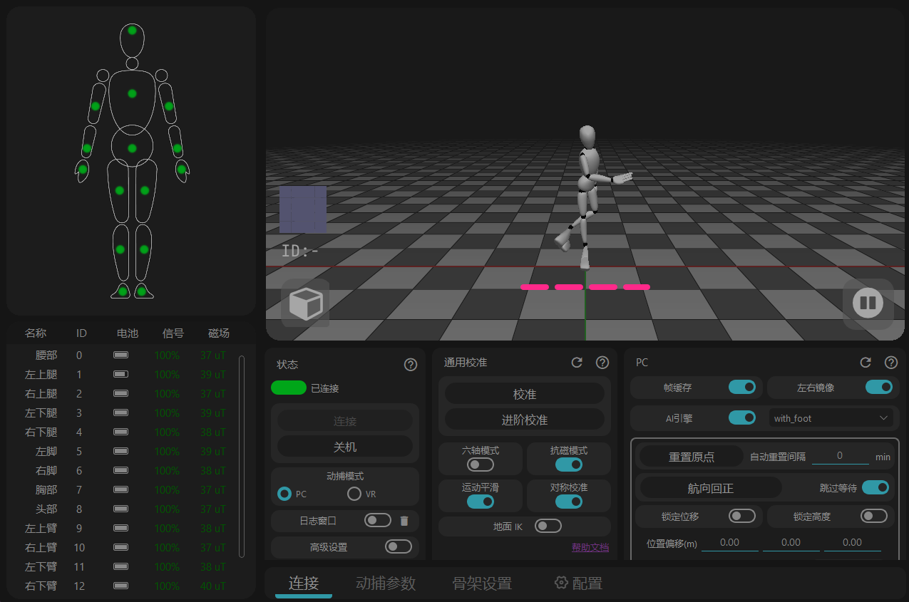

# 15トラッカーセット - 開封から使用まで

<!-- ============ タイトル ======== パッケージ内容の確認 ==================== -->
## 1 - パッケージ内容の確認

* **引き出し式カラーボックス**(⚠️ 捨てないでください)  
* **トラッカー** x 15 
  **USBレシーバー** x 1 
* **充電ボックス** x 1 
  **電源アダプター** x 1（出力12v 2a）

* **収納メッシュバッグ** x 1 
  **伸縮性ストラップ** x 15（幅2.5cm）

* **おまけの付属品** 
  自己粘着式IDステッカー 
  巻尺 
  USB延長ケーブル

* **オプションアクセサリー** 
  クイックリリースベース x 15 （グローバル版は標準装備） 
  幅広ストラップ x 11（幅5cm、手のひらと足を除く、標準の細いストラップと自由に組み合わせ可能）

<!-- ============= タイトル ======= ストラップの取り付け ==================== -->
## 2 - ストラップの取り付け

<!-- 方法 A - 直接取り付け -->

## 方法 A - 直接取り付け

  <video id="video" controls loop preload="metadata" width="60%">
    <source id="mp4" src="/ja/img/tracker_normal.mp4" type="video/mp4" />
  </video>

- この取り付け方法は推奨されません。長期的な負荷により素材の経年劣化やひび割れが発生しやすくなります。 
  通常は予備の方法として使用されます。

<!-- 方法 B - クイックリリースベースを使用 -->

## 方法 B - クイックリリースベースを使用

- クイックリリースベースをストラップに取り付け、ストラップがベースの下を通るようにします。

  <video id="video" controls loop preload="metadata" width="60%">
    <source id="mp4" src="/ja/img/kuaichai_normal.mp4" type="video/mp4" />
  </video>

- クイックリリースベースの取り付け動画

- 面ファスナーを取り付けた後、両側に少し引っ張ってフック面がループ面に完全に噛み合っていることを確認し、脱落を防ぎます。

- トラッカーの取り外しテクニック： 
  片側からこじるようにすると、クイックリリースベースからトラッカーを直接簡単に取り外すことができます。

<!-- 方法 C - 幅広ストラップを使用 -->

## 方法 C - 幅広ストラップを使用

- 幅広ストラップの片端にはあらかじめ面ファスナーが付いています。トラッカーまたはクイックリリースベースをその上に取り付けます。 
  ボックスに入っている予備の個別面ファスナーはバックアップとして使用します。

  <a href="/ja/docs/tutorial/instroction_for_straps" class="button button--primary" style="text-decoration: none; border-radius: 6px; display: inline-block; font-weight: bold; font-size: 1.0rem; padding: 6px 18px;">
    その他のストラップ取り付けガイドはこちら → 📖
  </a>

<!-- ============ タイトル ======== 体への装着位置 ==================== -->
## 3 - 体への装着位置

<!-- ==================== 左右2カラムレイアウト 開始 ==================== -->

<!-- 左側カラム：キャラクターモデル画像 -->

<!-- 右側カラム：文字説明 -->

<!-- 第一グループ：サイズデータ -->

<strong>胸部/腰部:</strong> 100 cm 
<strong>頭/太もも:</strong> 60 cm 
<strong>上腕/ふくらはぎ/足:</strong> 40 cm 
<strong>手のひら/前腕：</strong> 25 cm

<!-- 第三グループ：体型差による調整 -->

<strong>体型差による調整：</strong> 
画像に示されている装着位置を参考にしてください。 
胸部/腰部トラッカーは背中側に配置することをお勧めします。 
脚部トラッカーは側面に配置できます。

<!-- 第四グループ：避けるべきエリアのヒント -->

<strong>ヒント：</strong> 
トラッカーのボタンが上を向くようにしてください。 
 
腰部トラッカーは圧迫を防ぐためにおへその位置に置かないでください。 
脚部トラッカーは筋肉が盛り上がって傾斜している場所を避けてください。 
太ももトラッカーは膝に近すぎないように配置してください。 

<!-- 第四グループ：VRでの調整の違い -->

<strong>注：</strong> VRモードの装着には多少の違いがありますが、 
まずはこの方法ですべてのトラッカーが正常に動作するか確認することをお勧めします。

<!-- 第五グループ：下部画像とテキスト -->

トラッカーの背面にはID番号が貼られています。 
出荷時に番号と位置が紐付けられています。 
前腕と手のひらの4つのトラッカーのみ、ソフトウェアを介して位置を変更できます。 
その他のトラッカーは位置を変更できません。

<!-- ==================== 左右2カラムレイアウト 終了 ==================== -->

<!-- ============= タイトル ======= ソフトウェアのインストールとファームウェア更新の確認 ==================== -->
## 4 - ソフトウェアのインストールとファームウェア更新の確認

<!-- ==================== フラグ A：Install software 開始 ==================== -->

## A - ソフトウェアのインストール

🌐ダウンロードリンク → [https://doc.rebocap.com/en\_US/tutorial/software\_install.html](https://doc.rebocap.com/en_US/tutorial/software_install.html)

- バージョン選択：\
  V01 - 磁場が安定している環境に適しており、ダンスなどに適しています。 
  V02 Beta02 - デフォルトのスイッチが6トラッカーセット向けに最適化されており、新しいアルゴリズムによって強い干渉源を能動的に判断し、スプリングベッドの上でも方向を維持できます。

- システムドライブ以外（Cドライブ以外）へのインストールを推奨します。

<!-- ==================== フラグ A：Install software 終了 ==================== -->

<!-- ==================== フラグ B：Connect to computer 开始 ==================== -->

## B - PCへの接続

<!-- ==================== ステップ 1：レシーバーの接続 開始 ==================== -->

<strong style="font-size: 1.15em" class="tutorial-step-title">1. レシーバーの接続</strong> 
- USBレシーバーをPCに差し込みます。周囲が開けているポートを選択してください。 
- または、付属のUSB延長ケーブルを使用して外部接続します。(市販の一般的なUSB 3.0データケーブル) 
- トラッカーの信号が100%を維持できない場合は、レシーバーの位置を変更してください。

<!-- ==================== ステップ 1 終了 ==================== -->

<!-- ==================== ステップ 2：ソフトウェアの接続 開始 ==================== -->

<strong style="font-size: 1.15em" class="tutorial-step-title">2. ソフトウェアの接続</strong> 
- ソフトウェアで「接続」をクリックします（Beta02バージョン以降は自動的に接続されます）。

<!-- ==================== ステップ 2 終了 ==================== -->

<!-- ==================== ステップ 3：トラッカーの起動 開始 ==================== -->

<strong style="font-size: 1.15em" class="tutorial-step-title">3. トラッカーの起動</strong> 
- トラッカーのボタンを押して電源を入れます。 
- 注意：トラッカーの電源を切るには、ソフトウェアから行います。

<!-- ==================== ステップ 3 終了 ==================== -->

<!-- ==================== フラグ B：Connect to computer 終了 ==================== -->

<!-- ==================== フラグ C：Check firmware 開始 ==================== -->

## C - ファームウェアの確認

<!-- ==================== ファームウェアの確認 開始 ==================== -->

<strong style="font-size: 1.15em" class="tutorial-step-title">[トラッカーとレシーバー] のファームウェアの確認</strong> 
- 選択肢の中で最も高い利用可能なバージョンにアップグレードしてください。 
- このバージョンは将来のソフトウェアアップデートに伴って変更されます。 
- ファームウェアはソフトウェアのインストールパッケージに同梱されており、オンラインで更新されるものではありません。

<!-- ==================== ファームウェアの確認 終了 ==================== -->

<!-- ==================== アコーディオン 開始 ==================== -->

ソフトウェアに対応するファームウェアバージョンを確認します。

   &emsp;&emsp; 一部のファームウェアバージョンには重大なアルゴリズムの変更が含まれており、旧バージョンのソフトウェアとは互換性がありません。   

   &emsp;&emsp; 旧バージョンのソフトウェアに切り替えるときは、ファームウェアを対応するバージョンにダウングレードする必要があります。  

   &emsp;&emsp;&emsp; release_v01 - ◼️トラッカー : V6 / V7 , 📡レシーバー : V6 / V7   

   &emsp;&emsp;&emsp; release_v02 beta02 - ◼️トラッカー : V15 , 📡レシーバー : V6 / V7   

   &emsp;&emsp;&emsp; (未公開) release_v02 beta02.1 - ◼️トラッカー : V16 , 📡レシーバー : V8   

<!-- ==================== アコーディオン 終了 ==================== -->

- ログウィンドウを開いて、各トラッカーの実際のファームウェアバージョンを確認します   
  （ログウィンドウはソフトウェア内の「接続とシャットダウン」の下にあります）。

- トラッカーの更新はワイヤレス 📶 で行われます。USBケーブルを使用する必要はありません。  
  🚫 トラッカーとレシーバーを同時に更新しないでください。  
  トラッカーの更新に失敗した場合は、データアップロードの安定性を確保するためにトラッカーの半分をオフにすることを検討してください。ログでファームウェアバージョンが正しいトラッカーはオフのままで問題ありません。

- 更新に失敗した場合は、トラッカーを再起動して再度更新をクリックする必要があります。  
  &emsp;&emsp;🟩緑ランプ – 高速点滅：トラッカーは正常に動作中  
  &emsp;&emsp;🟩緑ランプ – 低速点滅：トラッカーはレシーバーの信号を待機中  
  &emsp;&emsp;🟦青ランプ：トラッカーがファームウェアデータを受信中  
  &emsp;&emsp;🟨黄ランプ：更新失敗（🔘ボタンを手動で押して再起動し、再度更新を実行）  
  &emsp;&emsp;⬜白ランプ：更新成功（通常10秒後に自動的に再起動します。自動起動しない場合は手動で再起動してください）  

- 📡レシーバーの更新が完了したら、USBを抜き差しして、ソフトウェアを🔄再起動します。

<!-- ==================== フラグ C：Check firmware 終了 ==================== -->

<!-- ============= タイトル ======= トラッカー初期データの校正 ==================== -->
## 5 - トラッカー初期データの校正

<!-- ==================== フラグ Gyroscope Calibrate 開始 ==================== -->

## ジャイロスコープ校正
<!-- ==================== ステップ 1：トラッカーの配置 開始 ==================== -->

<strong style="font-size: 1.15em" class="tutorial-step-title">1. 地面に置く</strong> 
- トラッカーを地面に置きます（物理的な揺れや動きのない場所）。 
- 吸塑トレイに戻す必要はありません。

<!-- ==================== ステップ 1 終了 ==================== -->

<!-- ==================== ステップ 2：計測の開始 開始 ==================== -->

<strong style="font-size: 1.15em" class="tutorial-step-title">2. 校正を開始</strong> 
- ボタンをクリックし、計測が完了するまで待ちます。 
- 現実で揺れがまったくない数秒間のデータを記録する仕組みです。

<!-- ==================== ステップ 2 終了 ==================== -->

<!-- ==================== ステップ 3：ジャイロスコープ情報の確認 開始 ==================== -->

<strong style="font-size: 1.15em" class="tutorial-step-title">3. ジャイロスコープ情報の確認</strong> 
- 完了後、各トラッカーのジャイロスコープ情報を確認します。 
- 通常、静止時のジャイロスコープの出力値は 0 〜 ±0.05 の間である必要があります。

<!-- ==================== ステップ 3 終了 ==================== -->

<!-- ==================== フラグ Gyroscope Calibrate 終了 ==================== -->

<!-- ==================== フラグ Magnet Calibrate 開始 ==================== -->

## 磁場校正

<!-- ==================== ステップ 1：吸塑トレイの配置 開始 ==================== -->

<strong style="font-size: 1.15em" class="tutorial-step-title">1. 吸塑トレイに入れる</strong> 
- トラッカーを同じ方向に向けて吸塑トレイに入れます。 
- （持ちにくい場合は、吸塑トレイを紙箱に戻しても構いません）。

<!-- ==================== ステップ 1 終了 ==================== -->

<!-- ==================== ステップ 2：中心に立つ 開始 ==================== -->

<strong style="font-size: 1.15em" class="tutorial-step-title">2. プレイエリアの中心に立つ</strong> 
- トレイを胸に抱え、プレイエリアの中心に立つか、 
- パソコンのデスクの端から1歩離れた場所に立ちます。

<!-- ==================== ステップ 2 終了 ==================== -->

<!-- ==================== ステップ 3：吸塑トレイの回転 开始 ==================== -->

<strong style="font-size: 1.15em" class="tutorial-step-title">3. 吸塑トレイを回転</strong> 
- ソフトウェアのボタンをクリックし、画面に表示されるアニメーションに従って吸塑トレイを回転させます。 
- （各面を切り替えるごとに2回転させます）。

<!-- ==================== ステップ 3 終了 ==================== -->

<!-- ==================== ステップ 4：磁場読数の確認 開始 ==================== -->

<strong style="font-size: 1.15em" class="tutorial-step-title">4. 磁場読数の確認</strong> 
- 完了後、手の中で吸塑トレイを自由に反転させ、 
- 🔍校正後のトラッカー磁場読数が一致しているか、または近い値であるか確認します。 
- ⚠️磁場読数の差が非常に大きい場合は、磁校正を再度行う必要があります。

<!-- ==================== ステップ 4 終了 ==================== -->

<!-- ==================== アコーディオン 開始 ==================== -->

充電ボックスを持ち運んでいない場合はどうすればいいですか？

   &emsp;&emsp;ストラップを使って、トラッカーを四角い水筒やティッシュボックスに固定して使用できます。 
   &emsp;&emsp;2〜3個を1組として固定してください。 

<!-- ==================== アコーディオン 終了 ==================== -->

<!-- ==================== アコーディオン 開始 ==================== -->

簡易磁場校正

   &emsp;&emsp;便利な代替案として利用可能です。 
   &emsp;&emsp;主な動作： 
   &emsp;&emsp;記録中にトラッカーを回転させ、できるだけ多くの方向をカバーします（360°全方位の反転）。 

   &emsp;&emsp;ヒント： 
   &emsp;&emsp;手首や腕を「8」の字に動かすことで、センサーがより多くの角度の磁場データをキャプチャしやすくなります。 

<!-- ==================== アコーディオン 終了 ==================== -->

<!-- ==================== アコーディオン 開始 ==================== -->

旧バージョンでこのボタンが表示されませんか？

   &emsp;&emsp;このボタンは旧バージョンではデフォルトで表示されません。 
   &emsp;&emsp;表示させるには、手動で特定の .txt ファイルを作成する必要があります。 

   &emsp;&emsp;Rebocap のルートフォルダ（Rebocap.exe があるディレクトリ）に移動し、 
   &emsp;&emsp;新規の .txt ファイルを作成して、名前を以下に変更してください： 
   &emsp;&emsp; \_simple_cal\_

   &emsp;&emsp;ソフトウェアを再起動すると、ボタンが表示されます。

<!-- ==================== アコーディオン 終了 ==================== -->

<!-- ==================== アコーディオン 終了 ==================== -->

<!-- ==================== フラグ Magnet Calibrate 終了 ==================== -->

<!-- ============= タイトル ======= トラッキングシステムの確認 ==================== -->
## 6 - トラッキングシステムの確認

- 「校正」ボタンをクリックし、特定のポーズを記録します。 

- 完了すると、3Dプレビューアでモーションキャプチャシステムが動作を開始するのが見えます。 
  そこから、アニメーション録画、バーチャルアイドル、VRゲームの使用に進むことができます。

<!-- ==================== フラグ Calibration posture guide 開始 ==================== -->

## VR – 校正ポーズ図鑑

<!-- ==================== ステップ 1：A pose 開始 ==================== -->

<strong style="font-size: 1.15em" class="tutorial-step-title">A Pose</strong> 
- 両足の間隔を適度に取り、閉じすぎず開きすぎず、画像と近い間隔を維持します。 
- 自然にリラックスして立ち、筋肉をこわばらせる必要はありません。

<!-- ==================== ステップ 1 終了 ==================== -->

<!-- ==================== ステップ 2：T pose 開始 ==================== -->

<strong style="font-size: 1.15em" class="tutorial-step-title">T Pose</strong> 
- 腕を水平に広げます。 
- 筋肉の記憶と実際にまっすぐ手を伸ばすのとでは差異がある場合があるため、視覚的に確認してください。 

<!-- ==================== ステップ 2 終了 ==================== -->

<!-- ==================== ステップ 3：S pose 开始 ==================== -->

<strong style="font-size: 1.15em" class="tutorial-step-title">S Pose</strong> 
- 中腰になり、腰を曲げて頭を下げ、トラッカーが前傾角度から体全体の向きを認識できるようにします。 
- できるだけ両脚のバランスと膝の間隔を維持し、腕を前に平行に伸ばします。 
- 腰を曲げるのが難しい場合や効果がわかりにくい場合は、詳細校正を使用できます。

<!-- ==================== ステップ 3 終了 ==================== -->

<!-- ==================== ステップ 4：B pose 开始 ==================== -->

<strong style="font-size: 1.15em" class="tutorial-step-title">B Pose (詳細校正)</strong> 
- S Poseの「腰を曲げる＋頭を下げる」動作を、個別の「お辞儀」動作として分けて記録します。 
- これにより、Sポーズに起因する身体の歪み（着席後にスケルトンが横に傾く現象など）を防ぐことができます。

<!-- ==================== ステップ 4 終了 ==================== -->

<!-- ==================== フラグ Calibration posture guide 終了 ==================== -->

<!-- ============ タイトル ======== PCモード - 外部プログラム接続 ==================== -->
## PCモード

<!-- ==================== フラグ アプリ内録画 開始 ==================== -->

## アプリ内録画

- 使用上の推奨事項: 
- .rebo_anim はソフトウェアの独自データです。長時間の録画の場合はバックアップとしてエクスポートすることをお勧めします。また、「オフライン再生」で再生することもできます。 
- .bvh ファイルは、中国語の文字を含むフォルダパスに保存することはできません。 
- 直接保存された fbx は従来の基本アニメーションに使用されるスケルトンファイルであり、編集ツールでリマッピングする必要があります。エクスポート後のファイルエラーを避けるため、ほとんどの場合 [ルートアニメーション] を有効にしないでください。

<!-- ==================== フラグ アプリ内録画 終了 ==================== -->

<!-- ==================== フラグ バーチャルアイドル（VTube） 開始 ==================== -->

## バーチャルアイドル（VTube）

- VMirror、TikTok Live Companion、MetaVance などのソフトウェアには、直接使用できる対応機能があります。 
- VMCプロトコルを使用して、Warudoなどのアイドルソフトウェアへの接続をサポートしています。 

<!-- ============ 外部リンク ==================== -->

  <a href="https://www.bilibili.com/video/BV1z7hFzfEw6/" target="_blank" class="button button--primary" style="text-decoration: none; border-radius: 6px; display: inline-block; font-weight: bold; font-size: 1.0rem; padding: 6px 18px;">
    VMirrorに接続
  </a>
  <a href="https://www.bilibili.com/video/BV1fPbwzbEak" target="_blank" class="button button--primary" style="text-decoration: none; border-radius: 6px; display: inline-block; font-weight: bold; font-size: 1.0rem; padding: 6px 18px;">
    TikTok Live Companionに接続
  </a>
  <a href="https://www.bilibili.com/video/BV1fPbwzbEak" target="_blank" class="button button--primary" style="text-decoration: none; border-radius: 6px; display: inline-block; font-weight: bold; font-size: 1.0rem; padding: 6px 18px;">
    Warudoに接続
  </a>

<!-- ==================== フラグ バーチャルアイドル（VTube） 終了 ==================== -->

<!-- ==================== フラグ ダイレクトプラグイン 開始 ==================== -->

## ダイレクトプラグイン

<!-- ============ 外部リンク ==================== -->

  <a href="https://doc.rebocap.com/zh_cn/plugins/blender.html" target="_blank" class="button button--primary" style="text-decoration: none; border-radius: 6px; display: inline-block; font-weight: bold; font-size: 1.0rem; padding: 6px 18px;">
    Blender 
  </a>
  <a href="https://doc.rebocap.com/zh_cn/plugins/ue.html" target="_blank" class="button button--primary" style="text-decoration: none; border-radius: 6px; display: inline-block; font-weight: bold; font-size: 1.0rem; padding: 6px 18px;">
    UE 
  </a>
  <a href="https://doc.rebocap.com/zh_cn/plugins/unity.html" target="_blank" class="button button--primary" style="text-decoration: none; border-radius: 6px; display: inline-block; font-weight: bold; font-size: 1.0rem; padding: 6px 18px;">
    Unity 
  </a>
  <a href="https://doc.rebocap.com/zh_cn/SDK/" target="_blank" class="button button--primary" style="text-decoration: none; border-radius: 6px; display: inline-block; font-weight: bold; font-size: 1.0rem; padding: 6px 18px;">
    SDK 
  </a>

<!-- ==================== フラグ ダイレクトプラグイン 終了 ==================== -->

<!-- ============= タイトル ======= VRモード - 外部プログラム接続 ==================== -->
## VRモード

<!-- ==================== フラグ 接続 開始 ==================== -->

## 接続

<!-- ==================== ステップ 1：SteamVRの起動 開始 ==================== -->

<strong style="font-size: 1.15em" class="tutorial-step-title">1. SteamVRの起動</strong> 
- SteamVRを起動します。 
- (SteamVR ヘッドセット = Rebocap 頭部トラッカー)。

<!-- ==================== ステップ 1 終了 ==================== -->

<!-- ==================== ステップ 2：VRモードの選択と校正 開始 ==================== -->

<strong style="font-size: 1.15em" class="tutorial-step-title">2. VRモードの選択と校正</strong> 
- Rebocapで [VR Mode] を選択し、「校正」をクリックします。 
- 正常に接続するために、SteamVRが動作している状態で校正を行ってください。

<!-- ==================== ステップ 2 終了 ==================== -->

<!-- ==================== ステップ 3 開始 ==================== -->

<strong style="font-size: 1.15em" class="tutorial-step-title">3. SteamVRのステータス確認</strong> 
- 校正が完了すると、 
  SteamVRのリストに更新された蝶のロゴが表示されます。

<!-- ==================== ステップ 3 終了 ==================== -->

- 今後SteamVRに入る際は、この手順を繰り返すだけです。
- Rebocap ID + 3 = SteamVR ID

<!-- ==================== フラグ 接続 終了 ==================== -->

<!-- ==================== フラグ センサー組み合わせと出力モード 開始 ==================== -->

## VRモードでのトラッカーの使用

💡 VRゲームの使用には10、8、6点のトラッカーの組み合わせがあります。 
足部トラッカーを使用しない場合は、[AIエンジン] を有効にしたままにしてください。  
🧤 [コントローラー位置を置換] またはトラッキンググローブを使用する場合は、最大14個のトラッカーを使用できます。 
💻 [VR 出力]（ヘッドセット座標のシミュレート）を使用する場合は、最大15個のトラッカーを使用できます。 
（技術プレイヤー向けの試験的機能）

<!-- ==================== フラグ センサー組み合わせと出力モード 終了 ==================== -->

<!-- ==================== フラグ VR – 校正ポーズ図鑑 開始 ==================== -->

## VR – 校正ポーズ図鑑

<!-- ==================== ステップ 1：A pose 開始 ==================== -->

<strong style="font-size: 1.15em" class="tutorial-step-title">A Pose</strong> 
- コントローラーを持ち上げ、トラッカーがコントローラーの磁石を感知しないようにします。 
- 両足の間隔を適度に取り、閉じすぎず開きすぎず、画像と近い間隔を維持します。 
- 自然にリラックスして立ち、筋肉をこわばらせる必要はありません。

<!-- ==================== ステップ 1 終了 ==================== -->

<!-- ==================== ステップ 2：T pose 开始 ==================== -->

<strong style="font-size: 1.15em" class="tutorial-step-title">T Pose</strong> 
- 腕を水平に広げます。 
- 筋肉の記憶と実際にまっすぐ手を伸ばすのとでは差異がある場合があるため、視覚的に確認してください。 

<!-- ==================== ステップ 2 終了 ==================== -->

<!-- ==================== ステップ 3：S pose 开始 ==================== -->

<strong style="font-size: 1.15em" class="tutorial-step-title">S Pose</strong> 
- 中腰になり、腰を曲げて頭を下げ、トラッカーが前傾角度から体全体の向きを認識できるようにします。 
- できるだけ両脚のバランスと膝の間隔を維持し、腕を前に平行に伸ばします。 
- 腰を曲げるのが難しい場合や効果がわかりにくい場合は、詳細校正を使用できます。

<!-- ==================== ステップ 3 終了 ==================== -->

<!-- ==================== ステップ 4：B pose 开始 ==================== -->

<strong style="font-size: 1.15em" class="tutorial-step-title">B Pose (詳細校正)</strong> 
- S Poseの「腰を曲げる＋頭を下げる」動作を、個別の「お辞仪」動作として分けて記録します。 
- これにより、Sポーズに起因する身体の歪み（着席後にスケルトンが横に傾く現象など）を防ぐことができます。

<!-- ==================== ステップ 4 終了 ==================== -->

<!-- ==================== フラグ VR – 校正ポーズ図鑑 終了 ==================== -->

<!-- ==================== フラグ ゲームへの参加 (VRChatを例に) 开始 ==================== -->

## ゲームへの参加 (以 VRChat 为例)

<!-- ==================== ステップ 1：SteamVR蝶アイコンの確認 开始 ==================== -->

<strong style="font-size: 1.15em" class="tutorial-step-title">1. SteamVRのステータス確認</strong> 
- SteamVRのリストに更新された蝶のロゴが表示されているか確認します。 
  トラッキングポイントの情報があって初めて、VRChatに全身トラッキングのスイッチが表示されます。

<!-- ==================== ステップ 1 終了 ==================== -->

<!-- ==================== ステップ 2：ゲーム内校正を開く 开始 ==================== -->

<strong style="font-size: 1.15em" class="tutorial-step-title">2. ゲーム内メニューを開く</strong> 
- ゲーム内のメニューを開き、「校正（Calibrate）」をクリックします。

<!-- ==================== ステップ 2 終了 ==================== -->

<!-- ==================== ステップ 3：トラッキングポイントのバインド 开始 ==================== -->

<strong style="font-size: 1.15em" class="tutorial-step-title">3. トラッキングポイントのバインド</strong> 
- トラッキングポイントがキャラクターの体に左右対称に配置されるようにします。 
  キャラクターごとに手足の長さが異なるため、トラッキングポイントが完全に一致する必要はありません。 
- 両手のトリガーボタンを押して、トラッキングポイントのバインドを完了します。

<!-- ==================== ステップ 3 終了 ==================== -->

<!-- ==================== フラグ ゲームへの参加 (VRChatを例に) 終了 ==================== -->
