# 6 トラッカーセット - 開封から使用まで

<!-- ============ 标题 ======== 检查包裹内容 ==================== -->
## 1 - パッケージ内容の確認

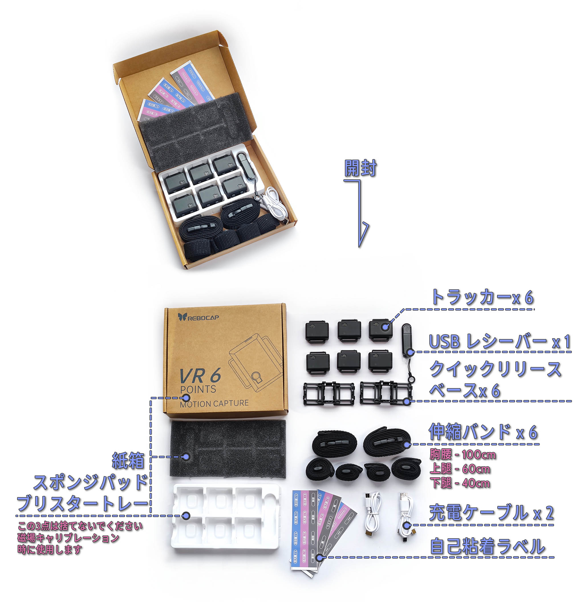

* **化粧箱、緩衝フォームパッド、ブリスタートレイ** 
 (⚠️ *これら3つのアイテムは廃棄しないでください。磁気校正に必要です。*)
* **トラッカー** x 6
* **USB レシーバー** x 1
* **クイックリリースベース** x 6
* **伸縮ストラップ** x 6
  * 胸部 / 腰部 - 100cm
  * 大腿 - 60cm
  * 小腿 - 40cm
* **充電ケーブル** x 2
* **自己粘着式識別ステッカー**

<!-- ============= 标题 ======= 安装绑带 ==================== -->
## 2 - ストラップの取り付け

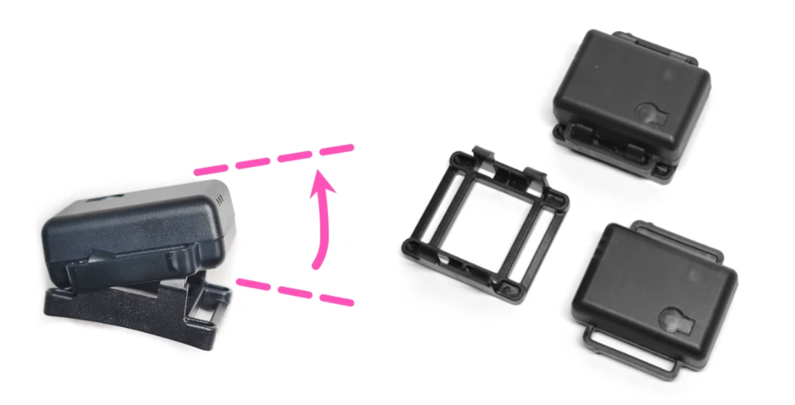

- トラッカーからクイックリリースベースを取り外します。 
片側からこじ開けるようにすると、トラッカーをクイックリリースベースから直接簡単に取り外すことができます。

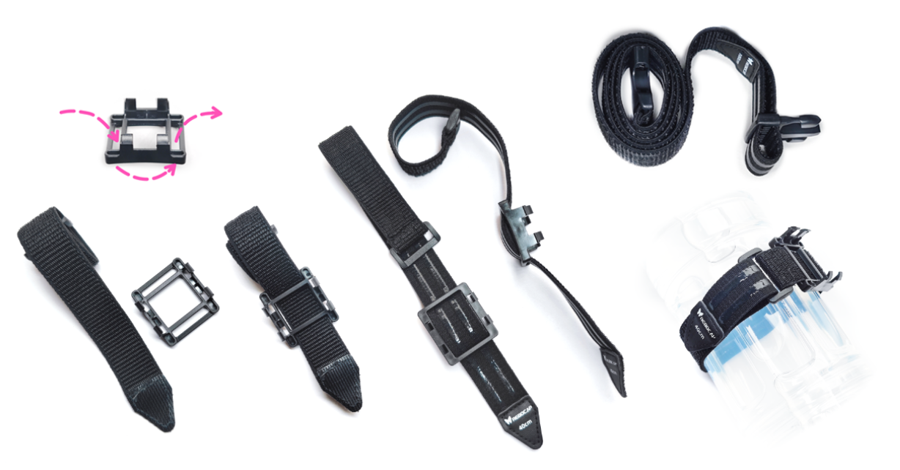
- クイックリリースベースをストラップに取り付けます。ストラップがベースの下を通るようにしてください。

  <video id="video" controls loop preload="metadata" width="60%">
    <source id="mp4" src="/ja/img/kuaichai_normal.mp4" type="video/mp4" />
  </video>

- ストラップの取り付け動画

- ベルクロを取り付けた後、左右に引っ張ってフック面をループ面にしっかりと噛み合わせ、脱落を防ぎます。

  <a href="/ja/docs/tutorial/instroction_for_straps" class="button button--primary" style="text-decoration: none; border-radius: 6px; display: inline-block; font-weight: bold; font-size: 1.0rem; padding: 6px 18px;">
    ストラップの詳しい取り付けガイドはこちら → 📖
  </a>

<!-- ============ 标题 ======== 穿戴在身上的位置 ==================== -->
## 3 - 身体への装着位置

<!-- ==================== 左右分栏图文排版 开始 ==================== -->

<!-- 左侧分栏：放人物模型图 -->

<!-- 右侧分栏：放文字说明 -->

<!-- 第一组：围度数据 -->

<strong>胸部/腰部:</strong> 100 cm 
<strong>大腿:</strong> 60 cm 
<strong>小腿:</strong> 40 cm

<!-- 第四组：身体差异性调整 -->

<strong>身体の個人差による調整：</strong> 
画像に示されている装着位置を参考にしてください。 
胸部/腰部のトラッカーは背中に配置することをお勧めします。 
脚のトラッカーは側面に配置することも可能です。

<!-- 第三组：避开区域提示 -->

<strong>ヒント：</strong> 
トラッカーのボタンが上を向くようにしてください。 
 
圧迫を防ぐため、腰のトラッカーはおへその位置に配置しないでください。 
脚のトラッカーは、筋肉が膨らんで傾斜している領域を避けて配置してください。 
大腿部のトラッカーを膝に近づけすぎないでください。 

<!-- 第五组：底部小图与文字上下排版 -->

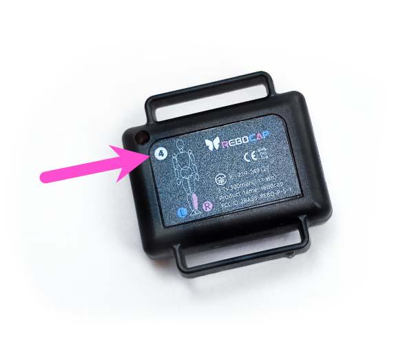

トラッカーの裏面にはID番号が貼られています。 
工場出荷時に番号と装着位置が紐付けられています。 
変更や交換はできません。 
2つの6トラッカーセットを組み合わせて使用することはできません。

<!-- ==================== 左右分栏图文排版 结束 ==================== -->

<!-- ============= 标题 ======= 安装软件 和 检查固件更新 ==================== -->

## 4 - ソフトウェアのインストールとファームウェア更新の確認

<!-- ==================== 旗帜 A：Install software 开始 ==================== -->

## A - ソフトウェアのインストール

🌐ダウンロードリンク → [https://doc.rebocap.com/en\_US/tutorial/software\_install.html](https://doc.rebocap.com/en_US/tutorial/software_install.html)

- バージョン選択：\
  V01 - 磁場が安定した環境に適しており、主にダンス用途に適しています。 
  V02 Beta02 - デフォルトのスイッチは6トラッカーセット向けに最適化されており、強力な干渉源を能動的に判断し、スプリングベッドの上でも方向を維持できる新しいアルゴリズムを採用しています。

<!-- ==================== 折叠页 开始 ==================== -->

V01 バージョンを使用する場合は、以下の設定を変更する必要があります。

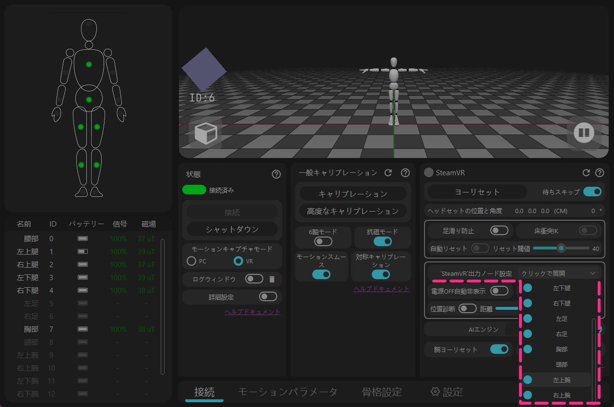

<strong>1 - 余分に表示されるトラッカーポイントをオフにします。</strong> 
[SteamVR 出力ノードの設定] を開き、[左/右上腕] をオフにします。

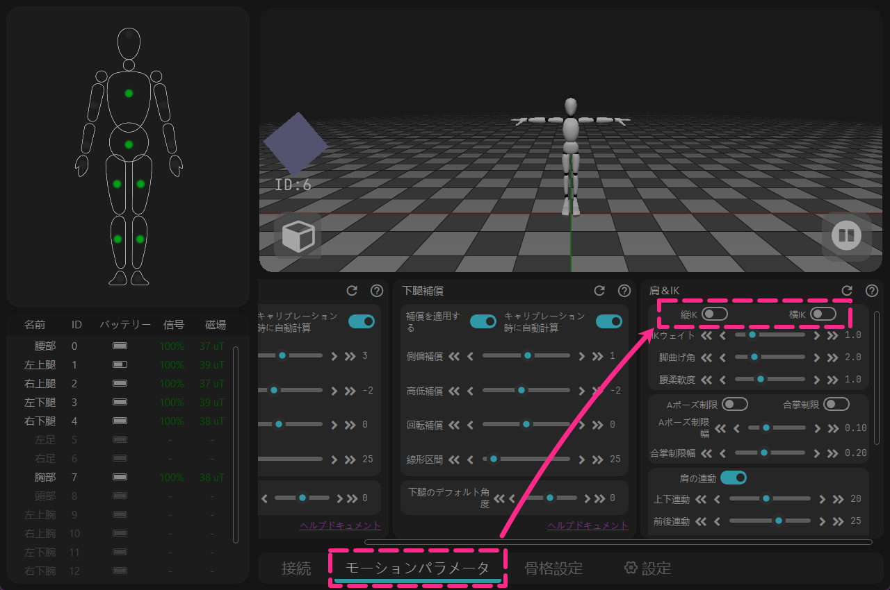

<strong>2 - グローバルに誤ってロックされるランニング機能をオフにします。</strong> 
→ [モーションパラメータ] → [縦方向IK & 横方向IK] をオフにします。

<!-- ==================== 折叠页 结束 ==================== -->

- システムドライブ（Cドライブ）以外のドライブにインストールすることをお勧めします。

<!-- ==================== 旗帜 A：Install software 结束 ==================== -->

<!-- ==================== 旗帜 B：Connect to computer 开始 ==================== -->

## B - PCへの接続

<!-- ==================== 步骤 1：连接接收器 开始 ==================== -->

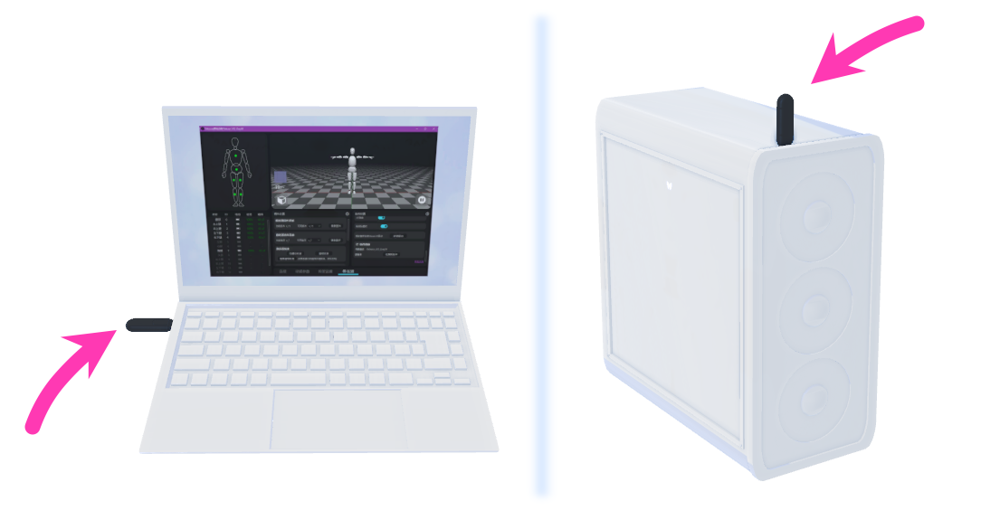

<strong style="font-size: 1.15em" class="tutorial-step-title">1. レシーバーの接続</strong> 
- USBレシーバーをPCに挿入し、周囲が開けたポートを選択してください。 
- 市販の一般的なUSB 3.0数据ケーブル等、延長ケーブルを各自用意して接続することも可能です。 
- トラッカーの信号が100%を維持できない場合は、延長ケーブルを使用するか、配置場所を変更してください。

<!-- ==================== 步骤 1 结束 ==================== -->

<!-- ==================== 步骤 2：软件连接 开始 ==================== -->

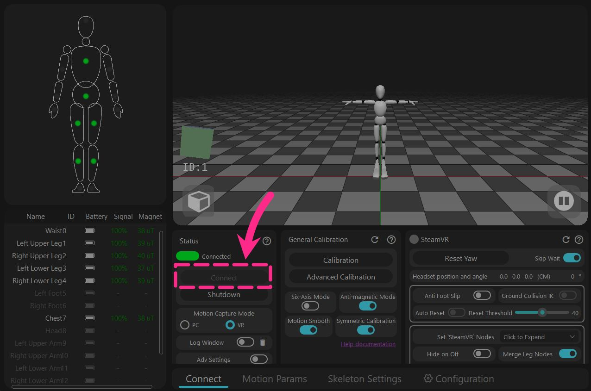

<strong style="font-size: 1.15em" class="tutorial-step-title">2. 软件连接</strong> 
- ソフトウェアで「接続」をクリックします（Beta02バージョン以降は自動的に接続されます）。

<!-- ==================== 步骤 2 结束 ==================== -->

<!-- ==================== 步骤 3：开启追踪器 开始 ==================== -->

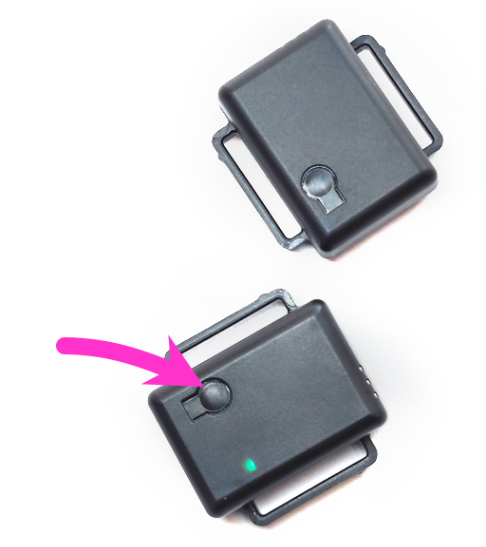

<strong style="font-size: 1.15em" class="tutorial-step-title">3. トラッカーの電源オン</strong> 
- トラッカーのボタンを押して電源を入れます。 
- 注意：トラッカーの電源はソフトウェアを介して切るようになっています。

<!-- ==================== 步骤 3 结束 ==================== -->

<!-- ==================== 旗帜 B：Connect to computer 结束 ==================== -->

<!-- ==================== 旗帜 C：Check firmware 开始 ==================== -->

## C - ファームウェアの確認

<!-- ====================  检查固件 开始 ==================== -->

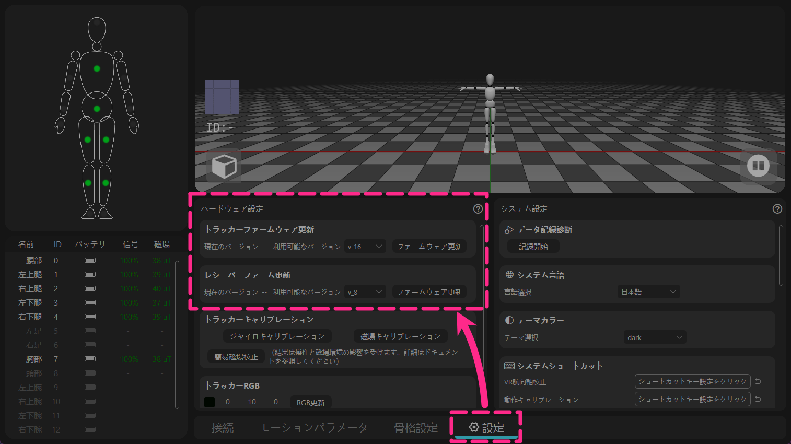

<strong style="font-size: 1.15em" class="tutorial-step-title">[トラッカーとレシーバー] のファームウェア確認</strong> 
- オプション内の利用可能な最新バージョンにアップグレードしてください。 
- このバージョンは今後のソフトウェアアップデートによって変更されます。 
- ファームウェアはソフトウェアのインストールパッケージに同梱されており、オンラインで更新するものではありません。

<!-- ====================  检查固件 结束 ==================== -->

<!-- ==================== 折叠页 开始 ==================== -->

 ソフトウェアがサポートしている対応ファームウェアバージョンを確認します。

   &emsp;&emsp; 一部のファームウェアバージョンには重大なアルゴリズム変更が含まれており、古いソフトウェアとは互換性がありません。   

   &emsp;&emsp; 古いソフトウェアバージョンに切り替える場合は、それに応じてファームウェアをダウングレードする必要があります。  

   &emsp;&emsp;&emsp; release_v01 - ◼️tracker : V6 / V7  ,  📡receiver : V6 / V7   

   &emsp;&emsp;&emsp; release_v02 beta02 - ◼️tracker : V15  ,  📡receiver : V6 / V7   

   &emsp;&emsp;&emsp; (未公開) release_v02 beta02.1 - ◼️tracker : V16  ,  📡receiver : V8   

<!-- ==================== 折叠页 结束 ==================== -->

- ログウィンドウを開いて、各トラッカーの実際のファームウェアバージョンを確認します   
（ログウィンドウは、ソフトウェアの「接続と电源オフ」の下にあります）。

- トラッカーはワイヤレス 📶 で更新されます。USBケーブルは不要です。  
🚫 トラッカーとレシーバーを同時に更新しないでください。  

- 更新が失敗した場合は、トラッカーを再起動して再度更新をクリックする必要があります。  
&emsp;&emsp;🟩緑灯 – 高速点滅：トラッカーは正常に動作しています  
&emsp;&emsp;🟩緑灯 – 低速点滅：トラッカーはレシーバーの信号を待っています  
&emsp;&emsp;🟦青灯：トラッカーはファームウェアデータを受信しています  
&emsp;&emsp;🟨黄灯：更新失敗（手動で 🔘 ボタンを押して再起動し、更新を再試行してください）  
&emsp;&emsp;⬜白灯：更新成功（通常10秒後に自動的に再起動します。自動再起動しない場合は手動で再起動してください） 

- 📡レシーバーの更新が完了したら、USBを抜き差しし、🔄ソフトウェアを再起動してください。

<!-- ==================== 旗帜 C：Check firmware 结束 ==================== -->

<!-- ============= 标题 ======= 校正追踪器初始数据 ==================== -->
## 5 - トラッカー初期データの校正

<!-- ==================== 旗帜 Gyroscope Calibrate 开始 ==================== -->

## ジャイロスコープの校正
<!-- ==================== 步骤 1：放置追踪器 开始 ==================== -->

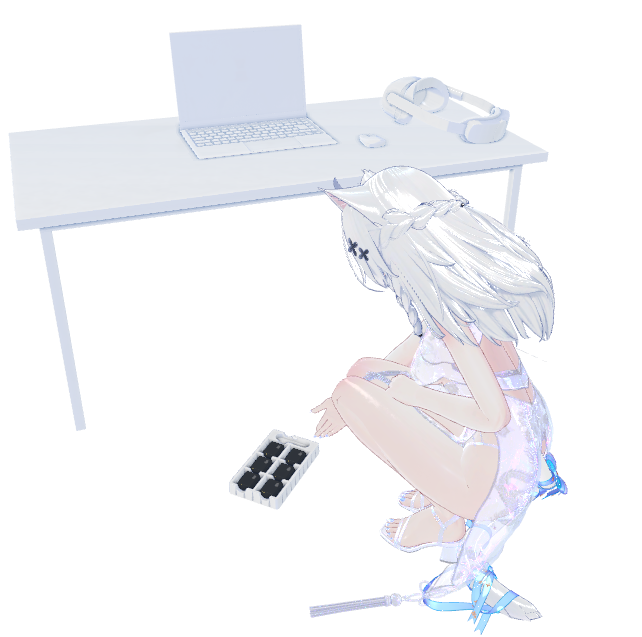

<strong style="font-size: 1.15em" class="tutorial-step-title">1. 床への配置</strong> 
- トラッカーを床（物理的な揺れや動きがない場所）に置きます。 
- ブリスタートレイに戻す必要はありません。

<!-- ==================== 步骤 1 结束 ==================== -->

<!-- ==================== 步骤 2：启动采集 开始 ==================== -->

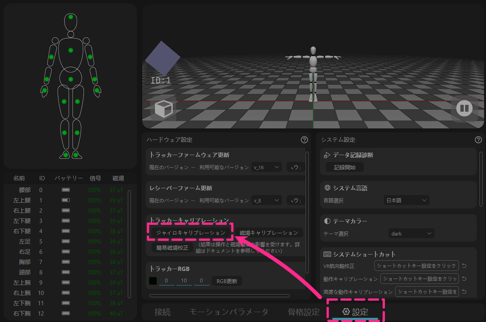

<strong style="font-size: 1.15em" class="tutorial-step-title">2. 校正の開始</strong> 
- ボタンをクリックし、データの収集が完了するまで待ちます。 
- 仕組みとしては、現実世界で全く揺れがない状態を数秒間録画・記録します。

<!-- ==================== 步骤 2 结束 ==================== -->

<!-- ==================== 步骤 3：检查陀螺仪信息 开始 ==================== -->

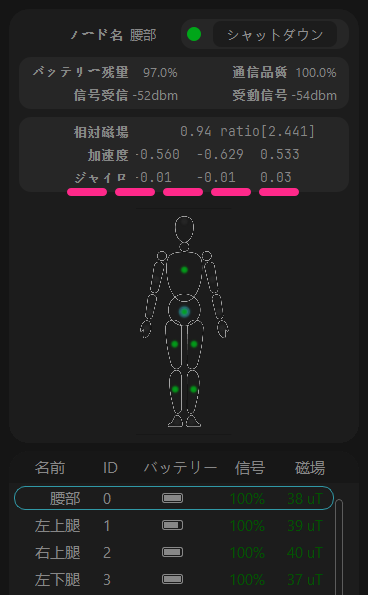

<strong style="font-size: 1.15em" class="tutorial-step-title">3. ジャイロスコープ情報の確認</strong> 
- 完了したら、各トラッカーのジャイロスコープ情報を確認します。 
- 通常、静止時のジャイロスコープの出力値は 0 ～ ±0.05 の間である必要があります。

<!-- ==================== 步骤 3 结束 ==================== -->

<!-- ==================== 旗帜 Gyroscope Calibrate 结束 ==================== -->

<!-- ==================== 旗帜 Magnet Calibrate 开始 ==================== -->

## 磁気校正

<!-- ==================== 步骤 1：放置吸塑盘 开始 ==================== -->

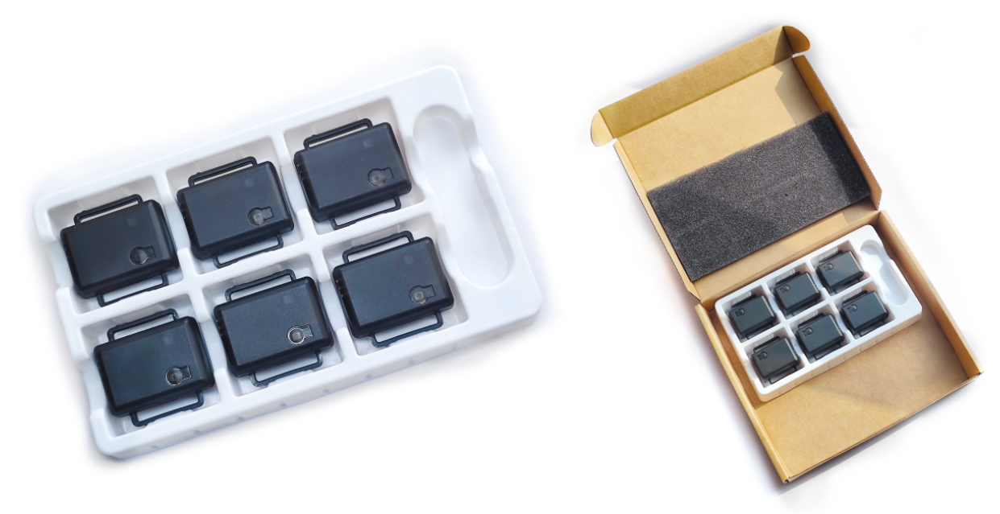

<strong style="font-size: 1.15em" class="tutorial-step-title">1. ブリスタートレイへの配置</strong> 
- トラッカーを向きを揃えてブリスタートレイに配置します。 
- （持ちにくい場合は、ブリスタートレイを化粧箱に戻しても構いません）。

<!-- ==================== 步骤 1 结束 ==================== -->

<!-- ==================== 步骤 2：站在中心 开始 ==================== -->

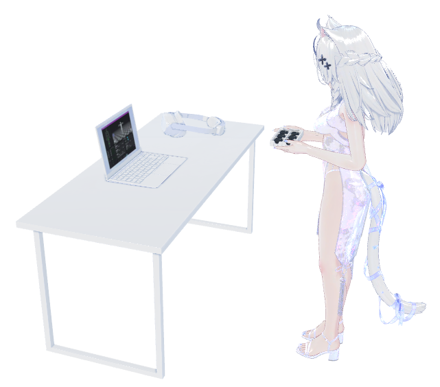

<strong style="font-size: 1.15em" class="tutorial-step-title">2. プレイエリアの中心に立つ</strong> 
- 胸に抱えてプレイエリアの中心に立つか、 
- またはPCデスクの端から一歩離れた場所に立ちます。

<!-- ==================== 步骤 2 结束 ==================== -->

<!-- ==================== 步骤 3：旋转吸塑盘 开始 ==================== -->

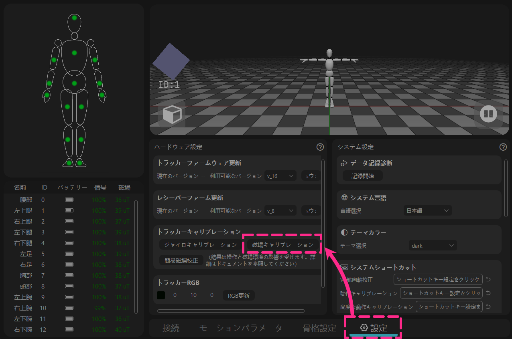

<strong style="font-size: 1.15em" class="tutorial-step-title">3. ブリスタートレイの回転</strong> 
- ソフトウェアのボタンをクリックし、ソフトウェアに表示されるアニメーションに従ってブリスタートレイを回転させます。 
- （それぞれの面について2回転させます）。

<!-- ==================== 步骤 3 结束 ==================== -->

<!-- ==================== 步骤 4：检查磁场读数 开始 ==================== -->

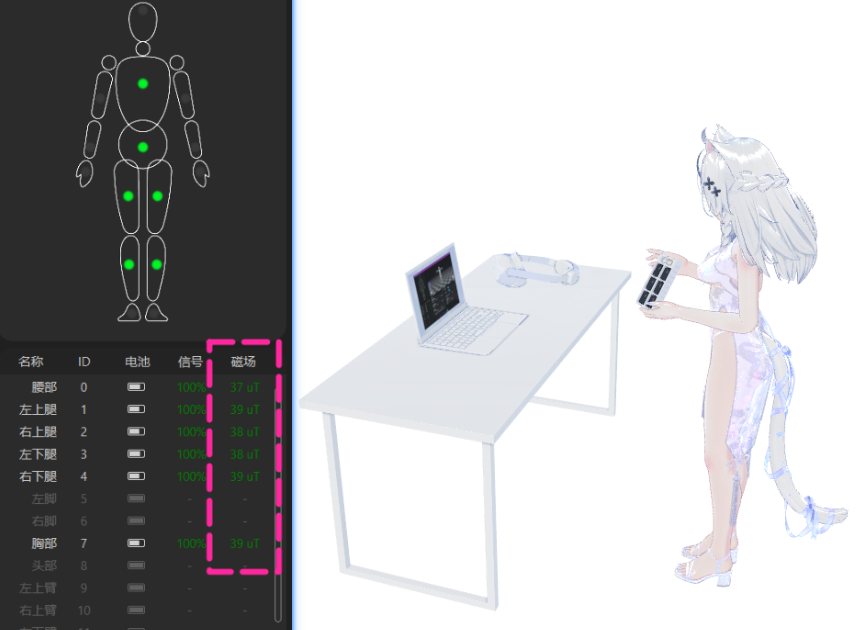

<strong style="font-size: 1.15em" class="tutorial-step-title">4. 磁场読み取り値の確認</strong> 
- 完了したら、手の中でブリスタートレイをランダムに裏返し、 
- 🔍校正されたトラッカーの磁場読み取り値が一貫しているか、または近い値であるかを確認します。 
- ⚠️磁場の読み取り値が大きく異なる場合は、磁気校正を再度行う必要があります。

<!-- ==================== 步骤 4 结束 ==================== -->

<!-- ==================== 折叠页 开始 ==================== -->

箱がない、または紛失した場合はどうすればよいですか？

   &emsp;&emsp;ストラップを使用して、トラッカーを四角い水筒やティッシュボックスに2〜3個ずつのグループで固定して代用できます。 

<!-- ==================== 折叠页 结束 ==================== -->

<!-- ==================== 折叠页 开始 ==================== -->

簡易磁気校正

   &emsp;&emsp;便利な代替案として。   
   &emsp;&emsp;主な動作：  
   &emsp;&emsp;記録時間中にトラッカーを回転させ、できるだけ多くの方向をカバーします（360°全方位反転）。 

   &emsp;&emsp;ヒント：  
   &emsp;&emsp;手首と腕を「8」の字に動かし、センサーがより多くの角度から磁場データを捕捉できるようにします。 

<!-- ==================== 折叠页 结束 ==================== -->

<!-- ==================== 旧版本看不到简易磁场校准 折叠页 开始 ==================== -->

古いバージョンではこのボタンが表示されませんか？

   &emsp;&emsp;このボタンは古いバージョンではデフォルトで表示されません。 
   &emsp;&emsp;表示させるには、手動で特定の .txt ファイルを作成する必要があります。 

   &emsp;&emsp;Rebocapのルートフォルダー（Rebocap.exeがあるディレクトリ）に移動し、  
   &emsp;&emsp;新規の .txt ファイルを作成して、名前を 
   &emsp;&emsp; \_simple_cal\_

   &emsp;&emsp;ソフトウェアを再起動すると、ボタンが表示されます。

<!-- ==================== 旧版本看不到简易磁场校准 折叠页 结束 ==================== -->

<!-- ==================== 折叠页 结束 ==================== -->

<!-- ==================== 旗帜 Magnet Calibrate 结束 ==================== -->

<!-- ============= 标题 ======= 进入SteamVR ==================== -->
## 6 - SteamVR の起動と接続

<!-- ==================== 旗帜 Connection 开始 ==================== -->

## 接続

<!-- ==================== 步骤 1：启动 SteamVR 开始 ==================== -->

<strong style="font-size: 1.15em" class="tutorial-step-title">1. SteamVR の起動</strong> 
- SteamVR を起動します。 
- (SteamVR ヘッドセット = Rebocap ヘッドトラッカー)。

<!-- ==================== 步骤 1 结束 ==================== -->

<!-- ==================== 步骤 2：选择 VR 模式并校准 开始 ==================== -->

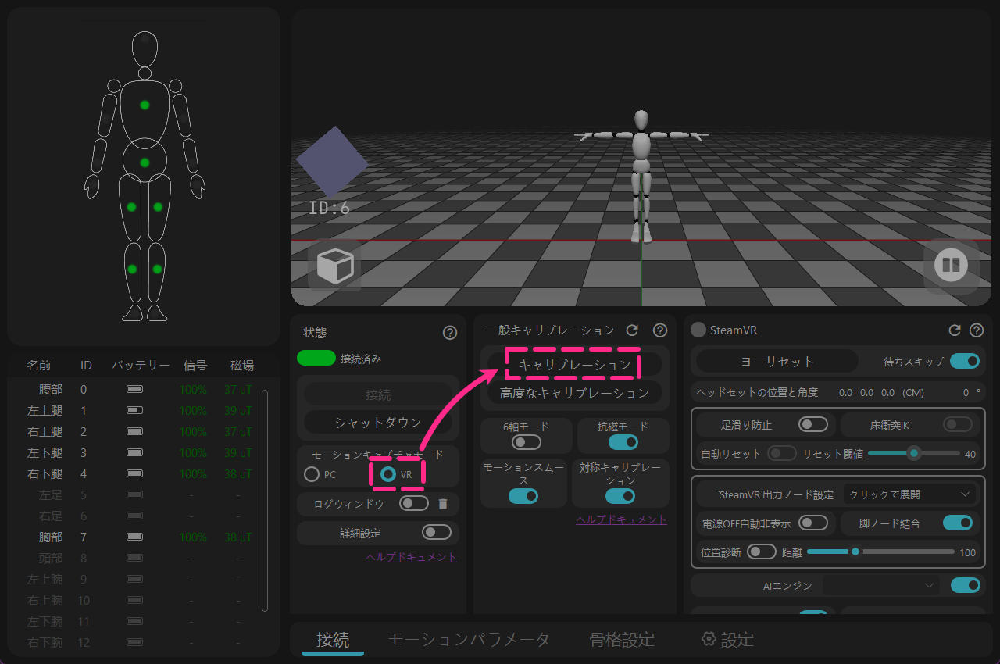

<strong style="font-size: 1.15em" class="tutorial-step-title">2. VR モードの選択と校正</strong> 
- Rebocapで [VR Mode] を選択し、「校正」をクリックします。 
- 接続を確実にするため、SteamVRが動作している状態で校正を行ってください。

<!-- ==================== 步骤 2 结束 ==================== -->

- ゲームに入るには、このセクションの操作を繰り返すだけです。
- Rebocap ID + 3 = SteamVR ID

<!-- ==================== 旗帜 Connection 结束 ==================== -->

<!-- ==================== 旗帜 VR – Calibration posture guide 开始 ==================== -->

## VR – 校正姿勢ガイド

<!-- ==================== 步骤 1：A pose 开始 ==================== -->

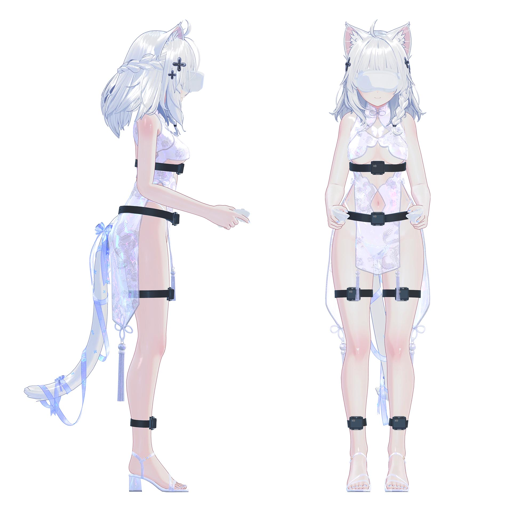

<strong style="font-size: 1.15em" class="tutorial-step-title">A ポーズ</strong> 
- VRコントローラーを持ち上げて、トラッカーがコントローラー内の磁石を感知しないようにします。 
- 両脚の間隔を適切に保ち、足を揃えたり開きすぎたりせず、図に近い間隔にしてください。 
- 筋肉を緊張させず、自然にリラックスして立ってください。

<!-- ==================== 步骤 1 结束 ==================== -->

<!-- ==================== 步骤 2：S pose 开始 ==================== -->

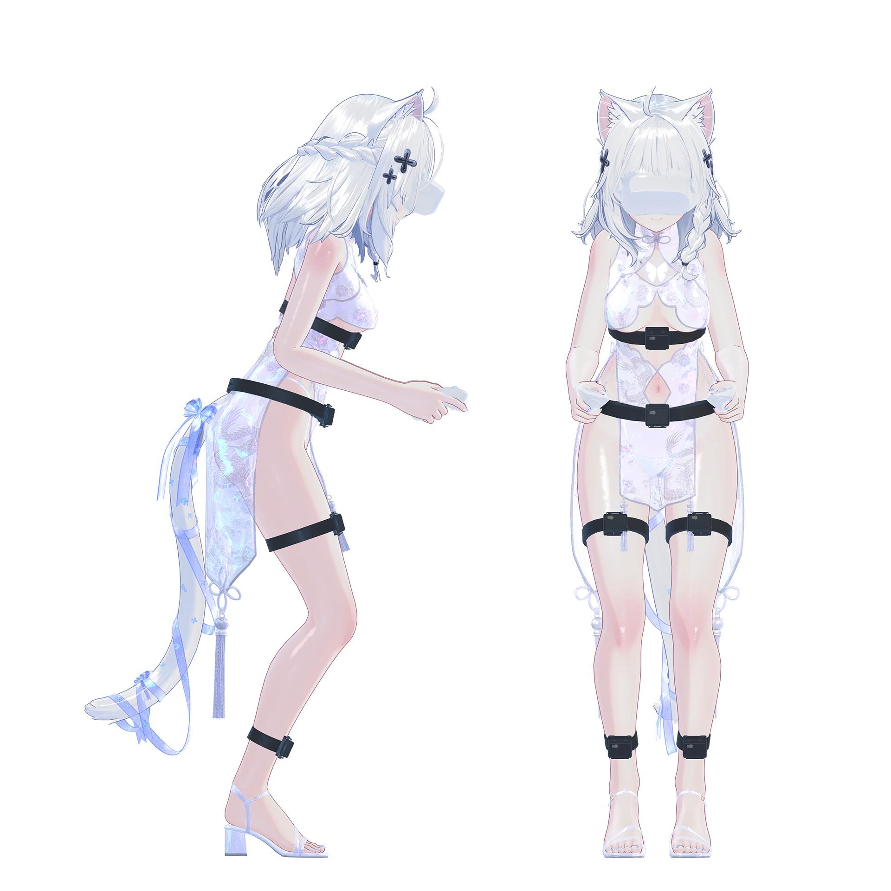

<strong style="font-size: 1.15em" class="tutorial-step-title">S ポーズ</strong> 
- 中腰（ハーフスクワット）＋前屈みになって頭を下げ、トラッカーが前傾角度から身体の前方方向を検知できるようにします。 
- できるだけ両脚のバランスを保ち、膝の間隔を維持してください。 
- 前屈みが難しい、または効果がはっきりしない場合は、詳細校正を使用してください。

<!-- ==================== 步骤 2 结束 ==================== -->

<!-- ==================== 步骤 3：B pose 开始 ==================== -->

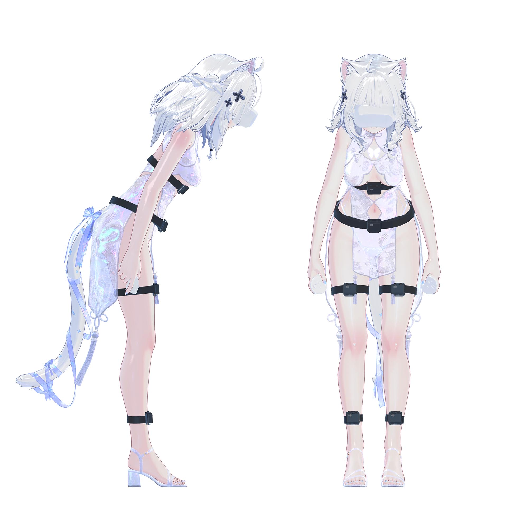

<strong style="font-size: 1.15em" class="tutorial-step-title">B ポーズ (詳細校正)</strong> 
- Sポーズの曲げる動作を、録画用に単独のお辞儀動作に分割して記録します。 
- Sポーズによる身体の歪み（座った後にアバターの骨格システムが側面に傾く現象など）を回避できます。

<!-- ==================== 步骤 3 结束 ==================== -->

<!-- ==================== 旗帜 VR – Calibration posture guide 结束 ==================== -->

<!-- ==================== 旗帜 Enter game (example: VRChat) 开始 ==================== -->

## ゲームに入る (VRChat を例に)

<!-- ==================== 步骤 1：检查 SteamVR 蝴蝶图标 开始 ==================== -->

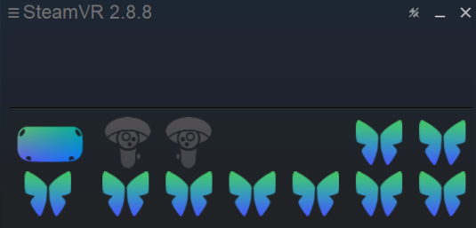

<strong style="font-size: 1.15em" class="tutorial-step-title">1. SteamVR ステータスの確認</strong> 
- 校正が完了すると、SteamVRのリスト内に新しく更新された蝶のロゴが表示されます。

<!-- ==================== 步骤 1 结束 ==================== -->

<!-- ==================== 步骤 2：打开游戏内校准 开始 ==================== -->

<strong style="font-size: 1.15em" class="tutorial-step-title">2. ゲーム内メニューを開く</strong> 
- ゲーム内のメニューを開き、「校正」をクリックします。

<!-- ==================== 步骤 2 结束 ==================== -->

<!-- ==================== 步骤 3：绑定追踪点 开始 ==================== -->

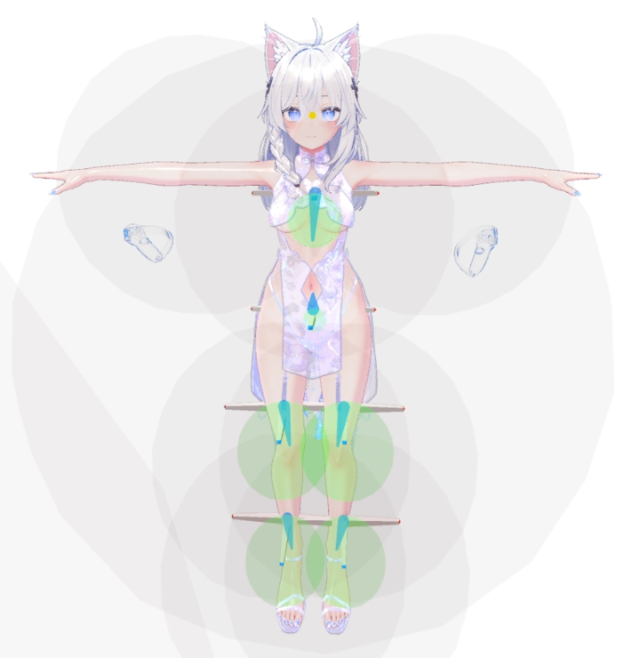

<strong style="font-size: 1.15em" class="tutorial-step-title">3. トラッカーポイントの紐付け</strong> 
- トラッカーポイントをアバターの身体に対称に配置します。アバターごとに身体の長さが異なるため、完全に一致させる必要はありません。 
- 両手の人差し指でトリガーボタンを押して、トラッカーポイントの紐付けを完了します。

<!-- ==================== 步骤 3 结束 ==================== -->

<!-- ==================== 旗帜 Enter game (example: VRChat) 结束 ==================== -->
