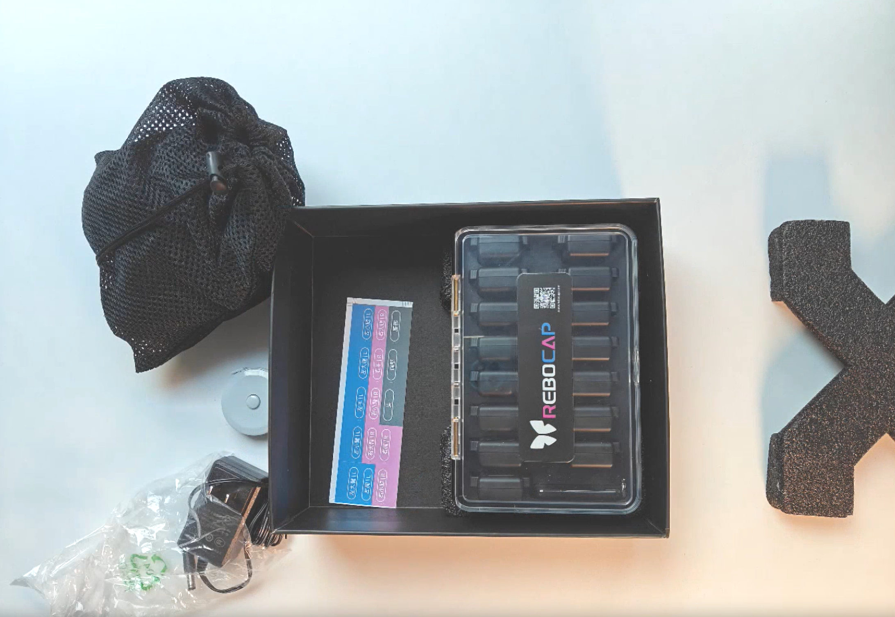
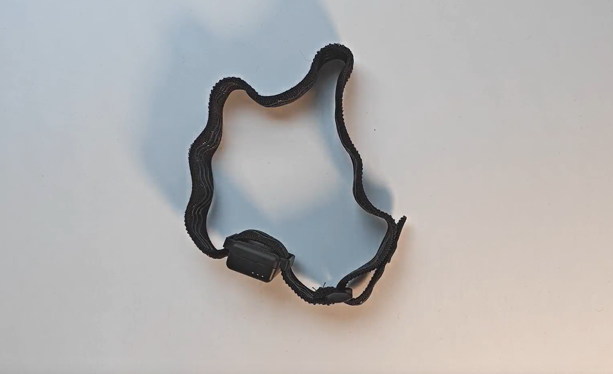
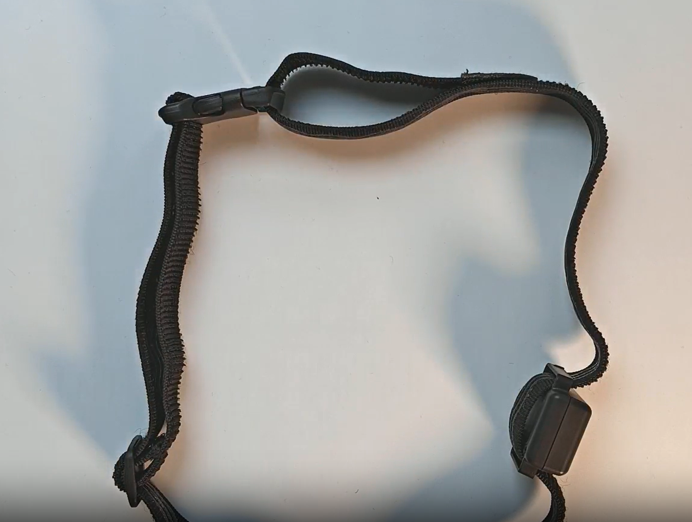
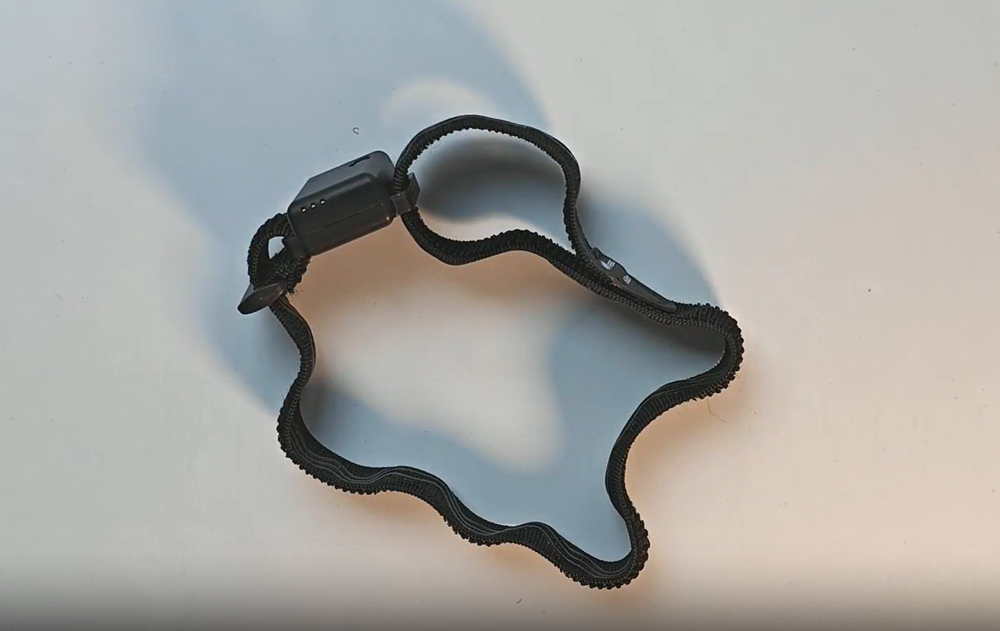
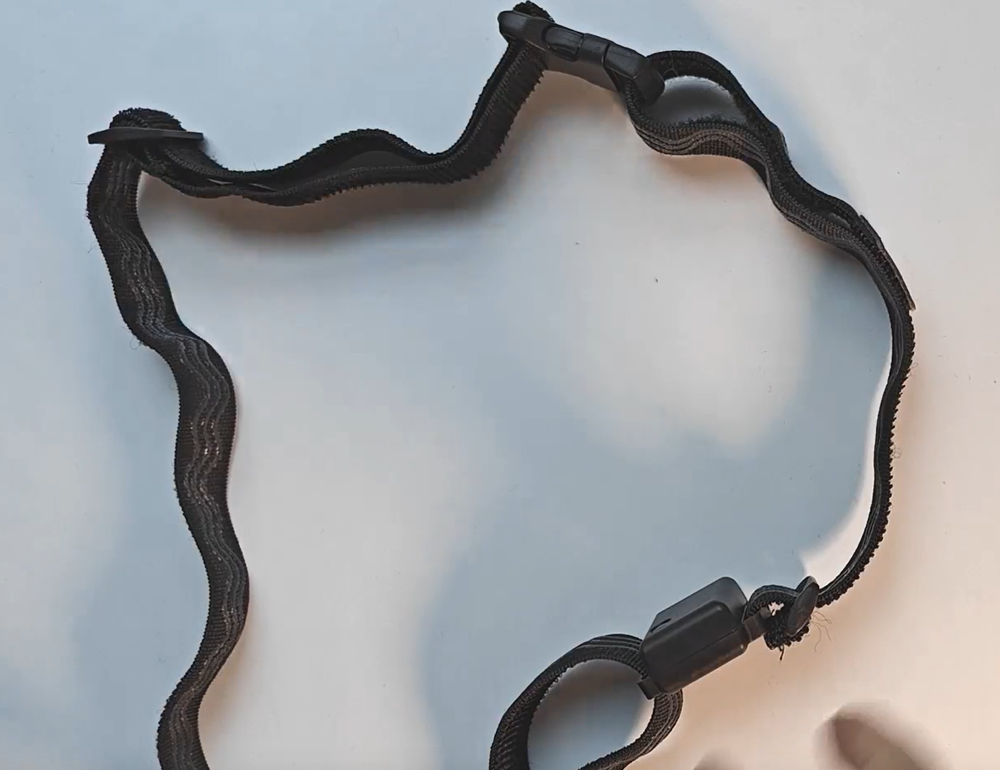
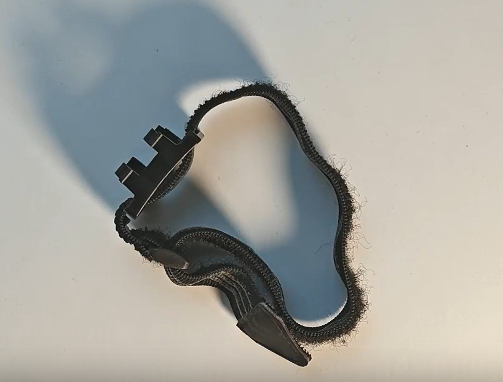
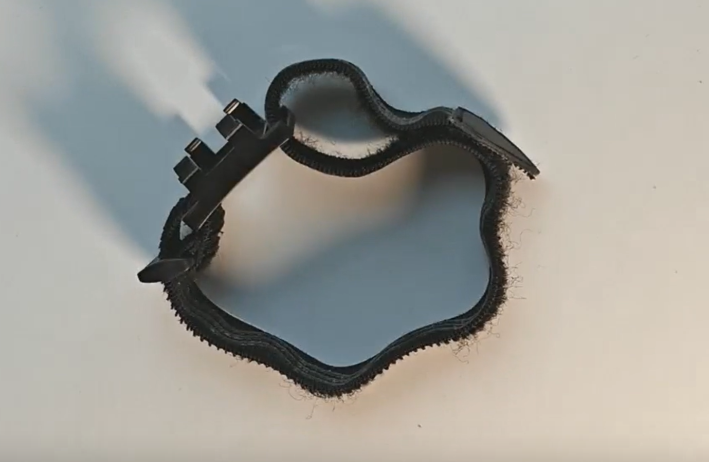

# 
Rebocap ユーザーマニュアル

**- このオフラインマニュアルは参考用です。オンラインマニュアルのエクスポート版であるため、更新情報が古い、リンク切れしている、動画が画像に置き換えられているなどの問題がある可能性があります。完全版は、[https://doc.rebocap.com/ja_JP/tutorial/hardware_check.html](https://doc.rebocap.com/ja_JP/tutorial/hardware_check.html) をご覧ください。**

## 開封チェック

- 製品は現在、引き出し型のカラーボックスと普通の段ボール箱で包装されており、内部にはエアカラムパッドが6面にわたって配置されて、緩衝材として機能しています。
- 製品リスト

  - トラッカー x 15
    > 各トラッカーの底部にはラベルがあり、ラベルには対応する数字コードと身体部位が描かれています。例えば、1号は左上腿、3号は左下腿です。トラッカーの位置は固定されており、[置き換え機能](../ui_help_doc/remap#trackerreplace)を使用しない限り変更できません。
  - レシーバー x 1
  - 充電ドック x 1
    > 収納用として使用でき、バッテリーは含まれていません。
    >
:::danger 12V以上の電源アダプター（例：24V電源アダプター）を使用すると、充電基板が過電圧で焼損する可能性があります！！！

:::

  - 電源アダプター x 1
    > 12V 2A、広い電圧範囲で、110Vおよび220Vに対応しています。
  - バンド x 15 + 収納ネットバッグ x 1
    1. 100cm * 2
    2. 60cm * 3
    3. 40cm * 6
    4. 25cm * 4
  - 引き出し型カラーボックス x 1
  - 【プレゼント】身体部位ステッカー x 15
    > 各トラッカーの位置を確認するのに役立ち、装着後に誤って装着していないか再確認するのが便利です。
  - 【プレゼント】プラスチック巻尺 x 1
  - 【オプション】クイックリリース x 15
    > 中国本土ではオプションのアクセサリー（中国の公式タオバーストアで購入）ですが、中国本土以外の地域では、配送距離が長いため、一部のユーザーがクイックリリースの機能を理解していなかったり、購入を忘れたりすることで再購入時に高額な配送費が発生するのを防ぐため、必須アクセサリーとして主製品と一緒に販売されます。

- 製品開封動画
  > 充電ボックスの上蓋を開ける方法については、動画の13秒を具体的にご覧ください。親指でボックスのバネボタンの最上部を押し、もう一方の手で上蓋を開けます。

- ハードウェア品質に関する説明
  1. トラッカーの上下のカバーには小さな段差があり、これは正常な現象です。
  2. 大きな充電ボックスの中で、中托部分の射出成形の水口が外観面に残っており、クリンチ部分の隣に一定の隙間や欠陥があります。
  3. レシーバーのUSBポート部分が出荷時にわずかに傾いていますが、使用には影響しません。
  4. プラスチック外殻は現在UVメッキが施されておらず、傷がつきやすいです。
  5. 異なるトラッカーのバッテリーには一定の容量差があり、これは正常な現象です。使用時間を基準とし、電量パーセンテージは参考値としてのみ使用し、評価指標とはしないでください。

## ボタン説明
- トラッカーのボタン

  > 
  > 電源オンまたはリセット機能のみで、クリックまたは長押ししても、トラッカーの電源オンまたはリセットがトリガーされるだけです。
  >     

 

- 充電ドックのボタン

  このボタンは、トラッカーが充電ドックに置かれ、トラッカーの底部の3つの接点が充電ドックに接触している場合にのみ有効です。
   
   
   1. 1回押すと、トラッカーの電源がオンになります。
   2. 3〜4秒間長押しすると、トラッカーの電源がオフになります。
   3. 周波数をリセットします【通常は必要ありません】。
      - トラッカーが点灯した後、8〜10秒長押しして放すと、トラッカーの青いランプが点滅し、リセット状態に入ります。再度8〜10秒長押しして放すと、リセットが確認され、緑のランプが点滅します。

## 充電と使用時間の説明

- 初めて受け取った際には、充電できるか確認する必要があります。通常、アダプターを接続するとすべてのトラッカーが赤いランプが点灯し、充電が完了すると緑のランプに変わります。
  >
- ランプが点灯しない場合は、トラッカーが輸送中に緩んでいる可能性があるため、該当するトラッカーを再度接続してみてください。すべてのトラッカーが点灯しない場合は、電源アダプターが通電しているか確認してください。
- 通常、充電が完了するまでに約2時間かかり、使用時間は約30時間です。
:::info 使用時間の説明と充電の説明

1. 使用時間は環境温度に依存し、低温は使用時間を短縮します。
2. 一部のノードが正常に電源を切らず、電力が持続的に消費されると、他のトラッカーとの使用時間に大きな差が生じることがあります。
3. 充電が完了した後、トラッカーを抜いて再度挿し直すと、再び赤いランプが点灯するのは正常な現象です。これは従来の携帯電話やその他の電化製品と同様で、満充電後に再度接続すると、短時間のトリクル充電が行われるためです。

:::

- 
ごく一部のトラッカーは、充電が完了した後に緑のランプ状態に切り替わらない場合がありますので、接続後のソフトウェア表示の電量を基準としてください！

- 
長期間放置する場合は、2〜3ヶ月ごとに放電して充電することをお勧めします。そうしないと、バッテリーの寿命に影響が出る可能性があります！例えば、VRユーザーは5〜7個の待機ポイントを持つことがあるため、将来的に損傷したポイントを前腕で交換できるように、バッテリーのメンテナンスをしっかり行うことをお勧めします。

> 注：使用時の持続時間は人体の運動状態に関係なく、接続後は動作の速さに関わらず、消費電流の大きさは一定です。

## トラッカーの状態説明
|       |  待機状態   |   切断状態   | 接続状態 |      バッテリー低下      | ファームウェア更新 | ファームウェア更新成功 |
|:-----:|:-------:|:--------:|:----:|:-------------:|:----:|:------:|
| RGB状態 | ブレスライト(3S) | ブレスライト(10S) | 高速点滅 | 赤ライト点滅 3回後にシャットダウン | 青ライト点滅 |  白ライト点滅  |

- トラッカーが点灯すると、待機状態になり、待機状態ではブレスライトが30S間持続して点滅し、10分間接続されない場合は自動的にシャットダウンします。
- レシーバーが通電されると、トラッカーは接続状態に入り、接続状態では自動的にシャットダウンしません。

  > **[警告] ソフトウェアを閉じても自動的にシャットダウンしません **
  >
  > 一部の状況ではシャットダウンに失敗し、電力を消費し続けることがあります！

- レシーバーが電源を切ると、トラッカーは再び待機状態に切り替わります。
- トラッカーが自動的にシャットダウンしない場合、レシーバーが通電されると、トラッカーはすぐに接続状態に入ります。

     

## トラッカーをストラップに取り付ける

### トラッカーの一般的な取り付け方法
**ポイント：**
1. ストラップの毛面はトラッカーの底面を向ける
2. 体格の小さいユーザーの場合、ストラップが長いときはトラッカーをバックルの近くに移動させることで、この問題を大幅に緩和できる

  
> 腰部と胸部のストラップは、三角面の一側のバックルを外してからトラッカーをストラップに取り付け、その後バックルに通す必要があります。具体的には下の動画を参照してください。

### トラッカーの複雑な取り付け方法
:::info 比較説明

一般的な取り付け方法に比べて、複雑な取り付け方法は手順が煩雑で時間がかかりますが、より安定性があり、ストラップがトラッカーに対してより強い力を発揮します。具体的な取り付け方法は図の通りです。

:::

  
> 腰部と胸部のストラップは、複雑な取り付け方法を使用する際に補助ストラップを追加する必要があります。具体的には下の動画を参照してください。

## クイックリリースをストラップに取り付ける
> 中国本土ではクイックリリースはオプションです（クイックリリースを持っているユーザーのみ対象）
### クイックリリースの一般的な取り付け方法
**ポイント**
1. 毛面はトラッカーの底面を向ける
2. 毛面はクイックリリースの下にあり、トラッカーに密着してはいけません。左側の最初の画像が正しい例で、対応する2番目の画像が誤った例です。
3. 同様に、体格の小さいユーザーの場合、ストラップが長いときはトラッカーをバックルの近くに移動させてストラップの長さの問題を軽減できます。[トラッカーの取り付け方法と同じ](#tracker_common_install_method)

  
> 腰部と胸部のストラップは、三角面の一側のバックルを外してからクイックリリースを取り付ける必要があります。[トラッカーの取り付け方法と同じ](#tracker_common_install_method)

### クイックリリースの複雑な取り付け方法
:::info 比較説明

一般的な取り付け方法に比べて、手順が煩雑で時間がかかりますが、より安定性があり、ストラップがトラッカーに対してより強い力を発揮します。具体的な取り付け方法は図の通りです。

:::

  
> 腰部と胸部のバンドは、まず三角面のクリンチを外し、クイックリリースを取り付ける必要があります。[トラッカーの取り付け方法](#tracker_complex_install_method)

## 異なるバンドの推奨部位
> ここでは使用を推奨していますが、絶対ではありません。各自の状況に応じて柔軟に調整してください。

| バンドの長さ | 身体部位 |
|:-----:|:--------:|
| 100cm | 腰部、胸部 |
| 60cm  | 上腿、頭部 |
| 40cm  | 下腿、上腕、足底 |
| 25cm  | 下腕、手部 |

## トラッカーの装着モード
> `AI Engine` をオンにした場合、下腿センサーは足首の上約5cmに取り付けることをお勧めします。

### PC サポートモード
* 15点装着
  > `AI Engine`（両モデルに対応）および非 `AI Engine` をサポート
* 13点装着（足底は装着しない）
  > 自動的に `AI Engine` に切り替わり、`no foot` モデルになります
* 上半身モード
  > 両腕、胸部、腰部（オプション）、`AI Engine` をオフにすることをお勧めします
* 単腕モード
  > 一方の腕と対応する手部の合計3点
* 6点全身モード
  > 将来的にサポート予定、未定

### VR サポートモード
> VRのすべてのモードは `AI Engine` をオンにすることができます

* VRモード10点
  > 足に6点、胸部、腰部、左上腕、右上腕
* VRモード8点
  > 足に6点、胸部、腰部
* VRモード6点
  > VR 8点に対して、足底の2つのトラッカーを除外
* VRモード5点
  > 左上腿、左下腿、右上腿、右下腿、腰部
* VRモード3点
  > 将来的にサポート予定、開発中
### 肩のノードを追加
- 手のノードを肩に置き換えることができますが、バンドの取り付け方法は自分で解決する必要があります。現在の公式バンドでは肩の装着を支えるのが難しいです。
- PCモードの全身13点装着モードでは、将来的にスイッチを追加し、足底を肩に置き換えることを検討しています。

## トラッカーの身体の具体的な部位
### トラッカーの位置決定原理の紹介
慣性センサーのトラッカーは方向センサーであり、位置センサーではありません。したがって、身体の変形は仮想骨格の方向を変えることになります。私たちの位置は、身体の各骨の方向と仮想骨格の長さに基づいて計算されるため、ソフトウェアはノードが骨に装着されている相対位置を実際には感知できません。

### トラッカーの装着位置の推奨
現在、具体的な推奨部位はありません。どの部位でも、対応する骨に装着すればキャリブレーションとモーションキャプチャが可能ですが、各自の体型分布が異なるため、異なる部位での効果が一貫しないことがあります。したがって、異なる部位に装着すると、効果に大きな差が出る可能性があります。ここでは装着のガイドラインと説明を示しますが、さまざまな部位の影響を自分で試す必要があります。

> 原理の説明として、トラッカーは方向センサーであり、位置センサーではありません。したがって、身体の変形は仮想骨格の方向を変えます。装着の核心原則は以下の通りです：

* 
トラッカーはできるだけ骨の方向と一致させ、肉体に合わせて変わらないようにします
トラッカーの設置位置は、筋肉や変形しやすい脂肪部位など、肉体の変形がある場所を避けるようにしてください。具体的な影響については [変形の事例分析](#example_for_deformation) を参照してください。補償アルゴリズムもありますが、より良い位置を自分で試して、肉体の変形の影響を減らすことを強くお勧めします。
* バンドの引っ張りによるセンサーの方向の変形を避けてください。例えば、ゆったりした長ズボンを着用していると、座ったときに股間がバンドを引っ張り、仮想キャラクターの両脚が交差することがあります。
* 呼吸によるセンサーの方向の変形を避けてください。例えば、胸部や腹部に装着する場合。
* センサーがバンドの上で浮いていることを避けてください。例えば、腰部や胸部で、後ろにバンドを結ぶと、センサーが揺れる可能性があります。
* 進化したキャリブレーションでない限り、胸部、腰部、頭部のトラッカーの上面はできるだけ人体の正面と平行にし、側面に置かないようにしてください。前後はどちらでも構いません。
* **足底のバンドは地面との摩擦を避けてください。ここは効果に非常に大きな影響を与えます。** 足底にバンドを使用する場合は、できるだけ裸足で、バンドを足底の凹んだ部分に置くか、靴を履いている場合は
センサーを靴ひもで固定し、バンドで固定しないようにしてください。

:::info 主に調整テストが必要なポイント

1. 上腿部位のトラッカーは、上腿部位の一部の人が膝の上5〜8cmの正面に装着するのが良いとされています。一部のユーザーは上腿の両側、中間位置に装着するのが良いとされています。ズボンがバンドを引っ張る影響を避けるように注意してください。
2. 足のトラッカーは、足のトラッカーの安定性が全体の追跡品質を直接決定します。足底のトラッカーがバンドの引っ張りの影響を受けないようにする必要があります。靴ひもで固定することをお勧めします。簡単な方法は、トラッカーを靴ひもに直接かぶせることです。以下の左図のように、複雑な方法はトラッカーまたはクイックリリースを靴ひもに固定する必要があります。
3. 腰のトラッカーは、一般的に身体の後方に置くことをお勧めします（寝る必要があるユーザーは、身体の側前方に置き、進化したキャリブレーションを行うことができます）。腹部に置くことは非常にお勧めできません。
4. 腰部と胸部のトラッカーは、クイックリリースを使用すると重心が高くなり、相対的にクイックリリースを使用しない方が安定します。また、バンドは[複雑な取り付け方法](#quick_fix_complex_install)を使用するとより安定します。

:::

#### 足の靴ひもを使った簡単な装着例

### 変形ケースの例示分析
太ももは影響を受けやすいため、ここでは太ももに関する影響ケースの解析を示します。
- 特別な説明：仮想骨格の方向はセンサーの方向と同じです。センサーが傾くと、仮想骨格も傾きます。

> 太ももの前面に装着する例として、立っている状態と座っている状態では人体の分布が変化します。通常の立位では、トラッカーと太ももに20度の角度があると仮定しますが、座ると重力の影響で、より多くの脂肪や筋肉組織が通常下垂し、角度が小さくなります。これは個人差があり、具体的な影響は以下の図に示されています。
>
> 
>
> 前面装着による股の引っ張り示意図
>
> 
>
> 太ももの外側に装着する例として、座った後、太ももの下部が椅子に圧迫されるため、人体組織が両側に堆積し、センサーと太もも骨の角度が大きくなりやすく、交差脚を引き起こしやすいです。以下の図に示されています。
>
> 

:::info 幅広バンド

5CM幅の幅広バンド（公式設定のバンドは2.5cm幅）は、特に大きな動きに対して、全体の安定性を向上させることができます。例えば、腰部や胸部の方向への振動を明らかに減少させることができます。

:::

    

## ソフトウェアダウンロード
現在は `Release` バージョンです。下記の `download` ダウンロードリンクをクリックしてください。

現在のソフトウェアは **Windows 10** 以降のシステムバージョンのみをサポートしています：
- **ここをクリックして[download](/img/files/rebocap_release_v01.exe)**

> 注意：ソフトウェアはオンライン状態で使用する必要があります。オフラインで使用したい場合は、スマートフォンのホットスポットでネットワークに接続し、ソフトウェアを起動して 30 秒後にネットワークを切断してください（ログを確認し、ネットワーク認証が成功と表示されたらネットワークを切断して構いません）。

## ソフトウェアのインストール
1. rebocap_release_v01.exe をダブルクリック（現行バージョンは rebocap_release_v01.exe）
2. 下図のようにインストールを進める
3. rebocap ソフトを起動
   * スタートメニューから起動
   * デスクトップショートカットから起動

    

# 接続
1. 接続するトラッカーの電源を入れる
   > サポートされているトラッカーの組み合わせモードについては [前の章](instroction_for_straps#follow_mode) を参照してください
2. レシーバーをコンピュータのUSBポートに挿入する
3. Rebocapソフトウェアを開いて接続をクリックする

### 接続後の信号が弱いまたは不安定
* デスクトップPCを使用している場合は、レシーバーをケースの後ろに置かないでください
* レシーバーの横にはできるだけ5cm以上の空間を保ち、例えばレシーバーの横にUSBメモリを挿入しないでください。可能であれば、延長ケーブルを試すと信号に一定の助けになるかもしれません

# キャリブレーション
装着については以下の図を参照してください。具体的な装着位置は人によって異なります。原理や詳細については[前の章](instroction_for_straps#tracker_position_recomendation)を参照してください。

:::info 初めて使用する場合は必ず15ポイントをテストしてください

テストの結果が良くない場合、以下の理由が考えられます
1. 磁場の問題。具体的な解決策については[こちらを参照してください](../QA/magnet)
2. ジャイロスコープのキャリブレーションが必要な場合があります。詳細については[こちらを参照してください](../ui_help_doc/control/config#gyrocalibrate)
3. 装着の引っ張り問題については[こちらをよく読み、参照してください](instroction_for_straps#tracker_position_on_body)

:::

### 動作キャリブレーション
ソフトウェアのインターフェースにある動作キャリブレーションボタンをクリックし、動作キャリブレーションの参考として以下の図を参照してください。ソフトウェア内にも対応する画像のヒントがあります。重要なポイントと動作の規範は必ずすべて読みましょう。

- **キャリブレーションの要点**
  * 動作キャリブレーションをクリックした後、すぐにA-Poseの姿勢を保持し、静止する
    > システムはクリックから2秒後に人物が静止しているかどうかを検出し始めます。前後の揺れ幅を注意深く制御し、揺れを最小限に抑えて、各センサーの初期化を完了します。検出時間は10秒で、最近の2秒間に静止していると検出されると、すぐにキャリブレーションプログラムに入ります。
  * 各動作は、速いビープ音の間に、システムが対応する姿勢データを録音します
    > 速いビープ音の間は必ず静止していることを維持し、動作を切り替える際は速いビープ音が鳴り終わった後1秒待ってから切り替えることをお勧めします
  * 動作を切り替えた後は必ず静止し、速いビープ音が鳴るのを待ち、切り替えの過程は2秒以内に完了することをお勧めします
  * 動作を切り替える際には必ず両足を動かさないこと
    > 両足はキャリブレーション中に必ず静止を厳守し、動かさないでください。

- **動作の規範**
  * **A-Pose**

    両足を垂直に下に向け、できるだけ平行にし、両足の間に拳1つ分の距離を保ち、両手を緊張させて垂直に下に向け、曲げずに手のひらを自分に向け、背中をまっすぐにし、正面を見つめる
    > ここで、キャリブレーション後に両足が閉じていると感じる場合、仮想キャラクターの両足が交差している場合は、キャリブレーション時に両足の間隔を狭めてください
    >
    > キャリブレーション後に両足が閉じていると感じ、仮想キャラクターの両足の間隔が広すぎる場合は、キャリブレーション時に両足の間隔を広げてください
  * **T-Pose**

    両足はA-Poseと同じに保ち、両手は外側に広げ、必ず肩幅と同じにし、両手が一直線になるようにし、手のひらを下に向ける
  * **S-Pose**

    両足を前方に約30度軽く曲げるだけで、過度に曲げる必要はありません。両手は前方に保ち、上半身と垂直にし、高さは肩と平行にし、両腕は平行にします
    > 腕にトラッカーを装着していない場合、腕の動作は無視できます
  * **B-Pose**

    上半身を前方に30度曲げるだけで、手の動作は気にしなくて大丈夫です
    > B-Poseの正式名称はBlend-Poseで、主に腰、胸、頭のトラッカーの航向角をキャリブレーションするために使用されます。

下図の左から右への順番は：`APose`  `TPose`  `SPose`  `BPose`

# ソフトウェア接続
### SteamVr 接続 [こちらをご覧ください](../third_party_software_access/steamvr/README)
- VRChat 接続 [こちらをご覧ください](../third_party_software_access/steamvr/vrchat)
- コミュニティ接続チュートリアル [https://kdocs.cn/l/cnOltEt3BgQP](https://kdocs.cn/l/cnOltEt3BgQP)，リンクにアクセスできない場合は[PDF ファイルをダウンロード](/img/files/RebocapVRchatTutorial-Japanese.pdf)してご覧ください（オフラインファイルは最新でない場合があります）

### VMC プロトコルユーザー接続 [こちらをご覧ください](../third_party_software_access/VMC/README)
- warudo 接続 [こちらをご覧ください](../third_party_software_access/VMC/warudo)

# 必須事項
使用中に発生する様々な問題（例えばトラッカーが突然傾くなど）を避けるため、またより良いモーションキャプチャ体験を得るために、以下の説明を必ずお読みください。

### ハードウェアキャリブレーション
- [磁場キャリブレーション](../ui_help_doc/control/config#magnetcalibrate)
- [ジャイロキャリブレーション](../ui_help_doc/control/config#gyrocalibrate)

### ソフトウェアでのモーションキャプチャ設定方法
- 磁場に関する設定については、[磁場関連の説明](../QA/magnet)をお読みください
- その他の設定については、各設定パネルの右上のクエスチョンマークアイコンをクリックしてください

### ストラップの最適な取り付け方法
[前の章](instroction_for_straps)を飛ばして読んだ場合は、空いている時間にお読みいただくか、問題が発生した際には必ず詳細にお読みください

:::info 重要点の再強調

ここで再度強調しますが、足底のトラッカーの取り付け方法は非常に重要です。ストラップを使用しないようにし、ストラップと地面の摩擦によってトラッカーが動き、全体のモーションキャプチャ効果に影響を与えないようにしてください。詳細は前の章の説明をご覧ください。

:::

    

