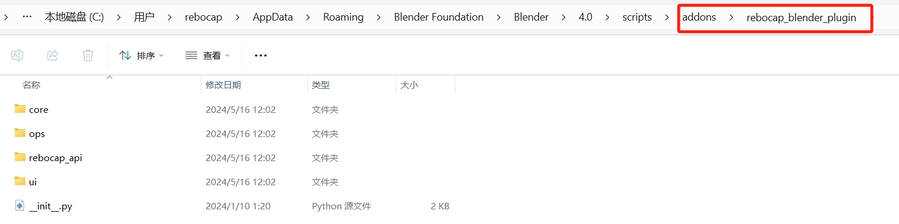

# Blender 플러그인 다운로드

직접 다운로드하려면 아래 링크를 클릭하세요:
- **Blender 플러그인 Beta 9**
<a href="/img/files/rebocap_blender_plugin_v9.zip" target="_blank" download="rebocap_blender_plugin_v9.zip">blender with python 3.6~3.12</a>
업데이트 내용:
- Blender 4.4 이상과 호환 가능
- rebocap 플러그인의 프로세스 잔류 버그 수정
- 실시간 구동 시나리오에서 발을 안정시키기 위한 뼈대 내보내기 버그 수정
- Python 3의 모든 버전 지원 (예: Blender 4.1 지원 가능)
- Mixamo 뼈대 직접 바인딩 지원
- fbx 모델 구동 버그 수정
- 애니메이션 기록 축 버그 수정
- 뼈대 흡착 선택 기능 추가

# Blender 튜토리얼 비디오
참고: 소리가 없습니다.

<video id="video" controls preload="metadata" width="100%">
      <source id="mp4" src="/img/for_blender_install/blender_usage.mp4" type="video/mp4" />
</video>

# Blender 플러그인 설치

설치 단계:
`Edit->Preference`를 열고 팝업 패널에서 `Add-ons`를 선택한 다음, 오른쪽의 `Install`을 클릭하고 다운로드한 `rebocap_blender_plugin.zip`을 선택한 후 Install Add-on을 클릭하여 설치합니다. 설치 후 체크하여 활성화해야 합니다. 그림과 같이 rebocap을 입력하고 플러그인을 체크하면 성공적으로 설치됩니다.

    
    

성공적으로 설치된 후 오른쪽 부분에 그림과 같이 해당 플러그인 메뉴가 나타나야 합니다.
    > 주의: 메뉴가 보이지 않는 경우, 클릭하여 볼 수 있는 작은 왼쪽 화살표가 있습니다.

    

:::info 설치 실패 시 해결 방법

일부 사용자가 설치에 실패한 경우, Blender 플러그인의 원래 설치 위치를 찾아 `rebocap_blender_plugin.zip`의 압축을 풀고 직접 blender 설치 디렉토리에 넣으세요. 기본 플러그인 설치 위치는 `C:\Users\<your_username>\AppData\Roaming\Blender Foundation\Blender\<version_number>\scripts\addons`입니다. 여기서 `your_username`은 사용자 이름이고, `version_number`는 설치한 Blender의 버전 번호입니다.

:::

# 뼈대 바인딩
1. VRM 뼈대의 자동 바인딩
2. FBX에 Mixamo 뼈대 사양을 사용하는 경우, 직접 모드에서 자동 바인딩을 달성할 수 있습니다. 즉, 직접 모드에서는 모든 Mixamo 아바타를 제어할 수 있습니다.
  > 하지만 발바닥의 12개 고정점은 수동으로 선택해야 합니다(발 효과 요구 사항이 높지 않으면 무시할 수 있습니다).

:::danger 주의!!!

실시간 모션 캡처를 계속하려면 rebocap 클라이언트를 열고 모션 캘리브레이션을 진행한 후 `connect`를 클릭해야 합니다. 그렇지 않으면 blender를 다시 시작해야 할 수도 있습니다.

바인딩된 캐릭터 뼈대는 엉덩이 노드에 의해 구동됩니다. 엉덩이 노드가 루트 뼈대가 아니거나 엉덩이 노드가 이동할 수 없는 경우(일부 뼈대는 엉덩이를 루트와 강제로 연결하며 엉덩이의 로컬 이동을 변경할 수 없음), 캐릭터의 엉덩이가 제자리에 머물 수 있습니다.

:::

팁: fbx를 미터로 스케일링하려면 아래 그림의 위치를 참고하여 `scale`을 0.01로 변경하세요.

    

### 개발자 모드 활성화
`Edit->Preference`를 열고 왼쪽에서 `Interface`를 선택한 다음, `Developer Extras`를 체크하세요.

    

### 캐릭터 임포트

`VRM` 형식의 캐릭터를 예로 들면, VRM 플러그인을 [여기](https://github.com/saturday06/VRM-Addon-for-Blender/releases/download/2_20_24/VRM_Addon_for_Blender-2_20_24.zip)에서 다운로드하세요.

FBX 형식의 캐릭터의 경우, 임포트를 위해 [`better fbx`](https://blendermarket.com/products/better-fbx-importer--exporter) 플러그인을 사용하는 것을 권장합니다.

    

### 플러그인에서 타겟 캐릭터 선택

임포트한 후 `REBOCAP_CONNECTION`을 열고, 오른쪽에서 `Armature`를 선택한 다음 [선택하지 않으면 `Drive Type` 옵션이 나타나지 않음], `REBOCAP_CONNECTION` 메뉴에서 `retarget`을 선택하고 이 캐릭터를 `Source`로 선택합니다. `Armature`를 직접 `Source` 상자로 드래그할 수 있습니다.

    
    

Source를 선택하면 다음 메뉴가 나타납니다:

    

### 뼈대 바인딩

각 뼈대는 타겟 캐릭터의 해당하는 뼈대와 매칭되어야 합니다. [여기서는 영어 부분만 제공되므로 명확하지 않으면 번역을 참고하세요]

Pelvis는 엉덩이, Spine은 엉덩이 위 뼈대, Chest는 두 개의 섹션이 있습니다. 일부 캐릭터는 Chest의 섹션이 하나뿐이며 이 경우 어느 섹션에든 바인딩할 수 있습니다. 타겟 캐릭터에 두 개의 뼈가 있는 경우 Chest에 더 가까운 뼈를 선택하세요. Leg의 네 뼈대는 모두 바인딩해야 하며 Toe는 선택 사항입니다.

VRM 형식 캐릭터의 경우 임포트 후 Auto Detect를 직접 클릭하면 자동으로 채워집니다. 다른 형식의 경우 사용자가 직접 해당하는 뼈대 이름을 찾고 선택해야 합니다.

    

### 신발 밑창의 정점 ID 얻기

이 단계는 약간 더 복잡하며 효과에 크게 신경 쓰지 않는다면 건너뛸 수 있습니다. 주요 목적은 캐릭터가 가장자리를 따라 걷도록 신발 밑창의 경계를 얻는 것입니다. 그러나 신발이 너무 크면 발을 바꿀 때 수직 진동이 발생할 수 있습니다.

1. 첫 번째 단계는 문서 시작 부분에 언급된 개발자 모드를 활성화하는 것입니다.

2. Object Mode로 전환한 다음, Bone 선택을 해제하고 캐릭터의 발을 클릭하여 Mesh를 선택합니다.

    

    
    

    

    
    

3. 캐릭터를 클릭하여 신발 부분이 선택되었는지 확인한 다음, EditMode로 전환합니다.

    

    
    
    

    

    
    

4. Indices를 엽니다. 이는 Blender 3.6과 Blender 4.0에서 다릅니다.

    

    
    
    

5. 정점을 선택하고 해당 값을 기록합니다.

    총 12개의 정점을 기록해야 합니다: 각 발 앞부분의 왼쪽, 중앙, 오른쪽 및 뒤꿈치의 왼쪽, 중앙, 오른쪽입니다. 이는 캐릭터 자신의 왼쪽 및 오른쪽 방향입니다. 포인트를 찾을 때 더 쉬운 식별을 위해 캐릭터의 등을 자신 쪽으로 향하게 할 수 있습니다.

    포인트를 선택하는 동안 Mesh를 선택해야 하므로 오른쪽 메뉴가 보이지 않게 됩니다. 발 앞부분의 왼쪽, 중앙, 오른쪽 및 뒤꿈치의 왼쪽, 중앙, 오른쪽 순서로 직접 기록해야 합니다.

    Blender의 기본 조작 방법은 다음과 같습니다:
    > shift + 마우스 휠 클릭: 드래그
    > 
    > ctrl + 마우스 휠 클릭: 줌
    > 
    > 마우스 휠 클릭: 뷰 변경

6. 기록한 후, `Edit` 모드에서 다시 `Object` 모드로 전환하고 `Armature`를 선택한 다음 발 ID를 기입합니다.

    

    
    

#### 밑창 정점 ID 바인딩에 대한 예제 설명
예를 들어, 아래 캐릭터의 왼쪽 앞발 세 정점은 다음과 같습니다:
8863 8860 8862

 

 
 

 

 
 
 
 

# 뼈대 내보내기
모든 핵심 뼈대가 바인딩되면 저장 뼈대 버튼이 나타납니다. 내보내기를 클릭하고 저장할 위치를 선택합니다.

 

 
 

그런 다음 Rebocap으로 임포트합니다, [여기를 참고하세요](../ui_help_doc/control/skeleton_setting#skeleton_import)

                     