# 15 트래커 세트 - 언박싱 및 사용

<!-- ============ Title ======== Check package content ==================== -->
## 1 - 패키지 구성품 확인

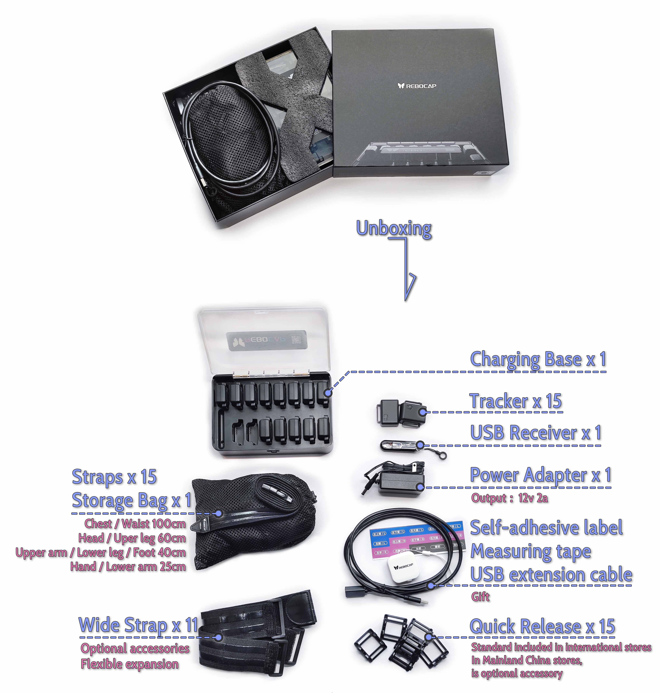

* **서랍형 컬러 박스**(⚠️ 버리지 마세요)  
* **트래커** x 15 
  **USB 수신기** x 1 
* **충전 케이스** x 1 
  **전원 어댑터** x 1 (출력 12V 2A)

* **보관용 메시 백** x 1 
  **탄성 스트랩** x 15 (너비 2.5cm)

* **포함된 사은품** 
  접착식 ID 스티커 
  줄자 
  USB 연장 케이블

* **선택 액세서리** 
  퀵 릴리스 베이스 x 15 (글로벌 버전 기본 구성품) 
  넓은 스트랩 x 11 (너비 5cm, 손바닥과 발 제외, 원래의 좁은 스트랩과 자유롭게 혼용 가능)

<!-- ============= Title ======= Install straps ==================== -->
## 2 - 스트랩 설치

<!-- Method A - Direct Installation -->

## 방법 A - 직접 설치

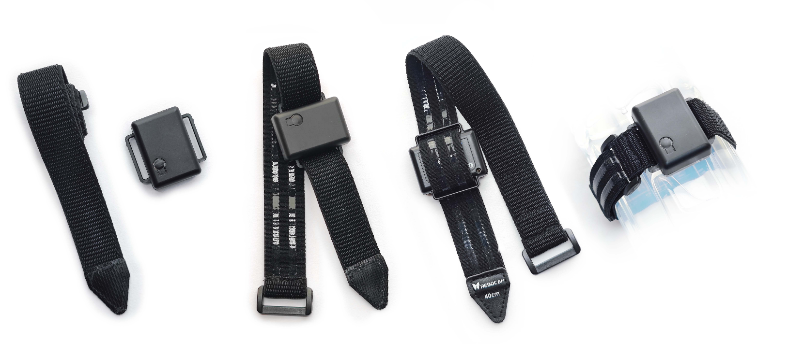

  <video id="video" controls loop preload="metadata" width="60%">
    <source id="mp4" src="/img/tracker_normal.mp4" type="video/mp4" />
  </video>

- 이 설치 방법은 장기간 스트레스를 받으면 재질이 노화되거나 갈라지기 쉬우므로 권장하지 않습니다. 
  주로 예비 방법으로 사용됩니다.

<!-- Method B - Using Quick Release Base -->

## 방법 B - 퀵 릴리스 베이스 사용

- 스트랩에 퀵 릴리스 베이스를 설치하고 스트랩이 베이스 아래로 지나가도록 확인합니다.

  <video id="video" controls loop preload="metadata" width="60%">
    <source id="mp4" src="/img/kuaichai_normal.mp4" type="video/mp4" />
  </video>

- 퀵 릴리스 베이스 설치 영상

- 벨크로를 부착한 후, 훅이 루프 쪽에 완전히 묻혀 떨어지지 않도록 양쪽으로 살짝 당겨줍니다.

- 트래커 제거 팁: 
  한쪽에서 들어 올리면 퀵 릴리스 베이스에서 트래커를 직접 제거하기가 더 쉽습니다.

<!-- Method C - Using Wide Straps -->

## 방법 C - 넓은 스트랩 사용

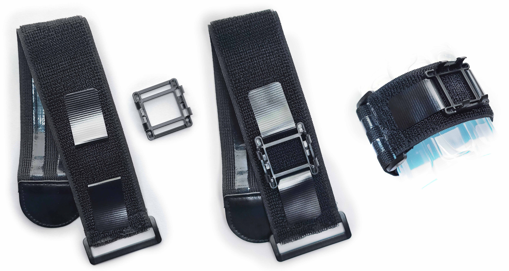

- 넓은 스트랩의 한쪽 끝에는 벨크로가 내장되어 있습니다. 그 위에 트래커 또는 퀵 릴리스 베이스를 설치합니다. 
  상자 안의 여분 단일 벨크로는 예비용으로 제공됩니다.

  <a href="/docs/tutorial/instroction_for_straps" target="_blank" class="button button--primary" style="text-decoration: none; border-radius: 6px; display: inline-block; font-weight: bold; font-size: 1.0rem; padding: 6px 18px;">
    더 많은 스트랩 설치 가이드 → 📖
  </a>

<!-- ============ Title ======== Body Wearing Positions ==================== -->
## 3 - 신체 착용 위치

<!-- ==================== Column Layout Start ==================== -->

<!-- Left Column: Character Model -->

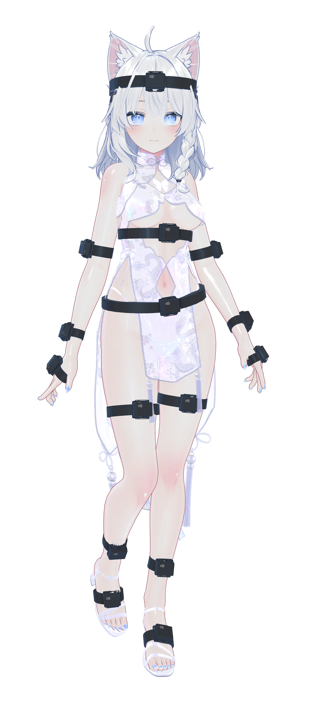

<!-- Right Column: Text Description -->

<!-- Group 1: Circumference Data -->

<strong>가슴/허리:</strong> 100 cm 
<strong>머리/허벅지:</strong> 60 cm 
<strong>상완/종아리/발:</strong> 40 cm 
<strong>손바닥/전완:</strong> 25 cm

<!-- Group 2: Individual Adjustments -->

<strong>개인별 조정:</strong> 
이미지에 표시된 착용 위치를 참조하세요. 
가슴/허리 트래커는 등에 배치하는 것을 권장하며, 
다리 트래커는 측면에 배치할 수 있습니다.

<!-- Group 3: Avoided Areas Tips -->

<strong>팁:</strong> 
트래커 버튼이 위를 향하도록 유지하세요. 
 
압력을 피하기 위해 배꼽에 허리 트래커를 두지 마세요. 
또한 다리 트래커는 근육이 경사지게 튀어나온 부분을 피해야 합니다. 
허벅지 트래커를 무릎에 너무 가깝게 두지 마세요. 

<!-- Group 4: VR Differences -->

<strong>참고:</strong> VR 모드에서의 착용은 약간의 차이가 있지만, 
먼저 모든 트래커가 올바르게 작동하는지 확인하는 것을 권장합니다.

<!-- Group 5: Bottom ID Image -->

트래커 뒷면에 ID 번호가 붙어 있으며, 
번호와 위치의 바인딩은 출고 시 미리 설정되어 있습니다. 
전완과 손바닥에 있는 4개의 트래커만 소프트웨어를 통해 위치를 교환할 수 있으며, 
나머지 트래커는 위치를 교환할 수 없습니다.

<!-- ==================== Column Layout End ==================== -->

<!-- ============= Title ======= Install Software & Check Firmware Update ==================== -->
## 4 - 소프트웨어 설치 및 펌웨어 업데이트 확인

<!-- ==================== Flag A: Install software Start ==================== -->

## A - 소프트웨어 설치

  <a href="/docs/tutorial/software_install" target="_blank" class="button button--primary" style="text-decoration: none; border-radius: 6px; display: inline-block; font-weight: bold; font-size: 1.0rem; padding: 6px 18px;">
    소프트웨어 다운로드 → 🌐
  </a>

- 버전 선택:\
  V01 - 자기장이 안정적인 환경에 적합하며 댄스용으로 권장합니다. 
  V02 Beta02 - 6 트래커 세트에 기본 최적화되어 있으며, 강한 간섭 소스를 능동적으로 감지하는 새로운 알고리즘을 사용하여 스프링 침대 위에서도 방향을 유지합니다.

<!-- ==================== 折叠页 开始 ==================== -->

VR 모드에서 V01 버전을 사용하는 경우 몇 가지 설정을 변경해야 합니다.

<strong>1 - 추가로 표시되는 트래커 포인트 끄기.</strong> 
[Set 'SteamVR'Nodes] 열기 → [Left/Right Upper Arm] 끄기

세부 정보

소프트웨어는 원래 [Auto Hide Joints] 기능을 사용하여 사용하지 않는 트래커 포인트를 자동으로 숨기려고 의도했지만, 
이 기능이 자동 검사를 수행할 수 없음이 발견되었습니다. 이는 V02 Beta02 소프트웨어에서 수정되었습니다.

<strong>2 - 전역적으로 멈춘 채 실행되는 기능 끄기.</strong> 
→ [Motion Params] → [Vertical IK & Horizontal IK] 끄기

세부 정보

이 기능은 원래 [Anti-Slip] 모듈 내의 하위 기능으로 의도되었지만, 
실수로 전역 활성 상태를 유지했습니다. 이는 V02 Beta02 소프트웨어에서 수정되었습니다.

<!-- ==================== 折叠页 结束 ==================== -->

- 비 시스템 드라이브에 설치하는 것을 권장합니다 (C 드라이브에 설치하지 마세요).

<!-- ==================== Flag A: Install software End ==================== -->

<!-- ==================== Flag B: Connect to computer Start ==================== -->

## B - 컴퓨터에 연결

<!-- ==================== Step 1: Connect Receiver Start ==================== -->

<strong style="font-size: 1.15em" class="tutorial-step-title">1. 수신기 연결</strong> 
- USB 수신기를 컴퓨터에 꽂고 주위에 여유 공간이 있는 포트를 선택합니다. 
- 또는 동봉된 USB 연장 케이블을 사용하여 외부 연결합니다. (시중의 일반 USB 3.0 케이블) 
- 트래커 신호가 100%를 유지할 수 없으면 수신기의 위치를 변경하세요.

<!-- ==================== Step 1 End ==================== -->

<!-- ==================== Step 2: Software Connection Start ==================== -->

<strong style="font-size: 1.15em" class="tutorial-step-title">2. 소프트웨어 연결</strong> 
- 소프트웨어에서 "연결"을 클릭합니다 (Beta02 및 이후 버전에서는 연결이 자동입니다).

<!-- ==================== Step 2 End ==================== -->

<!-- ==================== Step 3: Power on Trackers Start ==================== -->

<strong style="font-size: 1.15em" class="tutorial-step-title">3. 트래커 전원 켜기</strong> 
- 트래커 버튼을 눌러 전원을 켭니다. 
- 참고: 트래커의 전원은 소프트웨어를 통해 꺼집니다.

<!-- ==================== Step 3 End ==================== -->

<!-- ==================== Flag B: Connect to computer End ==================== -->

<!-- ==================== Flag C: Check firmware Start ==================== -->

## C - 펌웨어 확인

<!-- ==================== Check Firmware Start ==================== -->

<strong style="font-size: 1.15em" class="tutorial-step-title">[트래커 및 수신기] 펌웨어 확인</strong> 
- 옵션에서 사용 가능한 가장 높은 버전으로 업그레이드합니다. 
- 이 버전은 향후 소프트웨어 업데이트와 함께 변경됩니다. 
- 펌웨어는 소프트웨어 설치 프로그램 내에 패키지되어 있으며 온라인으로 업데이트되지 않습니다.

<!-- ==================== Check Firmware End ==================== -->

<!-- ==================== Dropdown Start ==================== -->

해당 소프트웨어에서 지원하는 펌웨어 버전을 확인하세요.

   &emsp;&emsp; 일부 펌웨어 버전은 주요 알고리즘 변경이 있어 이전 소프트웨어 버전과 호환되지 않습니다.   

   &emsp;&emsp; 이전 소프트웨어로 전환할 때는 그에 맞게 펌웨어를 다운그레이드해야 합니다.  

   &emsp;&emsp;&emsp; release_v01 - ◼️트래커: V6 / V7 , 📡수신기: V6 / V7   

   &emsp;&emsp;&emsp; release_v02 beta02 - ◼️트래커: V15 , 📡수신기: V6 / V7   

   &emsp;&emsp;&emsp; (미출시) release_v02 beta02.1 - ◼️트래커: V16 , 📡수신기: V8   

<!-- ==================== Dropdown End ==================== -->

- 로그 창을 열어 각 트래커의 실제 펌웨어 버전을 확인합니다   
  (로그 창은 소프트웨어의 "연결 및 전원 끄기" 아래에 있습니다).

- 트래커는 무선으로 업데이트됩니다 📶 — USB 데이터 케이블이 필요하지 않습니다.  
  🚫 트래커와 수신기를 동시에 업데이트하지 마세요.  
  트래커 업데이트에 실패하면 안정적인 데이터 업로드를 위해 트래커의 절반을 끄는 것을 고려하세요. 로그에 올바른 펌웨어 버전이 표시된 트래커는 꺼둔 상태로 유지해도 됩니다.

- 업데이트가 실패하면 트래커를 다시 시작하고 업데이트를 다시 클릭하세요.  
  &emsp;&emsp;🟩녹색 불 – 빠르게 깜박임: 트래커가 정상적으로 작동 중  
  &emsp;&emsp;🟩녹색 불 – 느리게 깜박임: 트래커가 수신기 신호를 기다리는 중  
  &emsp;&emsp;🟦파란색 불: 트래커가 펌웨어 데이터를 수신 중  
  &emsp;&emsp;🟨노란색 불: 업데이트 실패 (🔘 버튼을 수동으로 눌러 다시 시작한 다음 다시 업데이트)  
  &emsp;&emsp;⬜흰색 불: 업데이트 성공 (일반적으로 10초 후 자동으로 재시작; 자동으로 재시작되지 않으면 수동 재시작 필요)  

- 📡수신기 업데이트가 완료되면 USB 연결을 해제했다가 다시 삽입한 후 소프트웨어를 🔄재시작합니다.

<!-- ==================== Flag C: Check firmware End ==================== -->

<!-- ============= Title ======= Calibrate Tracker Initial Data ==================== -->
## 5 - 트래커 초기 데이터 캘리브레이션

<!-- ==================== Flag Gyroscope Calibration Start ==================== -->

## 자이로스코프 캘리브레이션
<!-- ==================== Step 1: Place Trackers Start ==================== -->

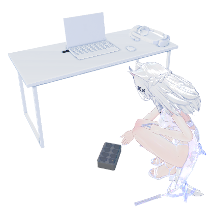

<strong style="font-size: 1.15em" class="tutorial-step-title">1. 바닥에 배치</strong> 
- 바닥에 트래커를 놓습니다 (물리적인 흔들림/움직임이 없는 위치). 
- 블리스터 트레이에 다시 넣을 필요는 없습니다.

<!-- ==================== Step 1 End ==================== -->

<!-- ==================== Step 2: Start Calibration Start ==================== -->

<strong style="font-size: 1.15em" class="tutorial-step-title">2. 캘리브레이션 시작</strong> 
- 버튼을 클릭하고 수집이 완료될 때까지 기다립니다. 
- 원리는 현실에서 전혀 흔들림이 없는 몇 초를 기록하는 것입니다.

<!-- ==================== Step 2 End ==================== -->

<!-- ==================== Step 3: Check Gyroscope Info Start ==================== -->

<strong style="font-size: 1.15em" class="tutorial-step-title">3. 자이로스코프 정보 확인</strong> 
- 완료되면 각 트래커의 자이로스코프 정보를 확인합니다. 
- 정상적인 경우 정지 상태일 때 자이로스코프의 출력 값은 0에서 ±0.05 사이여야 합니다.

<!-- ==================== Step 3 End ==================== -->

<!-- ==================== Flag Gyroscope Calibration End ==================== -->

<!-- ==================== Flag Magnetic Field Calibration Start ==================== -->

## 자기장 캘리브레이션

<!-- ==================== Step 1: Place Blister Tray Start ==================== -->

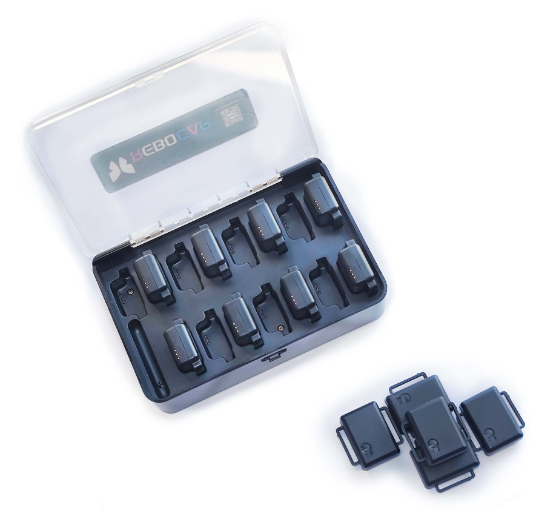

<strong style="font-size: 1.15em" class="tutorial-step-title">1. 충전 케이스에 배치</strong> 
- 각각의 슬롯 사이에 빈 슬롯을 남겨두고 충전 케이스에 트래커를 거꾸로 설치합니다. 
- 한 번에 최대 8개의 트래커를 장착할 수 있습니다. 두 번에 나누어 캘리브레이션하세요. 캘리브레이션에 참여하지 않는 트래커는 전원을 꺼야 합니다.

<!-- ==================== Step 1 End ==================== -->

<!-- ==================== Step 2: Stand in Center Start ==================== -->

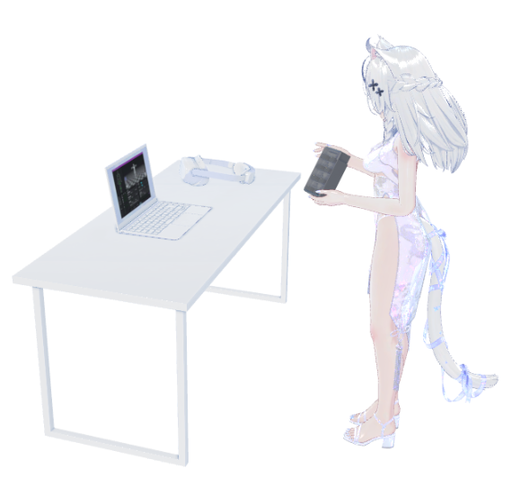

<strong style="font-size: 1.15em" class="tutorial-step-title">2. 플레이 영역 중앙에 서기</strong> 
- 팔에 안고 플레이 영역의 중앙에 서거나, 
- 컴퓨터 책상 가장자리에서 한 걸음 떨어져 서 있습니다.

<!-- ==================== Step 2 End ==================== -->

<!-- ==================== Step 3: Rotate Blister Tray Start ==================== -->

<strong style="font-size: 1.15em" class="tutorial-step-title">3. 캘리브레이션 수행</strong> 
- 소프트웨어 버튼을 클릭하고 소프트웨어에 표시된 애니메이션 순서에 따라 일정한 속도로 회전합니다. 
- (기록 프로세스는 각 측면당 두 바퀴의 데이터를 캡처합니다).

<!-- ==================== Step 3 End ==================== -->

<!-- ==================== Step 4: Check Magnetic Readings Start ==================== -->

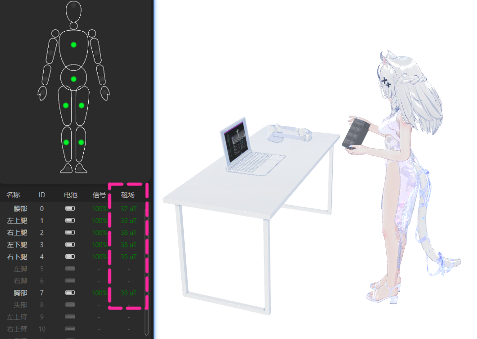

<strong style="font-size: 1.15em" class="tutorial-step-title">4. 자기장 수치 확인</strong> 
- 완료되면 손에 든 충전 케이스를 자유롭게 뒤집어보고, 
- 🔍캘리브레이션된 트래커의 자기장 수치가 일치하거나 비슷한지 확인합니다. 
- ⚠️자기장 수치가 서로 크게 다르면 자기장 캘리브레이션을 다시 수행해야 합니다.

<!-- ==================== Step 4 End ==================== -->

<!-- ==================== Dropdown Start ==================== -->

충전 케이스가 없거나 분실한 경우 어떻게 해야 하나요?

   &emsp;&emsp;스트랩을 사용하여 사각 물병이나 티슈 상자에 트래커를 2-3개씩 묶어 고정할 수 있습니다.  

<!-- ==================== Dropdown End ==================== -->

<!-- ==================== Dropdown Start ==================== -->

간단한 자기장 캘리브레이션

   &emsp;&emsp;편리한 대안입니다.  
   &emsp;&emsp;주요 동작:  
   &emsp;&emsp;기록 중 트래커를 회전시켜 가능한 많은 방향을 커버합니다(360° 전방위 뒤집기). 

   &emsp;&emsp;팁:  
   &emsp;&emsp;손목과 팔을 "8자" 모양으로 움직여 센서가 더 많은 각도에서 자기장 데이터를 캡처할 수 있도록 합니다. 

<!-- ==================== Dropdown End ==================== -->

<!-- ==================== Dropdown Start ==================== -->

이전 버전에서는 이 버튼이 보이지 않나요?

   &emsp;&emsp;이 버튼은 기본적으로 이전 버전에서는 표시되지 않으며, 
   &emsp;&emsp;버튼이 나타나도록 하려면 특정 .txt 파일을 수동으로 만들어야 합니다. 

   &emsp;&emsp;Rebocap 루트 폴더(Rebocap.exe가 있는 위치)로 이동하여  
   &emsp;&emsp;새 .txt 파일을 만들고 이름을 다음과 같이 바꿉니다. 
   &emsp;&emsp; \_simple_cal\_

   &emsp;&emsp;소프트웨어를 다시 시작하면 버튼이 나타납니다.

<!-- ==================== Dropdown End ==================== -->

<!-- ==================== Dropdown End ==================== -->

<!-- ==================== Flag Magnetic Field Calibration End ==================== -->

<!-- ============= Title ======= Run Tracker System ==================== -->
## 6 - 트래커 시스템 실행

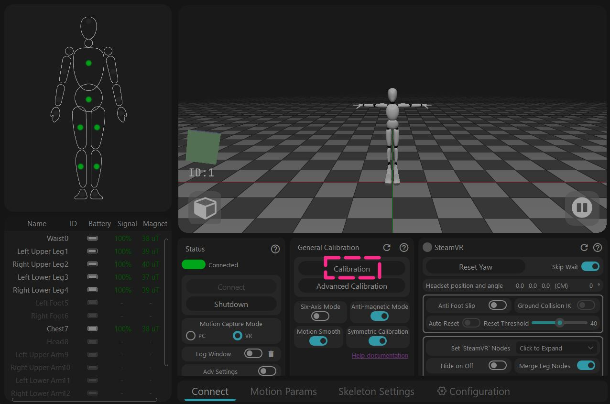

- [Calibrate] 버튼을 클릭하여 특정 자세를 기록합니다. 

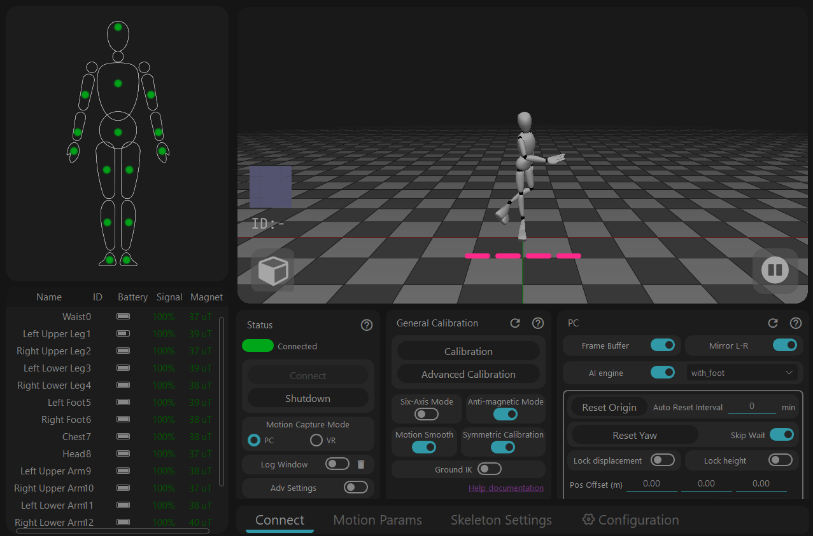

- 완료되면 3D 미리보기 뷰어에서 모션 캡처 시스템이 작동하기 시작하는 것을 볼 수 있습니다. 
  여기서부터 애니메이션 녹화, 가상 아바타 또는 VR 게임에 계속 사용할 수 있습니다.

<!-- ==================== 折叠页 开始 ==================== -->

캘리브레이션이 완료된 후 뷰어에서 작동하지 않음

   &emsp;&emsp;rebocap 소프트웨어를 재시작합니다.  
   &emsp;&emsp;이것은 보통 수신기 펌웨어 업데이트 후 소프트웨어를 재시작하지 않아 발생하며, 
   &emsp;&emsp;일부 Windows 시스템은 업데이트된 수신기를 두 번째 장치로 인식할 수 있습니다.  

<!-- ==================== 折叠页 结束 ==================== -->

<!-- ==================== 折叠页 结束 ==================== -->

<!-- ==================== Flag Calibration posture guide Start ==================== -->

## 캘리브레이션 자세 가이드

<!-- ==================== Step 1: A pose Start ==================== -->

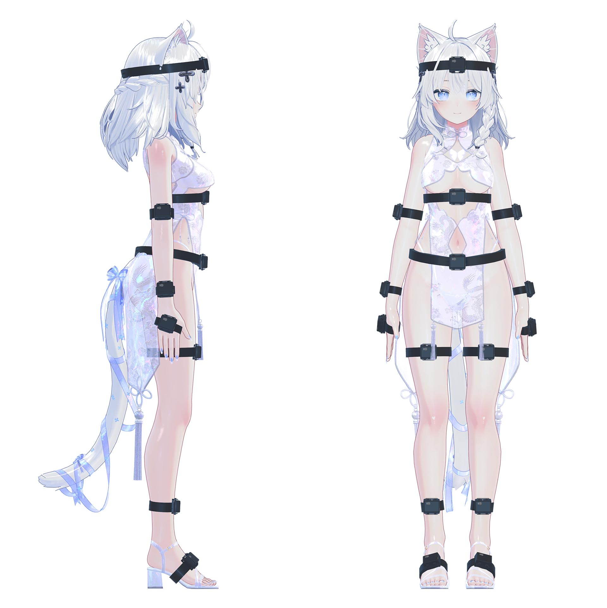

<strong style="font-size: 1.15em" class="tutorial-step-title">A 자세</strong> 
- 이미지와 유사하게 발 간격을 너무 가깝거나 넓지 않게 적절하게 유지합니다. 
- 근육에 힘을 주지 않고 자연스럽고 편안하게 서 있습니다.

<!-- ==================== Step 1 End ==================== -->

<!-- ==================== Step 2: T pose Start ==================== -->

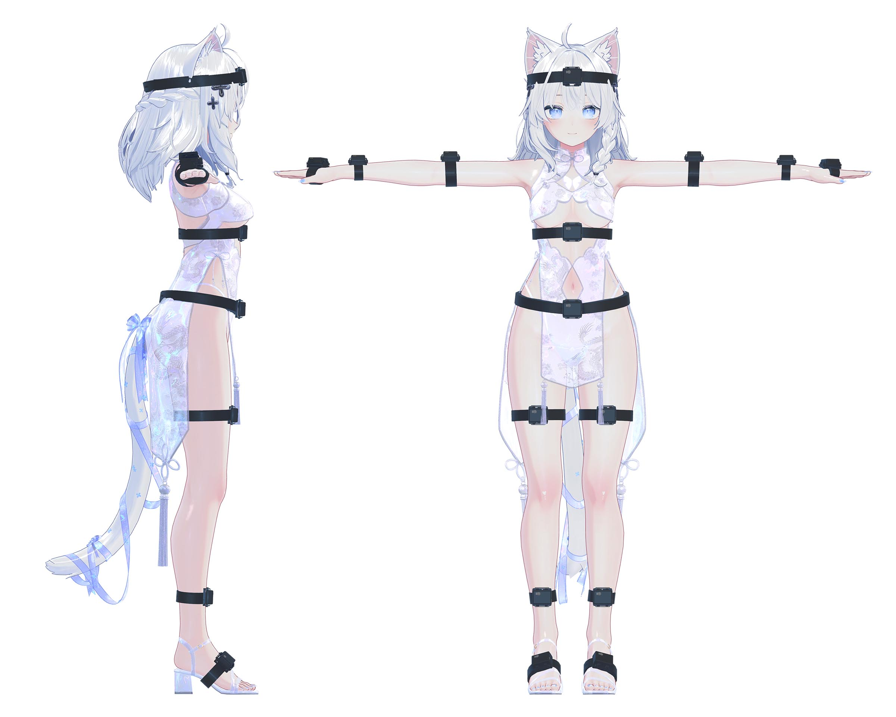

<strong style="font-size: 1.15em" class="tutorial-step-title">T 자세</strong> 
- 팔을 수평으로 폅니다. 
- 근육 기억이 손을 일직선으로 뻗는 것과 다를 때가 있으므로 눈으로 확인해 보세요.

<!-- ==================== Step 2 End ==================== -->

<!-- ==================== Step 3: S pose Start ==================== -->

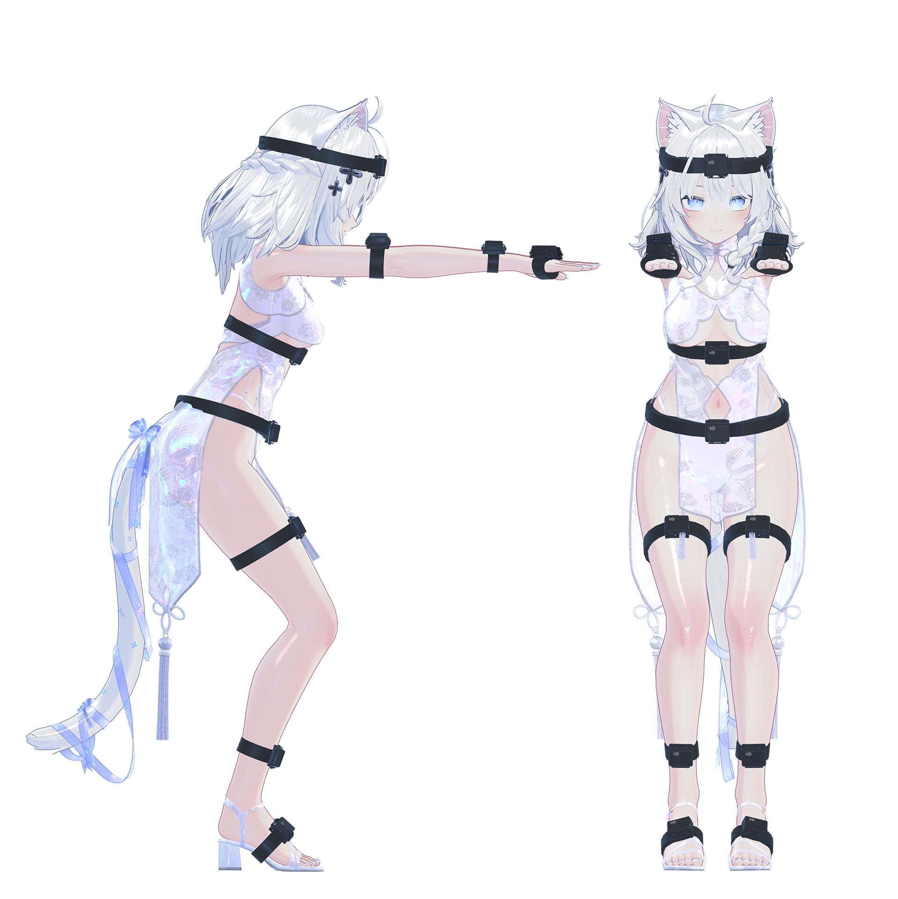

<strong style="font-size: 1.15em" class="tutorial-step-title">S 자세</strong> 
- 반 스쿼트 + 허리를 굽히고 + 머리를 숙여 트래커가 기울기 각도를 통해 신체의 정방향을 파악할 수 있도록 합니다. 
- 다리의 균형과 무릎 간격을 유지하고 팔은 평행하게 앞을 향하게 합니다. 
- 구부리는 것이 어렵거나 불명확한 경우, 고급 캘리브레이션을 사용할 수 있습니다.

<!-- ==================== Step 3 End ==================== -->

<!-- ==================== Step 4: B pose Start ==================== -->

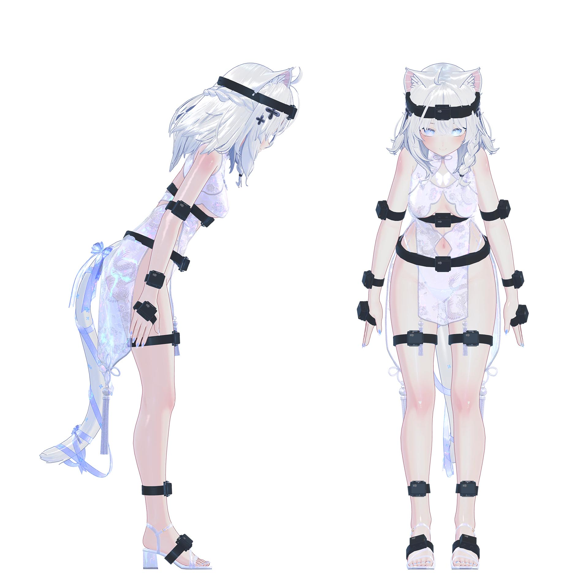

<strong style="font-size: 1.15em" class="tutorial-step-title">B 자세 (고급 캘리브레이션)</strong> 
- S 자세의 굽힘 + 머리 숙임을 분리하여 인사를 하는 별도의 움직임으로 기록합니다. 
- 이것은 S 자세로 인한 신체 왜곡을 방지합니다 (일반적으로 앉은 후에 골격 시스템이 옆으로 기울어지는 현상).

<!-- ==================== Step 4 End ==================== -->

<!-- ==================== Flag Calibration posture guide End ==================== -->

<!-- ============ Title ======== PC Mode ==================== -->
## PC 모드

<!-- ==================== Flag Software Recording Start ==================== -->

## 인앱 녹화

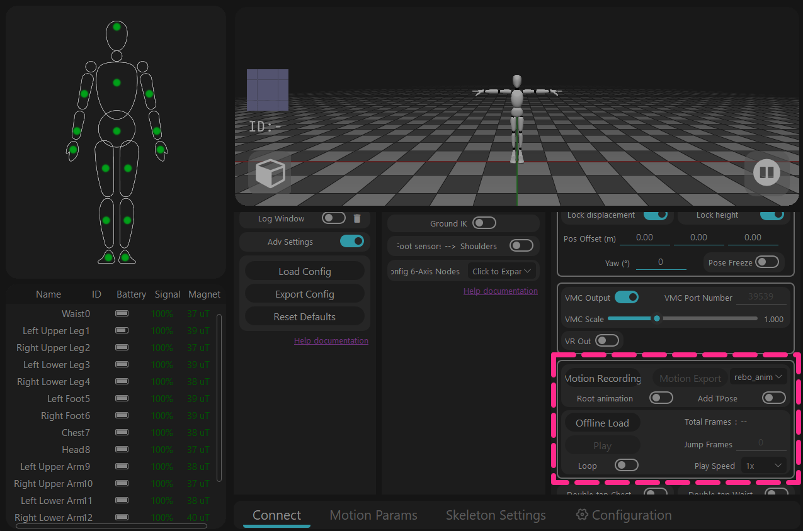

- 사용 권장 사항: 
- .rebo_anim은 소프트웨어의 기본 데이터 형식입니다. 장시간 녹화 시 백업용으로 내보내는 것을 권장하며 [Offline Playback]을 사용하여 다시 재생할 수 있습니다. 
- .bvh 파일은 한글, 한자 등의 문자가 포함된 폴더 경로에 저장할 수 없습니다. 
- 직접 저장된 fbx는 전통적인 애니메이션에 사용되는 스켈레톤 파일이며 편집 도구에서 리매핑해야 합니다. 내보낸 후 파일 오류를 방지하기 위해 대부분의 경우 [Root Animation]을 켜지 마세요.

<!-- ==================== Flag Software Recording End ==================== -->

<!-- ==================== Flag Virtual Idol (VTube) Start ==================== -->

## 버추얼 아이돌 (VTube)

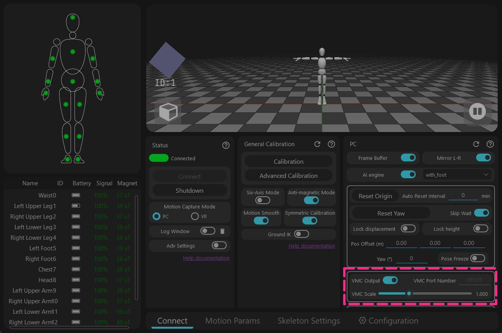

- VMirror, TikTok Live Companion, MetaVance 등과 같은 소프트웨어에는 직접 사용할 수 있는 해당 기능이 있습니다. 
- VMC 채널을 사용하여 Warudo와 같은 아이돌 소프트웨어에 연결하는 것을 지원합니다. 

<!-- ============ Redirect Buttons ==================== -->

  <a href="https://www.bilibili.com/video/BV1z7hFzfEw6/" target="_blank" class="button button--primary" style="text-decoration: none; border-radius: 6px; display: inline-block; font-weight: bold; font-size: 1.0rem; padding: 6px 18px;">
    VMirror 연결
  </a>
  <a href="https://www.bilibili.com/video/BV1fPbwzbEak" target="_blank" class="button button--primary" style="text-decoration: none; border-radius: 6px; display: inline-block; font-weight: bold; font-size: 1.0rem; padding: 6px 18px;">
    TikTok Live Companion 연결
  </a>
  <a href="https://www.bilibili.com/video/BV1fPbwzbEak" target="_blank" class="button button--primary" style="text-decoration: none; border-radius: 6px; display: inline-block; font-weight: bold; font-size: 1.0rem; padding: 6px 18px;">
    Warudo 연결
  </a>

<!-- ==================== Flag Virtual Idol (VTube) End ==================== -->

<!-- ==================== Flag Direct Plugins Start ==================== -->

## 다이렉트 플러그인

<!-- ============ Redirect Buttons ==================== -->

  <a href="https://doc.rebocap.com/en_us/plugins/blender.html" target="_blank" class="button button--primary" style="text-decoration: none; border-radius: 6px; display: inline-block; font-weight: bold; font-size: 1.0rem; padding: 6px 18px;">
    Blender 
  </a>
  <a href="https://doc.rebocap.com/en_us/plugins/ue.html" target="_blank" class="button button--primary" style="text-decoration: none; border-radius: 6px; display: inline-block; font-weight: bold; font-size: 1.0rem; padding: 6px 18px;">
    UE 
  </a>
  <a href="https://doc.rebocap.com/en_us/plugins/unity.html" target="_blank" class="button button--primary" style="text-decoration: none; border-radius: 6px; display: inline-block; font-weight: bold; font-size: 1.0rem; padding: 6px 18px;">
    Unity 
  </a>
  <a href="https://doc.rebocap.com/en_us/SDK/" target="_blank" class="button button--primary" style="text-decoration: none; border-radius: 6px; display: inline-block; font-weight: bold; font-size: 1.0rem; padding: 6px 18px;">
    SDK 
  </a>

<!-- ==================== Flag Direct Plugins End ==================== -->

<!-- ============= Title ======= VR Mode ==================== -->
## VR 모드

<!-- ==================== Flag Connection Start ==================== -->

## 연결

<!-- ==================== Step 1: Start SteamVR Start ==================== -->

<strong style="font-size: 1.15em" class="tutorial-step-title">1. SteamVR 시작</strong> 
- SteamVR을 시작합니다. 
- (SteamVR 헤드셋 = Rebocap 머리 트래커).

<!-- ==================== Step 1 End ==================== -->

<!-- ==================== Step 2: Select VR Mode and Calibrate Start ==================== -->

<strong style="font-size: 1.15em" class="tutorial-step-title">2. VR 모드 선택 및 캘리브레이션</strong> 
- Rebocap에서 [VR 모드]를 선택한 다음 "캘리브레이션"을 클릭합니다. 
- 성공적인 연결을 보장하려면 SteamVR이 실행되는 동안 캘리브레이션하십시오.

<!-- ==================== Step 2 End ==================== -->

<!-- ==================== Step 3 Start ==================== -->

<strong style="font-size: 1.15em" class="tutorial-step-title">3. SteamVR 상태 확인</strong> 
- 캘리브레이션이 완료되면 
  SteamVR 목록에서 새로 고침된 나비 로고를 볼 수 있습니다.

<!-- ==================== Step 3 End ==================== -->

- 나중에 SteamVR에 들어가려면 이 섹션의 단계를 반복하기만 하면 됩니다.
- Rebocap ID + 3 = SteamVR ID

<!-- ==================== Flag Connection End ==================== -->

<!-- ==================== Flag Tracker VR Usage Start ==================== -->

## VR 모드에서의 트래커 사용

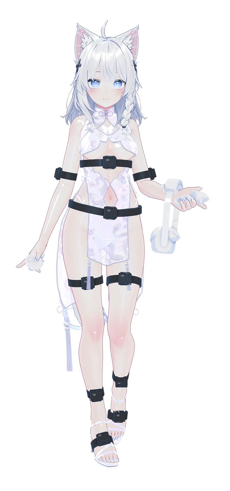

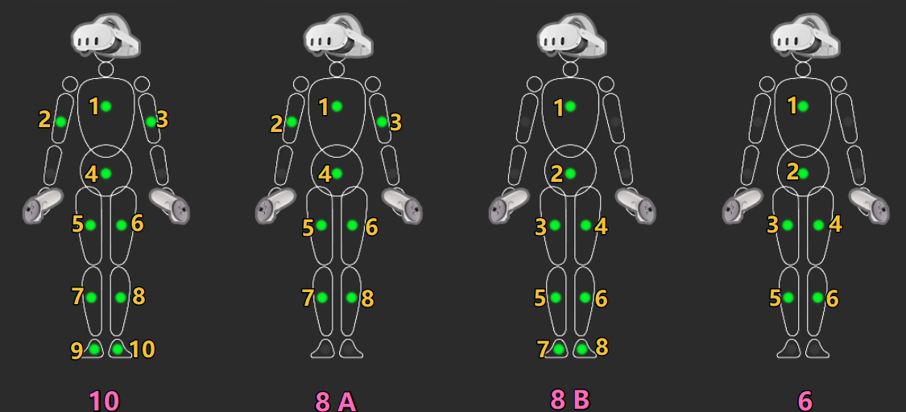

💡 VR 게임 조합에는 10, 8, 6개의 트래커 포인트 3가지 옵션이 있습니다. 발 트래커를 사용하지 않는 경우 [AI Engine]을 활성화된 상태로 유지하십시오.  
🧤 [Replace Controller Position] 또는 트래킹 장갑을 사용할 때 최대 14개의 트래커를 사용할 수 있습니다. 
💻 [VR Output] (헤드셋 좌표 시뮬레이션)을 사용할 때 최대 15개의 트래커를 사용할 수 있습니다. *(기술적인 사용자를 위한 탐구용)*

<!-- ==================== Flag Tracker VR Usage End ==================== -->

<!-- ==================== Flag VR – Calibration Posture Guide Start ==================== -->

## VR – 캘리브레이션 자세 가이드

<!-- ==================== Step 1: A pose Start ==================== -->

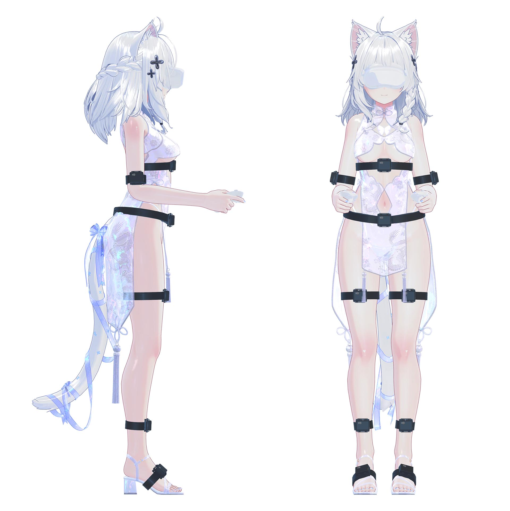

<strong style="font-size: 1.15em" class="tutorial-step-title">A 자세</strong> 
- 트래커가 컨트롤러의 자석을 캡처하는 것을 방지하기 위해 VR 컨트롤러를 위로 올립니다. 
- 이미지와 유사하게 발 간격을 너무 가깝거나 넓지 않게 적절하게 유지합니다. 
- 근육에 힘을 주지 않고 자연스럽고 편안하게 서 있습니다.

<!-- ==================== Step 1 End ==================== -->

<!-- ==================== Step 2: T pose Start ==================== -->

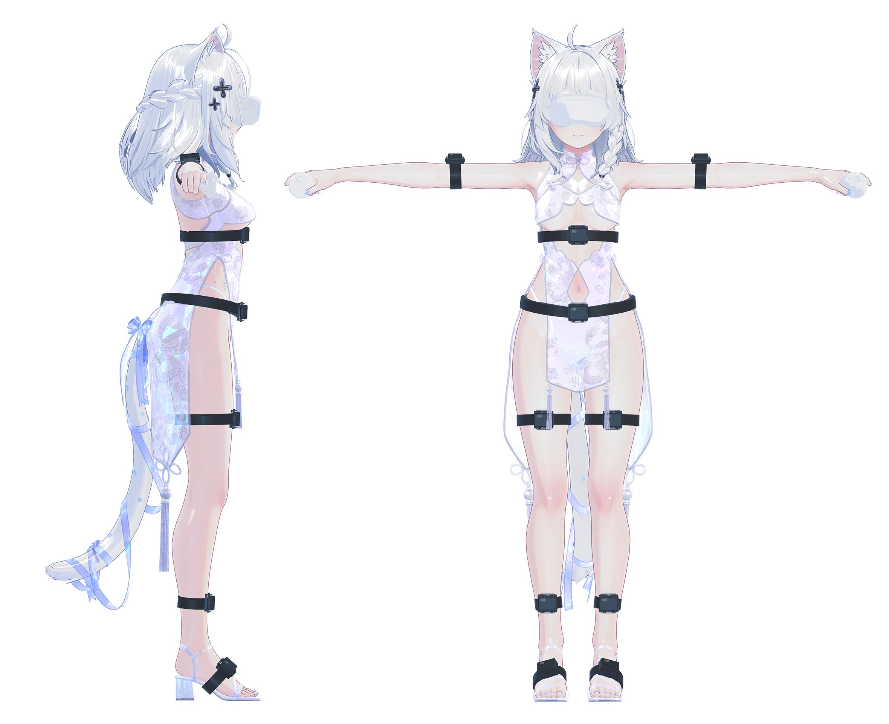

<strong style="font-size: 1.15em" class="tutorial-step-title">T 자세</strong> 
- 팔을 수평으로 넓게 폅니다. 
- 근육 기억이 손을 일직선으로 뻗는 것과 다를 때가 있으므로 눈으로 확인해 보세요.

<!-- ==================== Step 2 End ==================== -->

<!-- ==================== Step 3: S pose Start ==================== -->

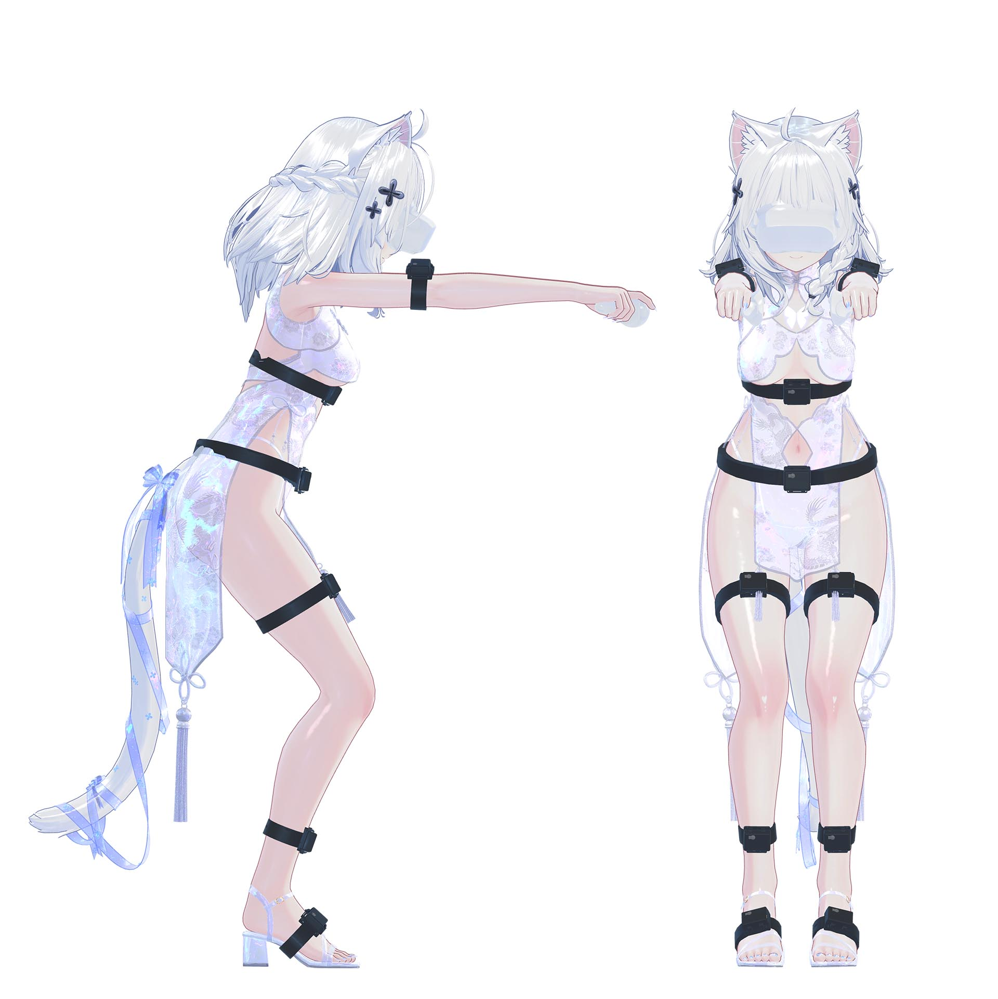

<strong style="font-size: 1.15em" class="tutorial-step-title">S 자세</strong> 
- 반 스쿼트 + 허리를 굽히고 + 머리를 숙여 트래커가 기울기 각도를 통해 신체의 정방향을 파악할 수 있도록 합니다. 
- 다리의 균형과 무릎 간격을 유지하고 팔은 평행하게 앞을 향하게 합니다. 
- 구부리는 것이 어렵거나 불명확한 경우, 고급 캘리브레이션을 사용할 수 있습니다.

<!-- ==================== Step 3 End ==================== -->

<!-- ==================== Step 4: B pose Start ==================== -->

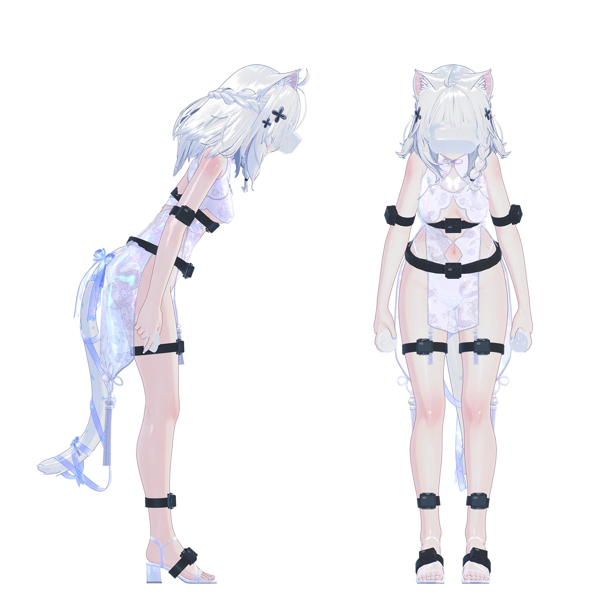

<strong style="font-size: 1.15em" class="tutorial-step-title">B 자세 (고급 캘리브레이션)</strong> 
- S 자세의 굽힘 + 머리 숙임을 분리하여 인사를 하는 별도의 움직임으로 기록합니다. 
- 이것은 S 자세로 인한 신체 왜곡을 방지합니다 (일반적으로 앉은 후에 골격 시스템이 옆으로 기울어지는 현상).

<!-- ==================== Step 4 End ==================== -->

<!-- ==================== Flag VR – Calibration Posture Guide End ==================== -->

<!-- ==================== Flag Enter game (example: VRChat) Start ==================== -->

## 게임 들어가기 (예: VRChat)

<!-- ==================== Step 1: Check SteamVR Status Start ==================== -->

<strong style="font-size: 1.15em" class="tutorial-step-title">1. SteamVR 상태 확인</strong> 
- SteamVR 목록에서 새로 고침된 나비 로고를 확인합니다. 
  트래킹 포인트 정보를 사용할 수 있으면 VRChat에 Full Body Tracking 토글이 표시됩니다.

<!-- ==================== Step 1 End ==================== -->

<!-- ==================== Step 2: Open In-game Menu Start ==================== -->

<strong style="font-size: 1.15em" class="tutorial-step-title">2. 게임 내 메뉴 열기</strong> 
- 게임 내 빠른 메뉴(Quick Menu)를 연 다음 "Calibrate"를 클릭합니다.

<!-- ==================== Step 2 End ==================== -->

<!-- ==================== Step 3: Bind Tracker Points Start ==================== -->

<strong style="font-size: 1.15em" class="tutorial-step-title">3. 트래킹 포인트 바인딩</strong> 
- 아바타의 신체에 대칭으로 트래킹 포인트를 맞춥니다. 
  아바타마다 신체 비율이 다르기 때문에 트래킹 포인트가 완벽하게 일치할 필요는 없습니다. 
- 양손의 트리거를 눌러 트래킹 포인트의 바인딩을 완료합니다.

<!-- ==================== Step 3 End ==================== -->

<!-- ==================== Flag Enter game (example: VRChat) End ==================== -->
