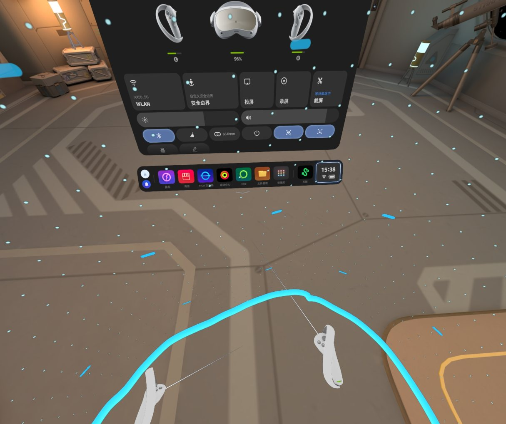
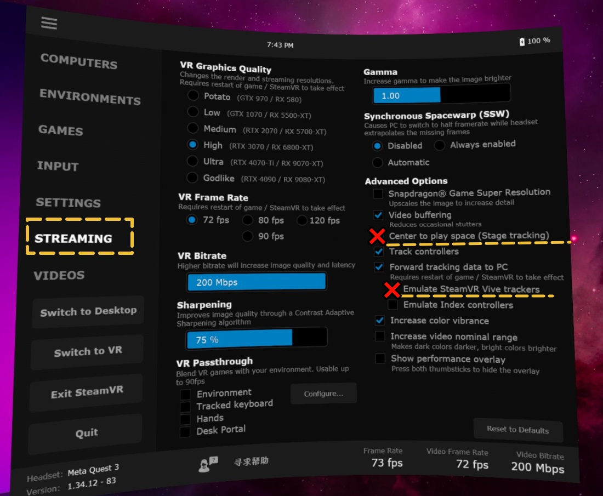
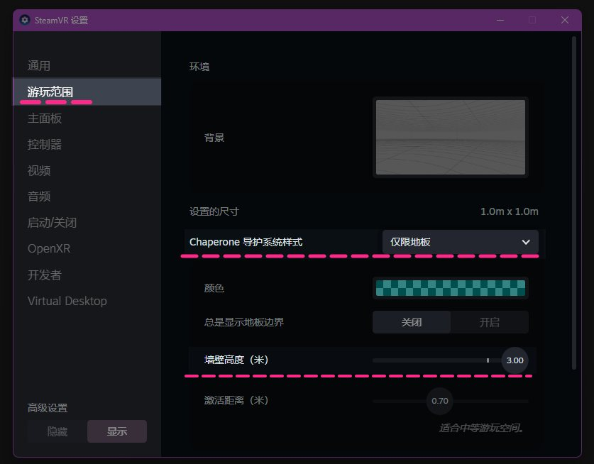
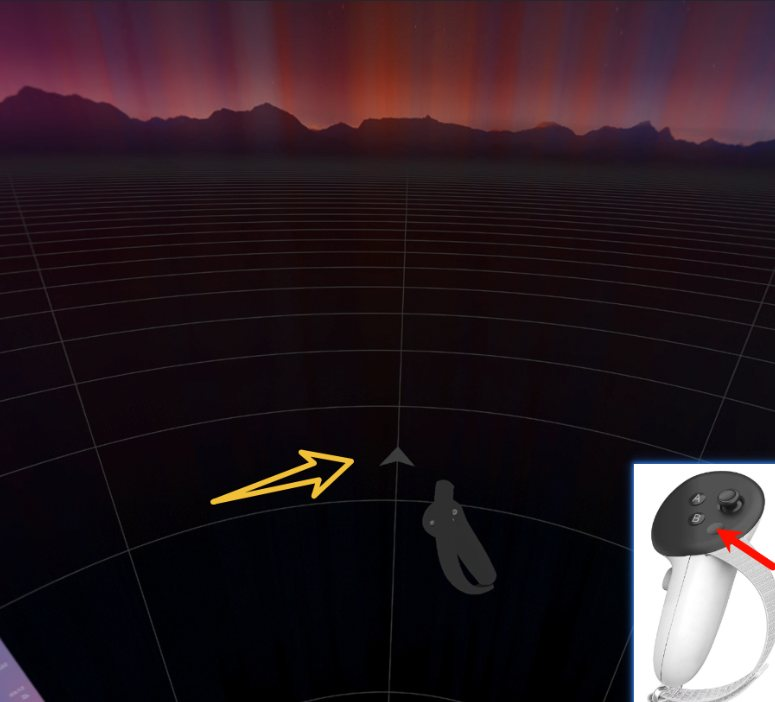
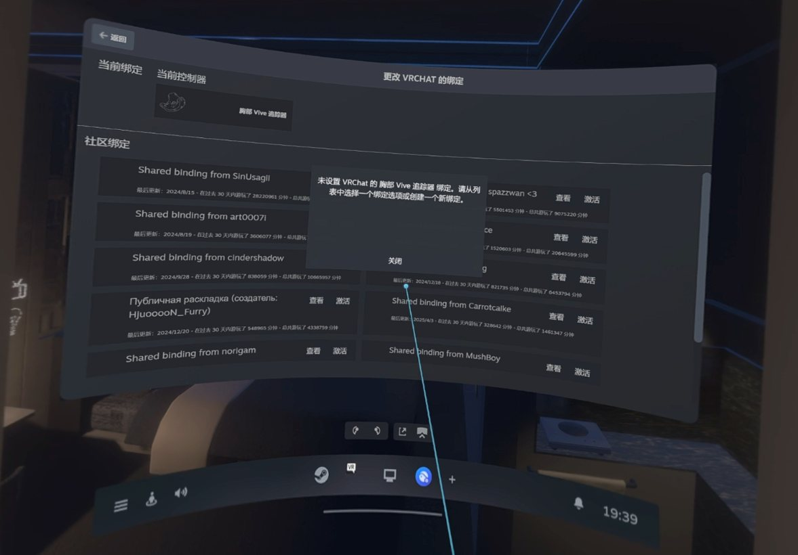
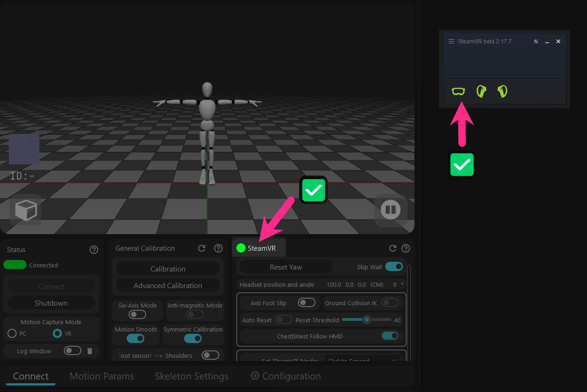

# SteamVR 가이드

SteamVR의 권장 설정 및 일반적인 문제에 대한 해결 방법입니다.

## VR 헤드셋 / 스트리밍 소프트웨어 권장 사항

### VR 헤드셋 설정 {#software-download-toc}
<h2 class="tutorial-heading-flag" style="background: #aab0ff; margin-top: 0; display: inline-block;">VR 헤드셋 설정</h2>

<!-- === 轮播图组件 代码开始 === -->

  <input type="radio" name="carousel" id="slide1" defaultChecked />
  <input type="radio" name="carousel" id="slide2" />
  
  

    

      
    

    

      <video src="/img/steamvr_guide/steamvr_windows_video.mp4" autoplay muted playsinline preload="auto"></video>
    

  

  

  
  

    

      <label for="slide2" class="arrow-left-1">&#10094;</label>
      <label for="slide1" class="arrow-left-2">&#10094;</label>
    

    

      <label for="slide1" title="Image 1"></label>
      <label for="slide2" title="Video"><svg viewBox="0 0 24 24" width="8" height="8" ><polygon points="8,4 20,12 8,20" /></svg></label>
    

    

      <label for="slide2" class="arrow-right-1">&#10095;</label>
      <label for="slide1" class="arrow-right-2">&#10095;</label>
    

  

<!-

${item1}

${CAROUSEL_HTML}

${item2}

### Virtual Desktop {#software-download-toc}
<h2 class="tutorial-heading-flag" style="background: #aab0ff; margin-top: 0; display: inline-block;">Virtual Desktop</h2>

<strong>2가지 옵션을 비활성화하는 것이 좋습니다:</strong>
 

> <strong>1 - Center to play space</strong> 
 왼쪽 컨트롤러의 홈 버튼을 두 번 클릭하여 VD 데스크톱으로 돌아갈 때, SteamVR 공간의 헤드셋이 뒤로 180° 회전하여 
보정 중 Rebocap이 잘못된 방향을 기록하게 될 수 있습니다.

> <strong>2 - Emulate SteamVR vive trackers</strong> 
 이 기능은 Quest 시스템의 AI 바디 트래킹 포인트를 SteamVR로 전달하지만, VRChat에서 트래킹 포인트 겹침 및 충돌을 일으킵니다. 
 특정 사용자 정의 트래킹 포인트만 활성화하려면 플러그인을 사용하여 구성할 수 있습니다. 
 🌐 [플러그인 GitHub 리포지토리](https://github.com/DenTechs/Virtual_Desktop_Body_Tracking_Configurator)

### SteamVR

- SteamVR 경계 비활성화 
기본 경계는 보이지 않는 벽처럼 트래킹 포인트의 최대 이동 범위를 제한합니다. 
VR 헤드셋이 2.4m 높이에서 어긋나면 누워서 다리를 들어 올릴 때 트래커가 헤드셋 높이를 초과할 수 없는 것처럼 보일 수 있습니다. 
이는 SteamVR의 기본 천장 높이가 2.4m이고 트래킹 포인트가 천장을 통과할 수 없기 때문입니다.

- VR 헤드셋 방향을 미리 가운데로 맞추기 
'오른쪽 컨트롤러 홈 버튼'을 길게 눌러 VR 헤드셋 시스템 방향을 재설정하면 
SteamVR 가상 수평선 화살표가 정면을 향하도록 재설정됩니다. 방향을 실수로 잃어버린 경우 이 기능을 사용하여 좌표계를 다시 정렬하세요.

- 게임 실행 시 프롬프트 팝업 
백그라운드에서 아무 커뮤니티 바인딩 구성이나 선택하고 
활성화한 후에는 후속 실행 시 프롬프트가 더 이상 나타나지 않습니다.

## SteamVR에 연결할 수 없음

<h2 class="tutorial-heading-flag" style="background: #aab0ff; margin-top: 0; display: inline-block;">다음 항목을 확인해 주세요:</h2>

<strong> 1 - SteamVR이 실행 중일 때 캘리브레이션을 클릭하세요.</strong> 
SteamVR이 실행되고 있지 않으면 Rebocap은 시스템에 VR이 존재하는지 감지할 수 없습니다.

  <input type="radio" name="carousel3" id="slide5" defaultChecked />
  <input type="radio" name="carousel3" id="slide6" />
  
  

    

      
    

    

      
    

  

  

  
  

    

      <label for="slide6" class="arrow-left-1">&#10094;</label>
      <label for="slide5" class="arrow-left-2">&#10094;</label>
    

    

      <label for="slide5" title="Image 1"></label>
      <label for="slide6" title="Image 2"></label>
    

    

      <label for="slide6" class="arrow-right-1">&#10095;</label>
      <label for="slide5" class="arrow-right-2">&#10095;</label>
    

  

<strong> 2 - SteamVR 드라이버를 확인하세요.</strong> 
Rebocap을 시작할 때 자동으로 확인하는 Rebocap의 [로그 창] 기록을 엽니다. 
필요한 경우 [설정] 페이지에서 드라이버를 강제로 설치할 수 있습니다.

  <input type="radio" name="carousel4" id="slide7" defaultChecked />
  <input type="radio" name="carousel4" id="slide8" />
  
  

    

      
    

    

      <video src="/img/steamvr_guide/check_steamvr_addons_video -cns.mp4" autoplay muted playsinline preload="auto"></video>
    

  

  

  
  

    

      <label for="slide8" class="arrow-left-1">&#10094;</label>
      <label for="slide7" class="arrow-left-2">&#10094;</label>
    

    

      <label for="slide7" title="Image 1"></label>
      <label for="slide8" title="Video"><svg viewBox="0 0 24 24" width="8" height="8"><polygon points="8,4 20,12 8,20" /></svg></label>
    

    

      <label for="slide8" class="arrow-right-1">&#10095;</label>
      <label for="slide7" class="arrow-right-2">&#10095;</label>
    

  

<strong> 3 - SteamVR 애드온을 확인하세요.</strong> 
SteamVR이 예기치 않게 충돌하는 경우 모든 애드온을 강제로 비활성화하는 경우가 많습니다. 
Rebocap 애드온을 다시 활성화하려면 SteamVR을 다시 시작해야 합니다.

## SteamVR 트래킹 포인트 표시 및 숨기기

<strong> 트래킹 포인트 표시 및 숨기기</strong> 
 SteamVR의 관리 메뉴에서 조작할 필요 없이 
 소프트웨어의 [ Set SteamVR Nodes ] 아래에서 트래킹 포인트 가시성을 제어합니다. 

 

참고

트래커는 SteamVR에 직접 연결되지 않습니다. 물리적 트래커는 스켈레톤 시스템을 제어하여 해당하는 트래킹 포인트를 생성하고 이를 SteamVR에 제공합니다. 
이는 해당 신체 부위에 물리적 트래커가 없더라도 트래킹 포인트를 여전히 SteamVR에 제공할 수 있음을 의미합니다.

## 트래킹 포인트는 설정되었지만 게임에서 발과 허리를 인식하지 못함

- 일부 게임은 트래킹을 식별하기 위해 OpenVR 환경을 사용하지만, 현재 Rebocap Release에 포함된 드라이버에는 트래커를 인식하지 못하는 버그가 있어 SteamVR 설정에서 수정해도 인식할 수 없습니다.

이 버그는 향후 업데이트에서 팀에 의해 수정될 예정입니다.
