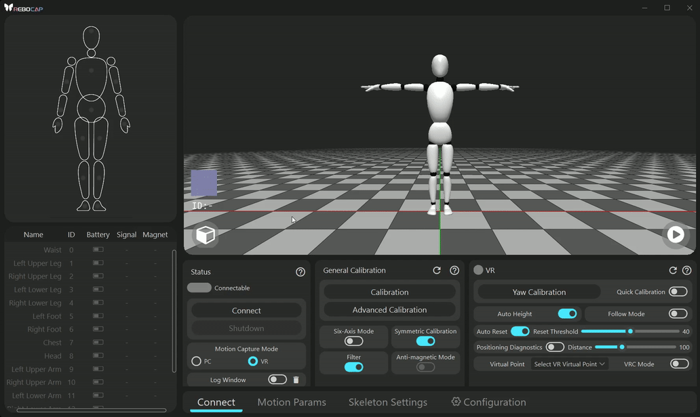
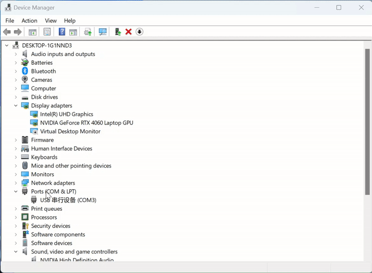

# 연결 가이드
1. 연결하려는 트래커의 전원을 켭니다.
   > 지원되는 트래커 조합 모드는 [이전 장](instroction_for_straps#follow_mode)에서 확인할 수 있습니다.
2. 리시버를 컴퓨터의 USB 포트에 삽입합니다.
3. Rebocap 소프트웨어를 열고 연결을 클릭합니다.

### 연결 실패 이유 및 해결 방법

연결 실패 또는 데이터 전송 실패의 구체적인 이유를 보려면 여기를 클릭하여 펼치세요

* USB 포트에 문제가 있을 수 있습니다. 예를 들어, 일부 사용자의 컴퓨터 USB 포트에 먼지가 쌓여 연결이 불안정해질 수 있습니다.
> USB 포트를 변경하거나 뽑았다가 다시 꽂아보세요.
* `Rebocap` 클라이언트가 이미 실행 중이어서 포트를 점유하고 있거나 다른 프로그램이 포트를 사용하고 있을 수 있습니다.
> `Connect` 버튼을 클릭할 수 있지만 연결에 실패하는 증상이 나타납니다. 이때 다른 `Rebocap` 클라이언트가 완전히 닫혀 있는지 확인하고, 리시버를 뽑았다가 다시 꽂는 것이 좋습니다. 또한 작업 관리자에서 다른 `Rebocap` 프로세스가 있는지 확인하고 발견되면 강제로 종료하세요.
* 직렬 포트가 제대로 작동하는지, 다른 가상 직렬 포트 소프트웨어가 설치되어 있지 않은지 확인하세요. 일부 사용자는 가상 직렬 포트 장치를 설치한 후 드라이버 오류를 경험할 수 있습니다.
> 예를 들어, `com0com` 드라이버가 설치된 경우 이를 제거한 다음 리시버를 뽑았다가 다시 꽂아야 합니다.
* 드라이버가 교체되지 않았는지 확인하세요. 아래 이미지에 표시된 단계에 따라 리시버의 직렬 포트 드라이버를 롤백할 수 있습니다. 여전히 연결할 수 없으면 리시버를 뽑았다가 다시 꽂습니다.
  > 연결 후 보정을 수행할 수 없고 RGB 조명 색상을 변경할 수 없는 경우, 드라이버를 롤백해 볼 수도 있습니다.

    

### 연결 후 신호가 약하거나 불안정함
* 데스크톱 컴퓨터를 사용하는 경우 리시버를 섀시 뒤에 두지 마십시오.
* 리시버 옆에 5cm 이상의 빈 공간을 유지하도록 하세요. 예를 들어, 리시버 옆에 USB 드라이브를 삽입하지 마세요. 가능한 경우 연장 케이블을 사용하면 신호를 개선하는 데 도움이 될 수 있습니다.

# 보정
착용 지침은 아래 이미지를 참조하세요. 구체적인 착용 위치는 사람마다 다릅니다. 원리 및 자세한 내용은 [이전 장](instroction_for_straps#tracker_position_recomendation)을 참조하세요.

:::info 처음 사용할 때는 반드시 15개 포인트를 테스트하세요.

테스트 결과가 좋지 않은 경우 다음과 같은 이유가 있을 수 있습니다:
1. 자기장 문제; 구체적인 해결 방법은 [여기 참조](../QA/magnet)하세요.
2. 자이로스코프 보정이 필요할 수 있습니다; [여기 참조](../ui_help_doc/control/config#gyrocalibrate)하세요.
3. 착용 및 당김 문제; [주의 깊게 읽고 여기 참조](instroction_for_straps#tracker_position_on_body)하세요.

:::

### 포즈 보정
소프트웨어 인터페이스에서 포즈 보정(Pose Calibration) 버튼을 클릭합니다. 포즈 보정 참조는 아래 이미지와 같으며, 소프트웨어에 해당 이미지 프롬프트가 있습니다. 모든 핵심 포인트와 동작 사양을 반드시 읽으세요.

- **보정 핵심 포인트**
  * 포즈 보정을 클릭한 후 즉시 A-Pose 자세를 취하고 가만히 있습니다.
    > 시스템은 클릭 후 2초부터 사용자가 정지해 있는지 감지하기 시작합니다. 앞뒤로 흔들리는 진폭을 제어하고, 각 센서의 초기화를 완료하기 위해 움직임을 최대한 최소화하세요. 감지 시간은 10초이며, 마지막 2초 동안 정지해 있었다고 감지되면 즉시 보정 프로그램으로 들어갑니다.
  * 각 동작에 대한 빠른 신호음이 울리는 동안 시스템은 해당 포즈 데이터를 기록합니다.
    > 빠른 신호음이 울리는 동안에는 반드시 정지 상태를 유지하세요. 빠른 신호음이 끝난 후 1초 뒤에 동작을 전환하는 것이 좋습니다.
  * 동작을 전환한 후 정지 상태를 유지하고 빠른 신호음이 울릴 때까지 기다리세요. 동작 전환 과정은 2초 내에 완료하는 것이 좋습니다.
  * 동작 전환 과정 중에는 발을 움직이지 마세요.
    > 보정 중에는 두 발이 어떠한 움직임도 없이 엄격하게 정지 상태를 유지해야 합니다.

- **동작 사양**
  * **A-Pose**
    
    두 다리는 수직이고 최대한 평행해야 하며, 발 사이에는 주먹 하나 정도의 간격을 둡니다. 두 팔은 구부리지 않고 아래로 곧게 뻗고, 손바닥은 몸 쪽을 향하게 하며, 등은 곧게 펴고 정면을 바라봅니다.
    > 보정 후 발이 닫혀 있고 가상 캐릭터의 발이 교차되어 있다고 느껴지면 보정 중에 발 사이의 거리를 줄이세요.
    > 
    > 보정 후 발이 닫혀 있고 가상 캐릭터의 발 거리가 너무 멀다고 느껴지면 보정 중에 발 사이의 거리를 늘리세요.
  * **T-Pose**
    
    두 다리는 A-Pose와 일관되게 유지하고, 두 팔은 밖으로 뻗어 어깨와 일직선이 되도록 하며, 두 손은 일직선으로 손바닥이 아래를 향하도록 합니다.
  * **S-Pose**
    
    두 다리는 앞으로 약 30도 정도 약간 구부리되 과도하게 구부리지 않습니다. 두 팔은 앞으로 뻗어 상체와 수직, 어깨와 평행하게 하고 두 팔은 평행을 이뤄야 합니다.
    > 팔에 트래커를 착용하지 않은 경우 팔의 움직임은 무시할 수 있습니다.
  * **B-Pose**
    
    상체를 앞으로 30도 구부리며, 손의 움직임은 고려할 필요가 없습니다.
    > B-Pose는 Blend-Pose의 약자로, 주로 허리, 가슴, 머리 트래커의 방향(heading) 각도를 보정하는 데 사용됩니다.

왼쪽부터 오른쪽으로 이미지는 다음과 같습니다: `APose` `TPose` `SPose` `BPose`

# 소프트웨어 연동
### SteamVr 연동 [[여기 참조](../third_party_software_access/steamvr/README)]
- VRChat 연동 [[여기 참조](../third_party_software_access/steamvr/vrchat)]
- 커뮤니티 연동 튜토리얼 [https://kdocs.cn/l/cbZLGg2QeEHk](https://kdocs.cn/l/cbZLGg2QeEHk)，링크에 접속할 수 없는 경우 <a href="/img/files/RebocapVRchatTutorialEnglish.pdf"  target="_blank" download="RebocapVRchatTutorialEnglish.pdf">PDF 파일을 다운로드</a>하여 확인하세요 (오프라인 파일은 즉시 업데이트되지 않을 수 있습니다).

### VMC 프로토콜 사용자 연동 [[여기 참조](../third_party_software_access/VMC/README)]
- warudo 연동 [[여기 참조](../third_party_software_access/VMC/warudo)]

# 필수 확인 항목
사용 중 발생할 수 있는 여러 가지 문제(예: 트래커가 알 수 없는 이유로 기울어짐)를 방지하고 더 나은 모션 캡처 경험을 보장하기 위해 다음 지침을 반드시 읽어주세요.

### 하드웨어 보정
- [자기장 보정](../ui_help_doc/control/config#magnetcalibrate)
- [자이로스코프 보정](../ui_help_doc/control/config#gyrocalibrate)

### 소프트웨어에서 모션 캡처 구성 설정 방법
- 자기장 구성은 [자기장 관련 지침](../QA/magnet)을 읽어보세요.
- 기타 구성은 각 구성 패널의 우측 상단에 있는 물음표 아이콘을 클릭하여 확인할 수 있습니다.

### 스트랩을 묶는 최선의 방법
[이전 섹션](instroction_for_straps)을 건너뛰었다면 여유 시간에 읽어보거나 문제가 발생하면 반드시 주의 깊게 읽어보시기 바랍니다.

:::info 중요 포인트 재강조

여기서 발바닥 트래커의 바인딩 방법이 매우 중요하다는 것을 다시 한 번 강조합니다. 스트랩과 바닥 사이의 마찰로 인해 트래커가 영향을 받아 전체적인 모션 캡처 효과에 영향을 미치는 것을 방지하기 위해 스트랩을 사용하지 않도록 노력하세요. 자세한 내용은 이전 섹션을 참조하세요.

:::

                     