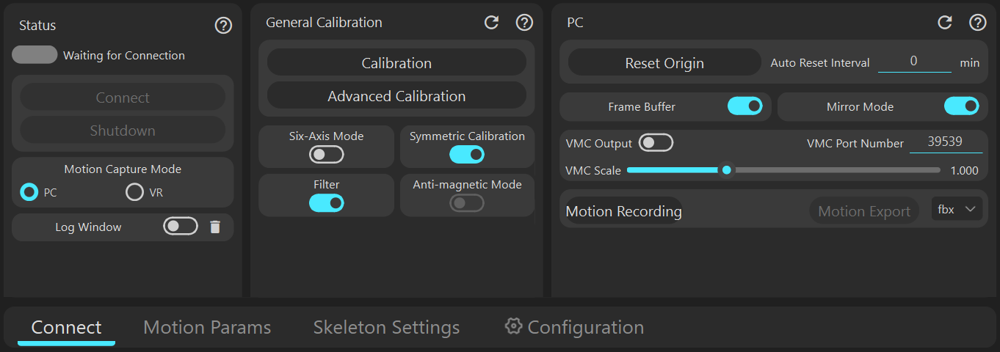
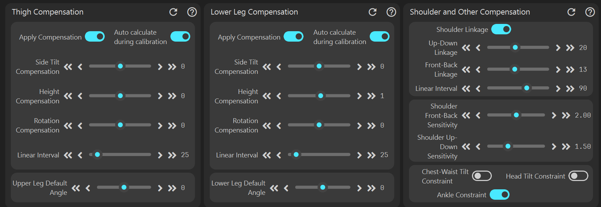
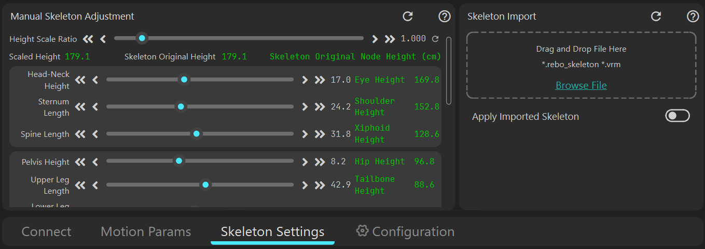
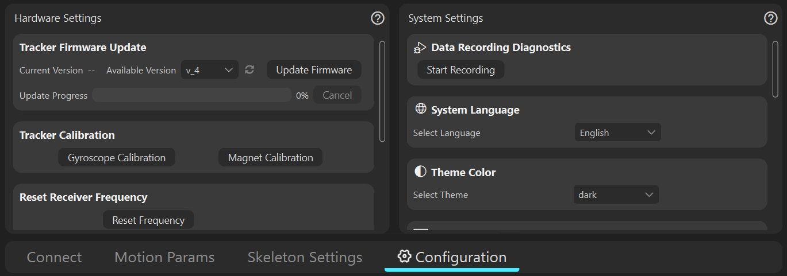

# [Панель подключения](connect)

[Нажмите, чтобы просмотреть детали](connect)

# [Панель параметров захвата движения](cap_param)

[Нажмите, чтобы просмотреть детали](cap_param)

# [Панель настройки скелета](skeleton_setting)

[Нажмите, чтобы просмотреть детали](skeleton_setting)

# [Панель настроек](config)

[Нажмите, чтобы просмотреть детали](config)

                     