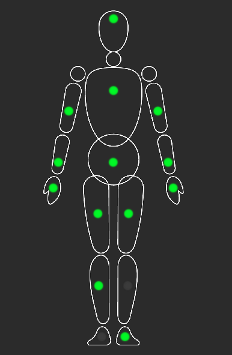
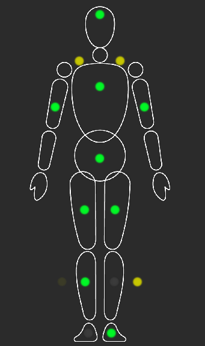

# Обзор датчиков

Как показано на рисунке ниже, зеленый цвет указывает на то, что датчик подключен к соответствующему суставу, в то время как серый указывает на то, что он не подключен. Левая сторона изображения представляет левую сторону человеческого тела; например, на изображении ниже датчик на левой ноге не подключен, и датчик на левой голени также не подключен.

## Функция замены датчика
Здесь вы можете перетаскивать точки датчиков для реорганизации датчиков.

:::warning После замены, если не активировано, это приведет к сбою калибровки

Многие пользователи случайно перетаскивают датчики, например, перетаскивая левую руку на левую верхнюю часть ноги, но если левая рука не активирована во время калибровки, появится сообщение об ошибке калибровки, потому что левая верхняя часть ноги не активирована!!! 
После перетаскивания замененные точки не будут эффективными независимо от того, активированы они или нет.

:::

### Демонстрация перетаскивания
> Нажмите и удерживайте левую кнопку мыши на узле, затем перетащите его в целевую позицию.

<video id="video" controls autoplay loop preload="metadata" width="35%">
      <source id="mp4" src="/img/remap_config.mp4" type="video/mp4" />
</video>

### Точки, которые могут заменить другие части тела
   * Левая рука   (Узел 13)
   * Правая рука   (Узел 14)
   * Левое предплечье (Узел 11)
   * Правое предплечье (Узел 12)

### Детали, которые можно заменить
   Все

### Специальная функция
   * Заменить положением плеча
    > Если вы хотите, чтобы область плеч была более гибкой, вы можете заменить ее положением плеч, но это требует более высоких требований к ремням, которые необходимо решить самостоятельно.

### Пример замены
Как показано на рисунке ниже, все четыре точки левой и правой руки были заменены, заменяя следующие части:
* Левое плечо
* Правое плечо
* Левая голень
  > Левая голень не была активирована после замены, поэтому произойдет сбой калибровки!!!
* Правая голень

                     