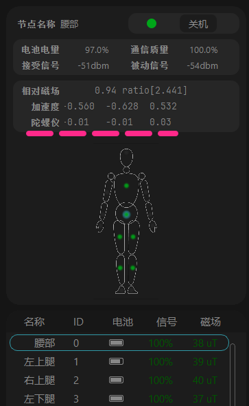
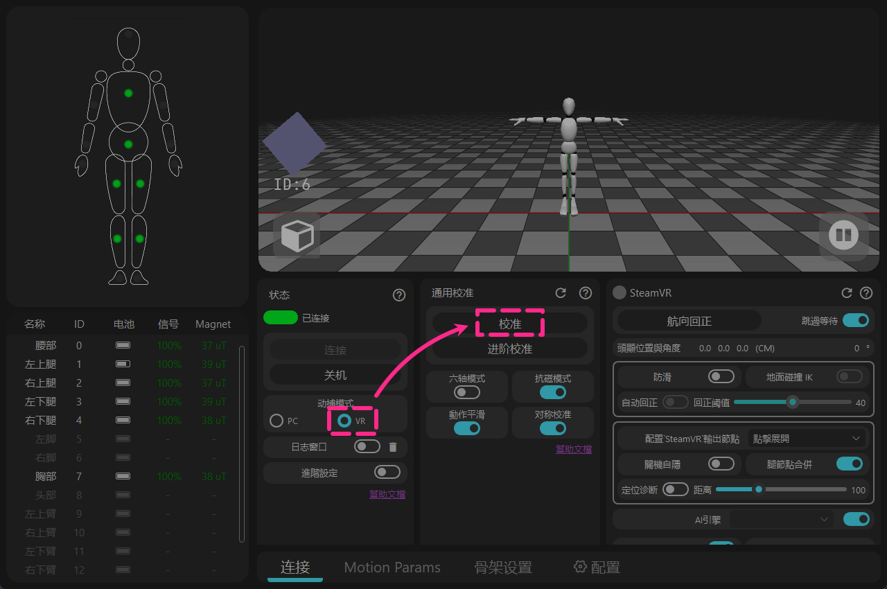

# 15 追踪器套装 - 开箱到使用

<!-- ============ 标题 ======== 检查包裹内容 ==================== -->
## 1 - 检查包裹内容

* **抽屉彩盒**(⚠️ 请勿丢弃)  
* **追踪器** x 15 
 **USB 接收器** x 1 
* **充电盒** x 1 
 **电源适配器** x 1（输出12v 2a）

* **收纳网袋** x 1 
**弹性绑带** x 15（2.5cm宽度）
 

* **附赠品** 
 自粘标识贴纸 
 卷尺 
 USB延长线

* **选购配件** 
 快拆底座 x 15 （国际版为标配，大陆版为选购配件） 
 宽绑带 x 11（5cm宽度，不含手掌和脚,与原窄绑带自由搭配）

<!-- ============= 标题 ======= 安装绑带 ==================== -->
## 2 - 安装绑带

<!-- 方式 A - 直接安装 -->

## 方式 A - 直接安装

  <video id="video" controls loop preload="metadata" width="60%">
    <source id="mp4" src="/zh-Hans/img/tracker_normal.mp4" type="video/mp4" />
  </video>

- 不推荐该安装方式，长期受力易导致材质老化、开裂， 
通常作为备用方式。

<!-- 方式 B - 使用快拆底座 -->

## 方式 B - 使用快拆底座

- 将快拆底座安装在绑带上，确保绑带从底座下方穿过。

  <video id="video" controls loop preload="metadata" width="60%">
    <source id="mp4" src="/zh-Hans/img/kuaichai_normal.mp4" type="video/mp4" />
  </video>

- 快拆底座的安装视频

- 粘上魔术贴后，向两侧拉扯一下，使钩面完全嵌入毛面，防止脱落。

- 追踪器拆装技巧， 
从一侧撬开能更容易地直接将追踪器从快拆底座上取下。

<!-- 方式 C - 使用宽绑带 -->

## 方式 C - 使用宽绑带

- 宽绑带的一端自带有魔术贴，把追踪器或者快拆底座装在上面， 
盒子中额外的单片魔术贴作为备用。

  <a href="/zh-Hans/docs/tutorial/instroction_for_straps" class="button button--primary" style="text-decoration: none; border-radius: 6px; display: inline-block; font-weight: bold; font-size: 1.0rem; padding: 6px 18px;">
    更多绑带的安装指南 → 📖
  </a>

<!-- ============ 标题 ======== 穿戴在身上的位置 ==================== -->
## 3 - 穿戴在身上的位置

<!-- ==================== 左右分栏图文排版 开始 ==================== -->

<!-- 左侧分栏：放人物模型图 -->

<!-- 右侧分栏：放文字说明 -->

<!-- 第一组：围度数据 -->

<strong>胸部/腰部:</strong> 100 cm 
<strong>头/大腿:</strong> 60 cm 
<strong>大臂/小腿/脚:</strong> 40 cm 
<strong>手掌/小臂：</strong> 25cm

<!-- 第三组：身体差异性调整 -->

<strong>身体差异性调整：</strong> 
请参考图片中所示的穿戴位置， 
推荐 胸部/腰部追踪器放置在后背， 
腿部追踪器可以放置在侧面。

<!-- 第四组：避开区域提示 -->

<strong>提示：</strong> 
保持追踪器按键朝上。 
 
请勿将腰部追踪器放置在肚脐处以防被挤压， 
腿部追踪器应避开肌肉隆起成斜坡的区域。 
请勿将大腿追踪器放得太靠近膝盖。 

<!-- 第四组：vr差异性调整 -->

<strong>注：</strong> VR模式穿戴有些差异， 
但建议先按此检查所有追踪器是否正常工作。

<!-- 第五组：底部小图与文字上下排版 -->

追踪器背面贴有 ID 编号， 
出厂已绑定编号与位置。 
只有小臂和手掌4个追踪器可以通过软件替换位置， 
其他追踪器不能替换位置。

<!-- ==================== 左右分栏图文排版 结束 ==================== -->

<!-- ============= 标题 ======= 安装软件 和 检查固件更新 ==================== -->

## 4 - 安装软件与检查固件更新

<!-- ==================== 旗帜 A：Install software 开始 ==================== -->

## A - 安装软件

🌐下载链接 → [https://doc.rebocap.com/en\_US/tutorial/software\_install.html](https://doc.rebocap.com/en_US/tutorial/software_install.html)

- 版本选择：\
  V01 - 适合磁场稳定的环境，适用于跳舞。 
  V02 Beta02 - 默认开关针对6追踪器套装优化，并采用全新算法可以主动判断强干扰源，甚至在弹簧床上保持朝向。

- 推荐安装在非系统盘（不要装在 C 盘）。

<!-- ==================== 旗帜 A：Install software 结束 ==================== -->

<!-- ==================== 旗帜 B：Connect to computer 开始 ==================== -->

## B - 连接电脑

<!-- ==================== 步骤 1：连接接收器 开始 ==================== -->

<strong style="font-size: 1.15em" class="tutorial-step-title">1. 连接接收器</strong> 
- 将 USB 接收器插入电脑，选择一个周围开阔的接口。 
- 或使用附赠的USB延长线外接。(市面通用的USB3.0数据线) 
- 如果追踪器信号不能维持在100%，则将接收器更换位置。

<!-- ==================== 步骤 1 结束 ==================== -->

<!-- ==================== 步骤 2：软件连接 开始 ==================== -->

<strong style="font-size: 1.15em" class="tutorial-step-title">2. 软件连接</strong> 
- 在软件中点击“连接”（Beta02 版本后将自动连接）。

<!-- ==================== 步骤 2 结束 ==================== -->

<!-- ==================== 步骤 3：开启追踪器 开始 ==================== -->

<strong style="font-size: 1.15em" class="tutorial-step-title">3. 开启追踪器</strong> 
- 按下追踪器按钮开机。 
- 注意：追踪器是通过软件关机的。

<!-- ==================== 步骤 3 结束 ==================== -->

<!-- ==================== 旗帜 B：Connect to computer 结束 ==================== -->

<!-- ==================== 旗帜 C：Check firmware 开始 ==================== -->

## C - 检查固件

<!-- ====================  检查固件 开始 ==================== -->

<strong style="font-size: 1.15em" class="tutorial-step-title">检查 [追踪器与接收器] 固件</strong> 
- 升级至选项中的最高可用版本， 
- 该版本将随未来的软件更新而改变。 
- 固件附属在软件安装包中，不是联网更新的。

<!-- ====================  检查固件 结束 ==================== -->

<!-- ==================== 折叠页 开始 ==================== -->

 查看软件对应支持的固件版本。

   &emsp;&emsp; 部分固件版本有重大算法变更，与旧版软件不兼容。   

   &emsp;&emsp; 当切换回旧版软件时，需要相应地降级固件。  

   &emsp;&emsp;&emsp; release_v01 - ◼️tracker : V6 / V7  ,  📡receiver : V6 / V7   

   &emsp;&emsp;&emsp; release_v02 beta02 - ◼️tracker : V15  ,  📡receiver : V6 / V7   

   &emsp;&emsp;&emsp; (未公开) release_v02 beta02.1 - ◼️tracker : V16  ,  📡receiver : V8   

<!-- ==================== 折叠页 结束 ==================== -->

- 打开日志窗口以查看每个追踪器的实际固件版本   
（日志窗口位于软件中的“连接与关机”下方）。

- 追踪器是通过无线 📶 进行更新的 — 无需使用 USB 数据线。  
🚫 请勿同时更新追踪器和接收器。  
如果追踪器更新失败，考虑关机一半的追踪器来稳定数据上传的稳定，在日志中固件版本正确的追踪器可以保持关机。

- 如果更新失败，需要重启追踪器并再次点击更新。  
&emsp;&emsp;🟩绿灯 – 快闪：追踪器工作正常  
&emsp;&emsp;🟩绿灯 – 慢闪：追踪器正在等待接收器信号  
&emsp;&emsp;🟦蓝灯：追踪器正在接收固件数据  
&emsp;&emsp;🟨黄灯：更新失败（手动按下 🔘 按钮重启，然后重新更新）  
&emsp;&emsp;⬜白色：更新成功（通常在 10s 后自动重启，如果无法自动重启需要手动重启）  

- 当 📡接收器更新完成后，断开并重新插入 USB，然后 🔄重启软件。

<!-- ==================== 旗帜 C：Check firmware 结束 ==================== -->

<!-- ============= 标题 ======= 校正追踪器初始数据 ==================== -->
## 5 - 校正追踪器初始数据

<!-- ==================== 旗帜 Gyroscope Calibrate 开始 ==================== -->

## 陀螺仪校准
<!-- ==================== 步骤 1：放置追踪器 开始 ==================== -->

<strong style="font-size: 1.15em" class="tutorial-step-title">1. 放置在地面上</strong> 
- 将追踪器放置在地面上（处于没有物理晃动/移动的位置）。 
- 无需放回充电盒里。

<!-- ==================== 步骤 1 结束 ==================== -->

<!-- ==================== 步骤 2：启动采集 开始 ==================== -->

<strong style="font-size: 1.15em" class="tutorial-step-title">2. 开始校准</strong> 
- 点击按钮，等待采集完成。 
- 原理为录制几秒在现实没有任何晃动的记录。

<!-- ==================== 步骤 2 结束 ==================== -->

<!-- ==================== 步骤 3：检查陀螺仪信息 开始 ==================== -->

<strong style="font-size: 1.15em" class="tutorial-step-title">3. 检查陀螺仪信息</strong> 
- 完成后，检查每个追踪器的陀螺仪信息。 
- 通常情况下，静止时陀螺仪的输出值应在 0 至 ±0.05 之间。

<!-- ==================== 步骤 3 结束 ==================== -->

<!-- ==================== 旗帜 Gyroscope Calibrate 结束 ==================== -->

<!-- ==================== 旗帜 Magnet Calibrate 开始 ==================== -->

## 磁场校准

<!-- ==================== 步骤 1：放置吸塑盘 开始 ==================== -->

<strong style="font-size: 1.15em" class="tutorial-step-title">1. 放入吸塑盘中</strong> 
- 将追踪器按一致方向放入吸塑盘中。 
- （如果觉得拿持不便，可将吸塑盘放回纸盒内）。

<!-- ==================== 步骤 1 结束 ==================== -->

<!-- ==================== 步骤 2：站在中心 开始 ==================== -->

<strong style="font-size: 1.15em" class="tutorial-step-title">2. 站在游玩区域中心</strong> 
- 抱在怀里，站在游玩区域的中心， 
- 或者距离电脑桌边缘一步的距离。

<!-- ==================== 步骤 2 结束 ==================== -->

<!-- ==================== 步骤 3：旋转吸塑盘 开始 ==================== -->

<strong style="font-size: 1.15em" class="tutorial-step-title">3. 旋转吸塑盘</strong> 
- 点击软件按钮，跟随软件显示的动画旋转吸塑盘。 
- (每换一面旋转两圈)。

<!-- ==================== 步骤 3 结束 ==================== -->

<!-- ==================== 步骤 4：检查磁场读数 开始 ==================== -->

<strong style="font-size: 1.15em" class="tutorial-step-title">4. 检查磁场读数</strong> 
- 完成后，在手中随意翻转吸塑盘， 
- 🔍检查校准后的追踪器磁场读数是否一致或相近， 
- ⚠️如果磁场读数各自差异很大，那么需要再次执行磁场校准。

<!-- ==================== 步骤 4 结束 ==================== -->

<!-- ==================== 折叠页 开始 ==================== -->

如果没有携带充电盒怎么办？

   &emsp;&emsp;可以使用绑带把追踪器固定在方形水瓶或纸巾盒上，  
   &emsp;&emsp; 以 2-3 个为一组。 

<!-- ==================== 折叠页 结束 ==================== -->

<!-- ==================== 折叠页 开始 ==================== -->

简易磁场校准

   &emsp;&emsp;作为一种便利的备选方案。   
   &emsp;&emsp;主要动作：  
   &emsp;&emsp;在记录期间旋转追踪器，覆盖尽可能多的方向（360° 全方位翻转）。 

   &emsp;&emsp;提示：  
   &emsp;&emsp;以“8”字形移动手腕和手臂，以便传感器能捕捉更多角度的磁场数据。 

<!-- ==================== 折叠页 结束 ==================== -->

<!-- ==================== 旧版本看不到简易磁场校准 折叠页 开始 ==================== -->

旧版本看不见此按钮？

   &emsp;&emsp;此按钮在旧版本中默认不显示， 
   &emsp;&emsp;您需要手动创建特定的 .txt 文件使其显现。 

   &emsp;&emsp;前往 Rebocap 根文件夹（Rebocap.exe 所在目录），  
   &emsp;&emsp;新建一个 .txt 文件并重新命名为 
   &emsp;&emsp; \_simple_cal\_

   &emsp;&emsp;重启软件后，该按钮即可显现。

<!-- ==================== 旧版本看不到简易磁场校准 折叠页 结束 ==================== -->

<!-- ==================== 折叠页 结束 ==================== -->

<!-- ==================== 旗帜 Magnet Calibrate 结束 ==================== -->

<!-- ============= 标题 ======= 检查追踪系统 ==================== -->
## 6 - 检查追踪系统

- 点击【校准】按钮，记录特定的姿势。 

- 完成后，在3D预览器中看到动捕系统开始工作， 
由此再去针对动画录制、虚拟偶像、VR游戏使用。

<!-- ==================== 旗帜  校准姿态图鉴 开始 ==================== -->

## VR – 校准姿态图鉴

<!-- ==================== 步骤 1：A pose 开始 ==================== -->

<strong style="font-size: 1.15em" class="tutorial-step-title">A Pose</strong> 
- 保持适当的双脚间距，不要并拢脚也不要过度张开，与图中相近。 
- 自然放松的站立，不需要绷紧肌肉。

<!-- ==================== 步骤 1 结束 ==================== -->

<!-- ==================== 步骤 2：T pose 开始 ==================== -->

<strong style="font-size: 1.15em" class="tutorial-step-title">T Pose</strong> 
- 水平张开手臂， 
有时肌肉记忆和实际伸直手会有差异，需要视觉看一下。 

<!-- ==================== 步骤 2 结束 ==================== -->

<!-- ==================== 步骤 3：S pose 开始 ==================== -->

<strong style="font-size: 1.15em" class="tutorial-step-title">S Pose</strong> 
- 半蹲 + 弯腰 + 低头，让追踪器通过前倾的角度获知身体的前方朝向。 
- 尽量保持双腿平衡与膝盖间距，手臂平行朝前。 
- 如果感觉弯腰困难、不明显，可以使用进阶校准。

<!-- ==================== 步骤 3 结束 ==================== -->

<!-- ==================== 步骤 4：B pose 开始 ==================== -->

<strong style="font-size: 1.15em" class="tutorial-step-title">B Pose (进阶校准)</strong> 
- 把S Pose的弯腰+低头拆分为单独的弯腰动作来记录。 
- 可以避免因 S 姿态引起的身体畸变 （常见于坐下后骨架系统向侧面倾斜）。

<!-- ==================== 步骤 4 结束 ==================== -->

<!-- ==================== 旗帜 Calibration posture guide 结束 ==================== -->

<!-- ============ 标题 ======== PC模式 - 外部程序连接 ==================== -->
## PC模式

<!-- ==================== 旗帜 软件内录制 开始 ==================== -->

## 软件内录制

- 使用建议: 
- .rebo_anim 为软件原生数据，对于较长录制建议导出作为备份，并且可以使用【离线播放】重播。 
- .bvh不能使用含有中文的文件夹路径保存。 
- 直接储存的fbx为传统动画所用的骨架文件，需要在编辑工具中重映射使用，多数时候，不要开启【根动画】,避免导出文件后出错。

<!-- ==================== 旗帜 软件内录制 结束 ==================== -->

<!-- ==================== 旗帜 虚拟偶像（VTube） 开始 ==================== -->

## 虚拟偶像（VTube）

- 云镜、抖音直播伴侣、MetaVance等软件做有对应功能直接使用。 
- 支持使用VMC通道向Warudo这类偶像软件连接。 

<!-- ============ 跳转 网页 ==================== -->

  <a href="https://www.bilibili.com/video/BV1z7hFzfEw6/" target="_blank" class="button button--primary" style="text-decoration: none; border-radius: 6px; display: inline-block; font-weight: bold; font-size: 1.0rem; padding: 6px 18px;">
    连接云镜 
  </a>
  <a href="https://www.bilibili.com/video/BV1fPbwzbEak" target="_blank" class="button button--primary" style="text-decoration: none; border-radius: 6px; display: inline-block; font-weight: bold; font-size: 1.0rem; padding: 6px 18px;">
    连接 抖音·直播伴侣
  </a>
  <a href="https://www.bilibili.com/video/BV1fPbwzbEak" target="_blank" class="button button--primary" style="text-decoration: none; border-radius: 6px; display: inline-block; font-weight: bold; font-size: 1.0rem; padding: 6px 18px;">
    连接Warudo
  </a>

<!-- ==================== 旗帜 虚拟偶像（VTube） 结束 ==================== -->

<!-- ==================== 旗帜 直连插件 开始 ==================== -->

## 直连插件

<!-- ============ 跳转 网页 ==================== -->

  <a href="https://doc.rebocap.com/zh_cn/plugins/blender.html" target="_blank" class="button button--primary" style="text-decoration: none; border-radius: 6px; display: inline-block; font-weight: bold; font-size: 1.0rem; padding: 6px 18px;">
    Blender 
  </a>
  <a href="https://doc.rebocap.com/zh_cn/plugins/ue.html" target="_blank" class="button button--primary" style="text-decoration: none; border-radius: 6px; display: inline-block; font-weight: bold; font-size: 1.0rem; padding: 6px 18px;">
    UE 
  </a>
  <a href="https://doc.rebocap.com/zh_cn/plugins/unity.html" target="_blank" class="button button--primary" style="text-decoration: none; border-radius: 6px; display: inline-block; font-weight: bold; font-size: 1.0rem; padding: 6px 18px;">
    Unity 
  </a>
  <a href="https://doc.rebocap.com/zh_cn/SDK/" target="_blank" class="button button--primary" style="text-decoration: none; border-radius: 6px; display: inline-block; font-weight: bold; font-size: 1.0rem; padding: 6px 18px;">
    SDK 
  </a>

<!-- ==================== 旗帜 直连插件 结束 ==================== -->

<!-- ============= 标题 ======= VR模式 - 外部程序连接 ==================== -->
## VR模式

<!-- ==================== 旗帜 Connection 开始 ==================== -->

## 连接

<!-- ==================== 步骤 1：启动 SteamVR 开始 ==================== -->

<strong style="font-size: 1.15em" class="tutorial-step-title">1. 启动 SteamVR</strong> 
- 启动 SteamVR。 
- (SteamVR 头显 = Rebocap 头部追踪器)。

<!-- ==================== 步骤 1 结束 ==================== -->

<!-- ==================== 步骤 2：选择 VR 模式并校准 开始 ==================== -->

<strong style="font-size: 1.15em" class="tutorial-step-title">2. 选择 VR 模式并校准</strong> 
- 在 Rebocap 中选择 [VR Mode]，然后点击“校准”。 
- 请在 SteamVR 运行状态下进行校准，以确保成功连接。

<!-- ==================== 步骤 2 结束 ==================== -->

<!-- ==================== 步骤 3 ==================== -->

<strong style="font-size: 1.15em" class="tutorial-step-title">3. 检查 SteamVR 状态</strong> 
- 校准完成后， 
在 SteamVR 列表中会看到刷新的蝴蝶 logo。

<!-- ==================== 步骤 3 结束 ==================== -->

- 进入SteamVR只需重复该段操作
- Rebocap ID + 3 = SteamVR ID

<!-- ==================== 旗帜 Connection 结束 ==================== -->

<!-- ==================== 旗帜 传感器搭配与输出模式 开始 ==================== -->

## 追踪器在VR模式的使用

💡 对于VR游戏的使用有 10、8、6 点传感器这3种搭配， 
如果不使用脚追踪器，请保持【AI引擎】开启。  
🧤 使用【替换控制器位置】或追踪手套时，可以使用至14个追踪器。 
💻 使用【VR 输出】时（模拟头显坐标），可以使用至15个追踪器。 
（仅技术型玩家可探索）

<!-- ==================== 旗帜 传感器搭配与输出模式 结束 ==================== -->

<!-- ==================== 旗帜 VR – 校准姿态图鉴 开始 ==================== -->

## VR – 校准姿态图鉴

<!-- ==================== 步骤 1：A pose 开始 ==================== -->

<strong style="font-size: 1.15em" class="tutorial-step-title">A Pose</strong> 
- 将手柄抬起，避免追踪器采集到手柄上的磁铁。 
- 保持适当的双脚间距，不要并拢脚也不要过度张开，与图中相近。 
- 自然放松的站立，不需要绷紧肌肉。

<!-- ==================== 步骤 1 结束 ==================== -->

<!-- ==================== 步骤 2：T pose 开始 ==================== -->

<strong style="font-size: 1.15em" class="tutorial-step-title">T Pose</strong> 
- 水平张开手臂， 
有时肌肉记忆和实际伸直手会有差异，需要视觉看一下。 

<!-- ==================== 步骤 2 结束 ==================== -->

<!-- ==================== 步骤 3：S pose 开始 ==================== -->

<strong style="font-size: 1.15em" class="tutorial-step-title">S Pose</strong> 
- 半蹲 + 弯腰 + 低头，让追踪器通过前倾的角度获知身体的前方朝向。 
- 尽量保持双腿平衡与膝盖间距，手臂平行朝前。 
- 如果感觉弯腰困难、不明显，可以使用进阶校准。

<!-- ==================== 步骤 3 结束 ==================== -->

<!-- ==================== 步骤 4：B pose 开始 ==================== -->

<strong style="font-size: 1.15em" class="tutorial-step-title">B Pose (进阶校准)</strong> 
- 把S Pose的弯腰+低头拆分为单独的弯腰动作来记录。 
- 可以避免因 S 姿态引起的身体畸变 （常见于坐下后骨架系统向侧面倾斜）。

<!-- ==================== 步骤 4 结束 ==================== -->

<!-- ==================== 旗帜 Enter game (example: VRChat) 开始 ==================== -->

## 进入游戏 (以 VRChat 为例)

<!-- ==================== 步骤 1：检查 SteamVR 蝴蝶图标 开始 ==================== -->

<strong style="font-size: 1.15em" class="tutorial-step-title">1. 检查 SteamVR 状态</strong> 
- 查看 SteamVR 列表中刷新的蝴蝶 logo， 
有了追踪点的信息，VRChat才会显示全身追踪的开关。

<!-- ==================== 步骤 1 结束 ==================== -->

<!-- ==================== 步骤 2：打开游戏内校准 开始 ==================== -->

<strong style="font-size: 1.15em" class="tutorial-step-title">2. 打开游戏内菜单</strong> 
- 打开游戏内的菜单，然后点击“校准”。

<!-- ==================== 步骤 2 结束 ==================== -->

<!-- ==================== 步骤 3：绑定追踪点 开始 ==================== -->

<strong style="font-size: 1.15em" class="tutorial-step-title">3. 绑定追踪点</strong> 
- 使追踪点对称地排列在角色身体上， 
但不需要追踪点完全吻合，因为每个角色的身体长短不一样。 
- 双手食指按下扳机键以完成追踪点的绑定。

<!-- ==================== 步骤 3 结束 ==================== -->

<!-- ==================== 旗帜 Enter game (example: VRChat) 结束 ==================== -->
