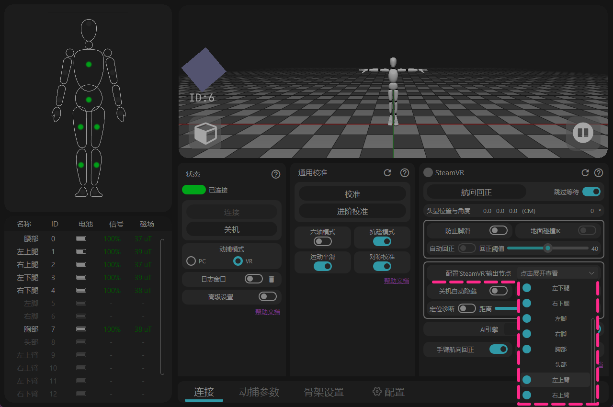

# SteamVR 操作指南

这里将推荐一些SteamVR的设置，以及一些常见问题。

## VR头显 / 串流软件操作建议

### VR头显的设定 {#software-download-toc}
<h2 class="tutorial-heading-flag" style="background: #aab0ff; margin-top: 0; display: inline-block;">VR头显的设定</h2>

<!-- === 轮播图组件 代码开始 === -->

  <input type="radio" name="carousel" id="slide1" defaultChecked />
  <input type="radio" name="carousel" id="slide2" />
  
  

    

      
    

    

      <video src="/img/steamvr_guide/steamvr_windows_video.mp4" autoplay muted playsinline preload="auto"></video>
    

  

  

  
  

    

      <label for="slide2" class="arrow-left-1">&#10094;</label>
      <label for="slide1" class="arrow-left-2">&#10094;</label>
    

    

      <label for="slide1" title="Image 1"></label>
      <label for="slide2" title="Video"><svg viewBox="0 0 24 24" width="8" height="8" ><polygon points="8,4 20,12 8,20" /></svg></label>
    

    

      <label for="slide2" class="arrow-right-1">&#10095;</label>
      <label for="slide1" class="arrow-right-2">&#10095;</label>
    

  

<!-- === 轮播图组件 代码结束 === -->

<strong> - 尽量使用steamvr的桌面窗口去操控rebocap软件。</strong> 
一些vr头显返回到内置系统后会停止/休眠steamvr的数据， 
在重新返回steamvr后会出现方向错位。 
( <u>Virtual Desktop</u>不受该问题影响，但要避免quest系统休眠 ) 

点击图标后无法显示桌面？

在steamvr的菜单中尝试重新居中或重置主面板 

- Quest、Pico这类一体机头显的安全范围需要画到比实际房间大一圈， 
避免触发安全边界时导致steamvr端的头显数据中断

  <input type="radio" name="carousel2" id="slide3" defaultChecked />
  <input type="radio" name="carousel2" id="slide4" />
  
  

    

      
    

    

      <video src="/img/steamvr_guide/VR_headset_tracking_lost_video.mp4" autoplay muted playsinline preload="auto"></video>
    

  

  

  
  

    

      <label for="slide4" class="arrow-left-1">&#10094;</label>
      <label for="slide3" class="arrow-left-2">&#10094;</label>
    

    

      <label for="slide3" title="Image 1"></label>
      <label for="slide4" title="Video"><svg viewBox="0 0 24 24" width="8" height="8" ><polygon points="8,4 20,12 8,20" /></svg></label>
    

    

      <label for="slide4" class="arrow-right-1">&#10095;</label>
      <label for="slide3" class="arrow-right-2">&#10095;</label>
    

  

- 如果走动/蹲起时头显固定在原地，说明vr头显系统内的定位系统未开启。 
（quest系统需要打开游玩边界，pico系统打开[定位追踪]）

### Virtual Desktop {#software-download-toc}
<h2 class="tutorial-heading-flag" style="background: #aab0ff; margin-top: 0; display: inline-block;">Virtual Desktop</h2>

 

<strong>有2个选项建议关闭：</strong>
 

> <strong>1 - Center to play space</strong> 
 在双击左手home键返回VD的电脑桌面时，steamvr空间中的头显向后旋转180° 
可能会导致rebocap在校准时记录错误的朝向。

>  <strong>2 - Emulate SteamVR vive trackers</strong> 
 这个功能把quest系统的AI全身追踪点传入steamvr中，但在vrchat中出现追踪点重叠，抢夺控制权。 
 如果想只启用他局部指定的追踪点，可以使用插件来调整。 
🌐 [插件的github](https://github.com/DenTechs/Virtual_Desktop_Body_Tracking_Configurator)

### SteamVR {#software-download-toc}
<h2 class="tutorial-heading-flag" style="background: #aab0ff; margin-top: 0; display: inline-block;">SteamVR</h2>

- 关闭steamvr的边界 
默认边界会限制追踪点的最大移动范围，像空气墙一样。 
如果VR头显错误定位在2.4米高度，可能在躺下后抬腿时呈现追踪器无法超过头显的高度， 
因为SteamVR默认的天花板高度为2.4米，而追踪点无法穿过天花板。

- 提前重置vr头显的角度 
按住'右手控制器home键'让VR头显重置系统方向， 
这会让steamvr虚拟地平线箭头重置到你视线的前方，在意外丢失方向后可以利用该功能重新对正坐标系 。

- 打开游戏后弹出提示 
随意选择背景中的一个社区配置， 
激活后在下一次启动就不会出现了 。

## 无法连接SteamVR

<h2 class="tutorial-heading-flag" style="background: #aab0ff; margin-top: 0; display: inline-block;">检查以下内容</h2>

<strong> 1 - 在开启SteamVR的状态点击校准。</strong> 
不启动SteamVR，rebocap无法知道系统里是否有VR。

  <input type="radio" name="carousel3" id="slide5" defaultChecked />
  <input type="radio" name="carousel3" id="slide6" />
  
  

    

      
    

    

      
    

  

  

  
  

    

      <label for="slide6" class="arrow-left-1">&#10094;</label>
      <label for="slide5" class="arrow-left-2">&#10094;</label>
    

    

      <label for="slide5" title="Image 1"></label>
      <label for="slide6" title="Image 2"></label>
    

    

      <label for="slide6" class="arrow-right-1">&#10095;</label>
      <label for="slide5" class="arrow-right-2">&#10095;</label>
    

  

<strong> 2 - 查看SteamVR驱动。</strong> 
打开rebocap的[日志窗口]记录，每次开启rebocap时候会自动检查。
如有需要，可以在[配置]页面中强制安装

  <input type="radio" name="carousel4" id="slide7" defaultChecked />
  <input type="radio" name="carousel4" id="slide8" />
  
  

    

      
    

    

      <video src="/img/steamvr_guide/check_steamvr_addons_video -cns.mp4" autoplay muted playsinline preload="auto"></video>
    

  

  

  
  

    

      <label for="slide8" class="arrow-left-1">&#10094;</label>
      <label for="slide7" class="arrow-left-2">&#10094;</label>
    

    

      <label for="slide7" title="Image 1"></label>
      <label for="slide8" title="Video"><svg viewBox="0 0 24 24" width="8" height="8"><polygon points="8,4 20,12 8,20" /></svg></label>
    

    

      <label for="slide8" class="arrow-right-1">&#10095;</label>
      <label for="slide7" class="arrow-right-2">&#10095;</label>
    

  

<strong> 3 - 检查SteamVR的加载项。</strong> 
如果Steamvr出现意外崩溃，往往会强制关闭所有加载项。 
重新开启rebocap的加载后需要重启SteamVR。

## SteamVR追踪点的显示和隐藏

<strong> 追踪点的显示和隐藏</strong> 
 在软件[ 配置 SteamVR 输出节点 ]里控制追踪点的显示和隐藏， 
 无需在SteamVR的管理菜单中操作。 

 

注

追踪器不是直连SteamVR，物理追踪器操纵骨架系统，从骨架系统上创建对应的追踪点输入到SteamVR中, 
也就是说没有对应的追踪器，依然可以向SteamVR提供追踪点。

## 设定了追踪点的部位属性但游戏无法识别到脚和腰

- 一些游戏使用openVR环境来识别追踪，但目前rebocap V01/V02 版本的Steamvr驱动会因为[Relo]名称缺失导致无法别识别的BUG， 
即便steamvr中修改了对应的属性也无法识别。 
目前的处理方法为更换旧版 driver_rebocap.dll 文件。

该BUG等待修复等待工作组后续修复

<a href="/img/steamvr_guide/(%20P05%20)%20%20%20%20driver_rebocap.dll" download target="_blank" class="button button--primary button--sm" style="margin-bottom: 15px; display: inline-block; font-size: 1em;">下载 ( P05 ) driver_rebocap.dll</a> 

- 更换过程： 
1 - rebocap和steamvr保持关闭。 
2 - 进入安装rebocap的文件夹， 
找到“Rebocap\data\rebocap_driver\bin\win64”文件夹， 
替换其中的driver_rebocap.dll文件。 
（移除“P05”前缀） 
3 - 首先启动Rebocap软件，待其更新SteamVR驱动文件后，再启动SteamVR。

