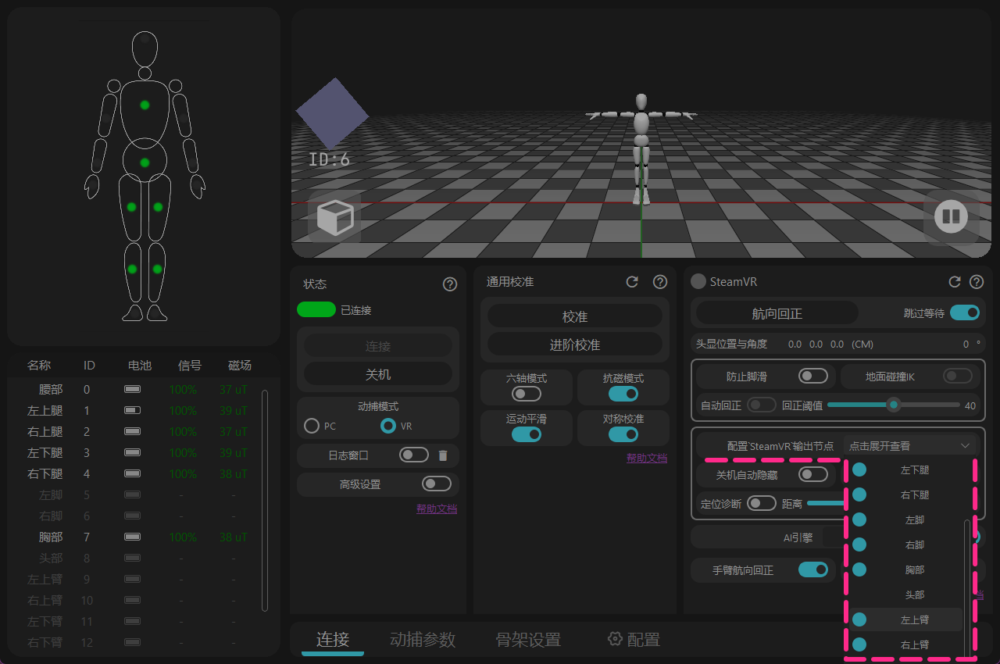
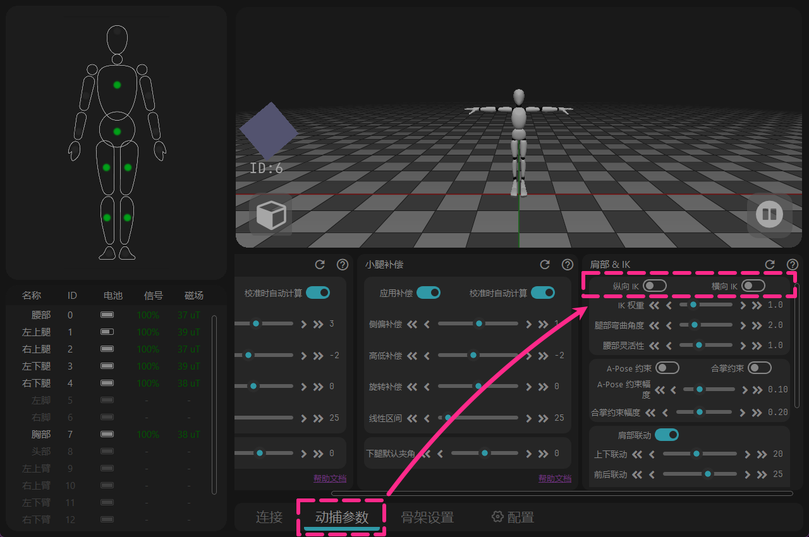

<!-- ==================== 旗帜 A：Install software 开始 ==================== -->

## 下载 {#software-download-toc}
<h2 class="tutorial-heading-flag" style="background: #88b49c; margin-top: 0; display: inline-block;">下载</h2>

目前为 Release 版本，点击下方 `下载链接`  
 Beta 版本为公开测试版本，应对磁场干扰明显的区域效果更好，但是尚未大规模验证。

**正式版本** -  [下载 Rebocap V01](https://doc.rebocap.com/img/files/rebocap_release_v01.exe)

**Beta版本** - [下载 Rebocap V02 Beta02](https://doc.rebocap.com/img/files/rebocap_release_v02_beta02.exe)

- 版本选择：\
  V01 - 适合磁场稳定的环境，适用于跳舞。 
  V02 Beta02 - 默认开关针对6追踪器套装优化，并采用全新算法可以主动判断强干扰源，甚至在弹簧床上保持朝向。

- 推荐安装在非系统盘（不要装在 C 盘）。

<!-- ==================== 折叠页 开始 ==================== -->

 查看软件对应支持的固件版本。

   &emsp;&emsp; 部分固件版本有重大算法变更，与旧版软件不兼容。   

   &emsp;&emsp; 当切换回旧版软件时，需要相应地降级固件。  

   &emsp;&emsp;&emsp; release_v01 - ◼️tracker : V6 / V7  ,  📡receiver : V6 / V7   

   &emsp;&emsp;&emsp; release_v02 beta02 - ◼️tracker : V15  ,  📡receiver : V6 / V7   

   &emsp;&emsp;&emsp; (未公开) release_v02 beta02.1 - ◼️tracker : V16  ,  📡receiver : V6 / V7 / V8   

<!-- ==================== 折叠页 结束 ==================== -->

<!-- ==================== 折叠页 开始 ==================== -->

如果在VR模式使用 V01 版本，需要更改以下设置。

<strong>1 - 关闭额外显示的追踪点。</strong> 
打开 [配置'SteamVR'输出节点] → 关闭 [左/右上臂]

详情

软件原计划使用[关节自动隐藏]功能自动隐藏未使用的追踪点， 
后发现该功能无法自动检查，在V02 Beta02软件中已修复。

<strong>2 - 关闭会错误卡在全局工作的功能。</strong> 
→ [运动参数] → 关闭 [纵向 IK & 横向 IK]

详情

该功能原定为[防止脚滑]模块里的子功能， 
但会意外处于全局工作状态，在V02 Beta02软件中已修复。

<!-- ==================== 折叠页 结束 ==================== -->

<!-- ==================== 旗帜 A：Install software 结束 ==================== -->

注意事项：
> 当前软件仅支持**Windows 10**及以上系统版本。 
> 软件必须在联网状态下使用，如果希望离线使用，请使用手机热点网络，开启软件30秒以后再断开网络即可。 
（在[日志窗口]中只要显示网络校验成功，即可断开网络）

## 软件安装
1. 双击 rebocap_release_v01.exe（当前版本为 rebocap_release_v01.exe）
2. 按照下图所示进行安装
3. 打开 rebocap 软件
   * 开始菜单打开
   * 桌面快捷方式打开

## 软件更新说明

### 更新日志

#### 2026-02-04 更新: rebocap Release V02 Beta02
1. 更新固件到v15，优化抗磁和6轴算法，抗磁稳定性提升，6轴稳定性提升
   > 动态情况下，比如一直跳舞，并且磁场不好的情况下，还是和6轴性能接近。新固件在磁场良好的情况下，动态跳舞基本能够一直修正（以前的固件则是依赖中间存在静止状态进行修正）
2. 增加延迟自动关机功能，需要升级新的接收器固件。
3. 航向校准重构，同时新增 PC航向校准 功能：
   > 注意：PC航向校准的时候，也是全身A-pose，小臂和手掌也抬起来向前会更好，或者直接做S-Pose也可以，或者坐着把手伸向正前方也行）
4. 软件意外闪退，5分钟内打开，还会自动应用上次校准结果，无需再次动作校准
5. 航向校准时，会重置磁场（直接重置到相对磁场1.0），也就是躺床上的话，会按照校准时刻作为初始磁场来回正。
6. 放开磁场校准限制，简易磁场校准（画8字）默认可展示点击
   > 默认限制8个传感器同时校准，如果data目录新增文件： `data/__no_limit_max_nodes__`，即可放开校准数量限制
7. 修复躺下后脚底运动可能导致人物骨架分离的bug

其它更新：
1. 软件头部显示版本号
2. 修复自动隐藏关机传感器功能不生效的bug
3. 关闭脚底防滑模式下，脚底可以到地面以下，并且移除了IK
4. 解决拔掉接收器后人物姿态冻结的bug
5. 骨架设置增加了VR侧向偏移（部分模型的头显挂载点不在眉心，而是侧边一点点，可以自行根据实际情况调试）

#### 2025-12-03 更新: rebocap Release V01
**VR 部分：**
1. 增加原地行走的功能，可以原地踏步的时候，模拟摇杆稳定缓慢向前推进，具体请阅读帮助文档（高级功能）
2. 增加 VR 虚拟地面高度，-100cm~100cm范围调节（高级功能）
3. 增加替换控制器功能，开启后会使用手掌跟踪器替换手柄控制器的位置和姿态，具体请阅读帮助文档（高级功能）
4. 升级 SteamVR 插件，并尝试修复跟踪器识别为控制器的现象
5. 修复VR模式导入骨架下，脚底定位点错误问题（主要影响 IK 计算），导致人物脚底以及整体被拉低。
6. 航向回正以后，会主动触发 自动回正功能
7. 增加自动隐藏关闭的节点开关，开启以后，会自动隐藏关机的节点
8. 恢复 VR 的 胸腰跟随头显功能

**PC 部分：**
1. 动作校准算法更新，减低 Tpose 手臂姿态要求，解决部分用户两只手臂不对称问题
2. 增加手臂 IK，合掌 IK 可以尽可能降低合掌状态下手臂交叉问题，Apose IK用于解决虚拟人物肩膀太窄，手臂垂直的时候导致严重穿模问题
3. 新增 MMD 动作导出，以及 PMX 模型导入。注意，VMD动作没有IK，需要自行移除 IK 约束。
4. 修复动画帧率跳转，最大999 的bug

**通用部分：**
1. UI 更新，按照功能进行分区，以及部分名词翻译优化，功能描述更人性化
2. 增加高级设置开关，以及设置导出和设置加载，恢复默认设置功能
3. 移除静止判定不过导致无法校准的问题
4. 增加自动连接功能，现在不需要手动点击连接按钮
5. 增加接收器固件升级，解决CPU高负载丢包问题（特别是 AMD CPU）
6. 跟踪器升级到 v07 固件，整体更稳定
7. 增加可选取部分节点进行六轴的能力（高级功能）
8. 修复个别陀螺仪校准后不归零的bug

**其它：**
1. 增加启动界面，避免长时间后台等待
2. 增强 3D 窗口稳定性
3. 验证服务器增加到三个（中国、香港和美国），只要其中一个验证服务器通过就验证通过。
4. 修复校准的时候偶发数据发送失败的bug（实际上是发送成功了）
5. 默认骨架修改为社区推荐的默认骨架，以及其它默认参数修改
6. 六轴开关开启关闭增加重新校准提示
7. 修复六轴侧偏补偿问题

### TODO（排名不分先后，这里只介绍大的更新点）

- 优化 IK 效果
- 优化软件稳定性
- VR 3点模式支持
- PC 全身6点模式支持
- 文档增加其它语言（后续文档稳定以后再增加）

### 历史版本
> **请注意，preview05以前的版本不支持 2025-11-29 号以后的新版本硬件，新版本硬件请下载最新 Release 版本 或者 Beta 版本**
