# 15 追蹤器套裝 - 開箱到使用

<!-- ============ 標題 ======== 檢查包裹內容 ==================== -->
## 1 - 檢查包裹內容

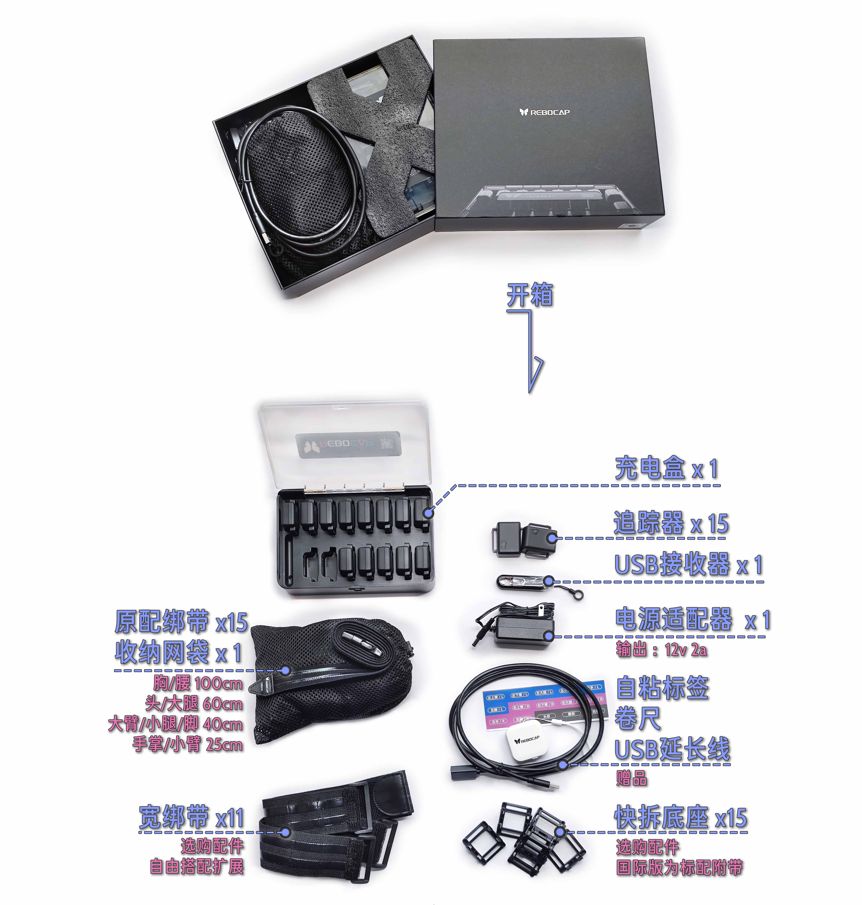

* **抽屜彩盒**(⚠️ 請勿丟棄)  
* **追蹤器** x 15 
  **USB 接收器** x 1 
* **充電盒** x 1 
  **電源變壓器** x 1（輸出12v 2a）

* **收納網袋** x 1 
  **彈性綁帶** x 15（2.5cm寬度）

* **附贈品** 
  自粘標識貼紙 
  卷尺 
  USB延長線

* **選購配件** 
  快拆底座 x 15 （國際版為標配） 
  寬綁帶 x 11（5cm寬度，不含手掌和腳,與原窄綁帶自由搭配）

<!-- ============= 標題 ======= 安裝綁帶 ==================== -->
## 2 - 安裝綁帶

<!-- 方式 A - 直接安裝 -->

## 方式 A - 直接安裝

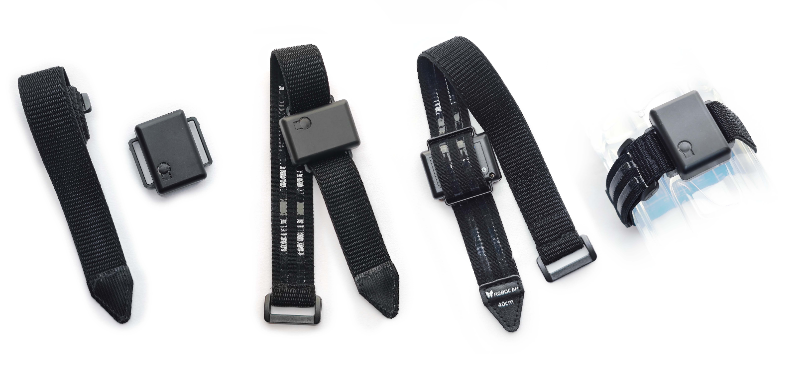

  <video id="video" controls loop preload="metadata" width="60%">
    <source id="mp4" src="../../img/tracker_normal.mp4" type="video/mp4" />
  </video>

- 不推薦該安裝方式，長期受力易導致材質老化、開裂， 
  通常作為備用方式。

<!-- 方式 B - 使用快拆底座 -->

## 方式 B - 使用快拆底座

- 將快拆底座安裝在綁帶上，確保綁帶從底座下方穿過。

  <video id="video" controls loop preload="metadata" width="60%">
    <source id="mp4" src="../../img/kuaichai_normal.mp4" type="video/mp4" />
  </video>

- 快拆底座的安裝影片

- 粘上魔術貼後，向兩側拉扯一下，使鉤面完全嵌入毛面，防止脫落。

- 追蹤器拆裝技巧， 
  從一側撬開能更容易地直接將追蹤器從快拆底座上取下。

<!-- 方式 C - 使用寬綁帶 -->

## 方式 C - 使用寬綁帶

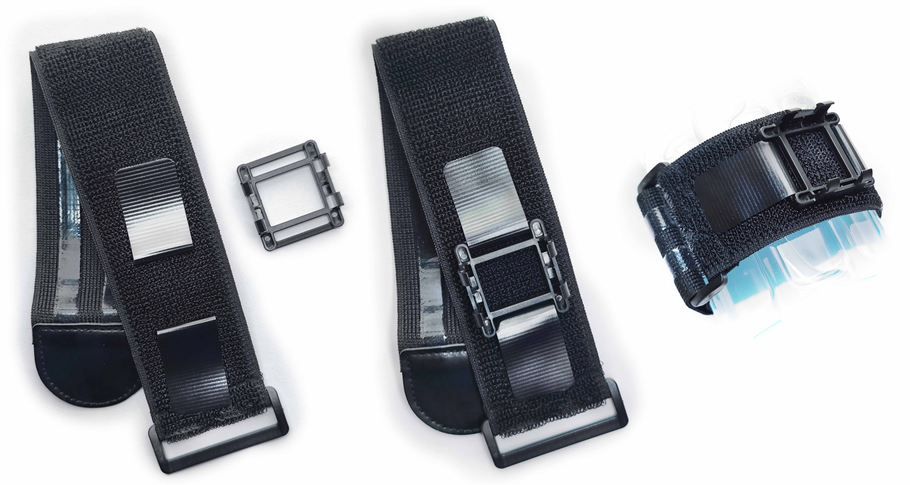

- 寬綁帶的一端自帶有魔術貼，把追蹤器或者快拆底座裝在上面， 
  盒子中額外的單片魔術貼作為備用。

  <a href="/zh-Hant/docs/tutorial/instroction_for_straps" target="_blank" class="button button--primary" style="text-decoration: none; border-radius: 6px; display: inline-block; font-weight: bold; font-size: 1.0rem; padding: 6px 18px;">
    更多綁帶的安裝指南 → 📖
  </a>

<!-- ============ 標題 ======== 穿戴在身上的位置 ==================== -->
## 3 - 穿戴在身上的位置

<!-- ==================== 左右分欄圖文排版 開始 ==================== -->

<!-- 左側分欄：放人物模型圖 -->

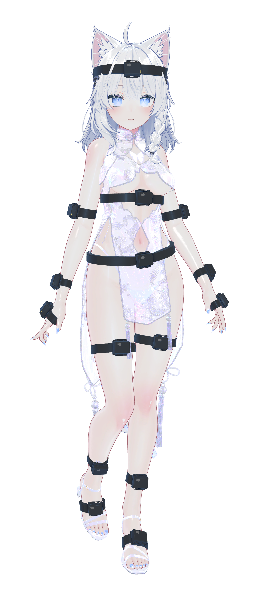

<!-- 右側分欄：放文字說明 -->

<!-- 第一組：圍度數據 -->

<strong>胸部/腰部:</strong> 100 cm 
<strong>頭/大腿:</strong> 60 cm 
<strong>大臂/小腿/腳:</strong> 40 cm 
<strong>手掌/小臂：</strong> 25cm

<!-- 第三組：身體差異性調整 -->

<strong>身體差異性調整：</strong> 
請參考圖片中所示的穿戴位置， 
推薦 胸部/腰部追蹤器放置在後背， 
腿部追蹤器可以放置在側面。

<!-- 第四組：避開區域提示 -->

<strong>提示：</strong> 
保持追蹤器按鍵朝上。 
 
請勿將腰部追蹤器放置在肚臍處以防被擠壓， 
腿部追蹤器應避開肌肉隆起成斜坡的區域。 
請勿將大腿追蹤器放得太靠近膝蓋。 

<!-- 第四組：vr差異性調整 -->

<strong>註：</strong> VR模式穿戴有些差異， 
但建議先按此檢查所有追蹤器是否正常工作。

<!-- 第五組：底部小圖與文字上下排版 -->

追蹤器背面貼有 ID 編號， 
出廠已綁定編號與位置。 
只有小臂和手掌4個追蹤器可以通過軟體替換位置， 
其他追蹤器不能替換位置。

<!-- ==================== 左右分欄圖文排版 結束 ==================== -->

<!-- ============= 標題 ======= 安裝軟體 和 檢查韌體更新 ==================== -->
## 4 - 安裝軟體與檢查韌體更新

<!-- ==================== 旗幟 A：Install software 開始 ==================== -->

## A - 安裝軟體

  <a href="/zh-Hant/docs/tutorial/software_install" target="_blank" class="button button--primary" style="text-decoration: none; border-radius: 6px; display: inline-block; font-weight: bold; font-size: 1.0rem; padding: 6px 18px;">
    軟體下載 → 🌐
  </a>

- 版本選擇：\
  V01 - 適合磁場穩定的環境，適用於跳舞。 
  V02 Beta02 - 預設開關針對6追蹤器套裝優化，並採用全新演算法可以主動判斷強干擾源，甚至在彈簧床上保持朝向。

<!-- ==================== 折叠页 开始 ==================== -->

如果在VR模式使用 V01 版本，需要更改以下設定。

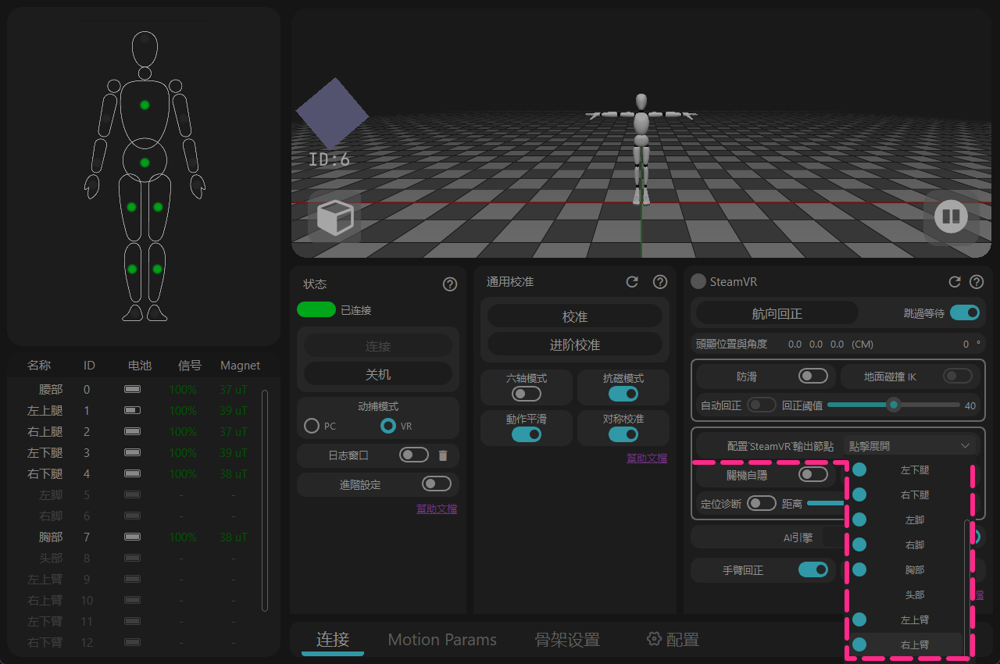

<strong>1 - 關閉額外顯示的追蹤點。</strong> 
打開 [配置'SteamVR'輸出節點] → 關閉 [左/右上臂]

詳情

軟體原計畫使用[關節自動隱藏]功能自動隱藏未使用的追蹤點， 
後發現該功能無法自動檢查，在V02 Beta02軟體中已修復。

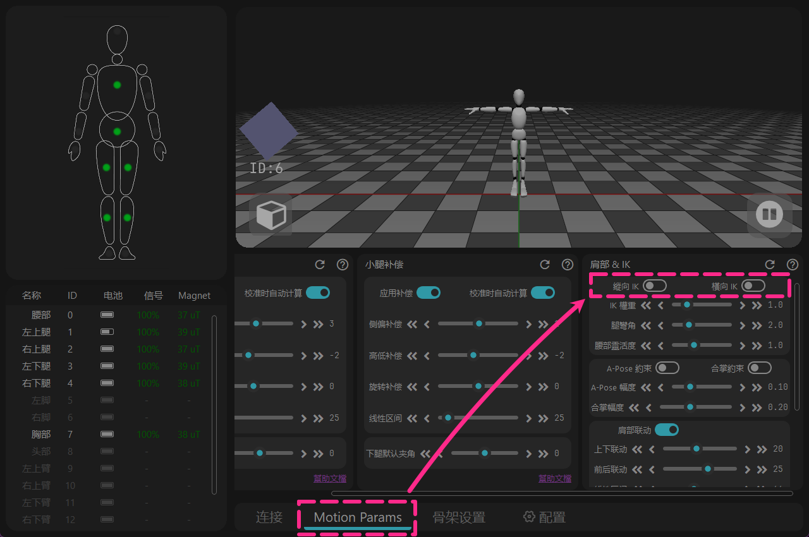

<strong>2 - 關閉會錯誤卡在全域工作的功能。</strong> 
→ [運動參數] → 關閉 [縱向 IK & 橫向 IK]

詳情

該功能原定為[防止腳滑]模組裡的子功能， 
但會意外處於全域工作狀態，在V02 Beta02軟體中已修復。

<!-- ==================== 折叠页 结束 ==================== -->

- 推薦安裝在非系統碟（不要裝在 C 碟）。

<!-- ==================== 旗幟 A：Install software 結束 ==================== -->

<!-- ==================== 旗幟 B：Connect to computer 開始 ==================== -->

## B - 連接電腦

<!-- ==================== 步驟 1：連接接收器 开始 ==================== -->

<strong style="font-size: 1.15em" class="tutorial-step-title">1. 連接接收器</strong> 
- 將 USB 接收器插入電腦，選擇一個周圍開闊的接口。 
- 或使用附贈的USB延長線外接。(市面通用的USB3.0傳輸線) 
- 如果追蹤器訊號不能維持在100%，則將接收器更換位置。

<!-- ==================== 步驟 1 結束 ==================== -->

<!-- ==================== 步驟 2：軟體連接 開始 ==================== -->

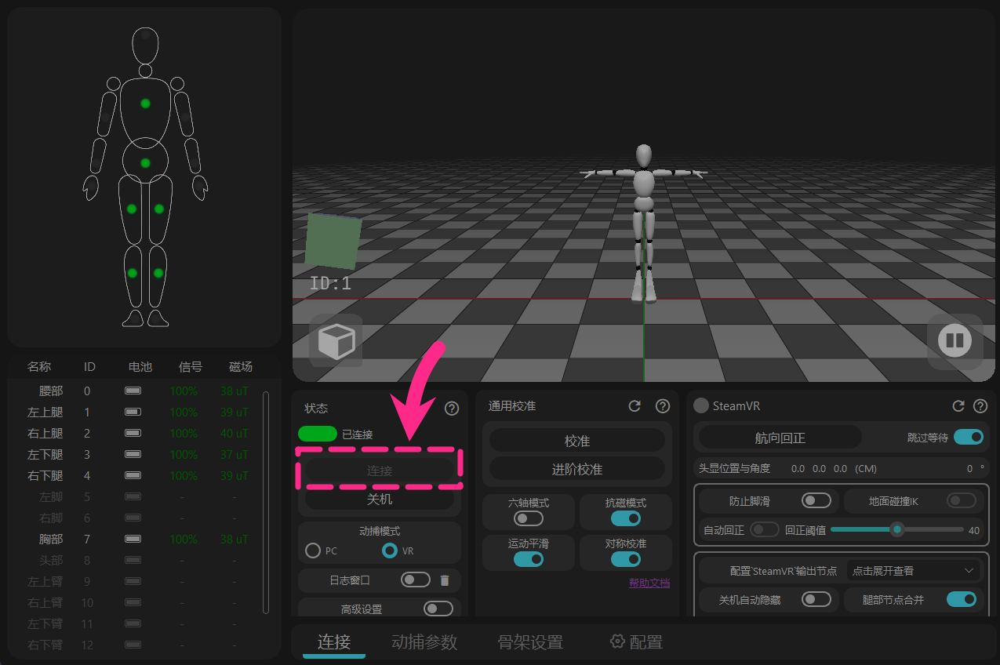

<strong style="font-size: 1.15em" class="tutorial-step-title">2. 軟體連接</strong> 
- 在軟體中點擊「連接」（Beta02 版本後將自動連接）。

<!-- ==================== 步驟 2 結束 ==================== -->

<!-- ==================== 步驟 3：開啟追蹤器 開始 ==================== -->

<strong style="font-size: 1.15em" class="tutorial-step-title">3. 開啟追蹤器</strong> 
- 按下追蹤器按鈕開機。 
- 注意：追蹤器是通過軟體關機的。

<!-- ==================== 步驟 3 結束 ==================== -->

<!-- ==================== 旗幟 B：Connect to computer 結束 ==================== -->

<!-- ==================== 旗幟 C：Check firmware 開始 ==================== -->

## C - 檢查韌體

<!-- ==================== 檢查韌體 開始 ==================== -->

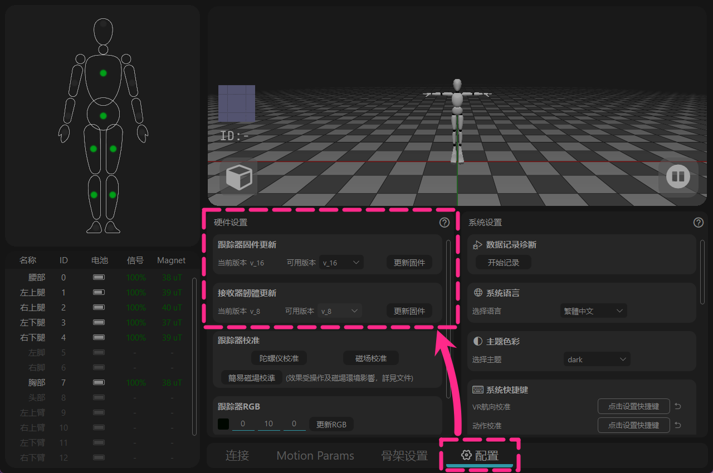

<strong style="font-size: 1.15em" class="tutorial-step-title">檢查 [追蹤器與接收器] 韌體</strong> 
- 升級至選項中的最高可用版本， 
- 該版本將隨未來的軟體更新而改變。 
- 韌體附屬在軟體安裝包中，不是聯網更新的。

<!-- ==================== 檢查韌體 結束 ==================== -->

<!-- ==================== 折疊頁 開始 ==================== -->

 查看軟體對應支援的韌體版本。

   &emsp;&emsp; 部分韌體版本有重大演算法變更，與舊版軟體不相容。   

   &emsp;&emsp; 當切換回舊版軟體時，需要相應地降級韌體。  

   &emsp;&emsp;&emsp; release_v01 - ◼️tracker : V6 / V7 , 📡receiver : V6 / V7   

   &emsp;&emsp;&emsp; release_v02 beta02 - ◼️tracker : V15 , 📡receiver : V6 / V7   

   &emsp;&emsp;&emsp; (未公開) release_v02 beta02.1 - ◼️tracker : V16 , 📡receiver : V8   

<!-- ==================== 折疊頁 結束 ==================== -->

- 打開日誌視窗以查看每個追蹤器的實際韌體版本   
  （日誌視窗位於軟體中的「連接與關機」下方）。

- 追蹤器是通過無線 📶 進行更新的 — 無需使用 USB 傳輸線。  
  🚫 請勿同時更新追蹤器和接收器。  
  如果追蹤器更新失敗，考慮關機一半的追蹤器來穩定數據上傳的穩定，在日誌中韌體版本正確的追蹤器可以保持關機。

- 如果更新失敗，需要重啟追蹤器並再次點擊更新。  
  &emsp;&emsp;🟩綠燈 – 快閃：追蹤器工作正常  
  &emsp;&emsp;🟩綠燈 – 慢闪：追蹤器正在等待接收器訊號  
  &emsp;&emsp;🟦藍燈：追蹤器正在接收韌體數據  
  &emsp;&emsp;🟨黃燈：更新失敗（手動按下 🔘 按鈕重啟，然後重新更新）  
  &emsp;&emsp;⬜白色：更新成功（通常在 10s 後自動重啟，如果無法自動重啟需要手動重啟）  

- 當 📡接收器更新完成後，斷開並重新插入 USB，然後 🔄重啟軟體。

<!-- ==================== 旗幟 C：Check firmware 結束 ==================== -->

<!-- ============= 標題 ======= 校正追蹤器初始數據 ==================== -->
## 5 - 校正追蹤器初始數據

<!-- ==================== 旗幟 Gyroscope Calibrate 开始 ==================== -->

## 陀螺儀校準
<!-- ==================== 步驟 1：放置追蹤器 開始 ==================== -->

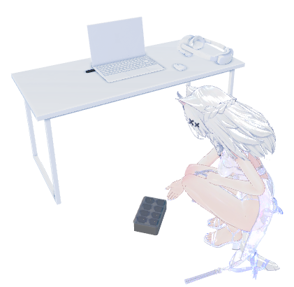

<strong style="font-size: 1.15em" class="tutorial-step-title">1. 放置在地面上</strong> 
- 將追蹤器放置在地面上（處於沒有物理晃動/移動的位置）。 
- 無需放回吸塑盤裡。

<!-- ==================== 步驟 1 結束 ==================== -->

<!-- ==================== 步驟 2：啟動采集 開始 ==================== -->

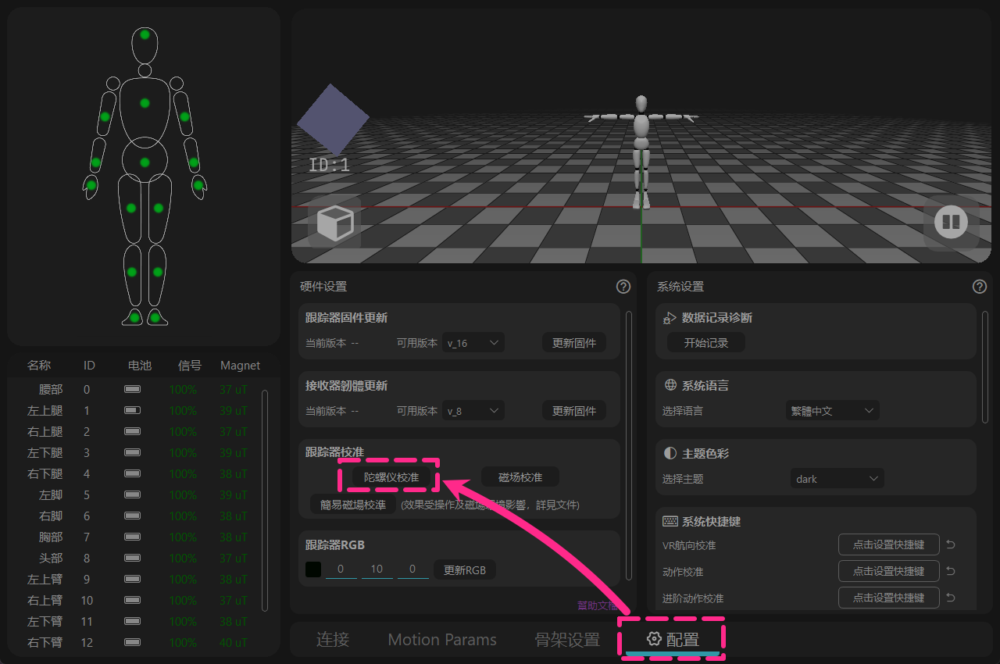

<strong style="font-size: 1.15em" class="tutorial-step-title">2. 開始校準</strong> 
- 點擊按鈕，等待採集完成。 
- 原理為錄製幾秒在現實沒有任何晃動的記錄。

<!-- ==================== 步驟 2 結束 ==================== -->

<!-- ==================== 步驟 3：檢查陀螺儀資訊 開始 ==================== -->

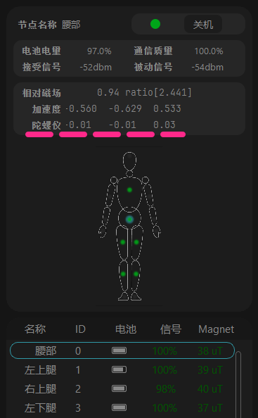

<strong style="font-size: 1.15em" class="tutorial-step-title">3. 檢查陀螺儀資訊</strong> 
- 完成後，檢查每個追蹤器的陀螺儀資訊。 
- 通常情況下，靜止時陀螺儀的輸出值應在 0 至 ±0.05 之間。

<!-- ==================== 步驟 3 結束 ==================== -->

<!-- ==================== 旗幟 Gyroscope Calibrate 結束 ==================== -->

<!-- ==================== 旗幟 Magnet Calibrate 開始 ==================== -->

## 磁場校準

<!-- ==================== 步驟 1：放置吸塑盤 開始 ==================== -->

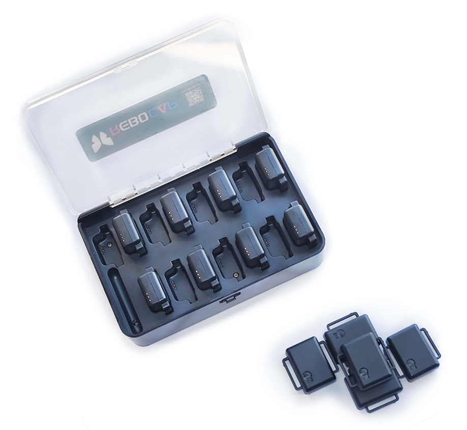

<strong style="font-size: 1.15em" class="tutorial-step-title">1. 放入充電盒中</strong> 
- 追蹤器反裝在充電盒裡，並且間隔一個空位。 
- 一輪最多裝入8個追蹤器，分兩批校準，不參與校準的追蹤器要關機。

<!-- ==================== 步驟 1 結束 ==================== -->

<!-- ==================== 步驟 2：站在中心 開始 ==================== -->

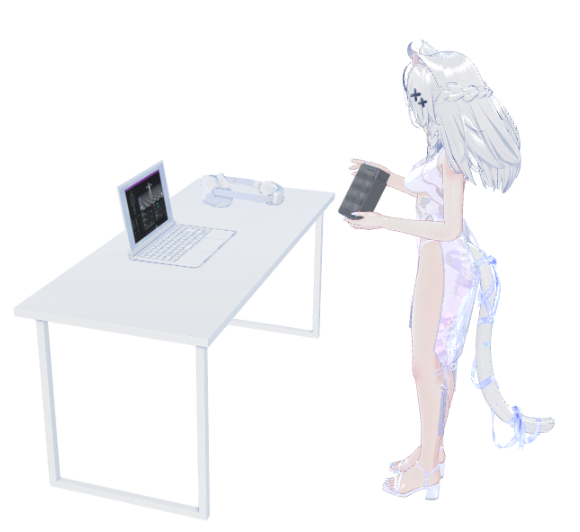

<strong style="font-size: 1.15em" class="tutorial-step-title">2. 站在遊玩區域中心</strong> 
- 抱在懷裡，站在遊玩區域的中心， 
- 或者距離電腦桌邊緣一步的距離。

<!-- ==================== 步驟 2 結束 ==================== -->

<!-- ==================== 步驟 3：旋轉吸塑盤 開始 ==================== -->

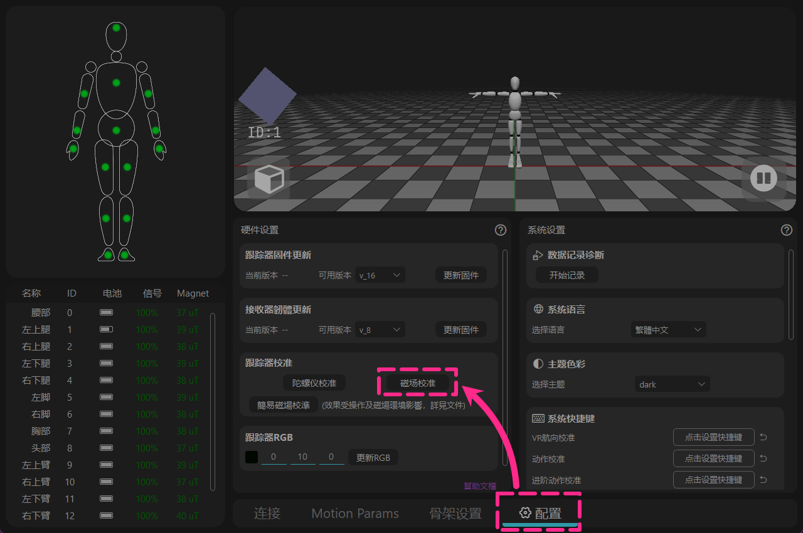

<strong style="font-size: 1.15em" class="tutorial-step-title">3. 執行校準</strong> 
- 點擊軟體按鈕，跟隨軟體顯示的動畫順序，勻速旋轉。 
- (記錄的過程為每換一面記錄旋轉兩圈的數據)。

<!-- ==================== 步驟 3 結束 ==================== -->

<!-- ==================== 步驟 4：檢查磁場讀數 開始 ==================== -->

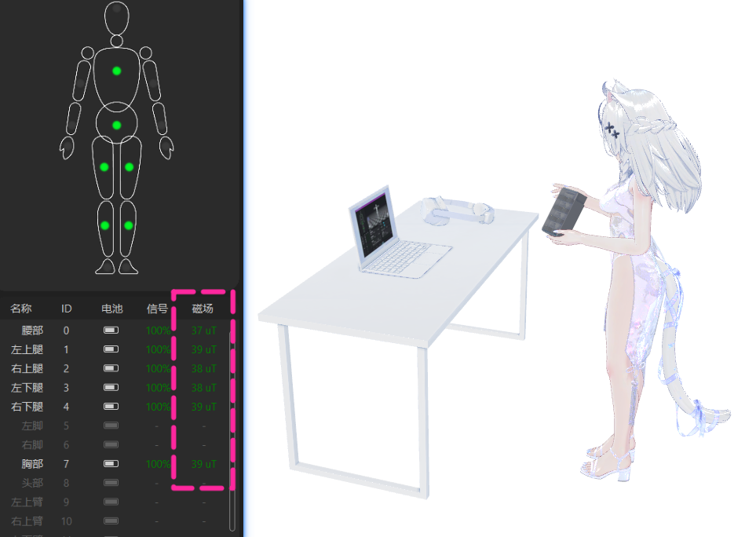

<strong style="font-size: 1.15em" class="tutorial-step-title">4. 檢查磁場讀數</strong> 
- 完成後，在手中隨意翻轉吸塑盤， 
- 🔍檢查校準後的追蹤器磁場讀數是否一致或相近， 
- ⚠️如果磁場讀數各自差異很大，那麼需要再次執行磁場校準。

<!-- ==================== 步驟 4 結束 ==================== -->

<!-- ==================== 折疊頁 開始 ==================== -->

如果沒有攜帶充電盒怎麼辦？

   &emsp;&emsp;可以使用綁帶把追蹤器固定在方形水瓶或紙巾盒上，  
   &emsp;&emsp; 以 2-3 個為一組。 

<!-- ==================== 折疊頁 結束 ==================== -->

<!-- ==================== 折疊頁 开始 ==================== -->

簡易磁場校準

   &emsp;&emsp;作為一種便利的備選方案。  
   &emsp;&emsp;主要動作：  
   &emsp;&emsp;在記錄期間旋轉追蹤器，覆蓋儘可能多的方向（360° 全方位翻轉）。 

   &emsp;&emsp;提示：  
   &emsp;&emsp;以“8”字形移動手腕和手臂，以便感測器能捕捉更多角度的磁場數據。 

<!-- ==================== 折疊頁 結束 ==================== -->

<!-- ==================== 旧版本看不到简易磁场校准 折叠页 开始 ==================== -->

舊版本看不見此按鈕？

   &emsp;&emsp;此按鈕在舊版本中預設不顯示， 
   &emsp;&emsp;您需要手動建立特定的 .txt 文件使其顯現。 

   &emsp;&emsp;前往 Rebocap 根資料夾（Rebocap.exe 所在目錄），  
   &emsp;&emsp;新建一個 .txt 文件並重新命名為 
   &emsp;&emsp; \_simple_cal\_

   &emsp;&emsp;重啟軟體後，該按鈕即可顯現。

<!-- ==================== 旧版本看不到简易磁场校准 折叠页 结束 ==================== -->

<!-- ==================== 折叠页 结束 ==================== -->

<!-- ==================== 旗幟 Magnet Calibrate 結束 ==================== -->

<!-- ============= 標題 ======= 檢查追蹤系統 ==================== -->
## 6 - 檢查追蹤系統

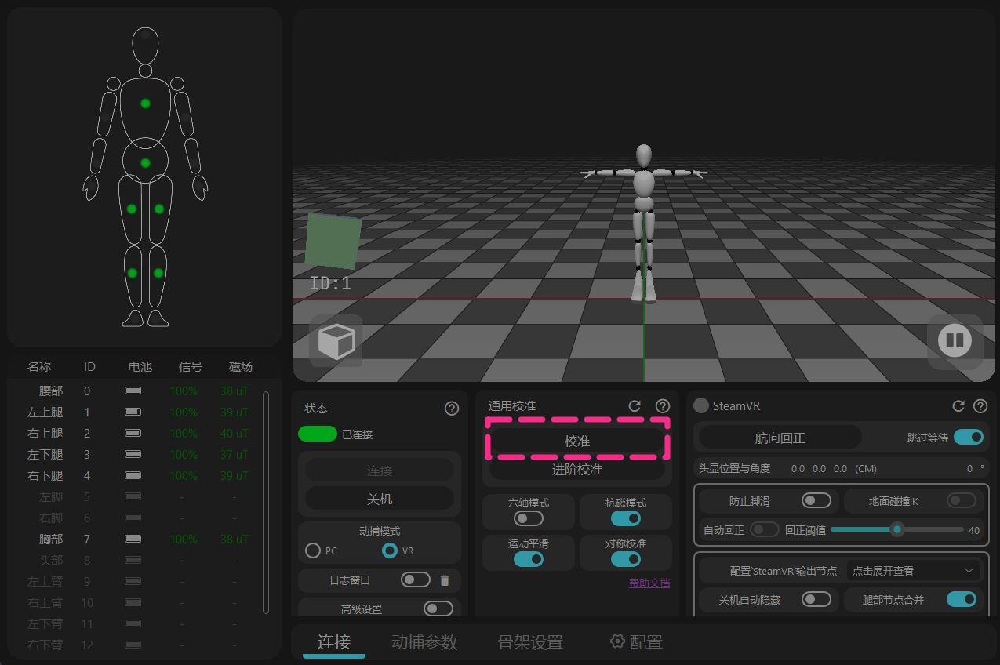

- 點擊【校準】按鈕，記錄特定的姿勢。 

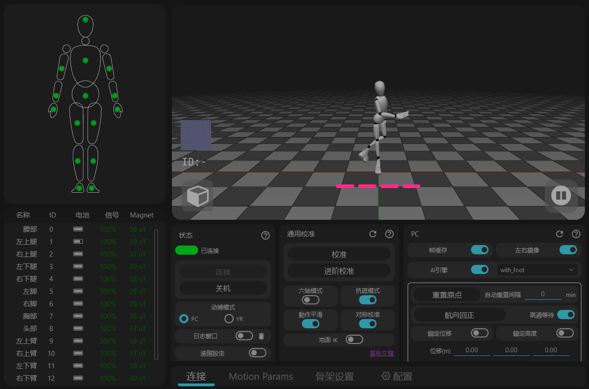

- 完成後，在3D預覽器中看到動捕系統開始工作， 
  由此再去針對動畫錄製、虛擬偶像、VR遊戲使用。

<!-- ==================== 旗幟 校準姿態圖鑑 開始 ==================== -->

## 校準姿態圖鑑

<!-- ==================== 步驟 1：A pose 開始 ==================== -->

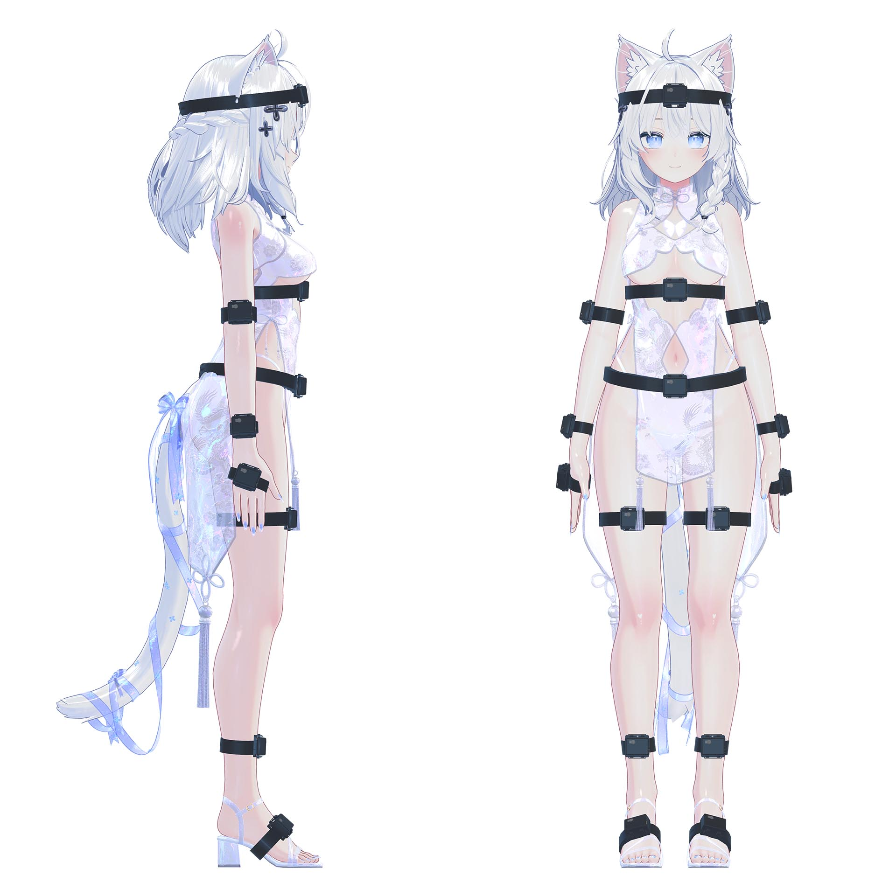

<strong style="font-size: 1.15em" class="tutorial-step-title">A Pose</strong> 
- 保持適當的雙腳間距，不要並攏腳也不要過度張開，與圖中相近。 
- 自然放鬆的站立，不需要繃緊肌肉。

<!-- ==================== 步驟 1 結束 ==================== -->

<!-- ==================== 步驟 2：T pose 開始 ==================== -->

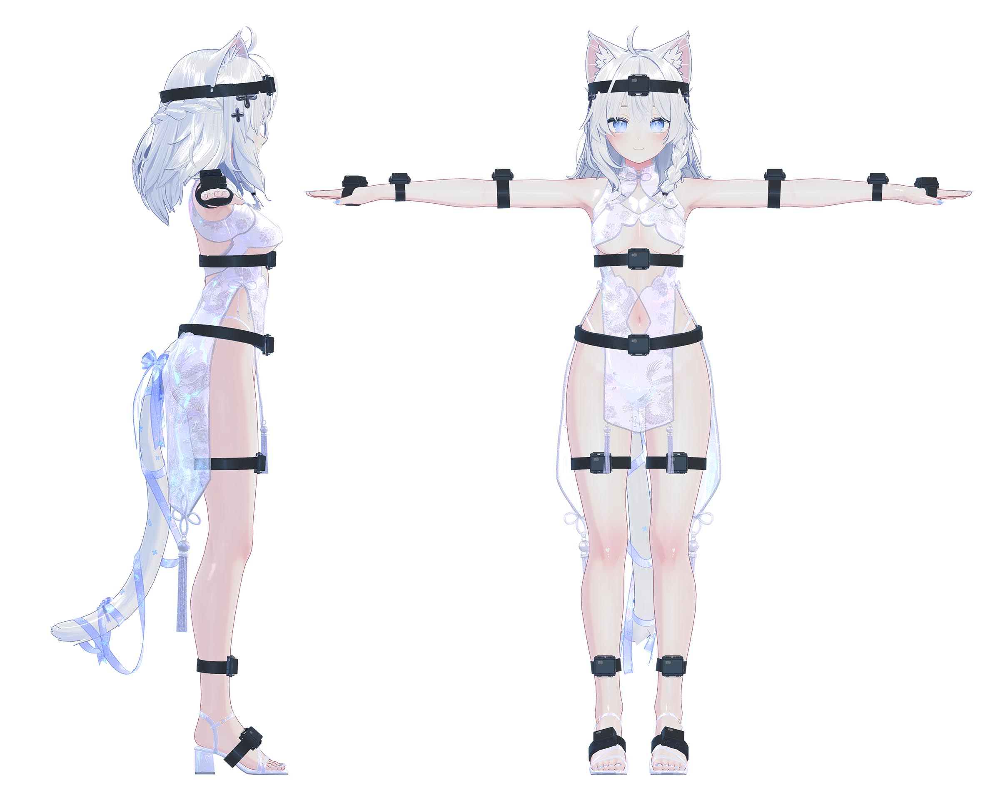

<strong style="font-size: 1.15em" class="tutorial-step-title">T Pose</strong> 
- 水平張開手臂， 
  有時肌肉記憶和實際伸直手會有差異，需要視覺看一下。 

<!-- ==================== 步驟 2 結束 ==================== -->

<!-- ==================== 步驟 3：S pose 開始 ==================== -->

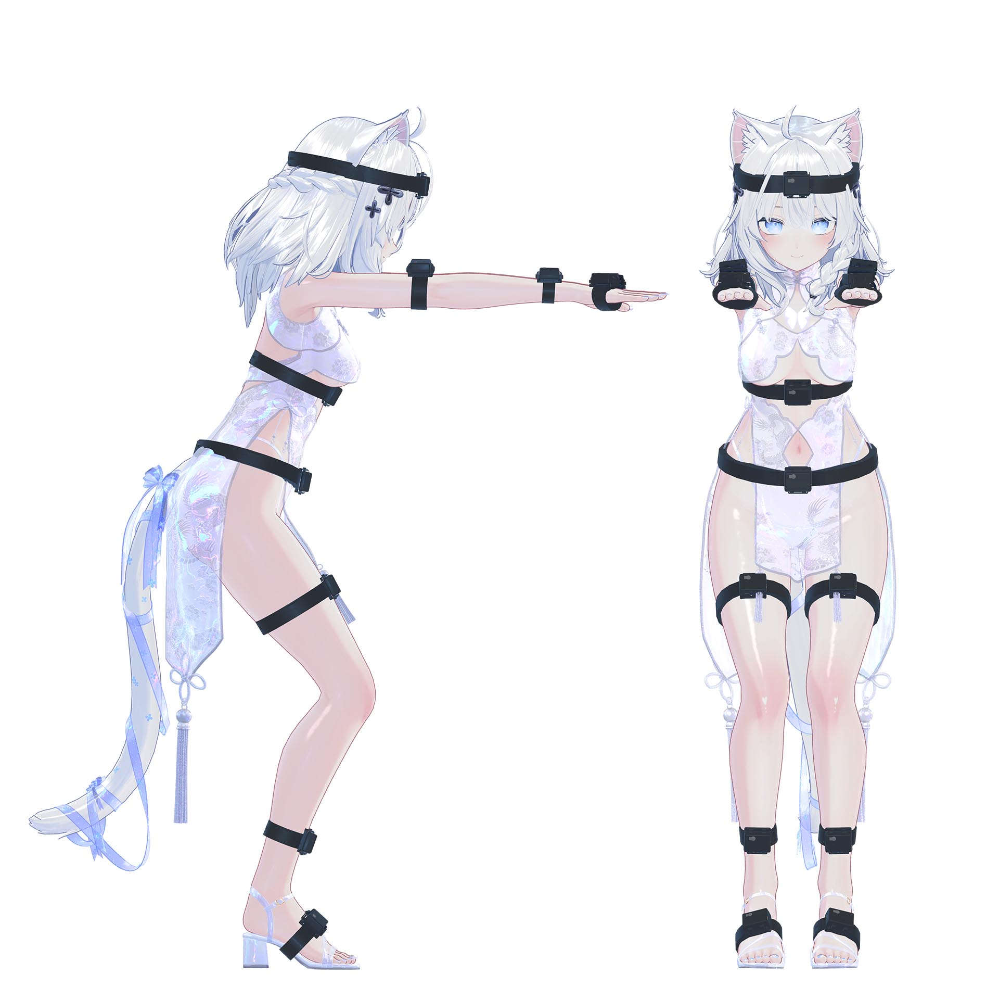

<strong style="font-size: 1.15em" class="tutorial-step-title">S Pose</strong> 
- 半蹲 + 彎腰 + 低頭，讓追蹤器通過前傾的角度獲知身體的前方朝向。 
- 儘量保持雙腿平衡與膝蓋間距，手臂平行朝前。 
- 如果感覺彎腰困難、不明顯，可以使用進階校準。

<!-- ==================== 步驟 3 結束 ==================== -->

<!-- ==================== 步驟 4：B pose 開始 ==================== -->

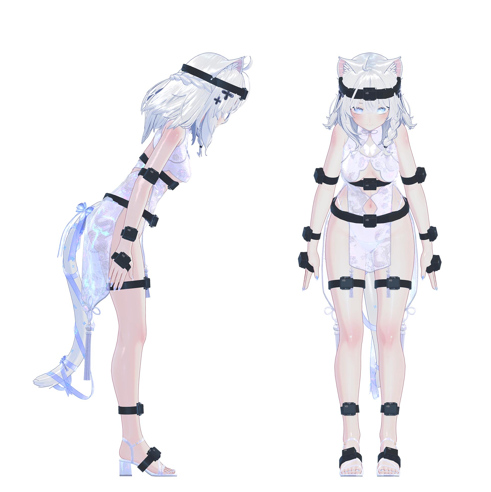

<strong style="font-size: 1.15em" class="tutorial-step-title">B Pose (進階校準)</strong> 
- 把S Pose的彎腰+低頭拆分為個別的彎腰動作來記錄。 
- 可以避免因 S 姿態引起的身體畸變 （常見於坐下後骨架系統向側面傾斜）。

<!-- ==================== 步驟 4 結束 ==================== -->

<!-- ==================== 旗幟 Calibration posture guide 結束 ==================== -->

<!-- ============ 標題 ======== PC模式 - 外部程序連接 ==================== -->
## PC模式

<!-- ==================== 旗幟 軟體內錄製 開始 ==================== -->

## 軟體內錄製

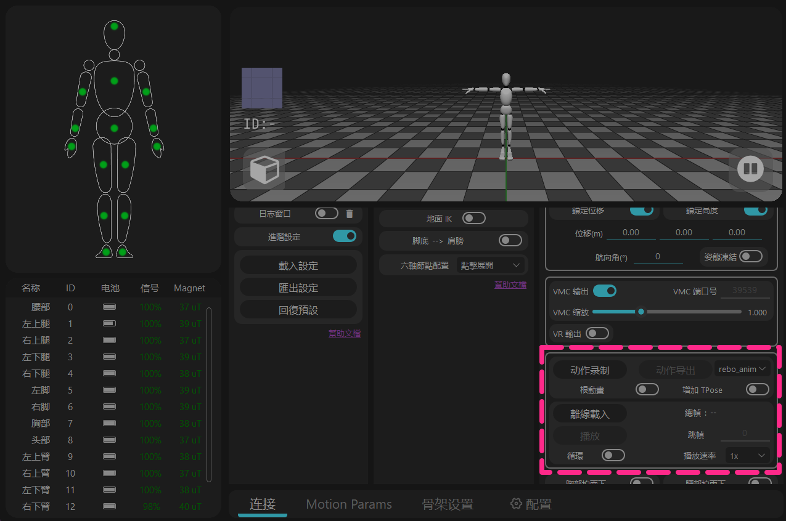

- 使用建議: 
- .rebo_anim 為軟體原生 data，對於較長錄製建議導出作為備份，並且可以使用【離線播放】重播。 
- .bvh不能使用含有中文的資料夾路徑保存。 
- 直接儲存的fbx為傳統動畫所用的骨架文件，需要在編輯工具中重映射使用，多數時候，不要開啟【根動畫】,避免導出文件後出錯。

<!-- ==================== 旗幟 軟體內錄制 結束 ==================== -->

<!-- ==================== 旗幟 虛擬偶像（VTube） 開始 ==================== -->

## 虛擬偶像（VTube）

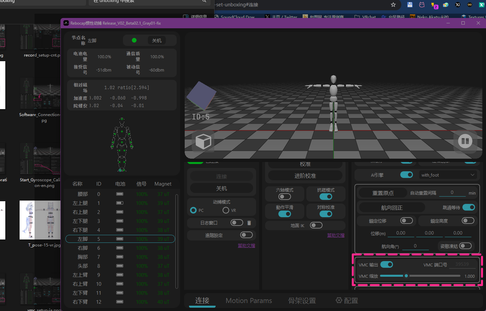

- 雲鏡、抖音直播伴侶、MetaVance等軟體做有對應功能直接使用。 
- 支援使用VMC通道向Warudo這類偶像軟體連接。 

<!-- ============ 跳轉 網頁 ==================== -->

  <a href="https://www.bilibili.com/video/BV1z7hFzfEw6/" target="_blank" class="button button--primary" style="text-decoration: none; border-radius: 6px; display: inline-block; font-weight: bold; font-size: 1.0rem; padding: 6px 18px;">
    連接雲鏡 
  </a>
  <a href="https://www.bilibili.com/video/BV1fPbwzbEak" target="_blank" class="button button--primary" style="text-decoration: none; border-radius: 6px; display: inline-block; font-weight: bold; font-size: 1.0rem; padding: 6px 18px;">
    連接 抖音·直播伴侶
  </a>
  <a href="https://www.bilibili.com/video/BV1fPbwzbEak" target="_blank" class="button button--primary" style="text-decoration: none; border-radius: 6px; display: inline-block; font-weight: bold; font-size: 1.0rem; padding: 6px 18px;">
    連接 Warudo
  </a>

<!-- ==================== 旗幟 虛擬偶像（VTube） 結束 ==================== -->

<!-- ==================== 旗幟 直連插件 開始 ==================== -->

## 直連插件

<!-- ============ 跳轉 網頁 ==================== -->

  <a href="https://doc.rebocap.com/zh_cn/plugins/blender.html" target="_blank" class="button button--primary" style="text-decoration: none; border-radius: 6px; display: inline-block; font-weight: bold; font-size: 1.0rem; padding: 6px 18px;">
    Blender 
  </a>
  <a href="https://doc.rebocap.com/zh_cn/plugins/ue.html" target="_blank" class="button button--primary" style="text-decoration: none; border-radius: 6px; display: inline-block; font-weight: bold; font-size: 1.0rem; padding: 6px 18px;">
    UE 
  </a>
  <a href="https://doc.rebocap.com/zh_cn/plugins/unity.html" target="_blank" class="button button--primary" style="text-decoration: none; border-radius: 6px; display: inline-block; font-weight: bold; font-size: 1.0rem; padding: 6px 18px;">
    Unity 
  </a>
  <a href="https://doc.rebocap.com/zh_cn/SDK/" target="_blank" class="button button--primary" style="text-decoration: none; border-radius: 6px; display: inline-block; font-weight: bold; font-size: 1.0rem; padding: 6px 18px;">
    SDK 
  </a>

<!-- ==================== 旗幟 直連插件 結束 ==================== -->

<!-- ============= 標題 ======= VR模式 - 外部程序連接 ==================== -->
## VR模式

<!-- ==================== 旗幟 連接 開始 ==================== -->

## 連接

<!-- ==================== 步驟 1：啟動 SteamVR 開始 ==================== -->

<strong style="font-size: 1.15em" class="tutorial-step-title">1. 啟動 SteamVR</strong> 
- 啟動 SteamVR。 
- (SteamVR 頭顯 = Rebocap 頭部追蹤器)。

<!-- ==================== 步驟 1 結束 ==================== -->

<!-- ==================== 步驟 2：選擇 VR 模式並校准 開始 ==================== -->

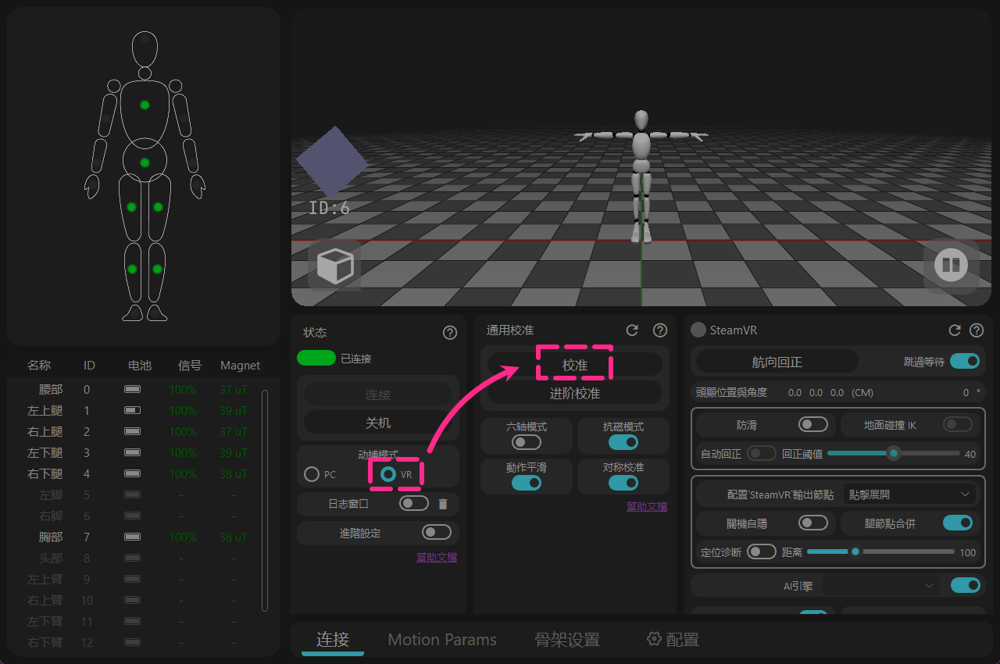

<strong style="font-size: 1.15em" class="tutorial-step-title">2. 選擇 VR 模式並校準</strong> 
- 在 Rebocap 中選擇 [VR Mode]，然後點擊“校準”。 
- 請在 SteamVR 運行狀態下進行校準，以確保成功連接。

<!-- ==================== 步驟 2 結束 ==================== -->

<!-- ==================== 步驟 3 開始 ==================== -->

<strong style="font-size: 1.15em" class="tutorial-step-title">3. 檢查 SteamVR 狀態</strong> 
- 校準完成後， 
  在 SteamVR 列表中會看到刷新的蝴蝶 logo。

<!-- ==================== 步驟 3 結束 ==================== -->

- 進入 SteamVR 只需重複該段操作
- Rebocap ID + 3 = SteamVR ID

<!-- ==================== 旗幟 連接 結束 ==================== -->

<!-- ==================== 旗幟 傳感器搭配與輸出模式 開始 ==================== -->

## 追蹤器在VR模式的使用

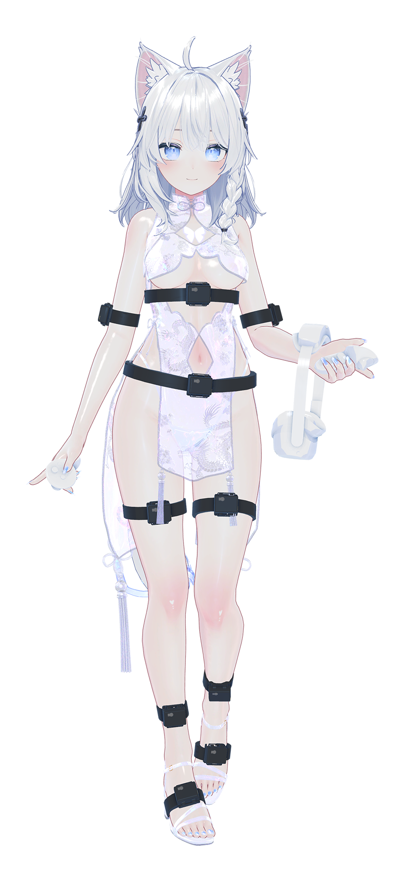

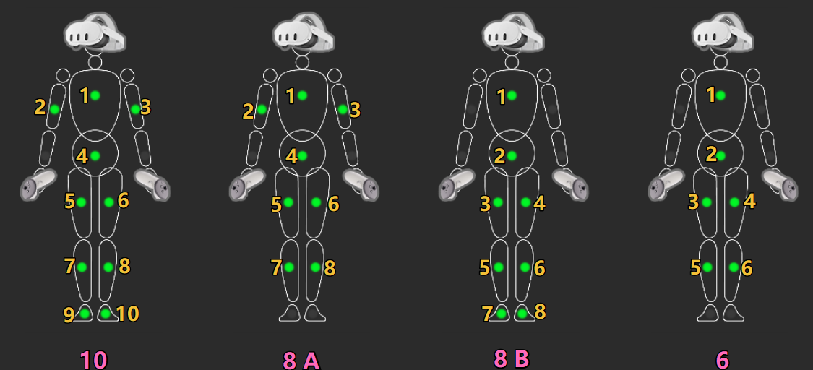

💡 對於VR遊戲的使用有 10、8、6 點感測器這3種搭配， 
如果不使用腳追蹤器，請保持【AI引擎】開啟。  
🧤 使用【替換控制器位置】或追蹤手套時，可以使用至14個追蹤器。 
💻 使用【VR 輸出】時（模擬頭顯座標），可以使用至15個追蹤器。 
（僅技術型玩家可探索）

<!-- ==================== 旗幟 傳感器搭配与輸出模式 結束 ==================== -->

<!-- ==================== 旗幟 VR – 校準姿態圖鑑 開始 ==================== -->

## VR – 校準姿態圖鑑

<!-- ==================== 步驟 1：A pose 開始 ==================== -->

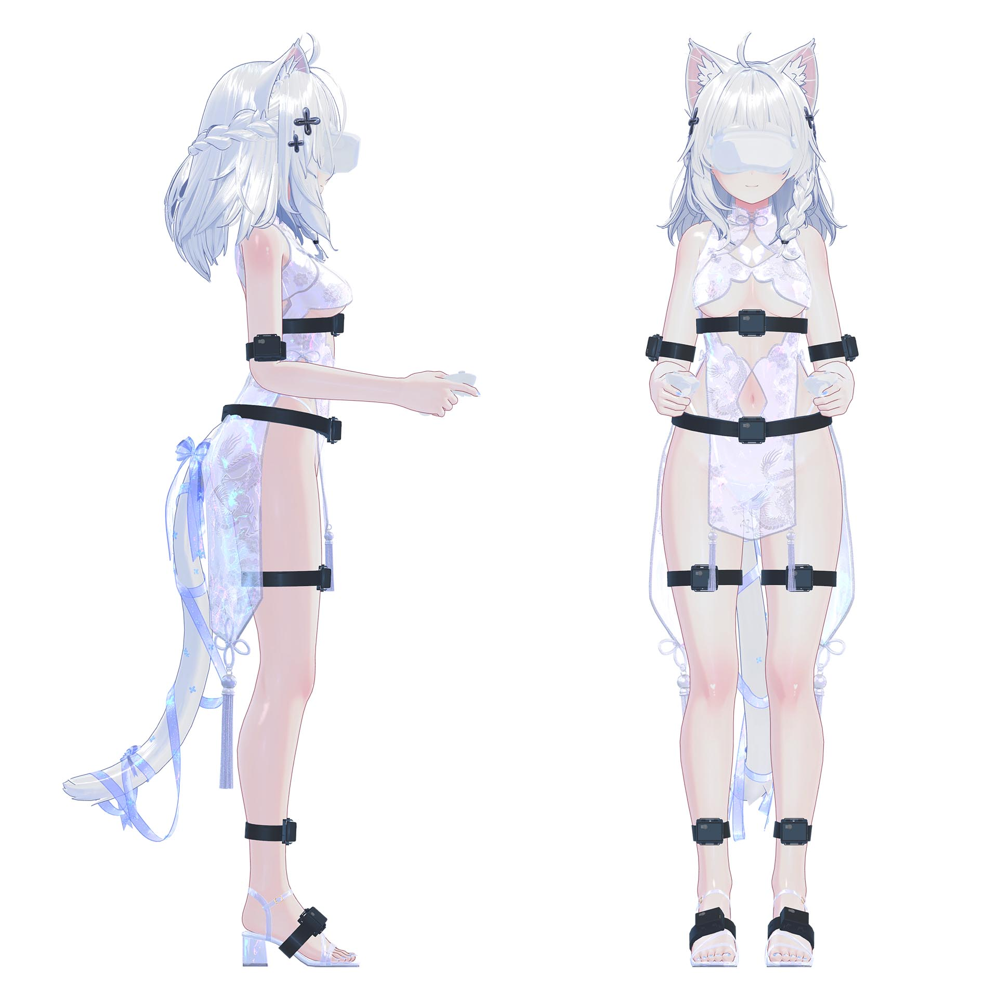

<strong style="font-size: 1.15em" class="tutorial-step-title">A Pose</strong> 
- 將手把抬起，避免追蹤器採集到手把上的磁鐵。 
- 保持適當的雙腳間距，不要並攏腳也不要過度張開，與圖中相近。 
- 自然放鬆的站立，不需要繃緊肌肉。

<!-- ==================== 步驟 1 結束 ==================== -->

<!-- ==================== 步驟 2：T pose 開始 ==================== -->

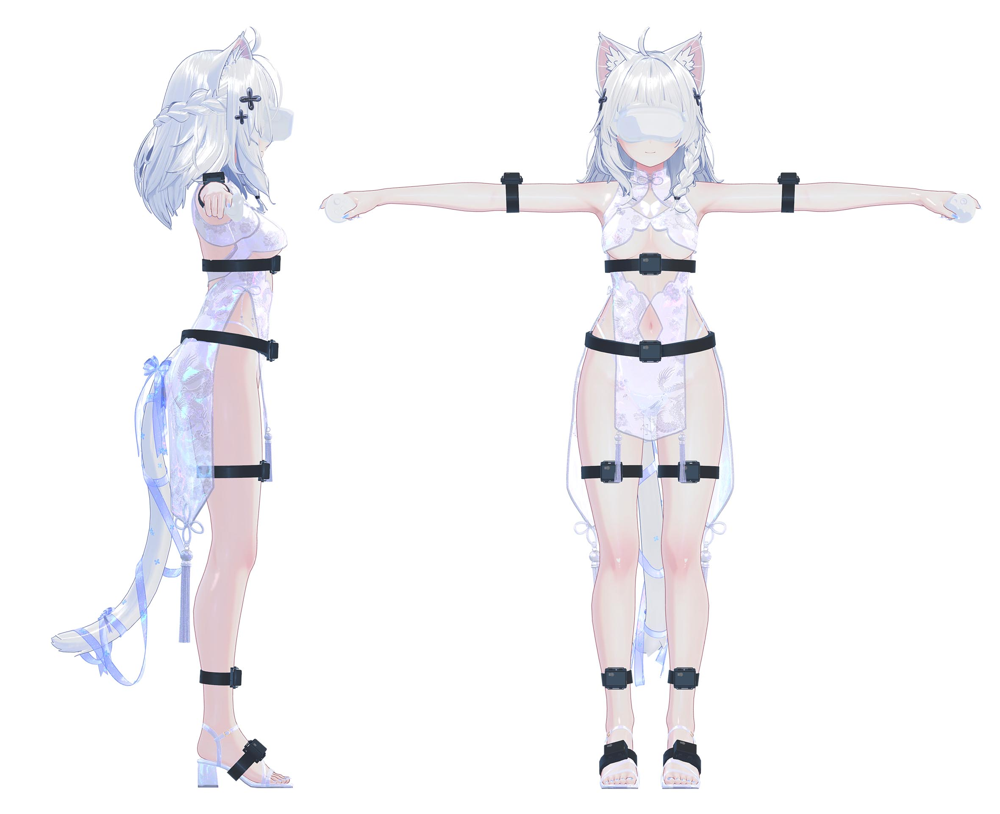

<strong style="font-size: 1.15em" class="tutorial-step-title">T Pose</strong> 
- 水平張開手臂， 
  有時肌肉記憶和實際伸直手會有差異，需要視覺看一下。 

<!-- ==================== 步驟 2 結束 ==================== -->

<!-- ==================== 步驟 3：S pose 開始 ==================== -->

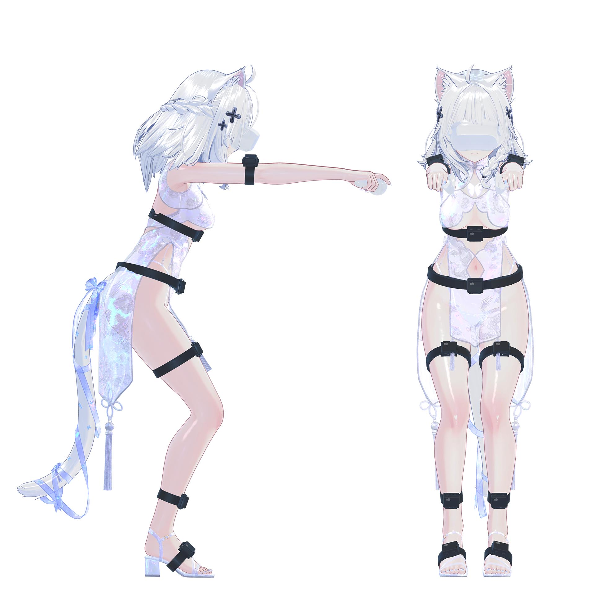

<strong style="font-size: 1.15em" class="tutorial-step-title">S Pose</strong> 
- 半蹲 + 彎腰 + 低頭，讓追蹤器通過前傾的角度獲知身體的前方朝向。 
- 儘量保持雙腿平衡與膝蓋間距，手臂平行朝前。 
- 如果感覺彎腰困難、不明顯，可以使用進階校準。

<!-- ==================== 步驟 3 結束 ==================== -->

<!-- ==================== 步驟 4：B pose 開始 ==================== -->

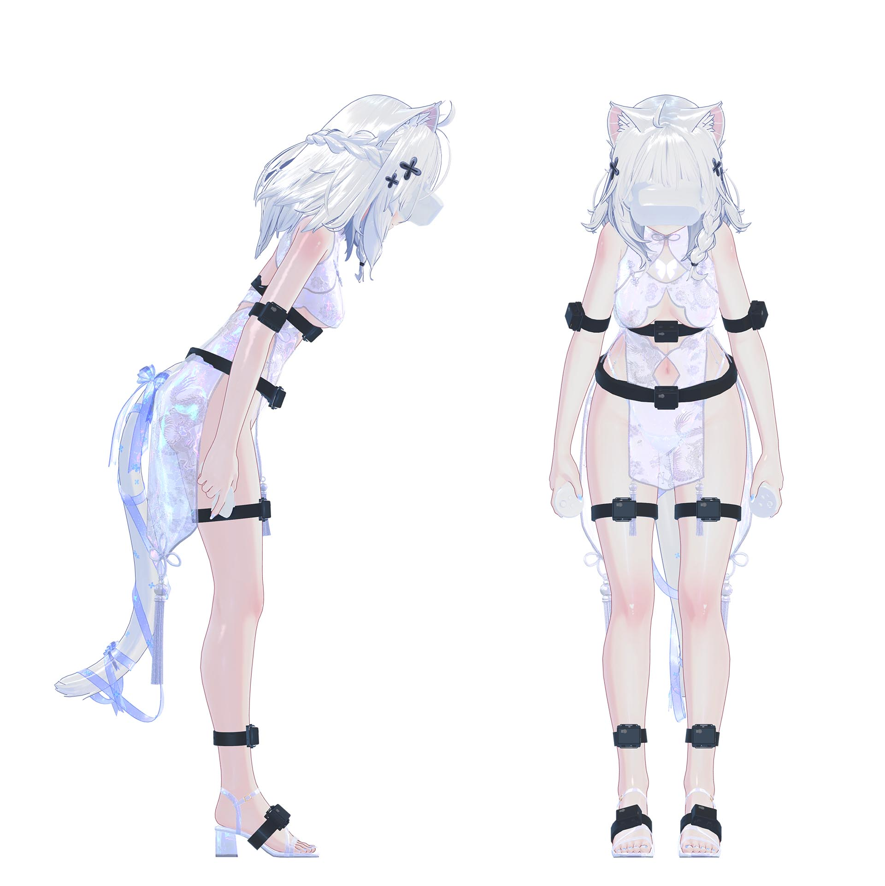

<strong style="font-size: 1.15em" class="tutorial-step-title">B Pose (進階校準)</strong> 
- 把S Pose的彎腰+低頭拆分為個別的彎腰動作來記錄。 
- 可以避免因 S 姿態引起的身體畸變 （常見於坐下後骨架系統向側面傾斜）。

<!-- ==================== 步驟 4 結束 ==================== -->

<!-- ==================== 旗幟 VR – 校準姿態圖鑑 結束 ==================== -->

<!-- ==================== 旗幟 進入遊戲 (以 VRChat 為例) 開始 ==================== -->

## 進入遊戲 (以 VRChat 為例)

<!-- ==================== 步驟 1：檢查 SteamVR 蝴蝶圖示 開始 ==================== -->

<strong style="font-size: 1.15em" class="tutorial-step-title">1. 檢查 SteamVR 狀態</strong> 
- 查看 SteamVR 列表中刷新的蝴蝶 logo， 
  有了追蹤點的資訊，VRChat才會顯示全身追蹤的開關。

<!-- ==================== 步驟 1 結束 ==================== -->

<!-- ==================== 步驟 2：打開遊戲內校準 開始 ==================== -->

<strong style="font-size: 1.15em" class="tutorial-step-title">2. 打開遊戲內選單</strong> 
- 打開遊戲內的選單，然後點擊“校準”。

<!-- ==================== 步驟 2 結束 ==================== -->

<!-- ==================== 步驟 3：綁定追蹤點 開始 ==================== -->

<strong style="font-size: 1.15em" class="tutorial-step-title">3. 綁定追蹤點</strong> 
- 使追蹤點對稱地排列在角色身體上， 
  但不需要追蹤點完全吻合，因為每個角色的身體長短不一樣。 
- 雙手食指按下扳機鍵以完成追蹤點的綁定。

<!-- ==================== 步驟 3 結束 ==================== -->

<!-- ==================== 旗幟 進入遊戲 (以 VRChat 為例) 結束 ==================== -->
