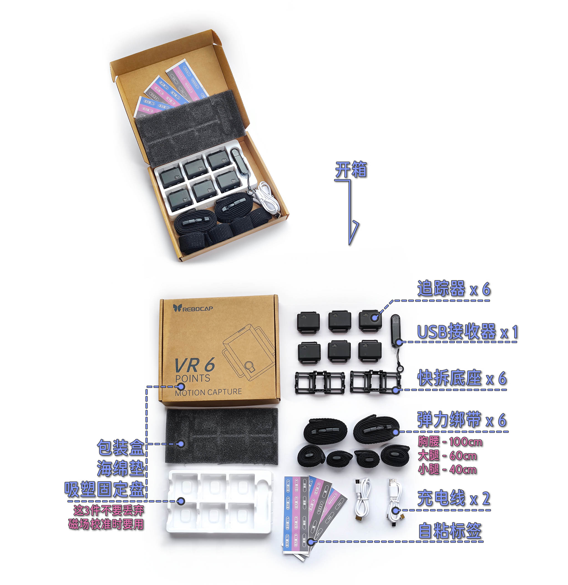
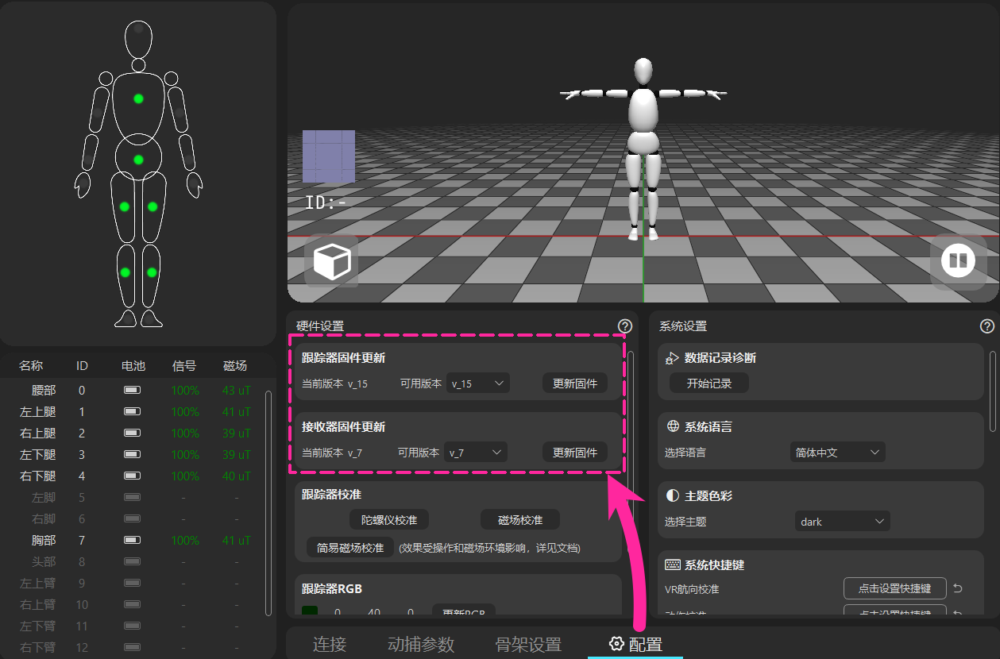
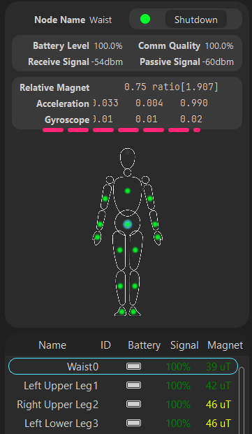
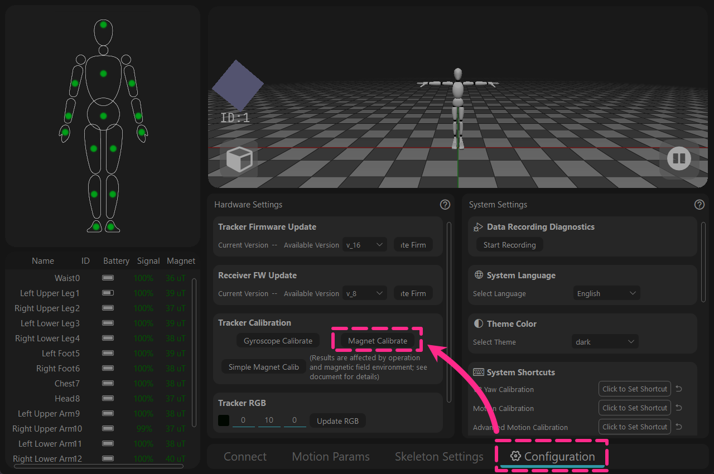
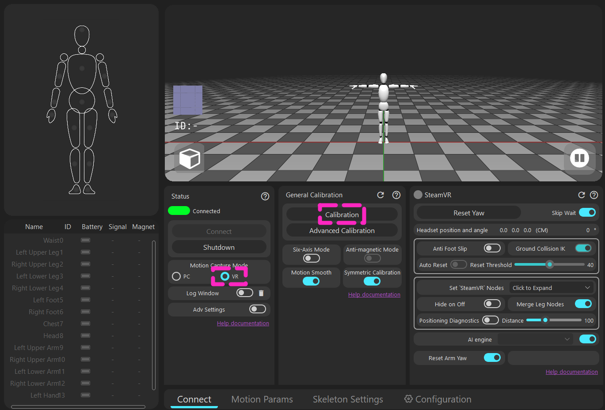
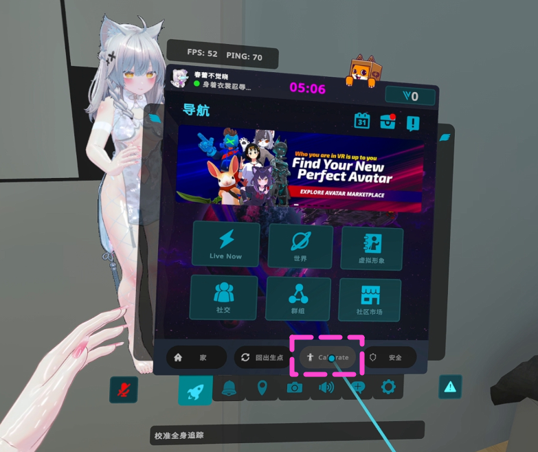

# 6 追蹤器套裝 - 開箱到使用

<!-- ============ 标题 ======== 检查包裹内容 ==================== -->
## 1 - 檢查包裹內容

* **紙盒、發泡棉墊、吸塑盤** 
 (⚠️ *請勿丟棄這3樣物品；它們是磁場校準所必需的。*)
* **追蹤器** x 6
* **USB 接收器** x 1
* **快拆底座** x 6
* **彈性綁帶** x 6
  * 胸部 / 腰部 - 100cm
  * 大腿 - 60cm
  * 小腿 - 40cm
* **充電線** x 2
* **自黏標識貼紙**

<!-- ============= 标题 ======= 安装绑带 ==================== -->
## 2 - 安裝綁帶

- 取下追蹤器上的快拆底座， 
從一側撬開能更容易地直接將追蹤器從快拆底座上取下。

- 將快拆底座安裝在綁帶上，確保綁帶從底座下方穿過。

  <video id="video" controls loop preload="metadata" width="60%">
    <source id="mp4" src="/zh-Hant/img/tracker_normal.mp4" type="video/mp4" />
  </video>

- 綁帶的安裝影片

- 黏上魔術貼後，向兩側拉扯一下，使鉤面完全嵌入毛面，防止脫落。

<!-- ============ 标题 ======== 穿戴在身上的位置 ==================== -->
## 3 - 穿戴在身上的位置

<!-- ==================== 左右分栏图文排版 开始 ==================== -->

<!-- 左侧分栏：放人物模型图 -->

<!-- 右侧分栏：放文字说明 -->

<!-- 第一组：围度数据 -->

<strong>胸部/腰部:</strong> 100 cm 
<strong>大腿:</strong> 60 cm 
<strong>小腿:</strong> 40 cm

<!-- 第二组：提示 -->

<strong>提示：</strong> 
保持追蹤器按鍵朝上。

<!-- 第三组：避开区域提示 -->

腰部追蹤器請勿放置在肚臍處以防擠壓， 
腿部追蹤器應避開肌肉隆起成斜坡的區域。 
請勿將大腿追蹤器放得太靠近膝蓋。 

<!-- 第四组：身体差异性调整 -->

<strong>身體差異性調整：</strong> 
請參考圖片中所示的穿戴位置， 
推薦 胸部/腰部追蹤器放置在後背， 
腿部追蹤器可以放置在側面。

<!-- 第五组：底部小图与文字上下排版 -->

追蹤器背面貼有 ID 編號， 
出廠已綁定編號與位置。 
不可修改或替換， 
無法將兩套 6 追蹤器套裝組合在一起使用。

<!-- ==================== 左右分栏图文排版 结束 ==================== -->

<!-- ============= 标题 ======= 安装软件 和 检查固件更新 ==================== -->

## 4 - 安裝軟體與檢查韌體更新

<!-- ==================== 旗帜 A：Install software 开始 ==================== -->

## A - 安裝軟體

🌐下載連結 → [https://doc.rebocap.com/en\_US/tutorial/software\_install.html](https://doc.rebocap.com/en_US/tutorial/software_install.html)

- 版本選擇：\
  V01 - 適合磁場穩定的環境，適用於跳舞。 
  V02 Beta02 - 預設開關針對6追蹤器套裝優化，並採用全新演算法可以主動判斷強干擾源，甚至在彈簧床上保持朝向。

<!-- ==================== 折叠页 开始 ==================== -->

如果使用 V01 版本，需要更改以下設定。

   &emsp;&emsp;1 - 關閉額外顯示的追蹤點。 
   &emsp;&emsp;&emsp; 打開 [配置'SteamVR'輸出節點] → 關閉 [左/右上臂] 

   &emsp;&emsp;2 - 關閉會錯誤卡在全域工作的功能。 
   &emsp;&emsp;&emsp; → [運動參數] → 關閉 [縱向 IK & 橫向 IK]

<!-- ==================== 折叠页 结束 ==================== -->

- 推薦安裝在非系統碟（不要裝在 C 碟）。

<!-- ==================== 旗帜 A：Install software 结束 ==================== -->

<!-- ==================== 旗帜 B：Connect to computer 开始 ==================== -->

## B - 連接電腦

<!-- ==================== 步骤 1：连接接收器 开始 ==================== -->

<strong style="font-size: 1.15em" class="tutorial-step-title">1. 連接接收器</strong> 
- 將 USB 接收器插入電腦，選擇一個周圍開闊的接口。 
- 可以自備延長線外接，市面通用的USB3.0數據線。 
- 如果追蹤器訊號不能維持在100%，則考慮延長線或者換個位置。

<!-- ==================== 步骤 1 结束 ==================== -->

<!-- ==================== 步骤 2：软件连接 开始 ==================== -->

<strong style="font-size: 1.15em" class="tutorial-step-title">2. 軟體連接</strong> 
- 在軟體中點擊“連接”（Beta02 版本後將自動連接）。

<!-- ==================== 步骤 2 结束 ==================== -->

<!-- ==================== 步骤 3：开启追踪器 开始 ==================== -->

<strong style="font-size: 1.15em" class="tutorial-step-title">3. 開啟追蹤器</strong> 
- 按下追蹤器按鈕開機。 
- 注意：追蹤器是透過軟體關機的。

<!-- ==================== 步骤 3 结束 ==================== -->

<!-- ==================== 旗帜 B：Connect to computer 结束 ==================== -->

<!-- ==================== 旗帜 C：Check firmware 开始 ==================== -->

## C - 檢查韌體

<!-- ====================  检查固件 开始 ==================== -->

<strong style="font-size: 1.15em" class="tutorial-step-title">檢查 [追蹤器與接收器] 韌體</strong> 
- 升級至選項中的最高可用版本， 
- 該版本將隨未來的軟體更新而改變。 
- 韌體附屬在軟體安裝包中，不是聯網更新的。

<!-- ====================  检查固件 结束 ==================== -->

<!-- ==================== 折叠页 开始 ==================== -->

 查看軟體對應支援的韌體版本。

   &emsp;&emsp; 部分韌體版本有重大演算法變更，與舊版軟體不相容。   

   &emsp;&emsp; 當切換回舊版軟體時，需要相應地降級韌體。  

   &emsp;&emsp;&emsp; release_v01 - ◼️tracker : V6 / V7  ,  📡receiver : V6 / V7   

   &emsp;&emsp;&emsp; release_v02 beta02 - ◼️tracker : V15  ,  📡receiver : V6 / V7   

   &emsp;&emsp;&emsp; (未公開) release_v02 beta02.1 - ◼️tracker : V16  ,  📡receiver : V8   

<!-- ==================== 折叠页 结束 ==================== -->

- 追蹤器是透過無線 📶 進行更新的 — 無需使用 USB 數據線。  
🚫 請勿同時更新追蹤器和接收器。  

- 如果更新失敗，需要重啟追蹤器並再次點擊更新。  
&emsp;&emsp;🟩綠燈 – 快閃：追蹤器工作正常  
&emsp;&emsp;🟩綠燈 – 慢閃：追蹤器正在等待接收器訊號  
&emsp;&emsp;🟦藍燈：追蹤器正在接收韌體數據  
&emsp;&emsp;🟨黃燈：更新失敗（手動按下 🔘 按鈕重啟，然後重新更新）  
&emsp;&emsp;⬜白色：更新成功（通常在 10s 後自動重啟，如果無法自動重啟需要手動重啟）  

- 打開日誌視窗以查看每個追蹤器的實際韌體版本   
（日誌視窗位於軟體中的“連接與關機”下方）。

- 當 📡接收器更新完成後，斷開並重新插入 USB，然後 🔄重啟軟體。

<!-- ==================== 旗帜 C：Check firmware 结束 ==================== -->

<!-- ============= 标题 ======= 校正追踪器初始数据 ==================== -->
## 5 - 校正追蹤器初始數據

<!-- ==================== 旗帜 Gyroscope Calibrate 开始 ==================== -->

## 陀螺儀校準
<!-- ==================== 步骤 1：放置追踪器 开始 ==================== -->

<strong style="font-size: 1.15em" class="tutorial-step-title">1. 放置在地面上</strong> 
- 將追蹤器放置在地面上（處於沒有物理晃動/移動的位置）。 
- 無需放回吸塑盤裡。

<!-- ==================== 步骤 1 结束 ==================== -->

<!-- ==================== 步骤 2：启动采集 开始 ==================== -->

<strong style="font-size: 1.15em" class="tutorial-step-title">2. 開始校準</strong> 
- 點擊按鈕，等待采集完成。 
- 原理為錄製幾秒在現實沒有任何晃動的記錄。

<!-- ==================== 步骤 2 结束 ==================== -->

<!-- ==================== 步骤 3：检查陀螺仪信息 开始 ==================== -->

<strong style="font-size: 1.15em" class="tutorial-step-title">3. 檢查陀螺儀資訊</strong> 
- 完成後，檢查每個追蹤器的陀螺儀資訊。 
- 通常情況下，靜止時陀螺儀的輸出值應在 0 至 ±0.05 之間。

<!-- ==================== 步骤 3 结束 ==================== -->

<!-- ==================== 旗帜 Gyroscope Calibrate 结束 ==================== -->

<!-- ==================== 旗帜 Magnet Calibrate 开始 ==================== -->

## 磁場校準

<!-- ==================== 步骤 1：放置吸塑盘 开始 ==================== -->

<strong style="font-size: 1.15em" class="tutorial-step-title">1. 放入吸塑盤中</strong> 
- 將追蹤器按一致方向放入吸塑盤中。 
- （如果覺得拿持不便，可將吸塑盤放回紙盒內）。

<!-- ==================== 步骤 1 结束 ==================== -->

<!-- ==================== 步骤 2：站在中心 开始 ==================== -->

<strong style="font-size: 1.15em" class="tutorial-step-title">2. 站在遊玩區域中心</strong> 
- 抱在懷裡，站在遊玩區域的中心， 
- 或者距離電腦桌邊緣一步的距離。

<!-- ==================== 步骤 2 结束 ==================== -->

<!-- ==================== 步骤 3：旋转吸塑盘 开始 ==================== -->

<strong style="font-size: 1.15em" class="tutorial-step-title">3. 旋轉吸塑盤</strong> 
- 點擊軟體按鈕，跟隨軟體顯示的動畫旋轉吸塑盤。 
- (每換一面旋轉兩圈)。

<!-- ==================== 步骤 3 结束 ==================== -->

<!-- ==================== 步骤 4：检查磁场读数 开始 ==================== -->

<strong style="font-size: 1.15em" class="tutorial-step-title">4. 檢查磁場讀數</strong> 
- 完成後，在手中隨意翻轉吸塑盤， 
- 🔍檢查校準後的追蹤器磁場讀數是否一致或相近， 
- ⚠️如果磁場讀數各自差異很大，那麼需要再次執行磁場校準。

<!-- ==================== 步骤 4 结束 ==================== -->

<!-- ==================== 折叠页 开始 ==================== -->

如果沒有或丟失了紙盒怎麼辦？

   &emsp;&emsp;可以使用綁帶把追蹤器固定在方形水瓶或紙巾盒上，  
   &emsp;&emsp; 以 2-3 個為一組。 

<!-- ==================== 折叠页 结束 ==================== -->

<!-- ==================== 折叠页 开始 ==================== -->

簡易磁場校準

   &emsp;&emsp;作為一種便利的備選方案。   
   &emsp;&emsp;主要動作：  
   &emsp;&emsp;在記錄期間旋轉追蹤器，覆蓋儘可能多的方向（360° 全方位翻轉）。 

   &emsp;&emsp;提示：  
   &emsp;&emsp;以“8”字形移動手腕和手臂，以便感測器能捕捉更多角度的磁場數據。 

<!-- ==================== 折叠页 结束 ==================== -->

<!-- ==================== 旧版本看不到简易磁场校准 折叠页 开始 ==================== -->

舊版本看不見此按鈕？

   &emsp;&emsp;此按鈕在舊版本中預設不顯示， 
   &emsp;&emsp;您需要手動建立特定的 .txt 檔案使其顯現。 

   &emsp;&emsp;前往 Rebocap 根資料夾（Rebocap.exe 所在目錄），  
   &emsp;&emsp;新建一個 .txt 檔案並重新命名為 
   &emsp;&emsp; \_simple_cal\_

   &emsp;&emsp;重啟軟體後，該按鈕即可顯現。

<!-- ==================== 旧版本看不到简易磁场校准 折叠页 结束 ==================== -->

<!-- ==================== 折叠页 结束 ==================== -->

<!-- ==================== 旗帜 Magnet Calibrate 结束 ==================== -->

<!-- ============= 标题 ======= 进入SteamVR ==================== -->
## 6 - 進入 SteamVR

<!-- ==================== 旗帜 Connection 开始 ==================== -->

## 連接

<!-- ==================== 步骤 1：启动 SteamVR 开始 ==================== -->

<strong style="font-size: 1.15em" class="tutorial-step-title">1. 啟動 SteamVR</strong> 
- 啟動 SteamVR。 
- (SteamVR 頭顯 = Rebocap 頭部追蹤器)。

<!-- ==================== 步骤 1 结束 ==================== -->

<!-- ==================== 步骤 2：选择 VR 模式并校准 开始 ==================== -->

<strong style="font-size: 1.15em" class="tutorial-step-title">2. 選擇 VR 模式並校準</strong> 
- 在 Rebocap 中選擇 [VR Mode]，然後點擊“校準”。 
- 請在 SteamVR 運行狀態下進行校準，以確保成功連接。

<!-- ==================== 步骤 2 结束 ==================== -->

- 進入遊戲只需重複該段操作
- Rebocap ID + 3 = SteamVR ID

<!-- ==================== 旗帜 Connection 结束 ==================== -->

<!-- ==================== 旗帜 VR – Calibration posture guide 开始 ==================== -->

## VR – 校準姿態圖鑑

<!-- ==================== 步骤 1：A pose 开始 ==================== -->

<strong style="font-size: 1.15em" class="tutorial-step-title">A姿態</strong> 
- 抬起 VR 手柄，避免追蹤器捕捉到手柄中的磁鐵。 
- 保持適當的雙腳間距，不要併攏腳也不要過度張開，與圖中相近。 
- 自然放鬆的站立，不需要繃緊肌肉。

<!-- ==================== 步骤 1 结束 ==================== -->

<!-- ==================== 步骤 2：S pose 开始 ==================== -->

<strong style="font-size: 1.15em" class="tutorial-step-title">S姿態</strong> 
- 半蹲 + 彎腰並低頭，讓追蹤器透過前傾的角度獲知身體的前方朝向。 
- 儘量保持雙腿平衡與膝蓋間距。 
- 如果感覺彎腰困難、不明顯，可以使用進階校準。

<!-- ==================== 步骤 2 结束 ==================== -->

<!-- ==================== 步骤 3：B pose 开始 ==================== -->

<strong style="font-size: 1.15em" class="tutorial-step-title">B姿態 (進階校準)</strong> 
- 把 S Pose 的彎腰姿勢拆分為單獨的彎腰動作進行記錄。 
- 可以避免因 S 姿態引起的身體畸變 （常見於坐下後骨架系統向側面傾斜）。

<!-- ==================== 步骤 3 结束 ==================== -->

<!-- ==================== 旗帜 VR – Calibration posture guide 结束 ==================== -->

<!-- ==================== 旗帜 Enter game (example: VRChat) 开始 ==================== -->

## 進入遊戲 (以 VRChat 為例)

<!-- ==================== 步骤 1：检查 SteamVR 蝴蝶图标 开始 ==================== -->

<strong style="font-size: 1.15em" class="tutorial-step-title">1. 檢查 SteamVR 狀態</strong> 
- 校準完成後，您可以在 SteamVR 列表中看到刷新的蝴蝶 logo。

<!-- ==================== 步骤 1 结束 ==================== -->

<!-- ==================== 步骤 2：打开游戏内校准 开始 ==================== -->

<strong style="font-size: 1.15em" class="tutorial-step-title">2. 打開遊戲內選單</strong> 
- 打開遊戲內的選單，然後點擊“校準”。

<!-- ==================== 步骤 2 结束 ==================== -->

<!-- ==================== 步骤 3：绑定追踪点 开始 ==================== -->

<strong style="font-size: 1.15em" class="tutorial-step-title">3. 綁定追蹤點</strong> 
- 使追蹤點對稱地排列在角色身體上， 
但不需要追蹤點完全吻合，因為每個角色的身體長短不一樣。 
- 雙手食指按下扳機鍵以完成追蹤點的綁定。

<!-- ==================== 步骤 3 结束 ==================== -->

<!-- ==================== 旗帜 Enter game (example: VRChat) 结束 ==================== -->
