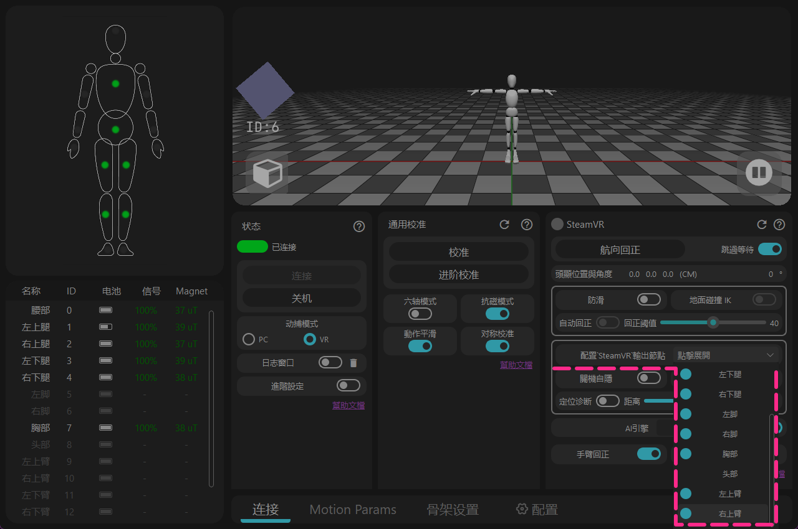

# SteamVR 操作指南

這裡將推薦一些 SteamVR 的設定，以及一些常見問題。

## VR 頭顯 / 串流軟體操作建議

### VR 頭顯的設定 {#software-download-toc}
<h2 class="tutorial-heading-flag" style="background: #aab0ff; margin-top: 0; display: inline-block;">VR頭顯的設定</h2>

<!-- === 轮播图组件 代码开始 === -->

  <input type="radio" name="carousel" id="slide1" defaultChecked />
  <input type="radio" name="carousel" id="slide2" />
  
  

    

      
    

    

      <video src="/img/steamvr_guide/steamvr_windows_video.mp4" autoplay muted playsinline preload="auto"></video>
    

  

  

  
  

    

      <label for="slide2" class="arrow-left-1">&#10094;</label>
      <label for="slide1" class="arrow-left-2">&#10094;</label>
    

    

      <label for="slide1" title="Image 1"></label>
      <label for="slide2" title="Video"><svg viewBox="0 0 24 24" width="8" height="8" ><polygon points="8,4 20,12 8,20" /></svg></label>
    

    

      <label for="slide2" class="arrow-right-1">&#10095;</label>
      <label for="slide1" class="arrow-right-2">&#10095;</label>
    

  

<!-- === 轮播图组件 代码结束 === -->

<strong> - 盡量使用 SteamVR 的桌面視窗去操控 rebocap 軟體。</strong> 
一些 VR 頭顯返回到內建系統後會停止/休眠 SteamVR 的數據， 
在重新返回 SteamVR 後會出現方向錯位。 
( <u>Virtual Desktop</u> 不受該問題影響，但要避免 Quest 系統休眠 ) 

點擊圖示後無法顯示桌面？

在 SteamVR 的選單中嘗試重新置中或重設主面板 

- Quest、Pico這類一體機頭顯的安全範圍需要畫到比實際房間大一圈， 
避免觸發安全邊界時導致steamvr端的頭顯數據中斷

  <input type="radio" name="carousel2" id="slide3" defaultChecked />
  <input type="radio" name="carousel2" id="slide4" />
  
  

    

      
    

    

      <video src="/img/steamvr_guide/VR_headset_tracking_lost_video.mp4" autoplay muted playsinline preload="auto"></video>
    

  

  

  
  

    

      <label for="slide4" class="arrow-left-1">&#10094;</label>
      <label for="slide3" class="arrow-left-2">&#10094;</label>
    

    

      <label for="slide3" title="Image 1"></label>
      <label for="slide4" title="Video"><svg viewBox="0 0 24 24" width="8" height="8" ><polygon points="8,4 20,12 8,20" /></svg></label>
    

    

      <label for="slide4" class="arrow-right-1">&#10095;</label>
      <label for="slide3" class="arrow-right-2">&#10095;</label>
    

  

- 如果走動/蹲起時頭顯固定在原地，說明 VR 頭顯系統內的定位系統未開啟。 
（Quest 系統需要打開遊玩邊界，Pico 系統打開 [定位追蹤]）

### Virtual Desktop {#software-download-toc}
<h2 class="tutorial-heading-flag" style="background: #aab0ff; margin-top: 0; display: inline-block;">Virtual Desktop</h2>

 

<strong>有 2 個選項建議關閉：</strong>
 

> <strong>1 - Center to play space</strong> 
 在雙擊左手 Home 鍵返回 VD 的電腦桌面時，SteamVR 空間中的頭顯向後旋轉 180° 
可能會導致 rebocap 在校準時記錄錯誤的朝向。

>  <strong>2 - Emulate SteamVR vive trackers</strong> 
 這個功能把 Quest 系統的 AI 全身追蹤點傳入 SteamVR 中，但在 VRChat 中出現追蹤點重疊，搶奪控制權。 
 如果想只啟用他局部指定的追蹤點，可以使用外掛來調整。 
🌐 [外掛的 Github](https://github.com/DenTechs/Virtual_Desktop_Body_Tracking_Configurator)

### SteamVR {#software-download-toc}
<h2 class="tutorial-heading-flag" style="background: #aab0ff; margin-top: 0; display: inline-block;">SteamVR</h2>

- 關閉 SteamVR 的邊界 
預設邊界會限制追蹤點的最大移動範圍，像空氣牆一樣。 
如果 VR 頭顯錯誤定位在 2.4 公尺高度，可能在躺下後抬腿時呈現追蹤器無法超過頭顯的高度， 
因為 SteamVR 預設的天花板高度為 2.4 公尺，而追蹤點無法穿過天花板。

- 提前重設 VR 頭顯的角度 
按住 '右手控制器 Home 鍵' 讓 VR 頭顯重設系統方向， 
這會讓 SteamVR 虛擬地平線箭頭重設到你視線的前方，在意外丟失方向後可以利用該功能重新對正座標系。

- 打開遊戲後彈出提示 
隨意選擇背景中的一個社群配置， 
啟用後在下一次啟動就不會出現了。

## 無法連接 SteamVR

<h2 class="tutorial-heading-flag" style="background: #aab0ff; margin-top: 0; display: inline-block;">檢查以下內容</h2>

<strong> 1 - 在開啟 SteamVR 的狀態點擊校準。</strong> 
不啟動 SteamVR，rebocap 無法知道系統裡是否有 VR。

  <input type="radio" name="carousel3" id="slide5" defaultChecked />
  <input type="radio" name="carousel3" id="slide6" />
  
  

    

      
    

    

      
    

  

  

  
  

    

      <label for="slide6" class="arrow-left-1">&#10094;</label>
      <label for="slide5" class="arrow-left-2">&#10094;</label>
    

    

      <label for="slide5" title="Image 1"></label>
      <label for="slide6" title="Image 2"></label>
    

    

      <label for="slide6" class="arrow-right-1">&#10095;</label>
      <label for="slide5" class="arrow-right-2">&#10095;</label>
    

  

<strong> 2 - 查看 SteamVR 驅動。</strong> 
打開 rebocap 的 [日誌視窗] 記錄，每次開啟 rebocap 時候會自動檢查。
如有需要，可以在 [配置] 頁面中強制安裝。

  <input type="radio" name="carousel4" id="slide7" defaultChecked />
  <input type="radio" name="carousel4" id="slide8" />
  
  

    

      
    

    

      <video src="/img/steamvr_guide/check_steamvr_addons_video -cns.mp4" autoplay muted playsinline preload="auto"></video>
    

  

  

  
  

    

      <label for="slide8" class="arrow-left-1">&#10094;</label>
      <label for="slide7" class="arrow-left-2">&#10094;</label>
    

    

      <label for="slide7" title="Image 1"></label>
      <label for="slide8" title="Video"><svg viewBox="0 0 24 24" width="8" height="8"><polygon points="8,4 20,12 8,20" /></svg></label>
    

    

      <label for="slide8" class="arrow-right-1">&#10095;</label>
      <label for="slide7" class="arrow-right-2">&#10095;</label>
    

  

<strong> 3 - 檢查 SteamVR 的附加元件 (Add-ons)。</strong> 
如果 SteamVR 出現意外崩潰，往往會強制關閉所有附加元件。 
重新開啟 rebocap 的載入後需要重啟 SteamVR。

## SteamVR 追蹤點的顯示和隱藏

<strong> 追蹤點的顯示和隱藏</strong> 
 在軟體 [ 配置 SteamVR 輸出節點 ] 裡控制追蹤點的顯示和隱藏， 
 無需在 SteamVR 的管理選單中操作。 

 

注

追蹤器不是直連 SteamVR，物理追蹤器操縱骨架系統，從骨架系統上建立對應的追蹤點輸入到 SteamVR 中， 
也就是說沒有對應的追蹤器，依然可以向 SteamVR 提供追蹤點。

## 設定了追蹤點的部位但遊戲無法識別到腳和腰

- 一些遊戲使用 OpenVR 環境來識別追蹤，但目前 rebocap Release 所帶的驅動會處於無法別識別的 BUG，即便 SteamVR 中修改了對應的設定也無法識別。

該 BUG 等待工作組後續修復。

## 設定了追蹤點的部位屬性但遊戲無法識別到腳和腰

- 一些遊戲使用openVR環境來識別追蹤，但目前rebocap V01/V02 版本的Steamvr驅動會因為[Relo]名稱缺失導致無法被識別的BUG， 
即便steamvr中修改了對應的屬性也無法識別。 
目前的處理方法為更換舊版 driver_rebocap.dll 檔案。

該BUG等待修復等待工作組後續修復

<a href="/img/steamvr_guide/(%20P05%20)%20%20%20%20driver_rebocap.dll" download target="_blank" class="button button--primary button--sm" style="margin-bottom: 15px; display: inline-block; font-size: 1em;">下載 ( P05 ) driver_rebocap.dll</a> 

- 更換過程： 
1 - 保持rebocap和steamvr關閉。 
2 - 進入安裝rebocap的資料夾， 
找到“Rebocap\data\rebocap_driver\bin\win64”資料夾， 
替換其中的driver_rebocap.dll檔案。 
（移除“P05”前綴） 
3 - 首先啟動Rebocap軟體，待其更新SteamVR驅動檔案後，再啟動SteamVR。

